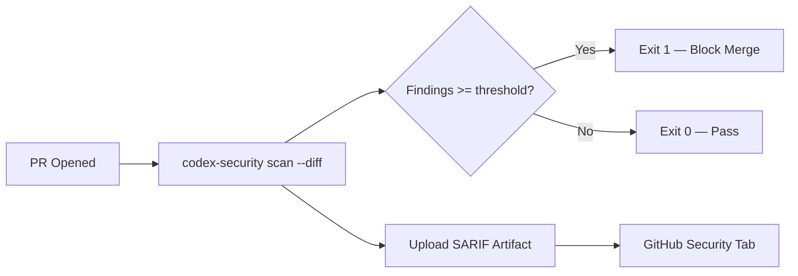
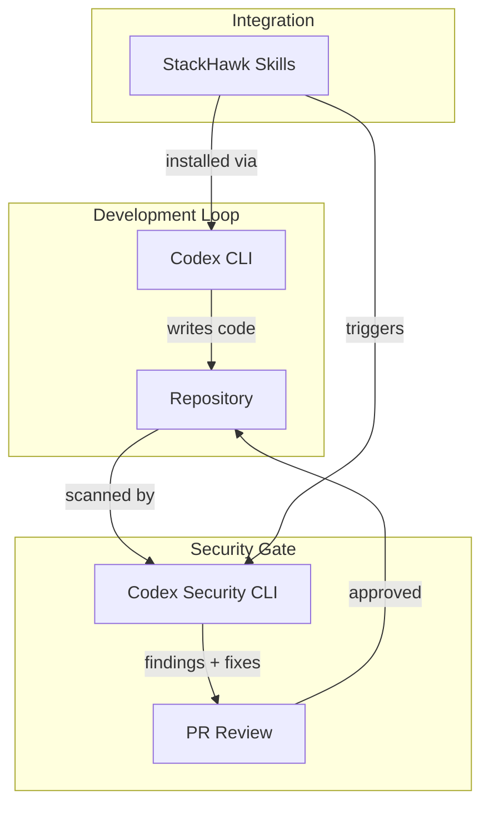

# Codex Security CLI: OpenAI's Open-Source Security Agent That Finds, Validates, and Fixes Vulnerabilities


---

On 29 July 2026 OpenAI open-sourced **Codex Security** — a standalone CLI and TypeScript SDK for finding, confirming, and remediating security vulnerabilities across codebases [^1]. Published under the Apache-2.0 licence at `github.com/openai/codex-security`, the tool ships as the `@openai/codex-security` npm package (v0.1.1 at time of writing) and represents a fundamentally different approach to static analysis: rather than pattern-matching against rule databases, it deploys an agentic scanning pipeline that builds project-specific threat models, validates findings in sandboxed environments, and generates bounded pull requests containing fixes and regression tests [^2].

This article examines what Codex Security does, how it compares to established SAST tooling, and how its architecture maps to Codex CLI workflows.

## Why Another Scanner?

Traditional static-analysis tools — Semgrep, Snyk SAST, SonarQube — excel at pattern coverage but drown teams in false positives. Independent testing against the same codebase produced the following true-positive rates [^3]:

| Scanner | Findings | Confirmed | True-Positive Rate |
|---|---|---|---|
| Codex Security | 31 | 23 | **74%** |
| Snyk SAST | 89 | 25 | 28% |
| Semgrep | 147 | 29 | 20% |

The difference is architectural. Codex Security invests 10–30 minutes building a project-specific threat model that maps data flows, identifies trust boundaries, and catalogues authentication mechanisms *before* it scans a single line of code [^3]. Findings that survive this contextual filter are then validated in a sandboxed environment where the tool attempts to exploit them — a step that reportedly reduces noise by approximately 70% compared to Semgrep [^3].

## Installation and Authentication

Codex Security requires Node.js 22+ and Python 3.10+ [^1]:

```bash
npm install @openai/codex-security
npx codex-security login
npx codex-security scan .
```

Two authentication paths are available. Interactive login via `codex-security login` uses ChatGPT credentials; for CI/CD pipelines, set the `OPENAI_API_KEY` environment variable instead [^1]. When both credential types exist, select explicitly:

```bash
npx codex-security scan . --auth api-key    # CI environments
npx codex-security scan . --auth chatgpt    # interactive use
```

## Scan Modes and Command Reference

The `scan` command supports four target types [^4]:

```bash
# Full repository scan
codex-security scan .

# Path-limited scan
codex-security scan . --path src/auth/

# Diff between Git refs (ideal for PR checks)
codex-security scan . --diff main...HEAD

# Working tree (uncommitted changes)
codex-security scan . --working-tree
```

Two analysis modes control depth:

- **`--mode standard`** — optimised for speed and common vulnerability classes
- **`--mode deep`** — multi-pass analysis for complex logic flaws

### Cost and Severity Gates

For budget-conscious CI runs, two flags provide hard guardrails:

```bash
codex-security scan . --max-cost 5.00 --fail-on-severity high
```

`--max-cost` terminates the scan if estimated expenditure exceeds the threshold; `--fail-on-severity` returns exit code 1 when findings meet or exceed the specified level (critical, high, medium, low) [^4].

### Scan History

Results persist in a local SQLite workbench. The `scans` subcommand group lets you list, inspect, rerun, and compare previous scans:

```bash
codex-security scans list --format json
codex-security scans show <scanId>
codex-security scans compare <scanId1> <scanId2>
codex-security scans match <scanId1> <scanId2>
```

The `match` and `compare` commands use LLM-backed semantic matching to identify whether a finding in one scan represents the same root cause as another, even when code location or wording has shifted [^4]. This is genuinely useful for tracking remediation across sprints.

## Bulk Scanning for Enterprise Campaigns

The `bulk-scan` command orchestrates parallel scanning across multiple repositories, sourced either from GitHub GraphQL discovery or a `repositories.csv` inventory file [^4]:

```csv
id,repository,revision,scope,mode
auth-service,https://github.com/org/auth-service,abc123f,src/,deep
payments,https://github.com/org/payments,def456a,,standard
```

```bash
codex-security bulk-scan --inventory repositories.csv
```

The worker pool is resumable — if a run is interrupted, rerunning the same command picks up where it left off via a ledger file.

## CI/CD Integration



Codex Security exports findings in three formats — SARIF v2.1.0, CSV, and JSON [^4]. A minimal GitHub Actions step:


```yaml
- name: Security Scan
  env:
    OPENAI_API_KEY: ${{ secrets.OPENAI_API_KEY }}
  run: |
    npx codex-security scan . \
      --diff ${{ github.event.pull_request.base.sha }}...${{ github.sha }} \
      --fail-on-severity high \
      --output-dir /tmp/security-results

- name: Upload SARIF
  uses: github/codeql-action/upload-sarif@v3
  with:
    sarif_file: /tmp/security-results/findings.sarif
```


This uploads results directly to GitHub's Security tab, where they appear alongside any existing CodeQL or Dependabot alerts.

## Fix Generation

Where Codex Security diverges most sharply from traditional SAST is in its remediation capability. The tool generates pull requests containing security patches, test cases verifying the fix, and regression tests [^3]. In independent testing, 18 of 23 proposed fixes merged without modification; the remaining five required minor convention adjustments [^3].

Compare this to Snyk, which generates fixes only for dependency upgrades, and SonarQube, which offers no auto-fix at all [^3].

## Language Support

Codex Security supports Python, JavaScript, TypeScript, Go, Java, C, C++, Rust, Ruby, and PHP [^3]. Python and JavaScript receive the deepest analysis; Ruby and PHP support launched in May 2026 [^3].

## The TypeScript SDK

For teams building custom security automation, the SDK provides programmatic access:

```typescript
import { CodexSecurity } from "@openai/codex-security";

const security = new CodexSecurity();
const result = await security.run(".", {
  mode: "deep",
  maxCost: 10.0,
  failOnSeverity: "high",
});

console.log(`Findings: ${result.findings.length}`);
console.log(`Report: ${result.reportPath}`);
await security.close();
```

This enables embedding scans in custom dashboards, Slack bots, or release-gate scripts without shelling out to the CLI.

## Pricing

Codex Security uses usage-based pricing tied to lines of code scanned [^3]:

| Tier | Cost per 1,000 Lines | Repository Limit |
|---|---|---|
| Developer | ~\$0.018 | 10 |
| Team | ~\$0.013 | 50 |
| Enterprise | Custom | Unlimited |

A 100,000-line codebase costs roughly \$1.80 per scan. A team running daily scans across 20 repositories averaging 50,000 lines each would spend approximately \$540/month [^3].

## How It Maps to Codex CLI

Codex Security is a *separate* tool from Codex CLI, but the two share infrastructure and can complement each other:



Third-party integrations like StackHawk's agent skills bridge the two tools directly — installing StackHawk's `hawkscan` and `stackhawk-api` plugins into Codex CLI lets you trigger security scans, parse findings, apply fixes, and rescan for verification in a single agentic loop [^5].

For teams already using Codex CLI's `PostToolUse` hooks, a deterministic security check after code-writing tool calls could invoke `codex-security scan --working-tree --fail-on-severity critical` to catch high-severity issues before they reach commit.

## Configuration

Codex Security reads configuration from `codex-security.toml`, merged with CLI overrides [^4]:

```toml
[scan]
mode = "standard"
max_cost = 5.0
fail_on_severity = "high"

[output]
format = "sarif"
dir = "./security-results"
```

Engine-level overrides are available via the `--codex` flag:

```bash
codex-security scan . --codex 'model_reasoning_effort="high"'
```

Overrides are validated — you cannot disable multi-agent systems or modify protected plugin paths [^4].

## Security Boundaries

The tool enforces several safety constraints [^4]:

- Output directories must sit outside the scanned repository
- Credentials are redacted before subprocess execution
- `PYTHONPATH` is restricted during plugin execution
- Scan state can be redirected via `CODEX_SECURITY_STATE_DIR` when write access to the default workbench directory is unavailable

## Limitations Worth Knowing

- **No dependency scanning** — Codex Security focuses on first-party code; for supply-chain vulnerabilities in third-party packages, you still need Snyk, Dependabot, or similar tooling [^3]
- **Beta status** — the CLI and SDK remain in limited beta and "require access" for some features [^6]
- **Cost at scale** — deep-mode scans on large monorepos can consume significant budget; the `--max-cost` flag exists for precisely this reason
- **Language depth varies** — Ruby and PHP support is newer and may produce fewer findings than the more mature Python and JavaScript pipelines [^3]

## Verdict

Codex Security does not replace your existing security toolchain — it augments it by tackling the problem traditional SAST tools handle worst: contextual understanding. Its 74% true-positive rate, sandbox-validated findings, and auto-generated fix PRs make it a compelling addition to any CI/CD pipeline, particularly for teams already invested in the Codex ecosystem.

The Apache-2.0 licence and TypeScript SDK lower the barrier to experimentation. For Codex CLI users, the integration path via StackHawk skills or `PostToolUse` hooks is straightforward. The main question is whether OpenAI can sustain the pricing model as adoption scales — at \$0.018 per thousand lines, large enterprises scanning millions of lines daily will want to see that cost trajectory before committing.

---

## Citations

[^1]: OpenAI, "Codex Security — SDKs and CLI for Codex Security," GitHub repository, [https://github.com/openai/codex-security](https://github.com/openai/codex-security), accessed 29 July 2026.

[^2]: OpenAI, "Introducing the Open-Source Codex Security CLI," OpenAI Developer Community Forum, [https://community.openai.com/t/introducing-the-open-source-codex-security-cli/1388319](https://community.openai.com/t/introducing-the-open-source-codex-security-cli/1388319), accessed 29 July 2026.

[^3]: Agent Finder, "Codex Security Review 2026 — OpenAI's AI That Fixes Your Vulnerabilities," [https://agent-finder.co/reviews/codex-security](https://agent-finder.co/reviews/codex-security), accessed 29 July 2026.

[^4]: DeepWiki, "Scan Commands — openai/codex-security," [https://deepwiki.com/openai/codex-security/2.1-scan-commands](https://deepwiki.com/openai/codex-security/2.1-scan-commands), accessed 29 July 2026.

[^5]: StackHawk, "Writing Secure Code with OpenAI Codex: Scan, Fix, and Verify with StackHawk," [https://www.stackhawk.com/blog/openai-codex-security/](https://www.stackhawk.com/blog/openai-codex-security/), accessed 29 July 2026.

[^6]: OpenAI, "Codex Security," ChatGPT Learn documentation, [https://learn.chatgpt.com/docs/security](https://learn.chatgpt.com/docs/security), accessed 29 July 2026.
