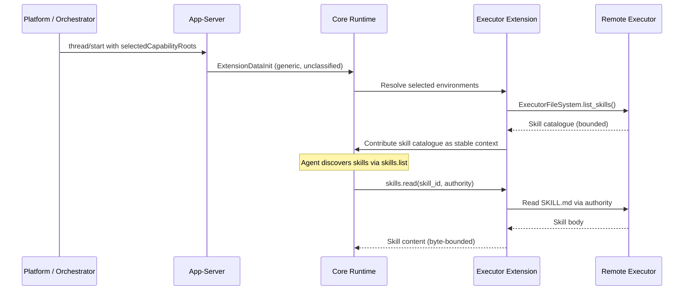

# Executor-Provided Skills in Codex CLI v0.146: How Remote Environments Now Contribute Skills to Your Agent


---

Until v0.146.0, every skill your Codex CLI agent could use had to live on the local filesystem — either in `~/.agents/skills/`, in the project directory, or installed via the plugin marketplace. The execution environment was a consumer of skills, never a contributor. That changed with three PRs merged in the v0.146.0 release cycle: executor skill discovery (#35184), resource reads for explicit executor skills (#35198), and extension-rendered skill catalogue metrics (#35597) [^1]. Together, they let remote execution environments — cloud workspaces, CI runners, IDE backends — contribute their own skills directly into the agent's context, turning Codex CLI from a tool that runs skills into a **platform that hosts them**.

## Why Executor-Provided Skills Matter

The SKILL.md format became an open standard adopted by over thirty AI coding tools in early 2026, from Codex CLI and Claude Code to Gemini CLI and GitHub Copilot [^2]. But the distribution model remained filesystem-bound: skills were markdown files that agents discovered by scanning local directories. This created three problems for platform builders:

1. **No server-side enrichment.** A cloud workspace provider could not inject deployment-specific skills (staging teardown, credential rotation, compliance checks) without first writing files to the developer's local machine.
2. **No explicit selection.** Skills were either discoverable or invisible — there was no mechanism for an orchestrator to say "use *this* skill for *this* thread" without modifying the filesystem.
3. **No observability.** There were no metrics on which skills the agent actually rendered into context, how many were truncated, or how catalogue size affected prompt budgets.

Executor-provided skills solve all three.

## Architecture: How It Works

The implementation follows a clean separation of concerns across three layers [^3]:



### The `selectedCapabilityRoots` Contract

The `thread/start` API gained an experimental `selectedCapabilityRoots` field that accepts an array of capability root descriptors [^3]:

```json
{
  "selectedCapabilityRoots": [
    {
      "id": "deploy-plugin@1",
      "location": {
        "type": "environment",
        "environmentId": "workspace",
        "path": "/opt/codex/plugins/deploy"
      }
    }
  ]
}
```

Three design decisions stand out:

- **Roots are intentionally unclassified.** A root can point at a standalone skill, a directory containing several skills, or a plugin containing skills and other components. The app-server does not inspect or canonise paths [^3].
- **The `id` provides stable selection identity** across thread restarts, while the `location` specifies which runtime owns the root and supplies an opaque path.
- **App-server does not resolve roots itself.** It converts them into generic `ExtensionDataInit` and passes them to the core runtime, which hands them to the owning extension for resolution [^3].

### Discovery and Reading

Once the extension resolves selected environments through the `EnvironmentManager`, it discovers skills via the executor's `ExecutorFileSystem` and contributes bounded skill catalogues as stable context [^3]. The agent then interacts with two new tool surfaces:

- **`skills.list`** — returns paginated skill metadata from executor-provided catalogues, with stale-cursor validation for large collections [^1].
- **`skills.read`** — loads `SKILL.md` bodies through the authority that listed them, with package boundary restrictions preventing path traversal [^1].

### Explicit-Only Skills

Not every executor skill should appear in the discoverable catalogue. PR #35198 introduced `resource_access` metadata for skills configured to disallow implicit invocation [^4]. These explicit-only skills remain absent from `skills.list` but can still be selected by the orchestrator and access their referenced resources through `skills.read`. This is the mechanism for injecting sensitive operational skills — credential rotation, production deployment — without polluting the agent's general-purpose skill discovery.

## Practical Configuration

### Cloud Workspace Provider

A cloud workspace provider (DigitalOcean Codex plugin, AWS Cloud9, or a custom executor) can ship skills alongside its environment:

```
/opt/codex/plugins/cloud-deploy/
├── SKILL.md              # Deployment skill
├── staging-teardown/
│   └── SKILL.md          # Staging cleanup
└── compliance-check/
    └── SKILL.md          # Pre-deploy compliance
```

The provider registers these when provisioning the workspace. When a developer starts a thread against that workspace, the platform passes:

```json
{
  "selectedCapabilityRoots": [
    {
      "id": "cloud-deploy@2.1",
      "location": {
        "type": "environment",
        "environmentId": "cloud-workspace-abc",
        "path": "/opt/codex/plugins/cloud-deploy"
      }
    }
  ]
}
```

The agent now has deployment, staging, and compliance skills without any local installation.

### CI/CD Runner

A CI runner can contribute pipeline-specific skills:

```
/opt/codex-ci/skills/
├── test-matrix/
│   └── SKILL.md          # Test matrix configuration
├── artifact-publish/
│   └── SKILL.md          # Build artefact publishing
└── rollback/
    └── SKILL.md          # Deployment rollback procedure
```

The CI harness passes these as `selectedCapabilityRoots` when spawning a Codex CLI session in non-interactive mode. The agent gains pipeline knowledge without requiring the developer to maintain CI skills in their local `~/.agents/skills/` directory.

### IDE Backend

An IDE extension (VS Code, JetBrains) can inject editor-specific skills through its app-server connection:

```json
{
  "selectedCapabilityRoots": [
    {
      "id": "vscode-refactor@1",
      "location": {
        "type": "environment",
        "environmentId": "vscode-extension",
        "path": "/extensions/codex-vscode/skills"
      }
    }
  ]
}
```

This is how Codex CLI's v0.146.0 JetBrains integration delivers IDE-aware refactoring skills [^5].

## Context Budget Controls

Executor-provided skills participate in the same context budget as local skills, with hard byte bounds on skill fragments enforced at the extension layer [^3]. The new metrics capability (PR #35597) records three telemetry dimensions per catalogue surface [^6]:

| Metric | Description |
|--------|-------------|
| **Skill count** | Number of skills rendered into context |
| **Omission count** | Skills marked as omitted due to budget constraints |
| **Truncated description chars** | Character count for descriptions that exceeded byte bounds |

These metrics are tagged by catalogue surface (local, executor, marketplace) and attributed to the effective model per turn, enabling operators to answer: "How many executor skills are we actually injecting, and how many are being silently dropped?"

World-state metrics are only recorded when the section is published or undergoes changes, eliminating redundant telemetry [^6].

## Safety Model

Three guardrails prevent executor skills from becoming an attack surface:

1. **Package boundary enforcement.** `skills.read` cannot traverse outside the package directory that owns the skill. Resource paths are resolved within the authority boundary [^1].
2. **No filesystem fallback.** If an executor is unavailable, the system produces warnings without falling back to the orchestrator's local filesystem. An attacker who compromises a local path cannot impersonate an executor skill [^3].
3. **Authority-scoped reads.** Every `skills.read` call carries the authority token from the `skills.list` response that discovered the skill. A skill body can only be read through the same executor that listed it [^1].

These complement Codex CLI's existing sandbox model — executor skills define *what* the agent knows how to do, while the sandbox controls *what it is allowed to execute* [^7].

## What This Changes

Before v0.146.0, extending Codex CLI meant one of three things: writing an AGENTS.md file, installing a plugin, or configuring an MCP server. All three required local filesystem access or local configuration. Executor-provided skills add a fourth path: **the environment tells the agent what it can do**.

This is a platform shift. Cloud workspace providers, CI/CD systems, and IDE backends can now contribute domain-specific skills without requiring developers to install anything. The skill content lives where the execution happens — on the server, in the pipeline, inside the IDE — and flows into the agent's context at thread start.

For teams building on Codex CLI as infrastructure, the practical implication is straightforward: stop distributing skills as files. Start contributing them as executor capabilities.

## Citations

[^1]: OpenAI, "Expose executor skills through skill tools," Pull Request #35184, merged July 2026. [https://github.com/openai/codex/pull/35184](https://github.com/openai/codex/pull/35184)

[^2]: Codex CLI Agent Skills — 2026 Install and Usage Guide, ITECS. [https://itecsonline.com/post/codex-cli-agent-skills-guide-install-usage-cross-platform-resources-2026](https://itecsonline.com/post/codex-cli-agent-skills-guide-install-usage-cross-platform-resources-2026)

[^3]: OpenAI, "Load selected executor skills through extensions," Pull Request #27184, merged June 9, 2026. [https://github.com/openai/codex/pull/27184](https://github.com/openai/codex/pull/27184)

[^4]: OpenAI, "Enable resource reads for explicit executor skills," Pull Request #35198, merged July 2026. [https://github.com/openai/codex/pull/35198](https://github.com/openai/codex/pull/35198)

[^5]: GitHub Blog, "Codex as agent provider and agentic enhancements in JetBrains IDEs," July 7, 2026. [https://github.blog/changelog/2026-07-07-codex-as-agent-provider-and-agentic-enhancements-in-jetbrains-ides/](https://github.blog/changelog/2026-07-07-codex-as-agent-provider-and-agentic-enhancements-in-jetbrains-ides/)

[^6]: OpenAI, "Add metrics for extension-rendered skill catalogs," Pull Request #35597, merged July 27, 2026. [https://github.com/openai/codex/pull/35597](https://github.com/openai/codex/pull/35597)

[^7]: OpenAI, Codex CLI v0.146.0 Release Notes, July 29, 2026. [https://github.com/openai/codex/releases/tag/rust-v0.146.0](https://github.com/openai/codex/releases/tag/rust-v0.146.0)
