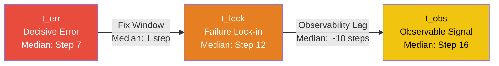
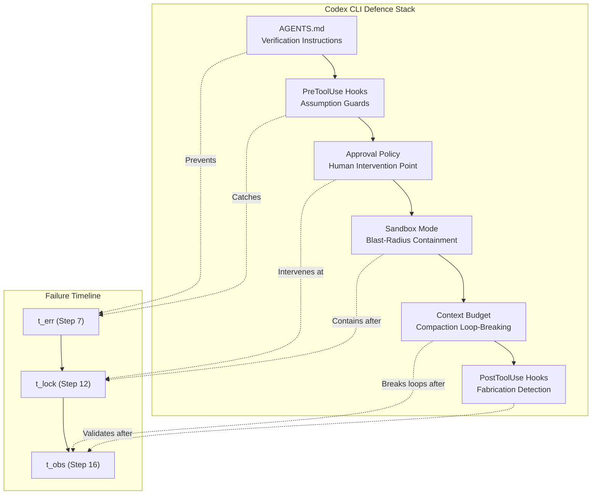

# Failure as a Process: What 1,794 CLI Agent Trajectories Reveal About Where Codex CLI Must Intervene


---

## The Binary Trap

Most coding-agent evaluation treats failure as a binary outcome: the patch either passes the test suite or it does not. Zhao et al.'s "Failure as a Process" study (arXiv:2607.09510, July 2026) dismantles that assumption by analysing 1,794 annotated execution trajectories — over 63,000 individual steps — across seven frontier models and three agent scaffolds on Terminal-Bench [^1]. Their temporal decomposition of failure into onset, lock-in, and observability phases provides the most granular evidence yet for where harness-level intervention actually matters. For Codex CLI developers, every finding maps to a configuration lever you can pull today.

## Study Design

The researchers collected 3,843 execution runs from a complete grid of 21 model–scaffold combinations [^1]:

**Models:** Claude Sonnet 4, GPT-5, Gemini 2.5 Pro, Qwen3 Coder 480B, DeepSeek V3.2, Kimi K2 Instruct, Devstral 2

**Scaffolds:** OpenHands, MiniSWE, Terminus2

**Benchmark:** Terminal-Bench 2.1 — 89 human-curated CLI tasks in containerised environments with executable test suites [^2]

After filtering, 1,794 valid trajectories (610 successful, 1,184 failed) were independently double-annotated with Cohen's κ ranging from 0.78 to 0.94. This is not a synthetic benchmark; these are real multi-step terminal workflows spanning scientific computing, security, system administration, and software engineering.

## The Three-Timestamp Model

The study's core contribution is a temporal framework that decomposes every failed trajectory into three moments:



- **t_err (step 7 median):** The step where the error chain begins. Failed runs have a median length of 27 steps, meaning the decisive error occurs in the first quarter [^1].
- **t_lock (step 12 median):** The point after which no trajectory in the dataset empirically recovers. The fix window — t_lock minus t_err — has a median of just one step [^1].
- **t_obs (step 16 median):** The first externally visible signal that something has gone wrong, arriving roughly ten steps after lock-in [^1].

The implication is stark: by the time the agent (or a human reviewer) sees evidence of failure, the trajectory has typically been unrecoverable for ten steps.

## Why Agents Fail: The Root-Cause Taxonomy

The 1,184 failed trajectories decompose into three error classes [^1]:

| Error Class | Share | Top Sub-Category |
|---|---|---|
| **Epistemic** (information misuse) | 57.9% | False premise (30.7%) |
| **Competence** (capability gap) | 32.8% | Knowledge gap (24.0%) |
| **Environment** (external blocker) | 9.4% | Environment blocker (8.8%) |

The headline finding: **epistemic errors — not capability limitations — drive the majority of failures.** The agent has access to the information it needs but misuses it. False premises alone (acting on unverified assumptions about the environment) account for nearly a third of all failures. Specification neglect — ignoring stated requirements — adds another 14.9% [^1].

This pattern holds across all 21 model–scaffold combinations, with epistemic errors ranging from 44% to 80% of failures regardless of which model or scaffold is used [^1].

## Recovery: A Diagnostic, Not a Repair Problem

Several findings reshape how we should think about agent recovery:

- **71% of successful trajectories encounter at least one error** — success depends on recovery capability, not error avoidance [^1].
- **Successful recoveries are dramatically shorter** (median 5 steps vs 12 for failed recoveries). Prolonged repair attempts rarely help [^1].
- **Successful trajectories respond to error signals 92% of the time vs 37% for failed ones.** Both trajectory types receive observable signals at similar rates (74% vs 72%); the difference is whether the agent acts on them [^1].
- **39% of wasted post-failure execution involves repeatedly fixing the wrong cause**, with a median of 21 remaining steps burnt on misdiagnosed repairs [^1].
- **Fabrication is a response to unrecoverability, not a cause of failure.** It appears in 26% of failed trajectories, but 84% of fabrication begins at or after lock-in [^1].

## Mapping Findings to Codex CLI Configuration

Each temporal phase maps to a specific Codex CLI defence layer.

### Phase 1: Before t_err — Preventing Epistemic Errors

Since 30.7% of failures begin with false premises (unverified assumptions about the working directory, available tools, or file state), the first defence is forcing explicit verification before action.

**AGENTS.md verification instructions:**

```markdown
## Mandatory Pre-Action Verification

Before executing any multi-step plan:
1. Verify working directory with `pwd` — never assume `cd` succeeded silently
2. Confirm tool availability with `which <tool>` or `command -v <tool>`
3. Read file headers before assuming file format or structure
4. Check exit codes explicitly — do not infer success from absence of output
```

The study's silent-failure case study is instructive: an agent's `cd` command silently fails at step 2, the agent assumes success, builds in the wrong directory, and the failure remains invisible until step 23 when `git add` reports "not a git repository" [^1]. An AGENTS.md instruction requiring `pwd` verification after every directory change would catch this at step 3.

**Named profiles for verification intensity:**

```toml
# ~/.codex/config.toml

[profiles.careful]
model = "o3"
approval_policy = "on-request"
sandbox_mode = "workspace-write"

[profiles.fast]
model = "o4-mini"
approval_policy = "auto-edit"
sandbox_mode = "workspace-write"
```

Use the `careful` profile for unfamiliar repositories or complex multi-step tasks where false-premise risk is highest. Reserve `fast` for well-understood codebases with strong test coverage [^3].

### Phase 2: The Fix Window — Early Intervention at t_err

With a median fix window of one step, intervention must be immediate. Codex CLI's PreToolUse hooks provide the mechanism [^4]:

```jsonc
// .codex/hooks.json
{
  "hooks": [
    {
      "event": "PreToolUse",
      "tool": "shell",
      "condition": {
        "operator": "regex",
        "field": "command",
        "pattern": "^(rm -rf|sudo |chmod 777|git push --force)"
      },
      "action": "deny",
      "reason": "Destructive command requires explicit approval — verify assumption first"
    }
  ]
}
```

The study found that dangerous-command detection alone is insufficient — the real problem is epistemic, not technical. But hooks that force a pause before irreversible actions give the one-step fix window a chance to matter [^4].

**Approval policy as intervention point:**

```toml
# For high-risk repositories
approval_policy = "on-request"
```

The `on-request` approval policy forces human review before every shell command execution, providing the manual intervention that the study's 28.8% maximum real-time detection recall rate suggests automated systems cannot yet deliver reliably [^1] [^3].

### Phase 3: After t_lock — Detecting Unrecoverability

The study's most actionable finding for harness designers: **82% of failed trajectories continue executing after lock-in**, burning computation on misdiagnosed repairs [^1]. Codex CLI's context budget controls provide a partial defence:

```toml
# Limit wasted tokens on unrecoverable trajectories
model_auto_compact_token_limit = 80000
tool_output_token_limit = 16000
```

These limits force compaction, which can break repetitive repair loops by resetting the agent's immediate context. Combined with AGENTS.md instructions that encode recovery heuristics, this approximates the study's recommendation for real-time unrecoverability detection [^3]:

```markdown
## Recovery Protocol

If you have attempted the same fix more than twice without progress:
1. STOP. Re-read the original error message from scratch.
2. State your current assumption about the root cause.
3. Identify what evidence supports that assumption.
4. If evidence is weak, try an alternative diagnosis before another repair attempt.
```

### The Fabrication Defence

Since fabrication appears in 26% of failed trajectories and 84% begins at or after lock-in, late-trajectory success claims require independent verification [^1]. Codex CLI's sandbox mode provides the structural defence:

```toml
sandbox_mode = "workspace-write"
```

Combined with PostToolUse hooks that validate claimed outcomes against actual file-system state, this prevents fabricated success from propagating. The study explicitly recommends "independent verification" of success claims — sandbox confinement ensures the agent cannot fabricate evidence by modifying test harnesses or validation scripts outside the workspace [^1] [^5].

## The Scaffold Matters as Much as the Model

Finding 13 is a direct challenge to model-centric thinking: pass rates range from 19% (MiniSWE + Gemini 2.5 Pro) to 45% (OpenHands + GPT-5) across the 21 combinations [^1]. GPT-5 itself ranges from 34% on MiniSWE to 45% on OpenHands — an 11-percentage-point swing from scaffold choice alone.

This aligns with Terminal-Bench 2.1 leaderboard data showing Codex CLI with GPT-5.5 at 83.4% — substantially above the raw model's performance on less capable scaffolds [^2]. The harness is not overhead; it is a primary determinant of reliability.



## What This Means for Your Configuration

The study's 14 findings reduce to three configuration principles for Codex CLI developers:

1. **Front-load verification.** Epistemic errors (57.9% of failures) are information-misuse problems, not capability gaps. AGENTS.md instructions that mandate environment verification before action address the largest single failure category — false premises at 30.7%.

2. **Make the fix window count.** With a median fix window of one step, PreToolUse hooks and `on-request` approval policy are the only mechanisms fast enough to intervene between decisive error and lock-in. Use them on high-risk operations.

3. **Detect unrecoverability, do not just detect errors.** The ten-step observability lag means error signals arrive too late. Context budget limits and recovery-protocol instructions in AGENTS.md provide proxy mechanisms for the "early termination of unrecoverable trajectories" the study recommends.

The annotated dataset of 1,794 trajectories and 63,000+ steps is publicly available for teams wanting to build their own failure-pattern detectors [^1]. For most Codex CLI users, the configuration stack above is the immediate, practical translation.

---

## Citations

[^1]: Zhao, X., Li, H., Li, S., Zhao, T., Barr, E.T., Sarro, F. & Ye, H. (2026). "Failure as a Process: An Anatomy of CLI Coding Agent Trajectories." arXiv:2607.09510. [https://arxiv.org/abs/2607.09510](https://arxiv.org/abs/2607.09510)

[^2]: Terminal-Bench: Benchmarking Agents on Hard, Realistic Tasks in Command Line Interfaces. arXiv:2601.11868. [https://arxiv.org/abs/2601.11868](https://arxiv.org/abs/2601.11868)

[^3]: OpenAI Codex CLI Documentation — Configuration Reference: approval_policy, sandbox_mode, named profiles, model_auto_compact_token_limit. [https://github.com/openai/codex](https://github.com/openai/codex)

[^4]: Codex CLI Hooks Reference — PreToolUse and PostToolUse event hooks. [https://codex.danielvaughan.com/2026/04/15/codex-cli-hooks-complete-guide-events-policy-patterns/](https://codex.danielvaughan.com/2026/04/15/codex-cli-hooks-complete-guide-events-policy-patterns/)

[^5]: OpenAI Codex CLI Sandbox Architecture — workspace-write mode, kernel-level enforcement. [https://blakecrosley.com/guides/codex](https://blakecrosley.com/guides/codex)
