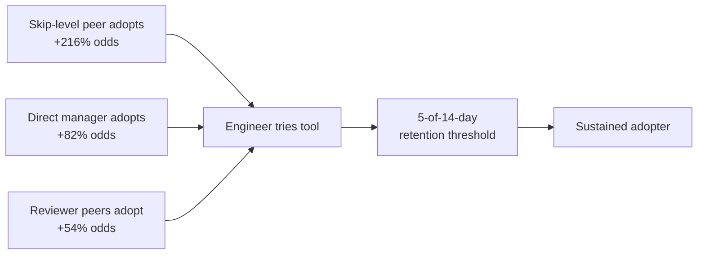
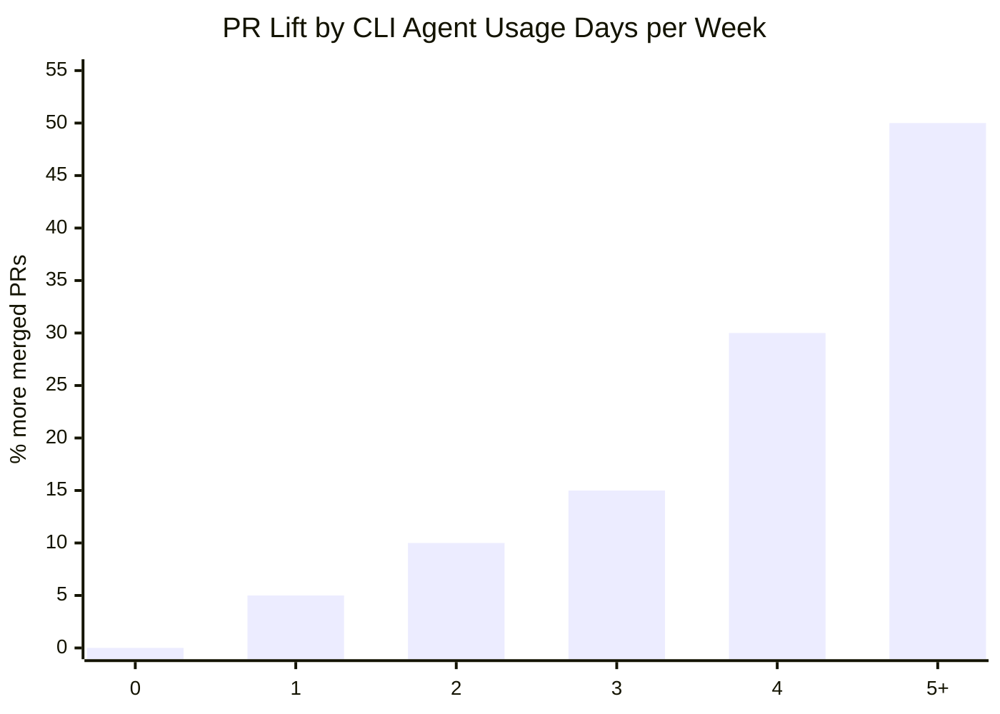

# What 24% More Merged PRs Tells Us About Rolling Out Codex CLI: Lessons from Microsoft's CLI Coding Agent Study


---

The question every engineering leader asks before committing budget to a CLI coding agent is blunt: does it actually make developers more productive, or are we buying expensive autocomplete? A study published on 1 July 2026 by Murphy-Hill, Butler, and Savelieva — all Microsoft Research — offers the most rigorous answer yet [^1]. Across tens of thousands of Microsoft engineers using Claude Code and GitHub Copilot CLI over a four-month window, adopters merged 24.0% more pull requests per engineer per day than a synthetic-control baseline (95% CI +14.5%, +33.7%, posterior tail-area p < 0.001) [^1]. The lift persisted across sub-periods, ruling out novelty effects.

This article unpacks what the study found, where its findings map onto Codex CLI's configuration surface, and how to structure an enterprise rollout that exploits the adoption patterns the data reveals.

## The Study at a Glance

The researchers examined Microsoft's early 2026 rollout of two agentic CLI tools — Copilot CLI and Claude Code — observing engineers from a pre-period of October 2025 through April 2026 [^1]. Key design choices:

- **Adoption threshold:** an engineer counted as having adopted if they used the tool on at least 5 of 14 days from first use, separating sustained use from idle curiosity [^1].
- **Outcome metric:** merged pull requests per engineer per day, tracked through Azure DevOps telemetry [^1].
- **Causal method:** Bayesian structural time-series (CausalImpact) for the headline estimate, plus within-person fixed-effects Poisson regression for dose-response and demographic moderation [^1].

A placebo test at October 2025 returned −1.1% (95% CI −10.6%, +8.6%), confirming no pre-existing trend [^1].

## Three Findings That Should Shape Your Rollout

### 1. Social Networks Drive Initial Adoption, Not Mandates

The strongest predictor of an engineer trying a CLI agent was not a Slack announcement or a training session. It was whether their skip-level peers — engineers two levels up the reporting chain — had already adopted: +216% odds of initial use [^1]. Direct-manager use added +82% odds [^1]. Reviewer peers with 25%+ adoption added +54% [^1].

The mechanism, surfaced in a 609-response internal survey, was visibility of peer output: shared code samples, documentation generated by the tool, and demonstrations during code review [^1].



**Codex CLI implication:** your rollout should start with senior ICs and tech leads who review code across multiple teams, not with a company-wide enablement email. Give them named profiles configured for their stack and let their output do the evangelism.

### 2. Retention Tracks Coding Activity, Not Seniority

Prior IDE Copilot usage increased the odds of trying the CLI tools (+49% to +83%), but paradoxically decreased retention by 12–15% [^1]. The researchers hypothesise that IDE-comfortable developers found the terminal workflow too different. The strongest retention predictor was baseline coding volume: engineers merging 2+ PRs per week were +31% more likely to stick [^1].

Career-stage effects were modest. Junior ICs (IC2–IC3) were 13–14% less likely to try the tools than mid-level (IC4), but senior ICs (IC5) were +22% more likely [^1].

**Codex CLI implication:** target your highest-throughput developers first. They have the most to gain from parallelisation and the strongest incentive to retain. Configure their environments to reduce friction:

```toml
# config.toml — profile for high-throughput adopters
[profile.power]
model = "gpt-5.6-sol"
approval_policy = "auto-edit"
sandbox_mode = "workspace-write"

[profile.power.history]
persist = true
resume_on_start = true
```

### 3. Dose-Response Is Monotone and Convex

The productivity lift scaled with usage days per week: three days gave +15.0%, rising to +50.1% at five or more days [^1]. The relationship was convex — each additional day of use yielded increasing marginal returns, not diminishing ones. This suggests the tools reward workflow integration rather than occasional use.



**Codex CLI implication:** the worst rollout strategy is giving everyone access and hoping for the best. The convex return curve means engineers who use the tool three days a week capture less than a third of the value available to daily users. Your rollout should include structured onboarding that pushes toward daily integration — AGENTS.md files committed to every active repository, shell aliases, and CI/CD pipeline hooks via `codex exec`.

## Mapping the Findings to Codex CLI Configuration

### Fleet Governance with requirements.toml

Microsoft's study involved two tools with different security postures. Codex CLI's `requirements.toml` gives platform teams the ability to enforce a consistent security baseline across the fleet while allowing individual teams to customise within those constraints [^2]:

```toml
# requirements.toml — enterprise policy floor
[policy]
sandbox_mode_minimum = "workspace-write"
approval_policy_maximum = "auto-edit"
allowed_models = ["gpt-5.6-sol", "gpt-5.6-terra", "gpt-5.6-luna"]

[policy.network]
allow_list = ["api.openai.com", "*.internal.corp"]
```

This separation of policy (what the platform team enforces) from preference (what individual developers configure) directly addresses the study's finding that retention tracks coding activity — you want to remove friction for power users without sacrificing governance [^2].

### Named Profiles for Phased Rollout

The social-network adoption pattern suggests a three-phase rollout [^3]:

```toml
# Phase 1: Senior IC champions — full capability
[profile.champion]
model = "gpt-5.6-sol"
approval_policy = "auto-edit"
sandbox_mode = "workspace-write"

# Phase 2: Team-wide — balanced safety
[profile.team]
model = "gpt-5.6-terra"
approval_policy = "on-request"
sandbox_mode = "workspace-write"

# Phase 3: Organisation-wide — conservative default
[profile.default]
model = "gpt-5.6-luna"
approval_policy = "on-request"
sandbox_mode = "read-only"
```

Each phase maps to a named profile distributed through managed configuration. As adoption spreads through the social network, engineers graduate to more capable profiles [^3].

### AGENTS.md as the Peer-Visibility Mechanism

The study found that peer visibility of tool output was the primary adoption driver [^1]. In Codex CLI terms, the most visible artefact of an agent-assisted workflow is a well-written `AGENTS.md` file committed to the repository root [^4]. When a senior IC's `AGENTS.md` file shows up in a colleague's code review, it serves the same function as the shared outputs the Microsoft survey respondents described:

```markdown
# AGENTS.md

## Build & Test
- Run `make test` before proposing changes
- Integration tests require `docker compose up -d`

## Code Style
- Follow Go standard project layout
- Use table-driven tests with descriptive subtest names

## Review Checklist
- All public functions must have godoc comments
- Error messages must include the operation that failed
```

This file becomes the mechanism through which the skip-level peer effect propagates: it demonstrates what the tool can do, teaches colleagues how to use it, and standardises quality expectations across the team.

## Caveats Worth Noting

The study is strong but not without limitations. The authors are transparent about several [^1]:

- **Single company:** Microsoft's engineering culture, tooling, and incentive structures may not generalise. The Azure DevOps PR measurement also undercounts developers working across ecosystems.
- **Merged PRs as proxy:** a PR is not the same as the value it delivers. The study explicitly acknowledges this construct validity limitation.
- **Homophily vs. influence:** the social-network findings cannot fully separate genuine peer influence from homophily — similar people adopting independently.
- **16-week window:** long enough to rule out novelty but not long-horizon decline. ⚠️ Whether the 24% lift sustains beyond four months remains unverified.
- **Copilot CLI vs. Codex CLI:** the study examined Copilot CLI and Claude Code, not Codex CLI directly. The architectural parallels are strong (terminal-native, sandbox-isolated, approval-policy-governed), but direct transferability should be treated as inference rather than established fact.

## Practical Rollout Checklist

Based on the study's findings, here is a concrete rollout sequence for Codex CLI:

1. **Identify champions** — select 5–10 senior ICs per division who already merge 2+ PRs per week and participate actively in code review.
2. **Configure champion profiles** — distribute `config.toml` with the `champion` profile via MDM or managed configuration, paired with a `requirements.toml` policy floor [^2] [^3].
3. **Seed AGENTS.md files** — have champions commit `AGENTS.md` to their most-reviewed repositories within the first week [^4].
4. **Measure the skip-level effect** — after 2–3 weeks, track which non-champion engineers begin using Codex CLI. The study predicts these will cluster around the champions' reporting chains [^1].
5. **Expand with the team profile** — once organic adoption appears, deploy the `team` profile to entire teams, with `requirements.toml` enforcing the safety floor [^2].
6. **Track dose-response** — use `/usage` telemetry to identify engineers stuck at 1 day per week and offer targeted onboarding to push toward daily integration [^5].

## Conclusion

The Microsoft study is the strongest empirical evidence yet that CLI coding agents deliver sustained productivity gains at enterprise scale. The 24% PR uplift is significant, but the more actionable insight is the mechanism: adoption spreads through social networks, not mandates, and the return curve rewards daily integration over occasional use.

For Codex CLI specifically, this means your rollout architecture matters as much as your model selection. Named profiles, `requirements.toml` governance, and visible `AGENTS.md` artefacts are not administrative overhead — they are the infrastructure that converts a 15% lift into a 50% one.

---

## Citations

[^1]: Murphy-Hill, E., Butler, J., & Savelieva, A. (2026). "Adoption and Impact of Command-Line AI Coding Agents: A Study of Microsoft's Early 2026 Rollout of Claude Code and GitHub Copilot CLI." arXiv:2607.01418. [https://arxiv.org/abs/2607.01418](https://arxiv.org/abs/2607.01418)

[^2]: OpenAI. (2026). "Codex CLI Enterprise Managed Configuration: requirements.toml and Admin-Enforced Policies." [https://openai.com/codex/docs/enterprise-config](https://openai.com/codex/docs/enterprise-config)

[^3]: Codex Knowledge Base. (2026). "Permission Profiles End-to-End: Governed Repo Mode and Enterprise Security Posture." [https://codex.danielvaughan.com/2026/04/17/permission-profiles-governed-repo-enterprise-security/](https://codex.danielvaughan.com/2026/04/17/permission-profiles-governed-repo-enterprise-security/)

[^4]: OpenAI. (2026). "AGENTS.md Reference." Codex CLI Documentation. [https://github.com/openai/codex](https://github.com/openai/codex)

[^5]: OpenAI. (2026). "Codex CLI v0.145.0 Release Notes — /usage command and usage-limit reset credits." [https://github.com/openai/codex/releases/tag/rust-v0.145.0](https://github.com/openai/codex/releases/tag/rust-v0.145.0)
