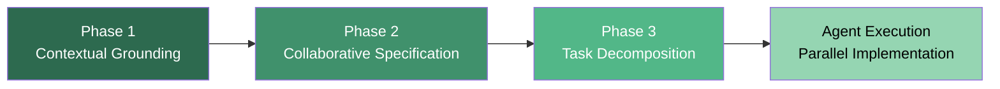
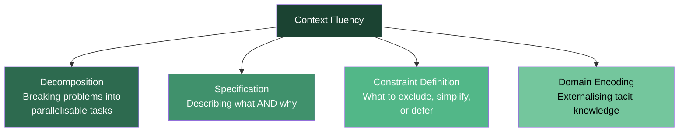

# Mise en Place for Agentic Coding: How Deliberate Preparation and Context Fluency Transform Your Codex CLI Workflow


---

Most developers launch Codex CLI, type a prompt, and hope for the best. The dominant workflow — colloquially known as "vibe coding" — prioritises speed of invocation over quality of preparation. A recent academic paper from VibeX 2026 argues this creates a systematic alignment problem: agents that lack sufficient context produce code requiring extensive debugging and refactoring, consuming the time they were meant to save [^1]. The remedy, borrowed from professional kitchens, is *mise en place*: everything in its place before the first flame.

This article unpacks the Mise en Place (MEP) methodology for agentic coding, examines its empirical results, and maps each phase directly onto Codex CLI configuration and tooling available in v0.145.0 and later.

## The Problem: Alignment Debt

When a coding agent begins work with an underspecified prompt, every ambiguous micro-decision it makes diverges further from the developer's intent. The cumulative effect is what Zigler calls "alignment debt" — structural misalignment that compounds across files and modules [^1]. Iterative correction (prompting the agent to fix what it got wrong) is expensive: each correction round burns tokens, invalidates prompt cache prefixes, and risks introducing new misalignment.

The MEP methodology inverts this pattern. Instead of correcting after the fact, it front-loads alignment work into three preparation phases completed *before* the agent writes a single line of code.

## The Three Phases of MEP



### Phase 1: Contextual Grounding

The first phase externalises domain expertise and tacit knowledge into structured documents that agents can consume. This goes beyond writing a README — it requires articulating the implicit knowledge that experienced developers carry but rarely document: architectural rationale, competitive context, design philosophy, and non-obvious constraints [^1].

In the hackathon case study reported in the paper, this phase produced ten planning documents totalling 9,386 words, including API exploration notes, competitive analysis, and an extended dictation on pedagogical design philosophy [^1].

**Codex CLI mapping:**

The natural home for contextual grounding in Codex CLI is the `AGENTS.md` file at the repository root. Codex reads this file on every session start [^2]. But MEP suggests going further than the typical build-and-test instructions:

```markdown
<!-- AGENTS.md — contextual grounding section -->

## Domain Context

This is a multi-tenant SaaS platform for veterinary practices.
Key domain terms: "patient" always refers to the animal, not the owner.
Billing uses a split-invoice model — see docs/billing-architecture.md.

## Architectural Rationale

We chose event sourcing for the appointment module because practices
frequently need to reconstruct scheduling history for insurance disputes.
Do NOT refactor to CRUD without explicit approval.

## Constraints

- No client-side state management libraries (React context + URL state only)
- All API responses must include ETag headers for cache validation
- British English in all user-facing strings
```

For larger context sets, use Codex CLI's multi-folder project support (v0.145.0) to make supplementary documentation folders accessible without cluttering the primary working directory [^3].

### Phase 2: Collaborative Specification

The second phase produces detailed design artefacts through structured human-agent dialogue. The practitioner describes intent; the agent proposes details; the practitioner accepts, rejects, or modifies. Crucially, the paper emphasises encoding *value judgements* — what to exclude matters as much as what to include [^1].

**Codex CLI mapping:**

This is precisely what Codex CLI's Plan mode delivers. Toggle it with `/plan` or `Shift+Tab` before implementation begins [^4]. In Plan mode, Codex gathers context, asks clarifying questions, and builds an approach before committing to code.

The reverse interview pattern works particularly well here: instruct Codex to question your assumptions before proposing a design.

```bash
# In your Codex CLI session:
/plan

# Then prompt:
"Before designing anything, interview me about the requirements for the
new notification system. Challenge my assumptions. Ask about edge cases
I might have missed."
```

For specifications that must persist across sessions, write the output to a `PLANS.md` file. Plan mode's interactive state disappears when the session ends; a persistent document does not [^4].

```toml
# ~/.codex/config.toml — default to plan mode for complex work
[profile.architect]
model = "gpt-5.6-sol"
approval_policy = "suggest"
```

### Phase 3: Task Decomposition

The third phase converts specifications into structured, dependency-aware task records enabling parallel agent execution. The MEP paper uses "Beads" — lightweight JSON records backed by Git, carrying priorities, dependencies, and acceptance criteria [^1]. The critical insight is that coordination burden shifts from runtime (where agents lack the judgement to resolve conflicts) to preparation (where human architectural judgement is most valuable).

**Codex CLI mapping:**

Codex CLI's Multi-Agent V2 (stable in v0.145.0) supports configurable sub-agent models, reasoning levels, and concurrency [^3]. Combined with worktree isolation, this enables the parallel execution pattern the MEP methodology demands:

```bash
# Decompose into independent tasks, then dispatch:
codex --model gpt-5.6-terra "Implement the notification preferences API
  endpoint per PLANS.md task 12. Do not modify any files outside
  src/api/notifications/."

# In a separate worktree:
codex --model gpt-5.6-luna "Write unit tests for the notification
  preferences schema per PLANS.md task 13."
```

The key is that each task carries its own boundary constraints (which files to touch, which APIs to call, which patterns to follow), all derived from the specification phase.

## Context Fluency: The Emerging Practitioner Skill

The MEP paper introduces *context fluency* as a new practitioner competency: "the ability to create rich, structured context that AI agents can act on" [^1]. This is distinct from prompt engineering, which optimises individual invocations. Context fluency operates at workflow scope and comprises four components:



In Codex CLI terms, context fluency manifests as:

| Component | Codex CLI Artefact |
|---|---|
| Decomposition | Multi-Agent V2 task assignment with worktree isolation |
| Specification | AGENTS.md domain sections + PLANS.md design docs |
| Constraint definition | `sandbox_mode`, file-scope restrictions in prompts, `requirements.toml` |
| Domain encoding | Contextual grounding docs in multi-folder projects |

## The Hackathon Evidence

The MEP methodology was demonstrated at a competitive hackathon where roughly two hours of preparation enabled rapid parallel implementation of a full-stack educational platform by four concurrent AI agents [^1]. The quantitative results are striking:

- **64 task records** with explicit dependencies generated during preparation
- **43 tasks closed** with a median completion time of **5.9 minutes** per task
- **Bug-type tasks**: median 1.2 minutes (mean 1.5 minutes)
- **Implementation tasks**: median 9.7 minutes
- **Final codebase**: 43 TypeScript/TSX files, 8,496 lines of source code
- **Planning-to-code ratio**: 1.10:1 (9,386 words of planning against 8,496 lines of code)
- **Zero structural refactoring** required during deployment — only integration and styling bugs emerged [^1]

That last point is the most significant. The architecture held because the agents had sufficient context to make aligned micro-decisions throughout implementation. Compare this with the typical vibe-coding experience, where architectural misalignment often surfaces only during integration.

## Configuring Your MEP Workflow in Codex CLI

Here is a practical configuration that operationalises the three MEP phases:

```toml
# ~/.codex/config.toml

# Phase 1 & 2: Use Sol for grounding and specification work
[profile.architect]
model = "gpt-5.6-sol"
approval_policy = "suggest"
model_reasoning_effort = "high"

# Phase 3: Use Luna for fast parallel task execution
[profile.worker]
model = "gpt-5.6-luna"
approval_policy = "auto-edit"
model_reasoning_effort = "medium"
```

```markdown
<!-- AGENTS.md — MEP workflow instructions -->

## Workflow

This project follows the Mise en Place methodology.

### Before implementation:
1. Read all documents in docs/context/ for domain grounding
2. Read PLANS.md for the current specification
3. Only work on tasks explicitly assigned — do not expand scope

### During implementation:
- Each task has file-scope boundaries — do not modify files outside your scope
- Run the test suite for your module before marking a task complete
- If a task requires changes outside your scope, stop and report the dependency
```

## The Planning-to-Execution Ratio

The MEP paper reports a preparation-to-execution ratio of approximately 5.7:1 — nearly six units of agent execution time yielded per unit of preparation time [^1]. This challenges the intuition that preparation is overhead. In token-economic terms, two hours of careful grounding and specification may save substantially more in avoided rework, failed prompt-cache invalidations, and debugging rounds.

For Codex CLI users paying attention to token costs, this aligns with findings from prompt-cache economics research: aggressive context compression destroys cache prefixes and can increase costs by 6.8% even while reducing raw token counts [^5]. Front-loading stable, well-structured context in AGENTS.md and PLANS.md preserves cache hit rates across turns.

## Open Questions

The MEP methodology raises several research questions that remain unanswered [^1]:

1. **Stopping criteria**: How much preparation is enough? The paper offers no formal metric for when contextual grounding is "sufficient."
2. **Scale**: Does MEP work for multi-month projects, or only hackathon-scale prototypes?
3. **Practitioner variance**: How does context fluency differ across experience levels and domains?
4. **Model sensitivity**: Do different foundation models require different preparation strategies?

These are worth tracking. As Codex CLI's Multi-Agent V2 matures and the plugin ecosystem expands, the preparation-to-execution ratio may shift — but the core principle (align before you execute) is unlikely to become less relevant.

## Conclusion

The Mise en Place methodology reframes agentic coding from "prompt and pray" to "prepare, specify, decompose, then execute." Its three phases map cleanly onto Codex CLI's existing tooling: AGENTS.md for contextual grounding, Plan mode for collaborative specification, and Multi-Agent V2 with worktree isolation for parallel task execution. The hackathon evidence — zero architectural refactoring, 5.9-minute median task closure, 8,496 lines of working code from two hours of preparation — suggests that context fluency is not optional overhead but a force multiplier.

The culinary metaphor holds: chefs who skip mise en place do not cook faster. They cook worse.

---

## Citations

[^1]: Zigler, A. (2026). "Mise en Place for Agentic Coding: Deliberate Preparation as Context Engineering Methodology." *VibeX 2026 (1st International Workshop on Vibe Coding)*, co-located with EASE 2026. arXiv:2605.05400. [https://arxiv.org/abs/2605.05400](https://arxiv.org/abs/2605.05400)

[^2]: OpenAI. (2026). "Codex CLI Best Practices." OpenAI Developer Documentation. [https://developers.openai.com/codex/learn/best-practices](https://developers.openai.com/codex/learn/best-practices)

[^3]: OpenAI. (2026). "Codex CLI Changelog — v0.145.0." GitHub Releases. [https://github.com/openai/codex/releases/tag/rust-v0.145.0](https://github.com/openai/codex/releases/tag/rust-v0.145.0)

[^4]: OpenAI. (2026). "Codex Plan Mode." ChatGPT Learn Documentation. [https://learn.chatgpt.com/docs/changelog](https://learn.chatgpt.com/docs/changelog)

[^5]: Weinberger, N. & Hozez, A. (2026). "Token Reduction Is Not Cost Reduction: Prompt-Cache Economics in Coding Agents." arXiv:2607.12161. [https://arxiv.org/abs/2607.12161](https://arxiv.org/abs/2607.12161)
