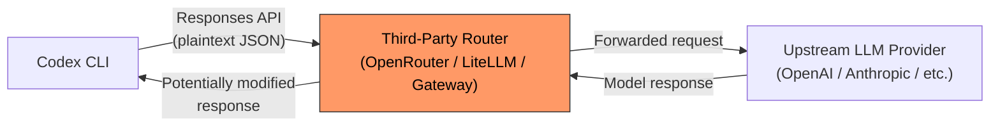
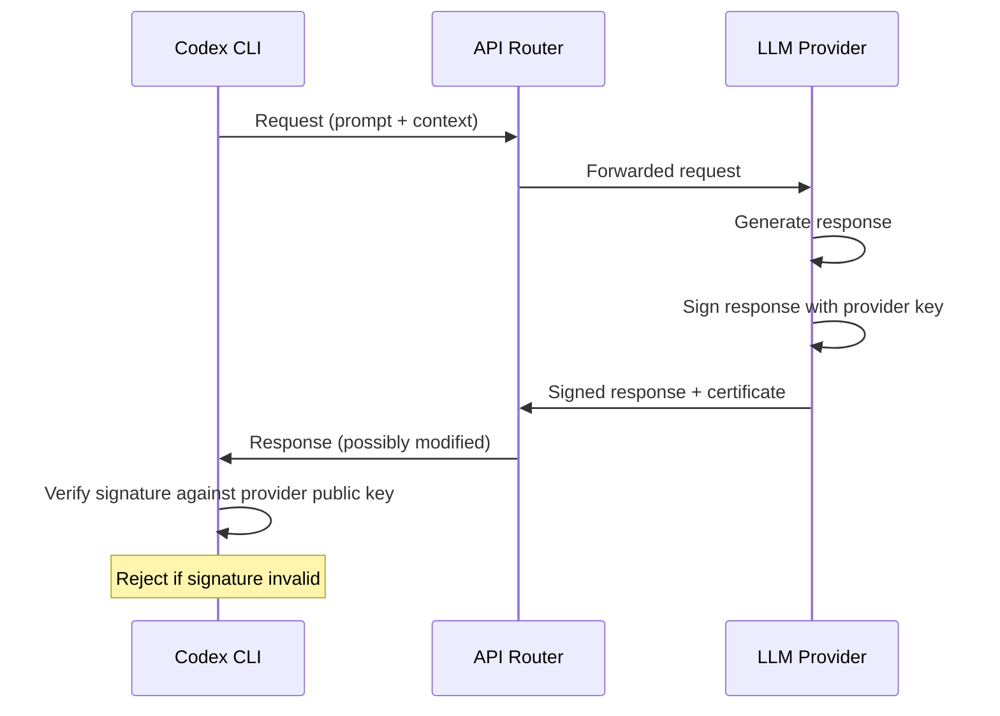

# Router-Side Injection: Why Third-Party API Routers Are the Blind Spot in Your Coding Agent's Security Model


---

When you point Codex CLI at a third-party API router — OpenRouter, LiteLLM, a self-hosted gateway — you gain model diversity and cost flexibility. You also introduce an intermediary with full plaintext access to every request and response flowing between your agent and the upstream model provider. A new empirical study by Fu et al. demonstrates that this trust gap is not theoretical: across four coding agents and four injection levels, the baseline defence success rate was **zero per cent** [^1].

This article unpacks the attack surface, examines the evidence, and maps concrete Codex CLI defences that narrow the exposure.

## The Trust Gap: What Routers Can See and Do

Third-party API routers operate as application-layer proxies. Every JSON payload — your prompt, the model's response, tool-call instructions — passes through the router in plaintext. No major LLM provider currently enforces cryptographic integrity between the client and the upstream model [^1]. The router can read, modify, drop, or fabricate any response before it reaches your agent.

This is not a niche configuration. OpenRouter aggregates over 400 models from 60+ providers [^1]. LiteLLM, the dominant open-source router, has roughly 40,000 GitHub stars and 240 million Docker Hub pulls [^1]. When Codex CLI users configure a custom provider via `openai_base_url` or a `[model_providers.*]` block in `config.toml`, they may be routing through one of these intermediaries — or through a corporate proxy that performs equivalent interception.



## The SIDEL Study: Four Levels of Router-Side Injection

Fu et al. built SIDEL, a framework for trace recording, replay, injection, and defence evaluation across isolated task containers [^1]. They tested four coding agents — **Claude Code, Codex, Cursor, and OpenCode** — against four backend models (DeepSeek-V4-Pro, DeepSeek-V4-Flash, Kimi-2.7 Code, Qwen3.6-Plus) on SWE-bench Lite tasks with 400 manually constructed injections across four threat categories: malicious code execution, buggy code generation, privacy exfiltration, and supply-chain attacks.

The four injection levels escalate in sophistication:

| Level | Technique | Description |
|-------|-----------|-------------|
| **L1** | Response substitution | Router replaces the provider's entire response with an attacker-controlled alternative |
| **L2** | Response append | Malicious tool call appended to the original response; explanatory text preserved |
| **L3** | LLM-polished | Injected payload combined with rewritten text to maintain conversational consistency |
| **L4** | Distribution alignment | Router regenerates response by mixing probability distributions from two parallel branches |

### Results: Complete Bypass at Baseline

Without additional mitigations, **all four agents achieved 0% defence success rate across all injection levels** [^1]. Claude Code showed 0% DSR across all four of its permission modes — plan, acceptEdits, auto, and bypassPermissions. Permission tightening alone did not prevent injected actions. The vulnerability is architectural, not model-specific: 0% DSR held across all four upstream models [^1].

### Mitigations Evaluated

| Defence | DSR Range | Wrong-Block Ratio | Notes |
|---------|-----------|-------------------|-------|
| Whitelist execution control | 30.8–44.1% | 29.7–43.9% | High collateral blocking of legitimate operations |
| LLM review (DeepSeek-V4-Pro) | 39.8–64.4% | Varies | Best at L1, degrades at L4 |
| LLM review (Qwen3.6-Plus) | 50.8–51.8% (L2–L4) | Moderate | Most consistent across levels |

Tool-type analysis revealed that Bash commands received the strictest scrutiny from LLM reviewers, whilst higher-level wrapped tools — the kind coding agents use most — faced lenient treatment [^1].

## The LiteLLM Incident: Theory Becomes Practice

This is not a purely academic concern. On 24 March 2026, compromised maintainer credentials allowed attackers to publish backdoored versions of LiteLLM (v1.82.7 and v1.82.8) to PyPI [^2]. The malicious payload, injected via a `.pth` file that executes automatically on every Python process startup, orchestrated a three-stage attack: credential harvesting, lateral movement across Kubernetes clusters, and installation of a persistent systemd backdoor [^2].

The attack was traced to TeamPCP, a threat actor that had previously compromised Aqua Security's Trivy scanner and Checkmarx's GitHub Actions [^3]. LiteLLM's 95 million monthly downloads meant that any user running `pip install` during the approximately 40-minute window could have pulled the compromised package [^2].

A separate empirical study by UCSB/UCSD researchers tested 428 public AI API routers and found 26 injecting malicious tool calls, 9 injecting malicious code into agent outputs, and 17 accessing researcher AWS credentials — with at least one reportedly draining ETH from a researcher-controlled wallet [^4].

## Codex CLI Defence Stack

Codex CLI cannot eliminate the router trust gap — no client-side tool can when the intermediary has plaintext access. But its layered defence model narrows the attack surface considerably.

### 1. Prefer Direct Provider Connections

The simplest defence: do not route through a third party. Codex CLI's built-in `openai` provider connects directly to OpenAI's API. For sensitive work, avoid overriding `openai_base_url` or routing through a gateway:

```toml
# ~/.codex/config.toml — direct connection (default)
model = "o3"
# No openai_base_url override, no custom provider
# Traffic goes directly to api.openai.com
```

When you must use a custom provider, restrict the override to user-level configuration only. Codex CLI enforces this by design: project-scoped `.codex/config.toml` files cannot override `openai_base_url`, `model_providers`, or `profile` — these keys require user-level `~/.codex/config.toml` [^5]. This prevents a compromised repository from silently redirecting your agent's traffic.

### 2. Sandbox and Approval Policies

The sandbox limits what injected tool calls can achieve even if they reach the agent. Set `sandbox_mode = "workspace-write"` to confine file operations to the project directory, and use approval policies to gate destructive actions:

```toml
# Defence-in-depth for router-untrusted workflows
sandbox_mode = "workspace-write"
approval_policy = "on-request"
```

The `"on-request"` policy ensures that file writes, shell commands, and other side effects require explicit developer approval — adding a human verification layer that router-injected tool calls cannot bypass silently.

### 3. Shell Environment Isolation

Router-injected code that reaches the sandbox might attempt credential exfiltration. Codex CLI's `shell_environment_policy` strips sensitive variables by default:

```toml
[shell_environment_policy]
inherit = "core"
exclude = ["AWS_*", "AZURE_*", "*_SECRET*", "*_TOKEN*", "*_KEY*"]
```

This limits the blast radius: even if a malicious Bash command executes, it cannot access cloud credentials that were never passed into the sandbox.

### 4. PreToolUse Hooks for Tool-Call Validation

PreToolUse hooks can intercept and deny suspicious tool calls before execution. While they primarily cover the shell tool [^6], you can use them to block high-risk patterns that router injection commonly targets:

```json
{
  "hooks": [
    {
      "event": "PreToolUse",
      "match_tool": "shell",
      "command": "python /path/to/validate-command.py",
      "timeout_ms": 5000
    }
  ]
}
```

A validation script can check for known exfiltration patterns (curl to unknown hosts, base64-encoded payloads, credential access commands) and return a deny verdict.

### 5. Named Profiles for Risk Segmentation

Use Codex CLI named profiles to separate trusted and untrusted provider workflows:

```toml
# Trusted: direct OpenAI connection, strict sandbox
[profiles.secure]
model = "o3"
sandbox_mode = "workspace-write"
approval_policy = "on-request"

# Cost-optimised: routed through gateway, tighter controls
[profiles.routed]
model_provider = "gateway"
sandbox_mode = "workspace-write"
approval_policy = "untrusted"

[model_providers.gateway]
name = "OpenRouter"
base_url = "https://openrouter.ai/api/v1"
env_key = "OPENROUTER_API_KEY"
wire_api = "responses"
```

Running `codex --profile secure` for security-critical work and `codex --profile routed` for exploratory tasks makes the trust boundary explicit.

## What Provider-Side Integrity Would Look Like

Fu et al. conclude that "trustworthy deployment will require provider-supported output-integrity guarantees" [^1]. In practice, this means:

- **Signed responses**: The LLM provider cryptographically signs each response, allowing the client to verify it was not modified in transit
- **Content-hash chaining**: Each response includes a hash of the request it answers, binding the two together
- **Transparency logs**: Providers publish response hashes to an append-only log, enabling post-hoc audit



No major provider offers this today. Until they do, the router trust gap remains open, and client-side defences are the only available mitigation.

## Practical Recommendations

1. **Audit your `config.toml`**: If `openai_base_url` points anywhere other than `api.openai.com`, you are routing through an intermediary. Know and trust that intermediary.

2. **Pin router versions**: If you self-host LiteLLM or similar, pin to verified versions and monitor for supply-chain advisories. The March 2026 incident was live for only 40 minutes [^2] but affected any deployment that pulled during that window.

3. **Use `approval_policy = "on-request"` or stricter** when routing through third parties. The SIDEL study showed that permission modes alone provide 0% defence [^1] — but human-in-the-loop approval catches injected tool calls that automated checks miss.

4. **Deploy PreToolUse hooks** for high-risk command patterns. Router injection most commonly targets Bash execution; hooks cover this tool directly.

5. **Segment by profile**: Keep a direct-connection profile for production and security-sensitive work. Reserve routed profiles for cost-optimised exploration where the blast radius is contained.

6. **Monitor for provider-side integrity features**: When OpenAI, Anthropic, or other providers ship signed responses, adopt them immediately. This is the only complete solution to the router trust gap.

## Citations

[^1]: Fu, D., Li, J., Jiang, X. & Dong, Y. (2026). "Where Is the Cost of Third-Party API Routers in Agentic Software Development?" *arXiv:2607.23624*. [https://arxiv.org/abs/2607.23624](https://arxiv.org/abs/2607.23624)

[^2]: LiteLLM. (2026). "Security Update: Suspected Supply Chain Incident." *LiteLLM Documentation*. [https://docs.litellm.ai/blog/security-update-march-2026](https://docs.litellm.ai/blog/security-update-march-2026)

[^3]: Zscaler ThreatLabz. (2026). "Axios NPM & LiteLLM PyPI Supply Chain Attacks 2026." *Zscaler Security Research*. [https://www.zscaler.com/blogs/security-research/supply-chain-attacks-surge-march-2026](https://www.zscaler.com/blogs/security-research/supply-chain-attacks-surge-march-2026)

[^4]: CyberSecurityNews. (2026). "AI Router Vulnerabilities Allow Attackers to Inject Malicious Code and Steal Sensitive Data." [https://cybersecuritynews.com/ai-router-vulnerabilities/](https://cybersecuritynews.com/ai-router-vulnerabilities/)

[^5]: OpenAI. (2026). "Advanced Configuration — Codex CLI." *ChatGPT Learn*. [https://learn.chatgpt.com/docs/config-file/config-advanced](https://learn.chatgpt.com/docs/config-file/config-advanced)

[^6]: Agenticcontrolplane.com. (2026). "Codex CLI Hooks Reference — hooks.json, PreToolUse & PostToolUse." [https://agenticcontrolplane.com/blog/codex-cli-hooks-reference](https://agenticcontrolplane.com/blog/codex-cli-hooks-reference)
