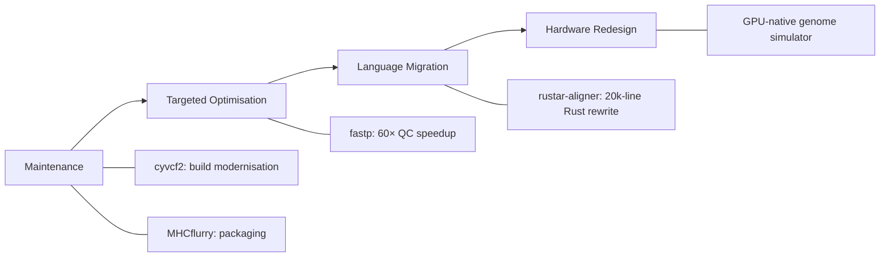
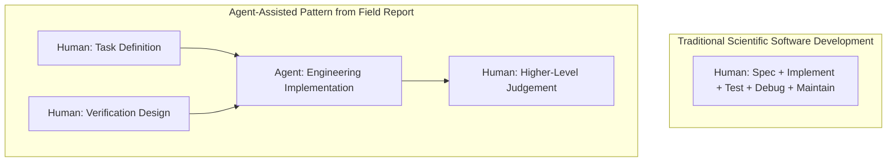

# From Implementation to Verification: What OpenAI's Scientific Computing Field Report Reveals About Codex CLI's Role in Legacy Code Modernisation


---

On 28 July 2026, OpenAI published an exploratory field report documenting eight agent-assisted scientific computing projects — primarily in the life sciences — where coding agents rewrote, optimised, and modernised legacy research software [^1]. The headline numbers are striking: a 60× speedup in RNA-sequencing quality control, a from-scratch Rust rewrite of a 20,000-line C/C++ genome aligner achieving 99.8% parity, and a GPU-native redesign that cut synthetic genome generation from 1,610 seconds to 27 seconds per run [^1]. Five projects used Codex alone; three combined Codex with Claude Code [^1].

But the report's most consequential finding is not about performance. It is about what happened to the *humans*. Across all but one project, contributor effort shifted from writing code to defining tasks, verifying results, and making higher-level judgements [^1]. For Codex CLI practitioners, this has direct implications for how you configure approval policies, structure AGENTS.md, and design verification harnesses.

## The Eight Projects: A Taxonomy of Interventions

The case studies span four distinct intervention types, ordered by increasing scope [^1]:



### Maintenance: cyvcf2 and MHCflurry

**cyvcf2** is a Python library for reading and writing genomic variant files [^1]. GPT-5.5, operating through Codex, replaced its legacy build and packaging system with a modern, unified process designed to make the library easier to install, test, and release [^1]. Changes were incorporated into the original upstream project [^1].

**MHCflurry** — an immunopeptide binding predictor — received similar treatment, with agent-generated changes merged upstream [^1].

These are precisely the maintenance tasks that accumulate as technical debt in research groups: unglamorous, essential, and perpetually deprioritised. Codex's sandbox mode (`workspace-write`) is well-suited here — the agent needs filesystem access to restructure build files but should not touch production data or escape the project boundary.

### Targeted Optimisation: 60× RNA-Seq QC Speedup

The most dramatic single-metric improvement came from optimising RNA-sequencing quality control pipelines, achieving a 60× speedup [^1]. This class of optimisation — profiling hotspots, rewriting inner loops, applying SIMD intrinsics — is where Codex CLI's `full-auto` mode excels when paired with a concrete, verifiable success criterion:

```bash
codex --full-auto "/goal Optimise the QC pipeline.
Success: all existing tests pass AND wall-clock time
on the benchmark dataset drops below 30 seconds."
```

The key insight: every optimisation target in the field report had a *machine-verifiable* success condition. No subjective quality gates. This maps directly to Codex CLI's goal mode, where the agent enters a plan → act → test → review → iterate loop and continues until the goal is met or it reaches an impasse [^3].

### Language Migration: The 20,000-Line Rust Rewrite

The most ambitious project was **rustar-aligner** — a faithful Rust rewrite of a widely used but unmaintained RNA-seq aligner originally written in C/C++ [^1]. The agent produced a from-scratch implementation achieving 99.8% output parity with the original [^1].

Three aspects warrant attention from Codex CLI practitioners:

1. **The original project was abandoned.** The agent was not refactoring maintained code — it was resurrecting dead code in a new language. rustar-aligner subsequently moved under new community stewardship [^1].

2. **99.8% parity, not 100%.** The remaining 0.2% represents the boundary where automated verification reaches its limits and domain expertise becomes essential. In genomics, even small alignment differences can affect downstream variant calls.

3. **Three Rust-focused projects** in the report involved either building or rewriting tools with coding agents, consistently finding that while agents reduce the cost of engineering labour, their role remains limited by the need for human guidance and judgement [^1].

For a Rust rewrite of this scale, the Codex CLI configuration needs careful thought. The tokenmaxxing research from Wu, Anderson, and Guha shows that Rust incurs 1.07–1.57× the token cost of Python [^4], so `model_auto_compact_token_limit` and named profiles become important levers:

```toml
# .codex/config.toml — Rust migration profile
[profile.rust-migration]
model = "gpt-5.6-sol"
model_auto_compact_token_limit = 200000
tool_output_token_limit = 30000

[features.rollout_budget]
enabled = true
limit_tokens = 500000
reminder_interval_tokens = 50000
```

### Hardware Redesign: GPU-Native Genome Simulation

The GPU-native redesign of a synthetic genome generator — cutting runtime from 1,610 seconds to 27 seconds — represents the highest-complexity intervention [^1]. This required not just code translation but algorithmic redesign for GPU parallelism, the kind of work that traditionally demands specialised HPC engineering talent.

## The Delegation Pattern: What Changes for the Human

The report's central observation deserves emphasis: contributors consistently describe a shift from *implementation* to *verification and orchestration* — specifying what to build, defining how to measure correctness [^1]. This is not merely a productivity gain. It is a change in the *type* of work.



This maps to a specific Codex CLI configuration stance. If your role is verification, not implementation, you want:

- **`suggest` or `auto-edit` approval mode** for exploratory phases, where you review each change before it lands
- **`full-auto` with goal mode** for execution phases with machine-verifiable success criteria
- **PostToolUse hooks** that capture every file mutation for offline review
- **AGENTS.md** that encodes domain-specific verification requirements

### Structuring AGENTS.md for Scientific Code

The field report's finding that "every one of those wins rested on a foundation agents could not build for themselves: a human scientist deciding what 'correct' means and building the machinery to prove it" [^2] suggests a specific AGENTS.md pattern for scientific computing projects:

```markdown
# AGENTS.md — Scientific Computing Project

## Verification Requirements
- All numerical outputs must be validated against reference datasets
- Floating-point comparisons use relative tolerance of 1e-6
- Performance benchmarks run on the standard test corpus before and after changes
- No optimisation is accepted without passing the full regression suite

## Domain Constraints
- Genomic coordinate systems are 0-based, half-open intervals
- BAM/CRAM output must pass samtools quickcheck
- Variant calls must match VCF 4.3 specification

## Out of Scope
- Do NOT modify reference datasets
- Do NOT change the public API without explicit approval
- Do NOT introduce dependencies not available on Bioconda
```

## Implications for Codex CLI Configuration

### Sandbox Mode Selection

Scientific computing projects present a tension: agents need broad filesystem access to read large reference datasets and write intermediate outputs, but must not corrupt irreplaceable data. The field report's projects would map to Codex CLI's sandbox modes as follows [^3]:

| Intervention Type | Recommended Sandbox | Rationale |
|---|---|---|
| Build modernisation | `workspace-write` | Confined to project directory |
| Performance optimisation | `workspace-write` + network | Needs benchmark data downloads |
| Language migration | `workspace-write` | New code in new directory |
| GPU redesign | `danger-full-access` (ephemeral only) | Needs CUDA toolkit access |

### Model Selection

The report's projects used GPT-5.5 and GPT-5.6 through Codex [^1]. For Codex CLI users targeting similar work, the model choice interacts with context budget:

- **GPT-5.6 Sol** (272k context) [^5]: best for large-codebase migrations where the agent needs to hold both source and target implementations in context simultaneously
- **GPT-5.6 Terra**: suited to targeted optimisation where reasoning depth matters more than context breadth
- **GPT-5.6 Luna**: cost-effective for maintenance tasks like build system modernisation

### Rollout Token Budgets

A 20,000-line Rust rewrite will consume substantial tokens. The rollout budget feature, merged in mid-2026, tracks usage across agent threads and aborts turns when exhausted [^6]. For long scientific computing sessions:

```toml
[features.rollout_budget]
enabled = true
limit_tokens = 1000000
reminder_interval_tokens = 100000
sampling_token_weight = 1.0
prefill_token_weight = 0.1
```

The `prefill_token_weight` at 0.1 means cached prompt tokens count for only 10% of their face value — critical when the agent repeatedly re-reads large source files during a migration.

## The Stewardship Question

The field report raises a question that tooling alone cannot answer: who maintains agent-generated code? MHCflurry and cyvcf2 changes were absorbed upstream [^1]. rustar-aligner required new community stewardship because the original was abandoned [^1].

For Codex CLI practitioners working on scientific code, this means the AGENTS.md and project configuration should encode not just what the agent builds, but what happens *after*: documentation standards, test coverage thresholds, CI/CD requirements that any future maintainer — human or agent — can rely on.

The field report's conclusion is precise: coding agents can significantly lower the cost of maintenance, migration, optimisation, and new implementations, but their long-term scientific value still depends on human decisions around what to build, how to verify it, and who will maintain it [^1]. Codex CLI's approval modes, sandbox boundaries, and hook system provide the mechanical scaffolding for that delegation. The judgement remains yours.

---

## Citations

[^1]: OpenAI, "Scientific computing in the age of agentic AI: an exploratory field report," openai.com, 28 July 2026. [https://openai.com/index/scientific-computing-agentic-ai/](https://openai.com/index/scientific-computing-agentic-ai/)

[^2]: TechTimes, "AI Agents Rewrote 20,000 Lines of Dead Genomics Code: Scientists Still Checked Every Result," techtimes.com, 28 July 2026. [https://www.techtimes.com/articles/321880/20260728/ai-agents-rewrote-20000-lines-dead-genomics-code-scientists-still-checked-every-result.htm](https://www.techtimes.com/articles/321880/20260728/ai-agents-rewrote-20000-lines-dead-genomics-code-scientists-still-checked-every-result.htm)

[^3]: OpenAI, "Codex CLI Guide 2026: Setup, Sandbox, AGENTS.md & MCP," learn.chatgpt.com. [https://learn.chatgpt.com/docs/extend/mcp](https://learn.chatgpt.com/docs/extend/mcp)

[^4]: Wu, Anderson & Guha, "Programming Language Token Cost in Coding Agent Trajectories," arXiv:2607.22807, July 2026. [https://arxiv.org/abs/2607.22807](https://arxiv.org/abs/2607.22807)

[^5]: Releasebot, "Codex Updates by OpenAI — July 2026," releasebot.io. [https://releasebot.io/updates/openai/codex](https://releasebot.io/updates/openai/codex)

[^6]: OpenAI, "Add rollout token budget configuration," GitHub PR #28746, openai/codex, June 2026. [https://github.com/openai/codex/pull/28746](https://github.com/openai/codex/pull/28746)
