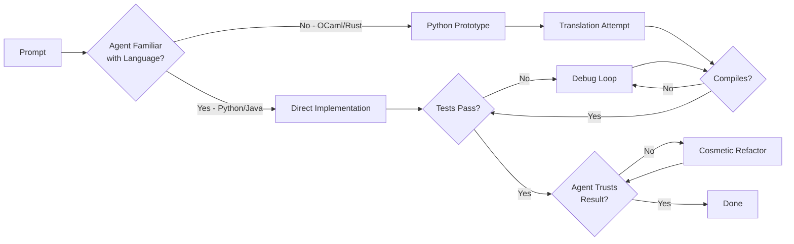
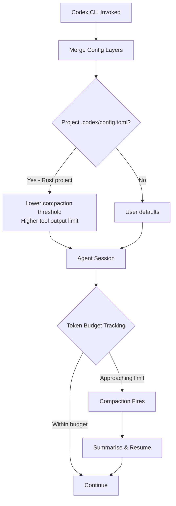

# Tokenmaxxing: Why Your Coding Agent Burns 69% More Tokens in Rust Than Python — and What Codex CLI Developers Should Do About It


---

Most Codex CLI users think about token budgets in terms of model choice and compaction thresholds. Few consider a variable that sits upstream of both: the programming language the agent is writing. New empirical evidence shows this choice can inflate token consumption by up to 69 per cent — before a single line of configuration changes.

## The Paper: 2,000 Trajectories, Five Models, Four Languages

Wu, Anderson, and Guha published "The Best Programming Language for Tokenmaxxing" (arXiv:2607.22807) on 24 July 2026 [^1]. They evaluated five frontier models — Qwen3.6-35B-A3B, Gemma-4-26B-A4B, GLM-5.2, GPT-5.5, and Claude Sonnet 4.6 — across Python, Java, Rust, and OCaml on MiniLCB, a 100-problem subset of LiveCodeBench Version 6 [^1]. The result: 2,000 agent trajectories whose token costs varied dramatically by target language, even when problem difficulty was held constant.

## The Numbers: Language as a Cost Multiplier

Using a mixed-effects model that controls for per-problem difficulty (ICC values of 0.80–0.97 confirm problem difficulty dominates variance), the researchers isolated language-specific token multipliers relative to Python [^1]:

| Model | Java | Rust | OCaml |
|-------|------|------|-------|
| GPT-5.5 | 1.30× | 1.36× | 1.30× |
| Claude Sonnet 4.6 | 1.18× | 1.16× | 1.28× |
| Qwen3.6 | 1.21× | 1.20× | 1.69× |
| GLM-5.2 | 1.34× | 1.57× | 1.54× |
| Gemma-4 | 0.85× | 1.07× | 1.44× |

Every multiplier above 1.0 is statistically significant at *p* < 0.05 or better; most are *p* < 0.001 [^1]. Qwen targeting OCaml uses **69 per cent more tokens** than the same model targeting Python on the same problem. For proprietary models billed per token, that is a direct cost hit.

## It Is Not Code Length — It Is Debugging Friction

The intuitive explanation — "Rust and OCaml produce longer source files" — does not hold. Accuracy on MiniLCB is largely unaffected by language choice (except Gemma on OCaml) [^1]. The extra tokens come from what happens *after* the agent produces its first attempt.

The researchers annotated agent trajectories into twelve behavioural span categories: `explore`, `implement`, `rewrite`, `execute plan`, `fix bug`, `debug failure`, `infra confusion`, `revert`, `verify`, `edge case`, `optimize performance`, and `cosmetic refactor` [^1]. The token inflation pattern becomes clear through these lenses:

### Error-Recovery Dominance

Error-recovery labels (`fix bug`, `debug failure`, `revert`) are disproportionately associated with OCaml across all models [^1]. The agent is not struggling with algorithms; it is fighting syntax and type errors. In Gemma's OCaml trajectories, 1,196 self-loops occurred in a "stuck" state, with revert actions accounting for 31 per cent of transitions [^1].

### Post-Success Waste

Perhaps the most striking finding: agents continue burning tokens *after* they have already produced a correct solution. For Gemma targeting Rust, the split was 2,026 tokens to reach the first correct solution but 7,311 tokens spent afterwards on unnecessary cosmetic refactoring and optimisation [^1]. The agent distrusts its own success.

### Python-First Prototyping

When targeting unfamiliar languages, agents frequently prototype solutions in Python before translating to the target language [^1]. This doubles the implementation effort and inflates the trajectory with cross-language translation spans.



### Self-Doubt Patterns

Reasoning traces reveal frequent reconsideration markers — words like "wait" and "actually" appear 7.70–7.72 times per turn for Gemma and Qwen [^1]. Over 70 per cent of snapshot spans for these models involved rewrites without running the provided tests; agents invented custom test cases rather than trusting the harness [^1].

## Mapping the Findings to Codex CLI's Token Architecture

Codex CLI's token management stack has three levers that interact directly with language-dependent cost inflation.

### 1. `model_auto_compact_token_limit`

This threshold triggers automatic history compaction — the process where Codex hands the entire conversation to the model for summarisation [^2]. The default fires at 80 per cent of the context window (capped at 90 per cent) [^2]. A Rust or OCaml task that burns 1.3–1.7× more tokens per attempt hits this threshold proportionally sooner, triggering more compaction cycles and destroying prompt-cache anchors.

```toml
# config.toml — language-aware compaction for Rust projects
model_auto_compact_token_limit = 200000
model_context_window = 272000
```

For GPT-5.6 variants with 272,000-token windows [^3], a Rust project consuming 1.36× the Python baseline reaches the compaction threshold after roughly 26 per cent fewer agent turns. Each compaction cycle itself consumes tokens and invalidates cached prefixes.

### 2. `tool_output_token_limit`

This caps individual tool output contributions to the context [^2]. Rust compiler error messages are notoriously verbose — a single `cargo build` failure can produce several kilobytes of type-error output. The default of 12,000–16,000 tokens may be insufficient for Rust's diagnostics but excessive for Python's terse tracebacks.

```toml
# Rust-optimised profile
[profile.rust-work]
tool_output_token_limit = 20000   # accommodate verbose rustc errors
model = "gpt-5.6-terra"
```

### 3. Named Profiles for Language-Specific Budgets

Codex CLI's named profile system [^4] — invoked with `codex --profile <name>` or `codex -p <name>` — lets you bind model, compaction threshold, and tool output limits into a single switchable configuration. The research data suggests creating language-aware profiles:

```toml
# ~/.codex/config.toml

[profile.python-default]
model = "gpt-5.6-luna"
model_auto_compact_token_limit = 220000
tool_output_token_limit = 12000

[profile.rust-deep]
model = "gpt-5.6-terra"
model_auto_compact_token_limit = 180000
tool_output_token_limit = 20000

[profile.ocaml-careful]
model = "gpt-5.5"
model_auto_compact_token_limit = 160000
tool_output_token_limit = 16000
```

The logic: languages with higher debugging friction need lower compaction thresholds (to trigger summarisation before the context fills with error-recovery noise), higher tool output limits (to capture full compiler diagnostics), and potentially larger-context models to absorb the overhead.

## The AGENTS.md Defence: Constraining Post-Success Waste

The research's most actionable finding for Codex CLI practitioners is the post-success token waste. Agents burning 3.6× more tokens *after* solving the problem than *before* is pure cost leakage. AGENTS.md constraints can mitigate this:

```markdown
## Testing and Verification Rules

- Run the provided test suite before attempting any optimisation
- Do NOT rewrite passing code for cosmetic reasons
- Do NOT create custom test inputs when the task provides test cases
- After all tests pass, stop and report the result
```

These constraints target the three waste behaviours identified in the paper: cosmetic refactoring of passing code, distrust of provided tests, and unnecessary optimisation passes [^1].

## Per-Project Configuration: The `.codex/config.toml` Layer

Codex CLI's configuration precedence — CLI flags → profile → project config → user config → system config → defaults [^4] — means you can set language-appropriate budgets at the project level:

```toml
# my-rust-project/.codex/config.toml
model_auto_compact_token_limit = 180000
tool_output_token_limit = 20000
```

This fires automatically when Codex CLI is invoked from within the project directory, requiring no manual profile switching.



## The Practical Takeaway: Language Awareness as Cost Engineering

The tokenmaxxing research establishes that programming language is not a neutral variable in agentic coding costs. For teams running Codex CLI across polyglot repositories, the implications are concrete:

1. **Budget per language, not per project.** A monorepo with Rust services and Python scripts should use per-directory `.codex/config.toml` files or named profiles to allocate different token budgets to different language contexts.

2. **Monitor compaction frequency.** If your Rust or Java sessions trigger compaction significantly more often than Python sessions of similar complexity, raise `model_context_window` or lower `model_auto_compact_token_limit` to trade off between context freshness and compaction overhead.

3. **Constrain post-success behaviour.** AGENTS.md rules that prevent cosmetic refactoring and enforce test-suite trust can eliminate the largest category of wasted tokens identified in the research.

4. **Consider language-specific model selection.** Claude Sonnet 4.6 showed the smallest language penalty (1.16–1.28×), while GLM-5.2 showed the largest (1.34–1.57×) [^1]. If your project is predominantly Rust, model selection matters more than it does for Python-only work.

The era of treating token budgets as language-agnostic is over. Codex CLI's configuration stack already supports the granularity needed to respond — what has been missing is the empirical evidence to justify language-aware tuning. Wu, Anderson, and Guha have now supplied it.

---

## Citations

[^1]: Wu, Z., Anderson, C. J., & Guha, A. (2026). "The Best Programming Language for Tokenmaxxing: An Investigation of Coding Agent Behavior Across Programming Languages." arXiv:2607.22807. [https://arxiv.org/abs/2607.22807](https://arxiv.org/abs/2607.22807)

[^2]: OpenAI. (2026). "Codex CLI Sample Configuration." OpenAI Developers. [https://developers.openai.com/codex/config-sample](https://developers.openai.com/codex/config-sample)

[^3]: OpenAI. (2026). "Codex CLI Changelog — GPT-5.6 Sol, Terra, and Luna context window fix." OpenAI Developers. [https://developers.openai.com/codex/changelog](https://developers.openai.com/codex/changelog)

[^4]: OpenAI. (2026). "Codex CLI Advanced Configuration — Named Profiles and Configuration Precedence." OpenAI Developers. [https://developers.openai.com/codex/config-advanced](https://developers.openai.com/codex/config-advanced)
