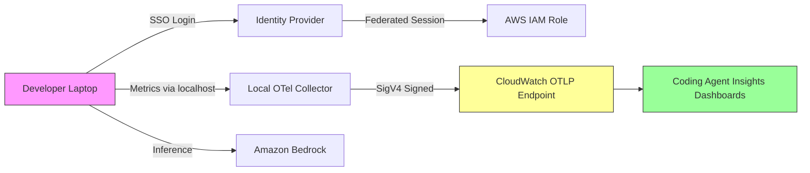

# CloudWatch Coding Agent Insights: Wiring Codex CLI into Enterprise Observability with OpenTelemetry


---

## The Observability Gap That Nobody Talked About

Coding agents produce code. They also produce costs, latency, approval bottlenecks, and token consumption patterns that, until recently, disappeared into a black hole the moment a session ended. Engineering leaders could tell you their team's AWS spend to the penny, yet had no visibility into whether their Codex CLI rollout was delivering value or burning tokens on hallucinated refactoring loops.

That gap closed on 20 July 2026 when AWS launched **CloudWatch Coding Agent Insights** — pre-built dashboards for OpenTelemetry metrics emitted by Claude Code, OpenAI Codex, and GitHub Copilot [^1]. Ten days later, Azure Monitor shipped equivalent Application Insights agent views with ready-made Grafana dashboards for the same tool matrix [^2]. For the first time, coding agent telemetry is a first-class citizen of the same observability platforms that already monitor your production workloads.

This article walks through what Codex CLI emits, how to wire it into CloudWatch (and Azure Monitor), and what the resulting data tells a team lead that raw usage dashboards cannot.

---

## What Codex CLI Emits

Codex CLI's telemetry aligns with the OpenTelemetry GenAI semantic conventions (v1.41, Development status as of July 2026) [^3]. The runtime emits metrics covering five dimensions:

| Metric Category | What It Captures |
|---|---|
| **Token consumption** | Input/output tokens per turn, broken down by `model` and `token_type` |
| **Per-turn latency** | Wall-clock time from request dispatch to response completion |
| **API requests** | Count and outcome of model invocations |
| **Tool calls** | MCP tool invocations, shell executions, file operations |
| **Approvals** | Guardian auto-review decisions: approved, rejected, escalated to human |

Model name, token type, and similar metric-level dimensions are stamped automatically by the Codex runtime. Identity and organisational attributes — `user.email`, `team.id`, `department`, `cost_center`, `organization` — must be supplied as OpenTelemetry *resource* attributes [^1].

---

## Setup Path 1: Bearer Token (Individual or Small Team)

The fastest route needs no collector. Codex sends OTLP metrics directly to the CloudWatch native OTLP endpoint, authenticated with an `Authorization: Bearer` header [^4].

### Step 1 — Create a CloudWatch Metrics API Key

Create an IAM user with CloudWatch metrics permissions, then generate a bearer token (metrics API key). Treat this as a long-term credential — rotate it on a schedule and restrict it to the narrowest IAM policy that permits OTLP ingestion.

### Step 2 — Configure `config.toml`

```toml
[otel]
environment = "production"

[otel.metrics_exporter]
otlp-http = {
  endpoint = "https://monitoring.eu-west-1.amazonaws.com/v1/metrics",
  protocol = "binary",
  headers = { "Authorization" = "Bearer YOUR_API_KEY" }
}
```

The full `/v1/metrics` path is required — Codex does not append it [^4]. Lock down file permissions:

```bash
chmod 600 ~/.codex/config.toml
```

### Step 3 — Supply Resource Attributes

Set `OTEL_RESOURCE_ATTRIBUTES` in the shell that launches Codex:

```bash
export OTEL_RESOURCE_ATTRIBUTES="\
user.id=jdoe,\
user.email=jane.doe@example.com,\
user.name=Jane Doe,\
department=engineering,\
team.id=platform,\
cost_center=cc-1234,\
organization=example-corp,\
location=eu-london,\
role=software-engineer,\
manager=lead@example.com"
```

These resource attributes populate the dashboard segmentation axes — `@resource.team.id`, `@resource.department`, and so on. Without them, the dashboards render but every breakdown dimension shows blank [^4].

### Step 4 — Verify

Run a Codex session that exercises at least one tool call. Then navigate to **CloudWatch → GenAI Observability → Coding Agent Insights → Codex** tab. Metrics typically appear within minutes. For ad-hoc exploration, query with PromQL directly [^4].

---

## Setup Path 2: Enterprise Rollout (Fleet Deployment)

For organisations with corporate SSO (Okta, Microsoft Entra ID, Auth0, AWS IAM Identity Center), the enterprise path eliminates bearer token distribution entirely [^5].



The flow works as follows:

1. **Identity federation** — Developers authenticate through your IdP. The IdP supplies `user.email` and organisational attributes (department, team, cost centre) [^5].
2. **Centralised Bedrock access** — Federated developers assume a role granting Amazon Bedrock invocations, scoped to permitted regions and models.
3. **Local collector** — A per-developer OpenTelemetry collector on `localhost` receives metrics from Codex, stamps IdP-derived resource attributes, signs requests with SigV4, and forwards to CloudWatch. No bearer token touches the developer's machine [^5].
4. **Fleet distribution** — AWS provides CloudFormation templates plus setup scripts that generate each developer's collector configuration from their federated session.

### Managed Configuration Integration

For Codex CLI fleet deployments already using `requirements.toml` via MDM (Jamf, Kandji, Fleet), the `[otel]` block can be distributed alongside existing policy constraints [^6]. Add the metrics exporter to `managed_config.toml` (managed defaults) so it applies at launch but remains overridable during a session, or enforce it in `requirements.toml` to prevent developers from disabling telemetry:

```toml
# In requirements.toml (enforced, not overridable)
[otel]
environment = "production"

[otel.metrics_exporter]
otlp-http = { endpoint = "https://monitoring.eu-west-1.amazonaws.com/v1/metrics", protocol = "binary" }
```

---

## The Azure Monitor Alternative

If your organisation runs on Azure, Application Insights now offers equivalent coding agent observability [^2]. The setup is structurally identical — Codex emits OTLP, you point it at an Azure Monitor data collection endpoint — but the dashboard surface differs:

| Capability | CloudWatch Coding Agent Insights | Azure Application Insights + Grafana |
|---|---|---|
| **Agents supported** | Claude Code, Codex, GitHub Copilot | Claude Code, Codex, GitHub Copilot, Gemini CLI, OpenCode, OpenClaw |
| **Dashboard surface** | Native CloudWatch console | Application Insights agent views + Grafana dashboards |
| **Codex Grafana dashboard** | Via CloudWatch data source | Native dashboard (ID `25266`) tracking sessions, turns, tokens, tool calls, prompt cache hit rate, latency [^2] |
| **Auth for telemetry** | Bearer token or SigV4 | Azure Monitor data collection endpoint + managed identity |
| **Fleet management** | CloudFormation + IdP scripts | Azure App Service integration, managed identity |

The Grafana Codex dashboard is particularly useful for teams already running Grafana: it surfaces **prompt cache efficiency** as a first-class metric, which CloudWatch does not yet expose in its pre-built views [^2].

---

## What the Data Actually Tells You

Raw metrics are table stakes. The value emerges from the questions you can now answer:

### 1. Token Budget Right-Sizing

By segmenting token consumption by `team.id` and `cost_center`, you can identify teams whose rollout token budgets exhaust mid-sprint versus teams that barely touch their allocation. This informs whether to redistribute budget or investigate why a team's sessions are token-heavy — often a sign of under-specified `AGENTS.md` files that force the agent into expensive exploration loops.

### 2. Approval Bottleneck Detection

Guardian auto-review approval and rejection counts, cross-referenced with per-turn latency, reveal whether `approval_policy: on-request` is creating human bottlenecks. If median approval latency exceeds median model latency by 10x, your team is spending more time approving than the agent spends working. That is a signal to trial `auto-review` for the relevant named profile.

### 3. Model Routing Feedback

Token consumption segmented by `model` dimension exposes whether your named profiles are routing tasks to the right tier. If 80% of tokens go to GPT-5.6 Sol on tasks that complete in under three turns, those tasks likely belong on the cheaper Terra or Luna tiers.

### 4. Tool Call Anomaly Detection

A sudden spike in MCP tool calls per session — especially to network-facing tools — can indicate prompt injection attempts, rogue skill behaviour, or simply a misconfigured MCP server generating retry storms. CloudWatch alarms on tool call rate provide a lightweight early-warning system that complements Codex's own `PreToolUse` and `PostToolUse` hooks.

---

## Practical Considerations

**Pricing.** Standard CloudWatch OpenTelemetry metric ingestion pricing applies [^1]. For a team of 50 developers generating ~100 Codex sessions per day, expect the telemetry cost to be negligible relative to the model inference spend it helps you optimise.

**Privacy.** `OTEL_RESOURCE_ATTRIBUTES` can include `user.email` and `user.name`. Ensure your data processing agreements cover shipping developer identity to your cloud provider's metrics backend. For GDPR-sensitive deployments, consider pseudonymised `user.id` values with a mapping table held internally.

**Regional availability.** CloudWatch Coding Agent Insights is available in all AWS commercial regions except Middle East (UAE), Middle East (Bahrain), and Israel (Tel Aviv) [^1].

**Attribute discipline.** AWS warns that changing metric names or moving identity fields off the resource attributes will break dashboard population [^4]. Standardise your `OTEL_RESOURCE_ATTRIBUTES` schema before fleet rollout and enforce it through your managed configuration pipeline.

---

## The Bigger Picture

The emergence of purpose-built coding agent observability from both major cloud providers signals a market maturation point. Coding agents are no longer experimental developer tools that live outside the operational perimeter — they are production workloads that deserve the same monitoring, alerting, and cost governance as any other service in your stack.

For Codex CLI users, the practical implication is straightforward: the `[otel]` section in `config.toml` is no longer optional for any team running more than a handful of seats. The data it produces is the foundation for every conversation about expanding agent autonomy, adjusting approval policies, and justifying the next budget increment.

---

## Citations

[^1]: AWS, "Amazon CloudWatch announces coding agent insights," 20 July 2026. [https://aws.amazon.com/about-aws/whats-new/2026/07/cloudwatch-coding-agent-insights/](https://aws.amazon.com/about-aws/whats-new/2026/07/cloudwatch-coding-agent-insights/)

[^2]: Microsoft, "Monitor AI coding agents with OpenTelemetry in Azure Monitor," July 2026. [https://techcommunity.microsoft.com/blog/azureobservabilityblog/monitor-ai-coding-agents-with-opentelemetry-in-azure-monitor/4524049](https://techcommunity.microsoft.com/blog/azureobservabilityblog/monitor-ai-coding-agents-with-opentelemetry-in-azure-monitor/4524049)

[^3]: OpenTelemetry, "GenAI Semantic Conventions," v1.41. [https://opentelemetry.io/docs/specs/semconv/gen-ai/](https://opentelemetry.io/docs/specs/semconv/gen-ai/)

[^4]: AWS, "Set up OpenAI Codex with a bearer token," July 2026. [https://docs.aws.amazon.com/AmazonCloudWatch/latest/monitoring/coding-agents-codex-bearer-token.html](https://docs.aws.amazon.com/AmazonCloudWatch/latest/monitoring/coding-agents-codex-bearer-token.html)

[^5]: AWS, "Set up OpenAI Codex for an enterprise rollout," July 2026. [https://docs.aws.amazon.com/AmazonCloudWatch/latest/monitoring/coding-agents-codex-enterprise.html](https://docs.aws.amazon.com/AmazonCloudWatch/latest/monitoring/coding-agents-codex-enterprise.html)

[^6]: OpenAI, "Managed configuration — Codex," July 2026. [https://learn.chatgpt.com/docs/enterprise/managed-configuration](https://learn.chatgpt.com/docs/enterprise/managed-configuration)
