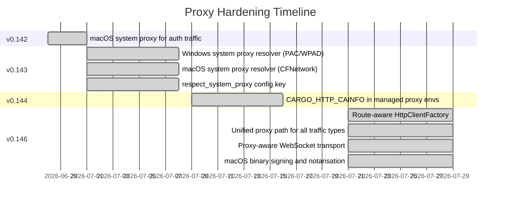
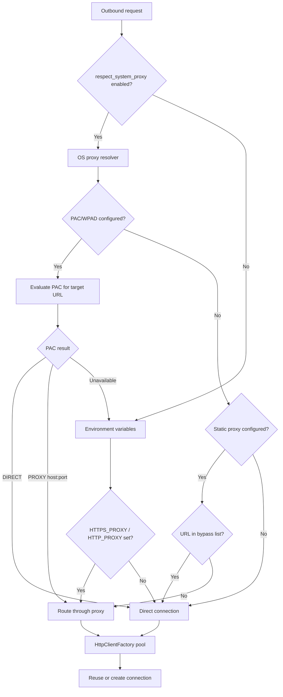

# Proxy Hardening in Codex CLI v0.143–v0.146: PAC, WPAD, and the Route-Aware HTTP Client That Finally Makes Corporate Networks Work


---

## The Corporate Proxy Problem

If you have ever tried to run Codex CLI behind a corporate proxy — the kind that pushes PAC files through MDM profiles, requires WPAD auto-discovery, or terminates TLS with a private CA — you know the pain. Until v0.143, Codex honoured `HTTPS_PROXY` and `HTTP_PROXY` for some code paths but silently ignored them for others [^1]. Authentication traffic, plugin downloads, MCP authorisation handshakes, WebSocket connections, and remote execution channels each had their own HTTP client, and each made its own proxy decisions. The result: developers on managed corporate Macs or locked-down Windows machines spent more time debugging connectivity than writing code.

Between v0.143.0 (8 July 2026) and v0.146.0 (29 July 2026), OpenAI shipped a comprehensive proxy hardening effort across roughly a dozen pull requests that replaced this patchwork with a unified, route-aware HTTP client pool [^2]. This article traces what changed, how the new architecture works, and how to configure it.

---

## What Changed: Four Releases, One Proxy Story



### v0.142–v0.143: System Proxy Resolution

The first phase introduced operating-system-native proxy resolution on both macOS and Windows [^3][^4].

**macOS** uses `SCDynamicStore` to read system proxy settings and `CFNetworkCopyProxiesForURL` to resolve each URL through the configured proxy stack — including PAC scripts and WPAD auto-discovery. PAC evaluation runs through a bounded run loop with a five-second timeout to prevent hangs from unreachable PAC servers [^4].

**Windows** calls `WinHttpGetIEProxyConfigForCurrentUser` to retrieve the current user's proxy settings, then `WinHttpGetProxyForUrl` for PAC/WPAD resolution. The resolution order is explicit PAC URLs first, then OS-enabled WPAD auto-detection, then static proxy and bypass rules [^3].

Both implementations map results into a shared `SystemProxyDecision` contract with three outcomes:

```rust
enum SystemProxyDecision {
    Direct,                    // connect without a proxy
    Proxy { url: String },     // route through this proxy
    Unavailable,               // fall back to env vars, then direct
}
```

A crucial design choice: URL-specific PAC decisions are cached using SHA-256 hashes of the target URL, preserving caching benefits without retaining raw URLs in memory — a privacy safeguard for environments where URL logging is a compliance concern [^3].

### v0.144: Certificate Chain Hardening

v0.144.5 added support for `CARGO_HTTP_CAINFO` in managed proxy environments, so Codex respects the same CA bundle that Cargo uses when a corporate proxy terminates TLS with a private root certificate [^2]. This matters because many enterprises deploy a single CA bundle across all developer tooling, and Codex previously required a separate `CODEX_CA_CERTIFICATE` or `SSL_CERT_FILE` override.

### v0.146: The Route-Aware HTTP Client Pool

The culmination arrived in v0.146.0 with a route-aware `HttpClientFactory` that serves as the single entry point for all outbound HTTP and WebSocket connections [^2][^5]. Every traffic type now passes through this factory:

- **Authentication** (OAuth, API key validation)
- **Model API calls** (Responses API, completions)
- **Plugin downloads** (marketplace, npm registry)
- **MCP authorisation** (tool server handshakes)
- **Remote execution** (WebSocket tunnels to remote hosts)
- **LM Studio connections** (local model providers)
- **Redirects** (HTTP 3xx follow-through)

The factory consults the effective proxy policy before opening any connection. A configured `HttpClientFactory` is now *required* for Responses API WebSocket connections and `codex doctor` network probes — neither path can open a connection without consulting the proxy policy [^5].

---

## Architecture: How Route-Aware Resolution Works



The resolution follows a strict precedence hierarchy:

1. **System proxy** (if `respect_system_proxy = true`): PAC → WPAD → static proxy → bypass rules
2. **Environment variables**: `HTTPS_PROXY` → `HTTP_PROXY` → `ALL_PROXY`, filtered by `NO_PROXY`
3. **Direct connection**: if nothing else applies

Only the first supported proxy candidate is used — the resolver does not attempt fallback to subsequent proxies after connection failure, matching standard `curl` behaviour [^3][^4].

---

## Configuration

### Enabling System Proxy Resolution

Add to `~/.codex/config.toml`:

```toml
[features]
respect_system_proxy = true
```

This is **disabled by default** to preserve existing behaviour for developers who have already configured environment variables [^3]. Enable it on managed corporate machines where proxy settings are pushed via MDM profiles or Group Policy.

### Corporate Proxy with TLS Interception

For environments where the corporate proxy terminates TLS with a private root CA:

```toml
[features]
respect_system_proxy = true

[permissions.default.network]
mode = "limited"
proxy_url = "http://proxy.corp.example.com:8080"
allow_upstream_proxy = true
```

Set the CA bundle via environment variable:

```bash
export CODEX_CA_CERTIFICATE="/etc/ssl/corp-ca-bundle.pem"
# Or, if sharing with Cargo:
export CARGO_HTTP_CAINFO="/etc/ssl/corp-ca-bundle.pem"
```

### WebSocket Traffic Through Proxies

The v0.146 proxy-aware WebSocket transport handles the Responses API, remote execution, and `codex doctor` probes. WebSocket connections use HTTP CONNECT tunnelling through the configured proxy, with bounded 32 KiB frames and a five-minute session ceiling for gateway virtual-key sessions [^5].

No additional configuration is needed — if your HTTP proxy supports CONNECT, WebSockets work automatically.

### Verifying Proxy Configuration

Use `codex doctor` to verify that proxy settings are correctly detected:

```bash
codex doctor
```

The diagnostics now include proxy resolution details, showing which proxy (if any) will be used for each traffic type [^6]. Look for the **Connectivity** section, which reports the effective proxy for API endpoints, plugin registries, and MCP servers.

---

## What This Means for Enterprise Deployments

### Before v0.143

Enterprise teams deploying Codex CLI needed to:

1. Set `HTTPS_PROXY` and `HTTP_PROXY` in every shell session
2. Hope that all code paths respected those variables (they did not)
3. Manually configure `SSL_CERT_FILE` for TLS-intercepting proxies
4. Accept that plugin downloads, MCP connections, and WebSocket tunnels might bypass the proxy entirely
5. Work around PAC/WPAD by extracting the static proxy URL and hardcoding it

### After v0.146

1. Enable `respect_system_proxy = true` once in `config.toml`
2. All traffic types — authentication, API calls, plugins, MCP, remote execution, WebSockets — route through the OS-resolved proxy
3. PAC scripts and WPAD auto-discovery work natively on both macOS and Windows
4. `codex doctor` verifies the configuration before anything breaks
5. macOS binaries are signed and notarised, satisfying Gatekeeper policies that blocked previous releases [^2]

### Firewall Allow-Listing

For network administrators configuring firewall rules, Codex CLI requires access to these domains through the proxy [^1]:

| Domain | Purpose |
|--------|---------|
| `api.openai.com` | Model API, Responses API |
| `auth.openai.com` | OAuth authentication |
| `chatgpt.com` | Session management |
| `cdn.openai.com` | Plugin downloads, updates |
| `registry.npmjs.org` | npm marketplace plugins |

---

## Limitations and Known Constraints

**SOCKS5 proxies**: The system proxy resolver recognises SOCKS entries but maps them to `UnsupportedProxyScheme`, falling back to environment variables. If your corporate network uses SOCKS exclusively, continue using `ALL_PROXY` with a `socks5://` URL rather than `respect_system_proxy` [^3].

**Single-candidate resolution**: Both macOS and Windows resolvers use only the first supported proxy candidate from PAC results. If your PAC script returns a failover chain (`PROXY a:8080; PROXY b:8080; DIRECT`), only `a:8080` is attempted [^3][^4].

**Linux**: System proxy resolution is not yet implemented on Linux. Linux deployments continue to rely on `HTTPS_PROXY`, `HTTP_PROXY`, and `ALL_PROXY` environment variables. ⚠️ No PR or issue tracking Linux system proxy support was found during research.

---

## Practical Checklist

For teams rolling out Codex CLI v0.146+ in a corporate environment:

1. **Upgrade** to v0.146.0 or later — earlier versions lack the unified proxy path
2. **Enable** `respect_system_proxy = true` in `~/.codex/config.toml`
3. **Distribute** the corporate CA bundle via `CODEX_CA_CERTIFICATE` or `CARGO_HTTP_CAINFO`
4. **Allow-list** the required OpenAI domains in your proxy's URL filter
5. **Verify** with `codex doctor` — check the Connectivity section for proxy resolution
6. **Test** MCP connections and plugin installs explicitly — these were the most common failure points before v0.146
7. **Monitor** with `CODEX_LOG_LEVEL=debug` if connections fail — proxy decisions are now logged

---

## Citations

[^1]: Codex CLI Proxy Configuration: SOCKS, HTTP, and Corporate Networks — Codex Knowledge Base, April 2026. [https://codex.danielvaughan.com/2026/04/18/codex-cli-proxy-configuration-socks-http-corporate-networks/](https://codex.danielvaughan.com/2026/04/18/codex-cli-proxy-configuration-socks-http-corporate-networks/)

[^2]: Codex CLI Changelog — Releases v0.143.0 through v0.146.0, July 2026. [https://releases.sh/openai/openai-codex-changelog](https://releases.sh/openai/openai-codex-changelog)

[^3]: PAC 3 — Add Windows system proxy resolver, PR #26708, openai/codex. [https://github.com/openai/codex/pull/26708](https://github.com/openai/codex/pull/26708)

[^4]: PAC 4 — Add macOS system proxy resolver, PR #26709, openai/codex. [https://github.com/openai/codex/pull/26709](https://github.com/openai/codex/pull/26709)

[^5]: Preserve Responses WebSockets with system proxy, PR #31441, openai/codex. [https://github.com/openai/codex/pull/31441](https://github.com/openai/codex/pull/31441)

[^6]: Codex CLI v0.135.0 release — codex doctor diagnostics, @CodexReleases on X, May 2026. [https://x.com/CodexReleases/status/2060053933817544823](https://x.com/CodexReleases/status/2060053933817544823)
