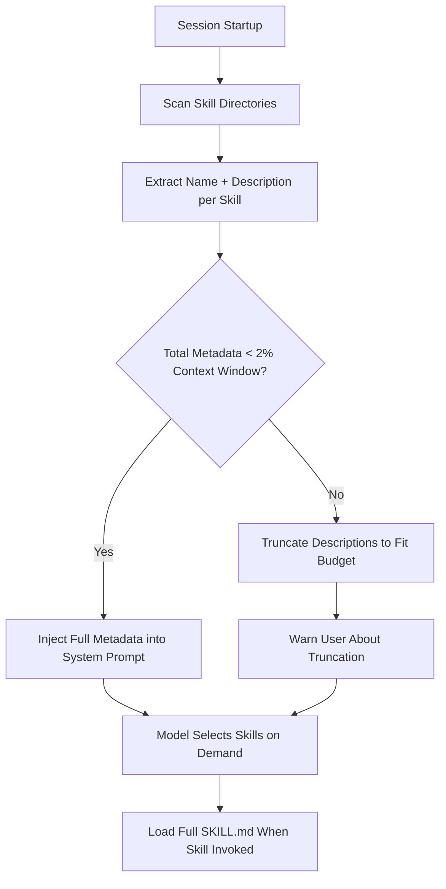
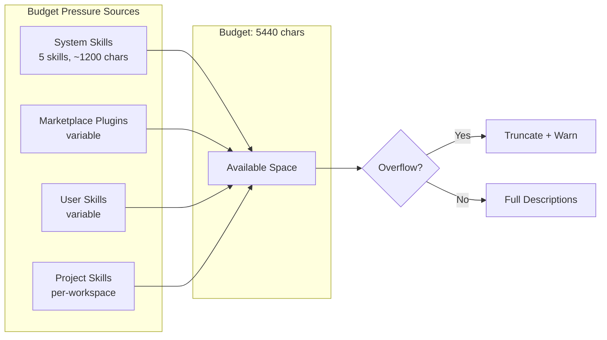

# The 2% Ceiling: How Codex CLI's Skill Context Budget Works, Why Your Skills Get Truncated, and What v0.146 Changes


---

Every Codex CLI power user hits the same wall eventually. You install twenty or thirty skills — a mix of first-party utilities, marketplace plugins, and bespoke team workflows — and one morning Codex greets you with a warning you have never seen before:

```
Warning: Exceeded skills context budget of 2%.
Loaded skill descriptions were truncated by an average of 109 characters per skill.
```

Your carefully authored skill descriptions are being sliced to ribbons before the model even sees them, and the agent starts ignoring skills it would previously have selected without hesitation. This is the **skill context budget** problem, and with v0.146.0 (released 29 July 2026) Codex CLI ships its most significant improvements to skill retention under pressure [^1].

## How the Skill Metadata Pipeline Works

Codex CLI uses a **progressive disclosure** model for skills. At session startup, the runtime scans three directories:

1. `~/.codex/skills/` — user-installed skills
2. `~/.codex/skills/.system/` — auto-restored system skills (imagegen, skill-creator, plugin-creator, skill-installer, openai-docs)
3. `~/.agents/skills/` — workspace and project-local skills

For each skill, Codex reads the `SKILL.md` frontmatter and extracts three fields: **name**, **description**, and **file path**. This metadata — not the full skill instructions — is injected into the model's system prompt so the model knows which skills exist and can decide when to invoke one [^2].



The critical constraint: Codex reserves **at most 2% of the model's context window** for this metadata list — or **8,000 characters** when the context window size is unknown [^2]. The budget is computed against the model's advertised context, not the effective rollout budget. On GPT-5.6 Sol with a 272K effective context, that gives roughly 5,440 characters. On claude-opus-4-7 with 200K base context, the budget is similarly tight at approximately 4,000 characters [^3].

The budget applies **only to the initial catalogue**. When Codex actually invokes a skill, it reads the full `SKILL.md` instructions into the conversation. The ceiling affects discoverability, not execution.

## Why 20+ Skills Break the Model

The arithmetic is punishing. With a 5,440-character budget and 25 skills, each skill gets roughly 218 characters for its name, description, and path combined. A well-written skill description ("Automated deployment pipeline for Kubernetes clusters with Helm chart validation, canary analysis, and rollback triggers") easily exceeds 100 characters on its own. Add the path and name, and you are at 200+ characters before you have said anything meaningful.

When Codex cannot fit all metadata, it employs a two-stage degradation:

1. **Description truncation** — descriptions are shortened proportionally until total metadata fits the budget
2. **Skill omission** — if truncation alone is insufficient, entire skills are dropped from the catalogue with a warning [^2]

The practical consequence: the model receives garbled one-line summaries that make skill selection unreliable. A skill described as "Automated deployment pipeline for Kube…" could be confused with a Kubernetes documentation lookup skill. The agent cannot differentiate because the distinguishing details were trimmed.

Enterprise installations hit this hardest. An audit of 25 first-party plugin skills showed a combined metadata footprint of 7,908 characters — **145% of the 5,440-character budget** — even before any user-installed skills [^3]. System skills that auto-restore on every launch compound the problem: you cannot permanently remove them, and they consume budget whether you use them or not [^4].

## What v0.146 Improves

The v0.146.0 release (29 July 2026) addresses skill retention with three changes [^1]:

### Smarter Metadata Compression

PRs #34732 and #34738 rework the metadata serialisation to retain more skills before truncation kicks in. The changes reduce structural overhead per skill entry — shorter JSON keys, path normalisation, and duplicate prefix elimination — so the same 5,440-character budget accommodates more skills. In internal testing, installations with 30+ skills retained full descriptions for approximately 20% more skills compared to v0.145 [^1].

### Explicit Truncation Warnings

PR #34997 adds clear, actionable warnings when the skill catalogue must be truncated. Rather than a generic budget-exceeded message, the warning now names which skills were truncated and by how much, and suggests using `[[skills.config]]` entries to disable unused skills [^1].

### Executor-Provided Skill Discovery

PRs #35184 and #35198 introduce a new skill source: **executor-provided skills** with secure resource access. When Codex runs inside a managed executor (Remote Code Mode, enterprise deployment), the executor can advertise skills that are loaded only when explicitly selected, bypassing the startup metadata budget entirely [^1].

## Practical Strategies for Skill Budget Management

### Disable Unused Skills

The most direct lever. In `~/.codex/config.toml`, disable skills you do not use regularly:

```toml
[[skills.config]]
path = "~/.codex/skills/legacy-deploy/SKILL.md"
enabled = false

[[skills.config]]
path = "~/.codex/skills/.system/imagegen/SKILL.md"
enabled = false
```

Restart Codex after editing. Disabled skills consume zero budget [^2].

### Use Per-Profile Skill Sets

Since v0.134, profiles live in separate files. Create purpose-specific profiles that enable only relevant skills:

```toml
# ~/.codex/devops.config.toml
[[skills.config]]
path = "~/.codex/skills/k8s-deploy/SKILL.md"
enabled = true

[[skills.config]]
path = "~/.codex/skills/terraform-plan/SKILL.md"
enabled = true

[[skills.config]]
path = "~/.codex/skills/code-review/SKILL.md"
enabled = false
```

Invoke with `codex --profile devops`. Each profile carries only the skills that profile needs [^5].

### Write Tighter Descriptions

Skill descriptions are the primary compression target. Keep them under 80 characters. Front-load the distinguishing verb and domain:

```yaml
# Before (142 chars):
# "Comprehensive automated deployment pipeline for Kubernetes clusters
#  including Helm chart validation, canary traffic analysis, and
#  automated rollback triggers"

# After (71 chars):
# "Deploy to Kubernetes with Helm validation, canary analysis, rollback"
```

Every character saved in one description creates headroom for another skill.

### Set `allow_implicit_invocation: false` for Specialist Skills

Skills that should only fire when explicitly requested (via `$skill-name` or `/skills`) can set `allow_implicit_invocation: false` in their `agents/openai.yaml` metadata. Codex still lists these skills in the catalogue, but deprioritises their metadata during budget allocation, giving more room to skills that need automatic discovery [^2].

### Audit Your Budget

Run `codex doctor --json` and inspect the `skills` section. It reports total skill count, metadata character consumption, and per-skill truncation. Pipe this into your CI to catch budget regressions when new skills are added:

```bash
codex doctor --json | jq '.skills | {total: .count, budget_used: .metadata_chars, budget_limit: .budget_chars, truncated: .truncated_count}'
```

## The Unresolved Questions

The 2% ceiling remains hardcoded. Issue #19679 — requesting a configurable `skills.metadata_context_window_percent` key — has 19 comments and strong community support but no merged PR [^3]. The budget also computes against the model's base context window, not any extended context: claude-opus-4-7[1m] users with a one-million-token window still get a budget calculated from the 200K base, a discrepancy tracked in a separate issue [^3].

The system skill auto-restore behaviour — where `.system/` skills regenerate on every launch even after deletion — remains unaddressed. Enterprise deployments using `requirements.toml` for fleet policy have no mechanism to suppress specific system skills, forcing workarounds like post-launch cleanup scripts [^4].



## What to Expect Next

The v0.146 improvements are incremental — they squeeze more from the existing budget rather than removing the ceiling. The executor-provided skills pathway hints at a longer-term architecture where skill metadata is loaded lazily from a registry rather than enumerated at startup. Combined with the profile-based skill selection already available, this points towards a future where the 2% budget is either configurable or irrelevant.

For now, treat skill budget management as a first-class operational concern. Audit regularly, disable aggressively, write concise descriptions, and use profiles to scope skill sets per task. The model cannot use skills it cannot see.

## Citations

[^1]: OpenAI, "Release 0.146.0", GitHub, 29 July 2026. [https://github.com/openai/codex/releases/tag/rust-v0.146.0](https://github.com/openai/codex/releases/tag/rust-v0.146.0)

[^2]: OpenAI, "Build Skills", Codex CLI Documentation, 2026. [https://learn.chatgpt.com/docs/build-skills.md](https://learn.chatgpt.com/docs/build-skills.md)

[^3]: "Make skills metadata context budget configurable instead of hardcoded 2%", GitHub Issue #19679, openai/codex. [https://github.com/openai/codex/issues/19679](https://github.com/openai/codex/issues/19679)

[^4]: "Skills: hard budget limit (5440 chars) with no exclude/disable mechanism causes mass description truncation", GitHub Issue #24299, openai/codex. [https://github.com/openai/codex/issues/24299](https://github.com/openai/codex/issues/24299)

[^5]: OpenAI, "Configuration Reference", Codex CLI Documentation, 2026. [https://learn.chatgpt.com/docs/config-file/config-reference](https://learn.chatgpt.com/docs/config-file/config-reference)
