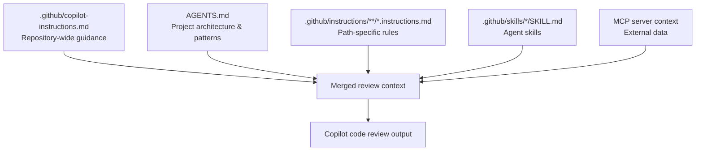
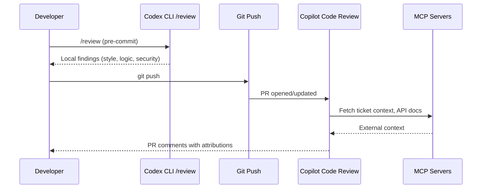

# Copilot Code Review Goes GA with Agent Skills and MCP: Building a Combined Review Pipeline with Codex CLI


---

On 29 July 2026, GitHub made Copilot code review support for agent skills and MCP servers generally available across every Copilot plan tier — Pro, Pro+, Business, and Enterprise [^1]. The timing matters for Codex CLI users: Codex already ships its own `/review` command, a `review_model` configuration key, and a Guardian `auto_review` subagent [^2]. Two review systems now sit in the same repository, and the question is no longer which one to use, but how to wire them into a single pipeline that catches different classes of defect at different stages.

This article walks through the Copilot code review GA changes, maps them against Codex CLI's review surface, and shows how to configure a layered review pipeline that uses each tool where it is strongest.

## What Changed on 29 July

Three capabilities moved from beta to GA simultaneously [^1]:

1. **Agent skills for code review** — Copilot can now invoke repository-defined skills (via `SKILL.md` files) during pull request review, extending its analysis beyond built-in rules.
2. **MCP server integration** — Model Context Protocol servers feed external context (issue trackers, documentation, service catalogues) into review comments.
3. **Attribution** — review comments now indicate which agent skill or MCP server informed a specific suggestion.

All three are available to every plan tier that includes Copilot. The GitHub and Playwright MCP servers are enabled by default; additional servers are configured in repository settings under **Copilot > MCP servers** [^1].

## SKILL.md: The Review Skill Format

Copilot agent skills live under `.github/skills/<skill-name>/SKILL.md`. The format uses YAML frontmatter with a markdown instruction body [^3]:

```yaml
---
name: security-review
description: >-
  Enforces OWASP Top 10 checks and flags SQL injection,
  XSS, and insecure deserialisation patterns.
  Use for security, vulnerability, OWASP.
---

When reviewing code, apply the security checklist in `/security/security-checklist.md`.

Flag any use of `eval()`, `dangerouslySetInnerHTML`, or raw SQL string concatenation.
Require parameterised queries for all database access.
```

Copilot reads the `description` field to decide whether to activate the skill for a given review. Review-focused directory names — `code-review`, `security-review`, `api-standards` — increase activation likelihood [^3]. Skills fire automatically when relevant, or on demand when custom instructions reference them explicitly.

### Instruction Hierarchy

Copilot reads instructions from the **head branch**, not the base branch [^4]. This means you can test instruction changes in the same pull request that introduces them — a design decision that mirrors how Codex CLI resolves `AGENTS.md` from the working tree rather than a fixed reference.

The full instruction stack for a Copilot review is:



## MCP in the Review Context

MCP servers configured for Copilot cloud agent automatically apply to code review [^1]. The key constraint: **all MCP tool calls during review are read-only** [^1]. Copilot will not create issues, update tickets, or mutate external state during a review pass.

Practical uses include:

- **Jira/Linear MCP**: pulling acceptance criteria from the linked ticket into the review context, so Copilot can check whether the implementation matches the specification.
- **Internal documentation MCP**: surfacing API contracts or architectural decision records relevant to the changed files.
- **GitHub MCP** (enabled by default): cross-referencing related issues, prior pull requests, and repository metadata.

To verify which MCP servers were consulted, check the attribution footer on review comments or open the linked review session from the pull request timeline to inspect session logs [^4].

## How Codex CLI Reviews Differ

Codex CLI provides three review surfaces [^2]:

| Surface | Trigger | Scope |
|---|---|---|
| `/review` in terminal | Manual, pre-commit | Uncommitted changes, branch diffs, specific commits |
| `@codex review` on GitHub | Manual or automatic PR trigger | Full pull request diff |
| `openai/codex-action` in CI | GitHub Actions workflow | Pull request diff in CI context |

The architectural distinction is significant. Copilot code review runs on GitHub-hosted runners using GitHub Actions infrastructure [^4]. Codex CLI's `/review` runs locally on the developer's machine with full repository context and the configured model (`review_model` in `config.toml`).

```toml
# ~/.codex/config.toml
model = "gpt-5.6-sol"
review_model = "gpt-5.6-terra"  # cheaper model for review passes

[agents]
max_threads = 6
```

Codex CLI also provides the Guardian `auto_review` subagent, which is a different mechanism entirely — it reviews the *agent's own actions* (tool calls, file writes, shell commands) rather than reviewing human-authored code [^5]. Guardian auto-review is a safety net for autonomous agent operation, not a code review tool in the traditional sense.

## Building the Combined Pipeline

The natural split is temporal: Codex CLI reviews *before* the commit, Copilot reviews *after* the push. Each catches defects the other misses.



### Step 1: Configure Codex CLI for Pre-Commit Review

Set up a dedicated review profile in `config.toml`:

```toml
[profiles.review]
model = "gpt-5.6-terra"
approval_policy = "unless-allow-listed"
sandbox_mode = "read-only"
```

Then run reviews against staged changes:

```bash
codex -p review
# Inside the session:
/review
```

Codex CLI's `/review` honours `## Review guidelines` sections in your `AGENTS.md` [^2]. Place project-specific review criteria there:

```markdown
## Review guidelines

- All public API methods must have JSDoc comments.
- No direct database queries outside the repository layer.
- Error handling must use the project's Result<T, E> type, not raw try/catch.
```

### Step 2: Configure Copilot for PR Review

Create `.github/skills/code-review/SKILL.md` with complementary checks — things that benefit from external context:

```yaml
---
name: code-review
description: >-
  Reviews pull requests against team coding standards,
  ticket acceptance criteria, and API compatibility.
  Use for review, standards, acceptance criteria.
---

When reviewing this pull request:

1. Check the linked Jira ticket (via MCP) for acceptance criteria.
   Flag any criteria not addressed by the changes.

2. For any new API endpoints, verify the OpenAPI spec in `/api/openapi.yaml`
   matches the implementation.

3. Flag breaking changes to public interfaces without a migration note.
```

Configure automatic review triggers in repository settings to fire on PR creation and draft-to-open transitions [^4].

### Step 3: Align AGENTS.md and SKILL.md

Both Codex CLI and Copilot read `AGENTS.md` from the repository root [^4][^2]. This file is the shared contract. Keep architectural context and review standards there, and use `SKILL.md` only for Copilot-specific skill activations:

| File | Read by | Purpose |
|---|---|---|
| `AGENTS.md` | Codex CLI + Copilot | Project architecture, patterns, review guidelines |
| `.github/copilot-instructions.md` | Copilot only | Repository-wide Copilot behaviour |
| `.github/skills/*/SKILL.md` | Copilot only | Skill-specific activation and instructions |
| `config.toml` | Codex CLI only | Model selection, approval policies, review model |

### Step 4: Wire MCP for Contextual Reviews

Store MCP authentication tokens under **Settings > Secrets and variables > Agents** in the repository [^1]. For internal services, configure the MCP server endpoint in repository Copilot settings.

If you run the same MCP servers locally with Codex CLI, configure them in `config.toml`:

```toml
[[mcp_servers]]
name = "jira"
command = "npx"
args = ["-y", "@atlassian/jira-mcp-server"]
env = { JIRA_TOKEN = "${JIRA_TOKEN}" }
```

This gives both tools access to the same external context, though through different paths: Codex CLI talks to the MCP server locally, Copilot talks to it through GitHub's infrastructure.

## What Each Tool Catches Best

| Defect class | Better tool | Why |
|---|---|---|
| Logic errors in changed code | Codex CLI `/review` | Full local context, configurable model |
| Standards compliance across the PR | Copilot agent skills | SKILL.md activation, automatic triggers |
| Ticket-requirement gaps | Copilot + MCP | MCP pulls acceptance criteria from trackers |
| Security patterns (OWASP, injection) | Both | Configure in AGENTS.md for both tools |
| Architectural drift | Codex CLI | Local access to full repository, deeper reasoning with Sol |
| API contract violations | Copilot + MCP | MCP can pull OpenAPI specs from documentation servers |

## Limitations to Watch

Copilot code review only leaves **Comment** reviews — never **Approve** or **Request changes** [^4]. It cannot count towards required approvals or block merging. This is a deliberate design choice: automated review augments human review rather than replacing it.

Copilot's MCP calls are **read-only** [^1]. If your review workflow needs to create follow-up tickets or update status, that must happen outside the review — either manually or through a separate GitHub Actions step.

Codex CLI's `/review` currently has no native attribution system comparable to Copilot's skill/MCP attribution. When diagnosing where a finding originated, Copilot's attribution footer gives clearer provenance.

## Conclusion

The GA release of Copilot code review with agent skills and MCP creates a natural division of labour. Codex CLI's `/review` excels at deep, model-driven analysis with full local context before the commit. Copilot's agent skills and MCP integration excel at standards enforcement and external-context correlation after the push. Configuring both — with `AGENTS.md` as the shared instruction layer and `SKILL.md` for Copilot-specific activations — gives senior teams a layered review pipeline where automated findings are caught early and contextual checks happen automatically on every pull request.

## Citations

[^1]: GitHub Changelog, "Copilot code review: Agent skills and MCP now generally available", 29 July 2026. [https://github.blog/changelog/2026-07-29-copilot-code-review-agent-skills-and-mcp-now-generally-available/](https://github.blog/changelog/2026-07-29-copilot-code-review-agent-skills-and-mcp-now-generally-available/)

[^2]: Codex Knowledge Base, "Codex CLI Code Review Workflows: /review, review_model, and the MCP Extension", 2026. [https://codex.danielvaughan.com/2026/03/30/codex-cli-review-command-code-review-workflows/](https://codex.danielvaughan.com/2026/03/30/codex-cli-review-command-code-review-workflows/)

[^3]: GitHub Copilot Skills Guide, "GitHub Copilot Agent Skills Guide: From Writing SKILL.md to Practical Usage", 2026. [https://smartscope.blog/en/generative-ai/github-copilot/github-copilot-skills-guide/](https://smartscope.blog/en/generative-ai/github-copilot/github-copilot-skills-guide/)

[^4]: GitHub Docs, "Using GitHub Copilot code review", 2026. [https://docs.github.com/copilot/using-github-copilot/code-review/using-copilot-code-review](https://docs.github.com/copilot/using-github-copilot/code-review/using-copilot-code-review)

[^5]: Codex Knowledge Base, "Codex CLI Granular Approval Policies and the Auto-Review Subagent", 2026. [https://codex.danielvaughan.com/2026/05/07/codex-cli-granular-approval-policies-auto-review-subagent-autonomous-secure-workflows/](https://codex.danielvaughan.com/2026/05/07/codex-cli-granular-approval-policies-auto-review-subagent-autonomous-secure-workflows/)
