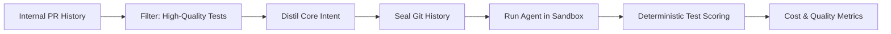
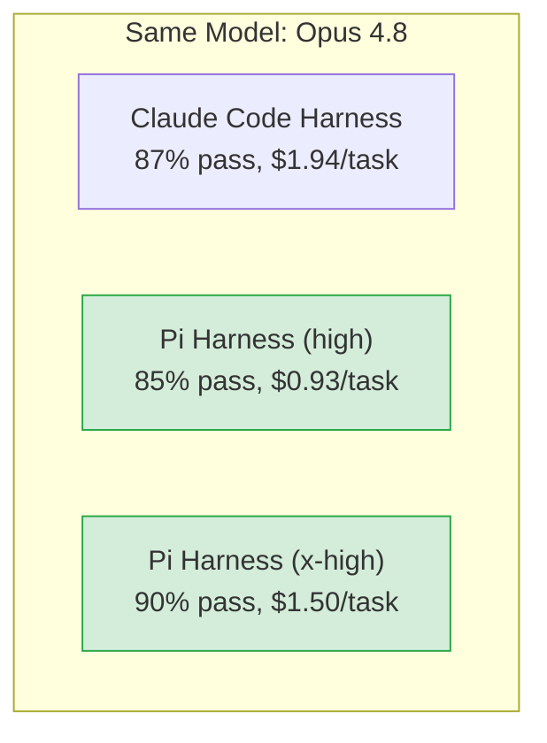

# Databricks' Internal Coding Benchmark: What a Multi-Million-Line Codebase Reveals About Model and Harness Selection for Codex CLI


---

On 8 July 2026, Databricks published results from an internal coding-agent benchmark built against their own production codebase — millions of lines spanning Python, Go, TypeScript, Scala, Rust, and more than ten languages in total[^1]. Unlike synthetic benchmarks such as SWE-Bench, this one uses real merged pull requests written by over 3,000 engineers, scored by deterministic test execution rather than LLM judges[^1]. The findings matter for anyone configuring Codex CLI, because they quantify two things most developers get wrong: the relationship between token price and task cost, and the outsized impact of harness choice on both quality and spend.

## Why Internal Benchmarks Matter

Public benchmarks carry a contamination risk — models trained on leaked solutions, or harnesses tuned to exploit benchmark-specific scoring rules[^2]. Databricks sidestepped this by constructing tasks from recent, internal pull requests that have never appeared in any training set. They sealed the git history per task run so agents could not walk forward through commits to find the merged solution[^1]. Tasks were filtered for those with high-quality test suites, then distilled to their core intent.

The result is a benchmark that more closely resembles the daily work a CLI coding agent actually does: navigating a large, polyglot monorepo, understanding cross-module dependencies, and producing changes that pass existing tests.



## Three Performance Tiers

Models clustered into three distinct capability tiers[^1][^3]:

| Tier | Pass Rate | Models |
|------|-----------|--------|
| **Top** | 82–90% | Opus 4.8, GLM 5.2, GPT-5.5 (select configs) |
| **Middle** | 71–82% | Sonnet 4.6, Sonnet 5, GPT-5.4 |
| **Bottom** | 51–60% | GPT-5.4-mini, Haiku 4.5 |

The headline result: GLM 5.2, an open-weight model from Zhipu AI, matched Opus 4.8 — statistically tied at approximately 87.5% pass rate — whilst costing \$1.28 per task against Opus's \$1.94[^3]. Databricks subsequently made GLM 5.2 their default daily-driver coding model[^4].

## Token Price Is a Poor Proxy for Task Cost

Developers routinely eyeball per-token pricing to estimate coding costs. The Databricks data demolishes this heuristic[^1]. Models with cheaper per-token rates sometimes produced higher total task costs because they required more reasoning tokens to reach the same answer. Conversely, models with higher per-token rates — notably GLM 5.2 — proved more token-efficient per task, generating fewer total tokens whilst maintaining quality.

This is directly relevant to Codex CLI's `config.toml` model configuration. The `model` key selects the model ID, and `model_provider` routes to the appropriate endpoint[^5]. A naïve cost optimisation would pick the cheapest per-token model. The Databricks evidence suggests you should instead benchmark against your own codebase and optimise for cost-per-resolved-task.

```toml
# ~/.codex/config.toml — cost-optimised daily driver
model = "glm-5.2"

[model_providers.zhipu]
name = "Zhipu AI"
base_url = "https://api.zhipuai.com/v1"
env_key = "ZHIPU_API_KEY"
wire_api = "responses"
```

## The Harness Matters More Than You Think

The most striking finding was the impact of harness choice. With the same model, different harnesses produced a 2× or greater variance in cost[^1][^3]. The minimalist Pi harness consistently outperformed more complex vendor-native harnesses:

- **Opus 4.8 + Pi (high effort)**: 85% pass rate at 2.08× lower cost than Opus 4.8 + Claude Code[^3]
- **GPT-5.5 + Pi**: consumed 665,000 tokens per task versus 1,235,000 for GPT-5.5 + Codex native harness — nearly half the context[^3]
- **Pi + Opus 4.8 (x-high effort)**: achieved 90% pass rate, the highest in the entire benchmark[^3]



The implication is that bloated system prompts and over-engineered context management can actively harm both cost and quality. Hacker News discussion highlighted that Claude Code's system prompt contains "irrelevant stuff about how CC works," inflating token usage unnecessarily[^6]. Pi's minimalist approach — smaller system prompt, tighter context window management — proved superior.

## What This Means for Codex CLI Configuration

Codex CLI sits in an interesting position. It is itself a harness, and its configuration directly controls the variables that Databricks found most impactful. Here is how to apply their findings:

### 1. Benchmark Your Own Codebase

Databricks' core recommendation: "companies can build similar benchmarks from their own PR history to make data-driven decisions"[^1]. For Codex CLI users, this means:

```bash
# Extract recent merged PRs with test coverage
git log --since="3 months ago" --merges --format="%H %s" \
  | head -50 > candidate_tasks.txt

# For each task: reset to parent, run codex, execute tests
codex --model glm-5.2 --approval-policy on-failure \
  "Implement the change described in this diff context"
```

### 2. Use Named Profiles for Model Routing

Codex CLI's named profiles let you route different task types to different models based on complexity — matching the tier structure Databricks observed[^5]:

```toml
# ~/.codex/config.toml

[profiles.daily]
model = "glm-5.2"
# Top-tier quality at lowest cost — the daily driver

[profiles.complex]
model = "o4-mini"
# Reasoning-heavy tasks where token efficiency matters less

[profiles.review]
model = "claude-sonnet-4.6"
# Middle-tier model for code review and lightweight edits
```

```bash
# Switch profile per task
codex --profile daily "Add pagination to the users endpoint"
codex --profile complex "Refactor the billing module to support multi-currency"
```

### 3. Control Context Size

The Databricks data shows that context bloat is the primary cost driver, not model pricing. Codex CLI provides several levers:

- **`AGENTS.md`** — keep project instructions concise and relevant. Every token in your AGENTS.md is prepended to every request.
- **Context compaction** — Codex CLI's built-in compaction reduces context when approaching limits, but starting lean is better than compacting late.
- **Subagent decomposition** — for complex tasks, decomposing into subagents with `max_threads` and `max_depth` limits prevents any single agent from accumulating unbounded context[^5].

### 4. Measure Cost Per Task, Not Cost Per Token

Track your actual spend with Codex CLI's OpenTelemetry integration. The `[otel.metrics_exporter]` configuration in `config.toml` exports token counts and latency per session, letting you compute cost-per-resolved-task rather than relying on per-token estimates[^5]:

```toml
[otel]
metrics_exporter = "otlp"
endpoint = "https://your-collector:4317"
```

## The Open-Weight Pareto Frontier

The Databricks benchmark's Pareto frontier — the set of models offering the best quality for a given cost — included models from OpenAI, Anthropic, and open-weight sources[^1]. This is significant for Codex CLI users because the tool's `[model_providers]` table supports any OpenAI-compatible endpoint[^5]. You are not locked into a single vendor.

The competitive positioning of GLM 5.2 alongside Opus 4.8 and GPT-5.5 suggests that the moat in coding agents has shifted from model quality to harness efficiency and integration depth. The CLI agent that manages context most effectively — keeping system prompts lean, decomposing tasks cleanly, routing models by complexity — will outperform one running a more expensive model with a bloated harness.

## Limitations and Caveats

The Databricks benchmark has known limitations worth noting:

- **Task complexity skew**: 61% of tasks were medium complexity, 19% low, and only 12% high[^3]. Ultra-long-horizon tasks — the kind that SWE-Marathon evaluates — are underrepresented.
- **Edit tool failures**: HN discussion noted that Pi harness experiences "significant Edit tool call failures" with newer models, requiring investigation[^6]. ⚠️ This may affect reproducibility with the latest model versions.
- **Enterprise cost models**: subscription-based pricing (e.g., Claude Code Pro) can change the cost calculus versus API pricing[^6]. The \$1.28/task figure assumes API rates.
- **Single codebase**: results from Databricks' specific codebase may not generalise to all architectures or languages.

## Key Takeaways

1. **Token price ≠ task cost.** Benchmark against your own codebase before choosing a model.
2. **Harness choice creates 2×+ cost variance** with the same model. Keep system prompts lean.
3. **Open-weight models are competitive** at the top tier. Configure Codex CLI's `[model_providers]` to test them.
4. **Named profiles** let you route tasks to the right model-cost tier automatically.
5. **Measure cost per resolved task** using OpenTelemetry, not per-token estimates.

The Databricks benchmark is the strongest evidence yet that the coding-agent cost problem is primarily a harness and configuration problem, not a model problem. For Codex CLI users, that is good news — it means the levers are in your `config.toml`.

---

## Citations

[^1]: Databricks Engineering Blog, "Benchmarking Coding Agents on Databricks' Multi-Million Line Codebase," 8 July 2026. [https://www.databricks.com/blog/benchmarking-coding-agents-databricks-multi-million-line-codebase](https://www.databricks.com/blog/benchmarking-coding-agents-databricks-multi-million-line-codebase)

[^2]: Gorinova, M.I. et al., "Position: Coding Benchmarks Are Misaligned with Agentic Software Engineering," arXiv:2606.17799, June 2026 (revised July 2026). [https://arxiv.org/abs/2606.17799](https://arxiv.org/abs/2606.17799)

[^3]: The Decoder, "Databricks makes Chinese open-source model GLM 5.2 its default coding engine after it matched Opus at lower cost," July 2026. [https://the-decoder.com/databricks-makes-chinese-open-source-model-glm-5-2-its-default-coding-engine-after-it-matched-opus-at-lower-cost/](https://the-decoder.com/databricks-makes-chinese-open-source-model-glm-5-2-its-default-coding-engine-after-it-matched-opus-at-lower-cost/)

[^4]: Creati.ai, "Databricks picks GLM 5.2 as its default coding model after internal tests showed Opus-level results at lower task cost," 9 July 2026. [https://creati.ai/ai-news/2026-07-09/databricks-picks-glm-5-2-as-its-default-coding-model-after-internal-tests-showed-opus-level-resu/](https://creati.ai/ai-news/2026-07-09/databricks-picks-glm-5-2-as-its-default-coding-model-after-internal-tests-showed-opus-level-resu/)

[^5]: Codex Knowledge Base, "Codex CLI Custom Model Providers: The Complete Configuration Guide," April 2026. [https://codex.danielvaughan.com/2026/04/23/codex-cli-custom-model-providers-configuration-guide/](https://codex.danielvaughan.com/2026/04/23/codex-cli-custom-model-providers-configuration-guide/)

[^6]: Hacker News discussion, "Benchmarking coding agents on Databricks' multi-million line codebase," July 2026. [https://news.ycombinator.com/item?id=48837696](https://news.ycombinator.com/item?id=48837696)
