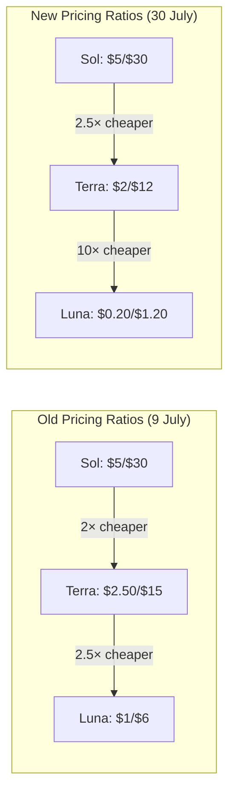
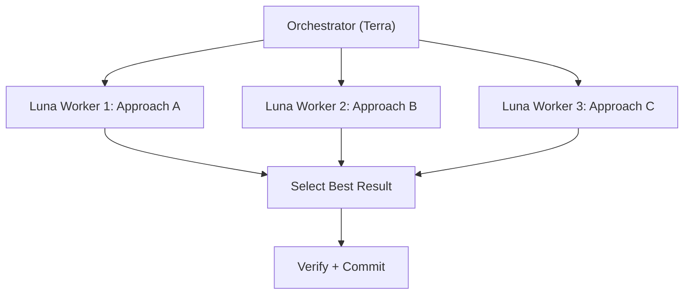

# GPT-5.6 Price Restructuring: Luna Down 80%, Sol Fast Mode, and What It Means for Your Codex CLI Model Routing


---

On 30 July 2026 — three weeks after the GPT-5.6 family launched — OpenAI restructured its pricing across all three tiers[^1]. Luna dropped 80%, Terra fell 20%, and Sol gained a new Fast mode at 2.5× throughput for double the price[^2]. For Codex CLI users running multi-model workflows, this is not a footnote. It rewrites the cost arithmetic that underpins every named profile and subagent routing decision in your `config.toml`.

## What Changed

The table below compares launch-day pricing with the new rates, effective immediately[^1][^3].

| Model | Input (launch) | Output (launch) | Input (new) | Output (new) | Change |
|-------|----------------|------------------|-------------|--------------|--------|
| **Sol** | \$5.00/MTok | \$30.00/MTok | \$5.00/MTok | \$30.00/MTok | — |
| **Sol Fast** | — | — | \$12.50/MTok | \$75.00/MTok | New tier |
| **Terra** | \$2.50/MTok | \$15.00/MTok | \$2.00/MTok | \$12.00/MTok | −20% |
| **Luna** | \$1.00/MTok | \$6.00/MTok | \$0.20/MTok | \$1.20/MTok | −80% |

OpenAI attributed the reductions to a 20% drop in end-to-end serving costs and a 15% improvement in token-generation efficiency achieved during internal development[^3].

### Competitive Context

Luna at \$0.20/\$1.20 per MTok now undercuts every major frontier competitor on raw token price. For reference, Claude Sonnet 4.6 sits at \$3.00/\$15.00[^4], and Gemini 2.5 Pro charges \$1.25/\$10.00. Luna is 15× cheaper on input tokens than Sonnet 4.6, though the quality gap on complex reasoning tasks remains real.

## Why This Matters for Codex CLI

Codex CLI's three-tier model routing — where you assign Sol, Terra, or Luna to different tasks via named profiles and subagent overrides — was designed around the assumption that Luna was cheap, Terra was mid-range, and Sol was expensive. Those ratios have shifted dramatically.

### The Old Calculus

At launch, Luna cost 5× less than Sol on input tokens (20× less on output). Terra sat in the middle at roughly half Sol's price. The standard advice was "Terra as default, Sol for hard problems, Luna for bulk"[^5].

### The New Calculus

Luna is now 25× cheaper than Sol on input tokens and 25× cheaper on output. Terra went from 2× cheaper than Sol to 2.5×. The gap between Luna and Terra widened from 2.5× to 10× on input. This changes which tier you should reach for at every decision point.



## Updating Your config.toml

### Default Model Selection

If you were running Terra as your default to balance cost against capability, that remains sensible. But Luna's 80% price cut makes it viable for a much wider range of tasks than before.

```toml
# ~/.codex/config.toml

# Option A: Terra default (balanced)
model = "gpt-5.6-terra"

# Option B: Luna default (aggressive cost optimisation)
model = "gpt-5.6-luna"
model_reasoning_effort = "high"
```

Luna at `high` reasoning effort now costs roughly what Luna at `medium` cost three weeks ago, whilst delivering meaningfully better results on multi-file tasks[^5].

### Named Profiles for Tier Routing

Named profiles let you switch tiers without editing your config each time. After the price restructuring, consider three profiles:

```toml
# ~/.codex/profiles/bulk.config.toml
# For linting, formatting, boilerplate generation, simple refactors
model = "gpt-5.6-luna"
model_reasoning_effort = "medium"

# ~/.codex/profiles/default.config.toml
# For everyday feature work, test writing, code review
model = "gpt-5.6-terra"
model_reasoning_effort = "high"

# ~/.codex/profiles/hard.config.toml
# For complex architecture, multi-file refactors, debugging subtle issues
model = "gpt-5.6-sol"
model_reasoning_effort = "max"
```

Switch profiles from the CLI:

```bash
codex --profile bulk "add docstrings to all public functions in src/"
codex --profile hard "debug the race condition in the connection pool"
```

### Subagent Model Overrides

In Multi-Agent V2 workflows, subagents can run on different models than the orchestrator. With the new pricing, spawning Luna subagents for parallel leaf tasks becomes dramatically cheaper:

```toml
# In your AGENTS.md or config.toml multi-agent section
# Orchestrator runs on Terra; leaf workers run on Luna
model = "gpt-5.6-terra"

[profiles.worker]
model = "gpt-5.6-luna"
model_reasoning_effort = "medium"
```

A session that spawns six parallel Luna subagents now costs roughly what a single Terra subagent cost at launch pricing.

## Sol Fast Mode: When Latency Is the Bottleneck

The new Sol Fast tier (\$12.50/\$75.00 per MTok) delivers up to 2.5× throughput — reportedly around 750 tokens per second[^2]. This is the first time OpenAI has sold speed as an explicit paid tier rather than a queue priority.

For Codex CLI, Sol Fast is relevant in two scenarios:

1. **Interactive sessions** where you are waiting on the agent and your time costs more than tokens
2. **CI/CD pipelines** where wall-clock time maps directly to compute billing

Configure it in your `config.toml`:

```toml
# Sol Fast for time-sensitive work
model = "gpt-5.6-sol"
# ⚠️ At time of writing, Sol Fast activation may require
# an API parameter rather than a config.toml key.
# Check the OpenAI API changelog for the exact mechanism.
```

## Cost-Per-Task Implications

Raw token prices do not tell the full story. Different models consume different numbers of tokens to complete the same task[^5]. Published benchmarks show:

| Model + Effort | Task Completion | Cost/Task | Steps |
|----------------|----------------|-----------|-------|
| Sol (max) | 73% | \$8.39 | 61 |
| Terra (max) | 70% | \$4.95 | 76 |
| Luna (max) | 67% | \$3.03 | 102 |

With the new pricing, these per-task costs shift:

| Model + Effort | Estimated New Cost/Task | Change |
|----------------|------------------------|--------|
| Sol (max) | ~\$8.39 | — |
| Terra (max) | ~\$3.96 | −20% |
| Luna (max) | ~\$0.61 | −80% |

Luna at \$0.61 per task changes the economics fundamentally. You can run five Luna attempts for less than one Terra attempt, which opens up speculative execution patterns: spawn multiple Luna agents with different approaches and keep the best result.



## Subscription Impact

For ChatGPT Pro and Team subscribers using Codex, the price cuts translate to adjusted token counting against usage allowances[^1]. The monthly subscription fee remains unchanged, but you can accomplish more tasks before hitting limits on Luna and Terra. This effectively increases the runway for Codex App users without touching their billing.

## Practical Recommendations

### For Solo Developers

Switch your default model from Terra to Luna with `high` reasoning effort. At \$0.61 per task, Luna is cheap enough for exploratory coding where you previously would have hesitated. Reserve Terra for sessions where Luna demonstrably struggles — typically multi-file architectural changes and complex debugging.

### For Teams with Managed Configuration

Update your `managed_config.toml` defaults to reflect the new pricing reality:

```toml
# /etc/codex/managed_config.toml
model = "gpt-5.6-luna"
model_reasoning_effort = "high"
```

This gives developers a sensible default whilst allowing profile overrides for heavier work. Pair with `requirements.toml` to cap the maximum model tier if budget control matters:

```toml
# /etc/codex/requirements.toml
# ⚠️ The exact key for model ceiling enforcement
# may vary; verify against current documentation.
```

### For CI/CD Pipelines

Luna at \$0.20 per MTok input makes Codex CLI viable for tasks that were previously too expensive to automate: generating changelog entries, writing migration guides, or producing test stubs for every PR. The cost of running Luna in a GitHub Action is now comparable to a linter.

### Monitor with OpenTelemetry

Whichever model you choose, wire up OpenTelemetry to track actual cost per task rather than relying on token-price assumptions:

```toml
[otel]
metrics_exporter = "otlp"
```

The `OTEL_RESOURCE_ATTRIBUTES` field lets you segment costs by model, profile, and developer — essential data for deciding whether the new Luna pricing justifies a fleet-wide default change[^6].

## What This Signals

Three price restructurings in three weeks signals that the frontier model pricing war is accelerating. Chinese open-weight models from DeepSeek and Alibaba have compressed margins, and OpenAI is responding by making its lower tiers aggressively competitive whilst preserving Sol's premium positioning[^3].

For Codex CLI users, the practical takeaway is straightforward: re-evaluate your model routing. The tier boundaries that made sense on 9 July no longer hold. Luna is no longer "the cheap model you use for trivial tasks" — at \$0.20 per MTok, it is cheap enough to be your default for everything except the genuinely hard problems where Sol's reasoning depth pays for itself.

## Citations

[^1]: OpenAI, "Advancing the price-performance frontier with GPT-5.6," [openai.com/index/advancing-the-price-performance-frontier-with-gpt-5-6/](https://openai.com/index/advancing-the-price-performance-frontier-with-gpt-5-6/), 30 July 2026.

[^2]: OpenAI API Changelog, "GPT-5.6 Luna costs 80% less; GPT-5.6 Terra costs 20% less; Sol Fast mode," [developers.openai.com/api/docs/changelog](https://developers.openai.com/api/docs/changelog), 30 July 2026.

[^3]: CNBC, "OpenAI cuts prices for two of its GPT-5.6 AI models as companies grow sensitive to costs," [cnbc.com/2026/07/30/open-ai-price-cut-gpt.html](https://www.cnbc.com/2026/07/30/open-ai-price-cut-gpt.html), 30 July 2026.

[^4]: Anthropic, Claude Sonnet 4.6 pricing via OpenRouter, [openrouter.ai/anthropic/claude-sonnet-4.6](https://openrouter.ai/anthropic/claude-sonnet-4.6), accessed 30 July 2026.

[^5]: Codex Knowledge Base, "GPT-5.6 Sol, Terra, and Luna: What OpenAI's Three-Tier Model Family Means for Codex CLI Workflows," [codex.danielvaughan.com](https://codex.danielvaughan.com/2026/07/01/gpt-5-6-sol-terra-luna-codex-cli-model-selection-tiered-reasoning-cache-breakpoints/), 1 July 2026.

[^6]: 9to5Mac, "OpenAI makes two GPT-5.6 models cheaper, expanding usage in ChatGPT," [9to5mac.com/2026/07/30/openai-makes-two-gpt-5-6-models-cheaper-expanding-usage-in-chatgpt/](https://9to5mac.com/2026/07/30/openai-makes-two-gpt-5-6-models-cheaper-expanding-usage-in-chatgpt/), 30 July 2026.
