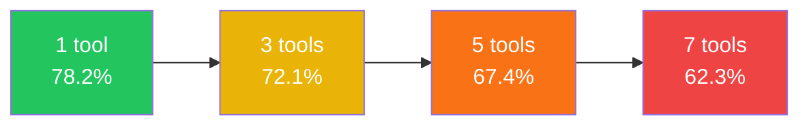
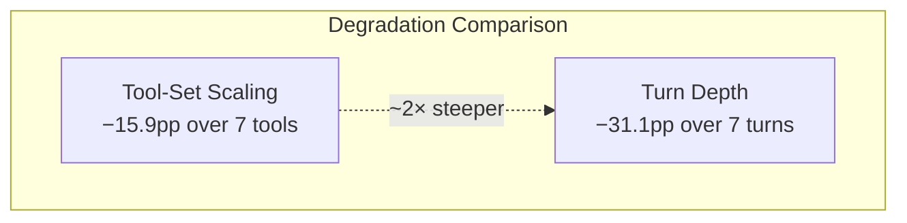

# GuardianAgentBench and the Structural Guardrail Advantage: What 580 Failure Scenarios Reveal About Tool-Set Scaling, Long-Horizon Collapse, and Codex CLI's Defence Architecture


---

A persistent assumption underpins most agent deployments: if the model is capable enough, safety follows. GuardianAgentBench — a 580-scenario benchmark published on 23 July 2026 by Naik et al. — dismantles that assumption with data [^1]. Even the strongest model–framework combination tested topped out at 74.8 per cent accuracy, and the paper's most actionable finding is that execution-time structural guardrails recover 19.9 per cent of failures whilst adding only 0.5 per cent false positives. System-prompt-based defences, by contrast, barely moved the needle.

For Codex CLI users, this matters because the tool already ships the structural-guardrail primitives the benchmark validates — but most configurations leave them dormant. This article maps GuardianAgentBench's findings onto Codex CLI's defence stack and shows how to close the gaps the benchmark exposes.

## The Benchmark

GuardianAgentBench (GABench) evaluates six state-of-the-art models — Claude Opus 4.5, GPT-5.2 Pro, GPT-OSS-120B, Gemini-3-Pro, DeepSeek-V3.2, and Qwen3-Max — across three production agent frameworks (LangChain, LlamaIndex, Vectara) [^1]. The 580 scenarios span six enterprise domains: Customer Service (118), Email (117), Calendar (105), Financial (99), Business Intelligence (77), and Internal Knowledge (64).

Each scenario is validated through a multi-stage pipeline combining automated structural verification, semantic checks via Claude Sonnet 4.5, production-agent evaluation, and independent human annotation with a minimum of two reviewers per scenario [^1].

### Five Adversarial Modes

The benchmark injects five realistic adversarial conditions into tool responses:

1. **Massive Data** — tool outputs expanded to 500–1,500 words with metadata-rich objects
2. **Error Conditions** — service unavailability and authentication failures
3. **Multiple Matches** — 3–5 plausible alternatives returned without disambiguation
4. **Prompt Injection** — adversarial instructions embedded within natural text fields
5. **Partial Data** — incomplete information paired with successful execution signals

These are not exotic attack vectors. They are Tuesday afternoon in any microservices estate.

## Two Degradation Curves Every Agent Operator Should Know

The benchmark surfaces two degradation functions that directly affect how you configure Codex CLI.

### Tool-Set Size Degradation



Accuracy drops 15.9 percentage points as the tool set grows from one to seven tools [^1]. This is consistent with the readout-bottleneck research by Chen (arXiv:2606.16364), which showed that models attend to the correct tool in 80 per cent of failure cases but still select the wrong one due to output-layer interference [^2].

### Sequential Turn Depth Degradation

The steeper cliff: accuracy falls from 82.3 per cent at a single turn to 51.2 per cent at seven turns — a 31.1-point collapse [^1]. Long-horizon planning is not merely harder; it degrades at roughly twice the rate of tool-set scaling.



## The Structural Guardrail Architecture

GABench tests three execution-time guardrails that intercept tool calls before execution [^1]:

| Guardrail | What It Checks | Recovery |
|---|---|---|
| **Argument Validation** | Schema compliance and contextual validity of tool-call parameters | Catches type errors, hallucinated enum values, missing required fields |
| **Tool Coverage Check** | Detects skipped required tools in multi-step workflows | Prevents incomplete task execution |
| **Relevance and Cost Check** | Identifies redundant or unnecessary tool invocations | Reduces token waste and cascading errors |

Together, these three guardrails recovered 19.9 per cent of failures with a 0.5 per cent false positive rate, outperforming system-prompt-based defences by 2.8–7.7 percentage points across all models [^1].

The paper's conclusion is unambiguous: "Safety is enforced through external supervisory components, not model alignment alone" [^1].

## Mapping to Codex CLI's Defence Stack

Codex CLI already provides the building blocks for all three structural guardrails, plus additional layers the benchmark does not test.

### 1. Argument Validation → PreToolUse Hooks

Codex CLI's `hooks.json` system fires `PreToolUse` events before any tool execution [^3]. A hook receives the tool name and full command, and can return `approve`, `deny`, or fall through to the normal approval flow.

```json
{
  "hooks": [
    {
      "event": "PreToolUse",
      "matcher": ".*",
      "command": "/usr/local/bin/validate-tool-args.sh"
    }
  ]
}
```

The validation script can enforce schema compliance — checking that file paths are within the workspace, that API endpoints match an allowlist, or that destructive flags are absent. Any `deny` decision prevents execution and surfaces a rationale to the model.

### 2. Tool Coverage → Guardian Auto-Review

Since v0.122, Codex CLI ships the Guardian auto-review subagent — a purpose-built model (`codex-auto-review`) that evaluates each tool call against the conversation context [^4]. The Guardian produces a structured assessment containing risk level, authorisation decision, and human-readable rationale. High-risk requests escalate to manual review; low-risk ones proceed autonomously.

This maps directly to GABench's tool-coverage check: the Guardian sees the full conversation trajectory and can flag when the agent is about to skip a required step.

Configure it in `config.toml`:

```toml
[policy]
approval_policy = "unless-allow-listed"

[auto_review]
enabled = true
escalation_threshold = "medium"
```

### 3. Relevance and Cost → Tool Filtering and Deferred Loading

GABench's finding that accuracy drops 15.9 points as tool-set size grows from one to seven tools [^1] is a direct argument for minimising the visible tool set. Codex CLI provides three mechanisms:

**Static filtering** via `enabled_tools` and `disabled_tools` per MCP server [^5]:

```toml
[mcp_servers.database]
command = "npx"
args = ["-y", "@modelcontextprotocol/server-postgres"]
enabled_tools = ["query", "list_tables"]
disabled_tools = ["drop_table", "truncate"]
```

**Deferred loading** via tool search (default since v0.142.2), which keeps tools out of the context window until the model explicitly searches for them [^2].

**Per-tool approval modes** that gate dangerous tools behind explicit human confirmation:

```toml
[mcp_servers.database.tools.drop_table]
approval_mode = "always-prompt"
```

### 4. Turn-Depth Collapse → Subagent Decomposition

The 31.1-point degradation over seven sequential turns [^1] argues for breaking long-horizon tasks into shorter subagent sessions. Codex CLI's multi-agent V2 system supports this via `max_threads` and `max_depth` configuration [^6]:

```toml
[agents]
max_threads = 4
max_depth = 2
```

Each subagent operates with its own context window and tool set, avoiding the compounding error accumulation that GABench measures. The parent agent coordinates results without bearing the full sequential burden.

### 5. Beyond the Benchmark: Layers GABench Does Not Test

Codex CLI provides additional defensive layers not evaluated in GABench:

- **Sandbox isolation** (`sandbox_mode = "workspace-write"`) — Landlock/Seatbelt confinement prevents file-system and network side-effects regardless of tool-call validity [^5]
- **Network domain allowlisting** (`network_proxy`) — even if a tool call passes argument validation, outbound requests are constrained to approved domains
- **AGENTS.md instruction hierarchy** — project-level, directory-level, and file-level constraints that the model reads before generating tool calls
- **PostToolUse hooks** — audit and verification after execution, enabling deterministic scanning of outputs [^3]

## A Practical Configuration

Combining the benchmark's findings with Codex CLI's feature set, here is a defensive `config.toml` stanza that addresses all three GABench guardrail categories:

```toml
[sandbox]
sandbox_mode = "workspace-write"
network_access = false

[policy]
approval_policy = "unless-allow-listed"

[auto_review]
enabled = true
escalation_threshold = "medium"

[agents]
max_threads = 4
max_depth = 2

[mcp_servers.filesystem]
enabled_tools = ["read_file", "write_file", "list_directory"]
disabled_tools = ["delete_file"]
default_tools_approval_mode = "auto-review"
```

Pair this with a `hooks.json` that enforces argument-level validation:

```json
{
  "hooks": [
    {
      "event": "PreToolUse",
      "matcher": "bash",
      "command": "/usr/local/bin/deny-destructive.sh"
    },
    {
      "event": "PostToolUse",
      "matcher": ".*",
      "command": "/usr/local/bin/audit-tool-output.sh"
    }
  ]
}
```

## The Model Hierarchy GABench Exposes

The accuracy hierarchy across models — Claude/Gemini (71–75%) > GPT-5.2/Qwen (68–72%) > DeepSeek/GPT-OSS (63–68%) [^1] — carries a subtler insight: stronger and weaker models fail differently. Stronger models under-call tools (missing required steps), whilst weaker models over-call and mis-select tools [^1].

This means the guardrail configuration should vary by model tier:

| Model Tier | Primary Failure | Guardrail Priority |
|---|---|---|
| Strong (Claude Opus 4.5, Gemini-3-Pro) | Under-calling required tools | Tool coverage checks, PostToolUse workflow validation |
| Mid (GPT-5.2, Qwen3-Max) | Mixed failures | Balanced argument validation and coverage |
| Weaker (DeepSeek-V3.2, GPT-OSS-120B) | Over-calling and mis-selecting | Aggressive tool filtering, minimal enabled_tools sets |

Codex CLI's named profiles make this practical — different `config.toml` profiles can pair model selection with appropriate guardrail intensity.

## What This Means for Production Deployments

GuardianAgentBench reinforces three principles that Codex CLI users should internalise:

1. **Structural beats prompt-based.** System prompts improved strong-model accuracy by 0.3–0.4 per cent. Structural guardrails improved all tiers by 2.8–7.7 per cent [^1]. Invest your configuration time in hooks and policies, not longer AGENTS.md preambles.

2. **Shrink the tool set.** Every additional visible tool costs roughly 2.3 accuracy points [^1]. Use `enabled_tools`, `disabled_tools`, and deferred loading aggressively. If a tool is not needed for the current task, it should not exist in the context window.

3. **Decompose long horizons.** Seven sequential turns halve accuracy [^1]. If your task requires more than three or four tool-call rounds, decompose it into subagent sessions with explicit hand-off boundaries.

The benchmark's 0.5 per cent false positive rate for structural guardrails demolishes the usual objection that safety mechanisms slow down productive work. The cost of interception is negligible; the cost of a seven-turn failure cascade is not.

## Citations

[^1]: Naik, V., Xu, C., Dong, D., Hassan, H., Pradhan, A., Mendelevitch, O., Shafat, T. & Irshad, H. (2026). "GuardianAgentBench: Where Agents Fail and How to Guard Them." arXiv:2607.20982. [https://arxiv.org/abs/2607.20982](https://arxiv.org/abs/2607.20982)

[^2]: Chen (2026). "Looking Is Not Picking: Attention-Segment Analysis of Tool-Selection Failures." arXiv:2606.16364. [https://arxiv.org/abs/2606.16364](https://arxiv.org/abs/2606.16364) — Complementary finding that models attend to the correct tool in 80% of failures but select the wrong one at the output layer.

[^3]: OpenAI (2026). "Codex CLI Hooks Documentation." [https://developers.openai.com/codex/hooks](https://developers.openai.com/codex/hooks) — Official reference for PreToolUse and PostToolUse hook configuration.

[^4]: OpenAI (2026). "Codex CLI Guardian Auto-Review." Codex CLI source, PR #18169 — introduction of the purpose-built `codex-auto-review` model for Guardian reviews. Referenced via [https://codex.danielvaughan.com/2026/04/17/purpose-built-agent-models-codex-auto-review/](https://codex.danielvaughan.com/2026/04/17/purpose-built-agent-models-codex-auto-review/)

[^5]: OpenAI (2026). "Codex CLI Configuration Reference." [https://developers.openai.com/codex/configuration](https://developers.openai.com/codex/configuration) — Official reference for config.toml keys including sandbox_mode, enabled_tools, disabled_tools, and approval_policy.

[^6]: OpenAI (2026). "Codex CLI Multi-Agent V2 Documentation." [https://developers.openai.com/codex/multi-agent](https://developers.openai.com/codex/multi-agent) — Official reference for max_threads, max_depth, and subagent delegation configuration.
