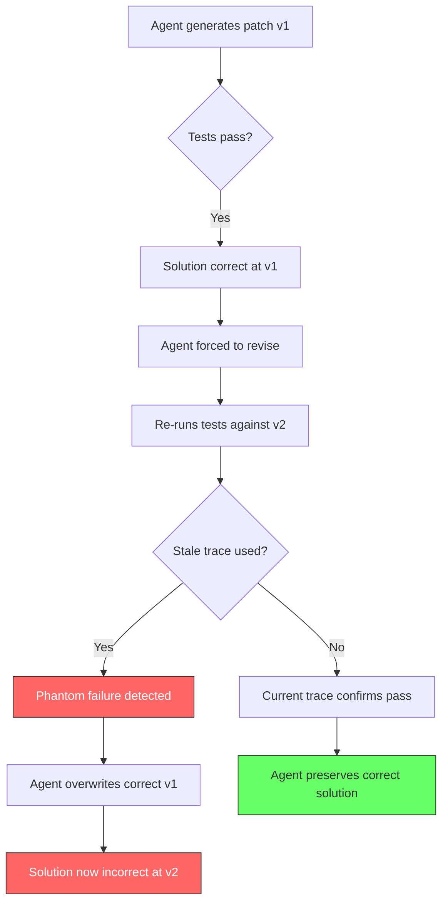
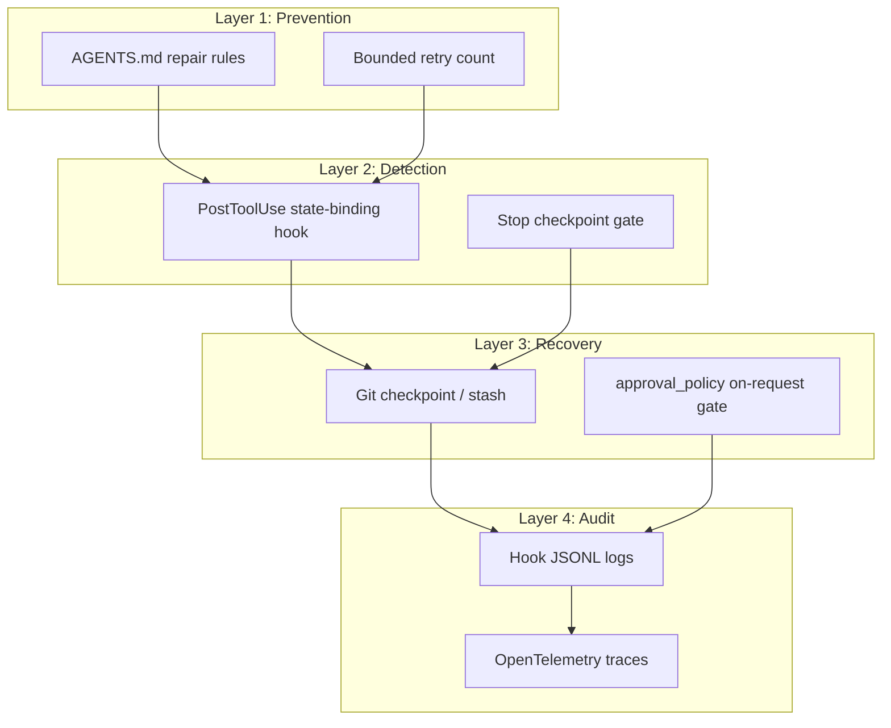

# Looping Is Not Reliability: What Typed Revision Contracts Reveal About Repair-Loop Decay — and How to Harden Your Codex CLI Repair Cycles


---

Every coding agent ships with a generate-test-revise loop at its core. The assumption is intuitive: if the first attempt fails, try again with the error message in context, and correctness will converge. New research demonstrates that this assumption is wrong — and that unrestricted looping actively destroys solutions the agent has already found.

Gao, Yang and Yang's "Looping Is Not Reliability: State-Bound Evidence and Typed Revision Contracts for Agentic Code Repair" [^1], published on 27 July 2026, presents the first controlled study of what happens when agents are forced to revise code they have already repaired correctly. The findings carry direct implications for how you configure Codex CLI's hook pipeline, compaction strategy and token budgets.

## The Revision Degradation Problem

The central experiment is elegant. The authors took 30 HumanEval repair tasks and generated 900 three-revision trajectories across five seeds [^1]. Rather than measuring pass rates after a single attempt, they tracked what happened to solutions that were *already correct* when the agent was pushed to revise further.

The results are stark:

| Metric | Value |
|--------|-------|
| Correctness after 1 revision | 82.0% |
| Correctness after 2 revisions | 67.3% |
| "Ever-correct" across trajectory | 84.7% |
| Stale-trace harm (correct starts) | 34 / 135 |
| Current-trace harm (correct starts) | 4 / 135 |
| Stale-trace performance gap | −22.2 pp (95% CI [8.9, 37.0], p = 0.0337) |

The "ever-correct" rate — the proportion of trajectories that produced a correct solution *at some point* — reached 84.7%. Yet the final-revision correctness fell to 67.3% [^1]. The agent found the right answer but then revised it into a wrong one. This is not a rare edge case; it is a systematic pattern.

## Trace Staleness: The Hidden Mechanism

The paper identifies trace staleness as the primary mechanism driving revision degradation. When an agent re-runs verification against stale output — traces from a previous code state rather than the current one — it makes revision decisions based on phantom failures [^1].

In the common-state studies (2,430 branches from frozen programmes), stale traces harmed 34 of 135 correct starts, versus only 4 with current traces [^1]. That 22.2 percentage-point gap is the cost of allowing verification evidence to drift out of sync with code state.



## The Typed Revision Contract

The authors propose a structural solution: an evidence-bound typed loop contract with three mechanically enforceable components [^1]:

1. **State binding** — verification evidence is cryptographically bound to the exact code state that produced it. A hash mismatch between the code under test and the evidence attached to it triggers an automatic re-verification before any revision decision.

2. **Checkpoint preservation** — once a solution passes verification with state-bound evidence, it is preserved as a verified checkpoint. Subsequent revisions fork from this checkpoint rather than overwriting it.

3. **Auditable admission receipts** — each loop iteration produces a typed record linking the code state, the verification trace, the revision decision and the resulting code state. This creates an audit trail that makes revision degradation detectable post-hoc.

The contract is deliberately minimal. The authors describe their reference implementation as an "executable specification and conformance artefact" [^1] — a standard that agent scaffolds can implement, not a competing repair tool.

## Why This Matters for Codex CLI

Codex CLI's hook pipeline and configuration stack already provide the primitives needed to implement the core ideas from this research. The gap is that most configurations do not use them for this purpose.

### PostToolUse Hooks as State-Bound Verifiers

The `PostToolUse` hook fires after every tool execution — shell commands, `apply_patch` edits and MCP tool calls [^2]. Exit code 2 replaces the tool result the agent sees with your stderr feedback, effectively steering the next revision.

A PostToolUse hook can hash the current working tree (or the specific files under repair) and compare that hash against the verification trace. If the agent is about to revise based on stale test output, the hook intercepts:

```toml
[[hooks.PostToolUse]]
matcher = "^Bash$"

[[hooks.PostToolUse.hooks]]
type = "command"
command = "python3 .codex/verify-state-binding.py"
timeout = 30
statusMessage = "Verifying test trace is bound to current code state"
```

The verification script computes a content hash of the files under test, compares it against a `.codex/last-verified-state` file written by the previous test run, and exits with code 2 if there is a mismatch — forcing re-verification before the agent proceeds [^2].

### Stop Hooks as Checkpoint Gates

The `Stop` hook fires when the agent completes a turn [^2]. This is the natural place to implement checkpoint preservation:

```toml
[[hooks.Stop]]

[[hooks.Stop.hooks]]
type = "command"
command = "python3 .codex/checkpoint-if-passing.py"
timeout = 60
statusMessage = "Checkpointing verified solution"
```

The checkpoint script runs the test suite, and if all tests pass, creates a git stash or tagged commit as a verified checkpoint. If a subsequent revision degrades the solution, you have a known-good state to return to.

### AGENTS.md: Encoding the Contract

The typed revision contract's rules can be encoded directly in your `AGENTS.md` file, where they survive context compaction and remain visible to the agent throughout the session [^3]:

```markdown
## Repair Loop Rules

1. Never revise code that passes all tests unless the user explicitly requests changes.
2. After every test run, record which files were tested and their content hashes.
3. If a previously passing test now fails after a revision, revert to the last verified checkpoint before attempting further fixes.
4. Maximum three revision attempts per file. If the third attempt fails, report the failure and stop.
```

These constraints directly address the revision degradation pattern: they prevent the agent from overwriting correct solutions and impose a bounded retry policy rather than unbounded looping.

### Token Budget as Loop Bound

The paper's 540-rollout policy study found that a generous but finite token budget eliminated harm to correct starts at the cost of reduced repair capacity for incorrect ones [^1]. This maps directly to Codex CLI's compaction and budget controls:

```toml
model_auto_compact_token_limit = 80000
tool_output_token_limit = 16000
```

The `model_auto_compact_token_limit` triggers automatic context compaction before the context window fills [^4]. Combined with the `tool_output_token_limit` that caps individual tool outputs, these settings prevent the context from being flooded with stale verification traces — the exact mechanism the paper identifies as the primary driver of revision degradation.

### Approval Policy as Revision Gate

For high-stakes repair tasks, Codex CLI's granular approval policy can gate revision decisions explicitly:

```toml
[approval_policy]
apply_patch = "on-request"
```

In `on-request` mode, every file edit requires explicit approval [^5]. This creates a human checkpoint at each revision step — the most direct implementation of the paper's checkpoint-preservation principle, albeit at the cost of automation speed.

## The Broader Pattern: Defence in Depth for Repair Loops

The typed revision contract fits into a defence-in-depth architecture that layers multiple Codex CLI mechanisms:



Each layer addresses a different aspect of the revision degradation problem:

- **Prevention** stops unbounded looping before it starts
- **Detection** catches stale-trace decisions in real time
- **Recovery** preserves known-good states for rollback
- **Audit** makes the entire repair trajectory inspectable after the fact

## Practical Recommendations

1. **Add a PostToolUse state-binding hook** that hashes files under test and compares against the last verification trace. This is the single highest-impact intervention from the paper.

2. **Set explicit retry bounds in AGENTS.md** — three revisions per file is a reasonable starting point based on the paper's trajectory analysis.

3. **Use Stop hooks to checkpoint passing states** via git tags or stashes. The cost is negligible; the recovery value is substantial.

4. **Keep `model_auto_compact_token_limit` conservative** to prevent stale traces from accumulating in context. The paper's findings suggest that shorter, fresher context windows outperform longer, staler ones.

5. **Enable `auto_review`** for repair workflows. The auto-reviewer acts as an independent verifier — a second opinion on whether a revision improves or degrades the solution [^5].

6. **Log everything**. The typed revision contract's audit trail is only useful if your hooks write structured output. Configure JSONL logging in your hook scripts and, for enterprise deployments, route hook telemetry through OpenTelemetry [^6].

## Conclusion

The intuition that "more iterations equals more reliability" is precisely wrong for coding agents. Gao, Yang and Yang's controlled study shows that forced revision degrades correctness by 14.7 percentage points [^1], and that stale verification traces are the primary mechanism. The fix is not to stop looping — it is to make each loop iteration structurally sound through state-bound evidence, checkpoint preservation and bounded retry policies.

Codex CLI's hook pipeline, AGENTS.md constraints and configuration stack provide the building blocks. The gap is that most teams treat repair loops as a black box. The typed revision contract gives you a blueprint for opening that box and making each iteration accountable.

## Citations

[^1]: Gao, X., Yang, J. & Yang, Q. (2026). "Looping Is Not Reliability: State-Bound Evidence and Typed Revision Contracts for Agentic Code Repair." arXiv:2607.24604. [https://arxiv.org/abs/2607.24604](https://arxiv.org/abs/2607.24604)

[^2]: OpenAI. (2026). "Hooks — Codex CLI Documentation." [https://learn.chatgpt.com/docs/hooks](https://learn.chatgpt.com/docs/hooks)

[^3]: OpenAI. (2026). "AGENTS.md — Codex CLI Documentation." [https://learn.chatgpt.com/docs/agents-md](https://learn.chatgpt.com/docs/agents-md)

[^4]: OpenAI. (2026). "Advanced Configuration — Codex CLI Documentation." [https://learn.chatgpt.com/docs/config-file/config-advanced](https://learn.chatgpt.com/docs/config-file/config-advanced)

[^5]: OpenAI. (2026). "Configuration Reference — Codex CLI Documentation." [https://developers.openai.com/codex/config-reference](https://developers.openai.com/codex/config-reference)

[^6]: OpenAI. (2026). "Codex CLI Changelog." [https://learn.chatgpt.com/docs/changelog](https://learn.chatgpt.com/docs/changelog)
