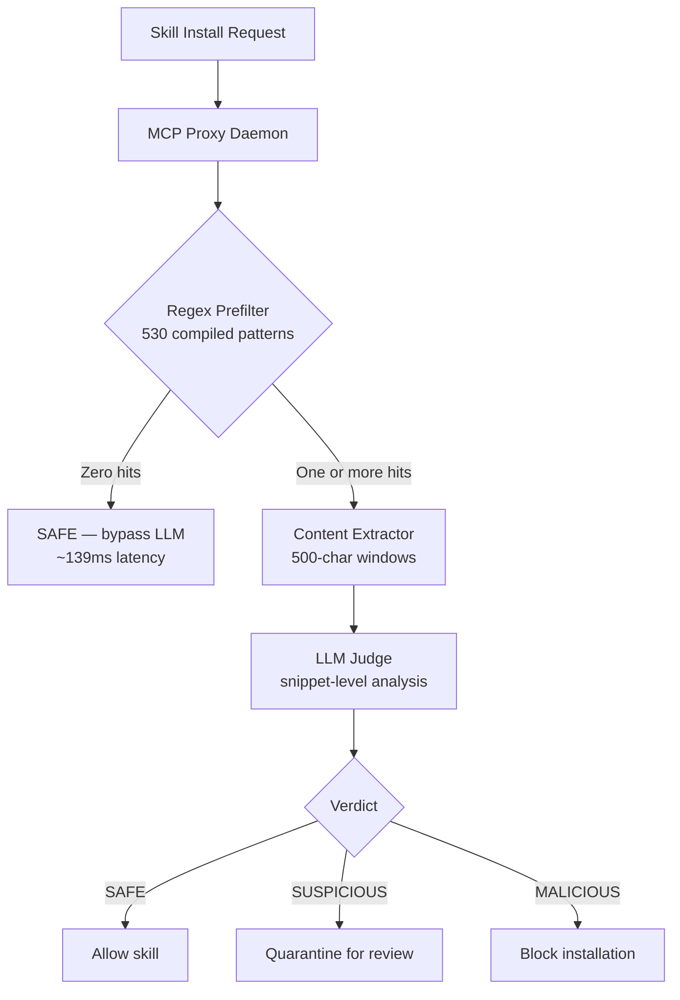
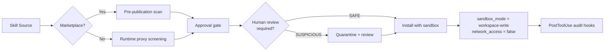

# SkillGate and the Skill Supply-Chain Gap: Why Runtime Screening Matters More Than Marketplace Curation — and How to Harden Your Codex CLI Skill Stack


---

## The Unscreened Install Problem

A `npx skills add` command is all it takes to inject a Markdown-based skill file into a coding agent's context. No compilation step. No sandboxed build. No cryptographic signature verification. The file is plain text that the agent reads, trusts, and executes as behavioural instructions — making skill files simultaneously the simplest extension mechanism in modern tooling and one of the least defended supply-chain surfaces in software engineering.

Three independent research programmes published between May and July 2026 have quantified the risk. PhantomSkill demonstrated that VulMask rewrites can disguise malicious behaviour as ordinary insecure code, defeating both human review and automated scanners [^1]. MalSkillBench assembled 3,944 malicious skill files across 108 taxonomy cells, confirming that code injection achieves 94.5% verification yield while prompt injection reaches 75.8% [^2]. And most recently, SkillGate — published on 28 July 2026 by Yang, Fu, Tantithamthavorn, Arora, and Chua — introduced a two-stage screening gateway that detects malicious skills at runtime with an F1 of 0.817, a false-positive rate of 1.13%, and a 77% reduction in LLM token costs compared to full-file screening [^3].

This article unpacks SkillGate's architecture, benchmarks its findings against existing tools, and maps the defence pattern onto Codex CLI's configuration stack.

---

## SkillGate's Two-Stage Architecture

SkillGate operates as an MCP proxy daemon, intercepting `tools/call`, `resources/read`, and `prompts/get` responses before they reach the agent. Integration requires a single configuration line — no agent source modification [^3].



### Stage 1: Regex Prefiltering

A `RuleEngine` compiles 530 patterns: 428 derived from the MITRE ATT&CK framework and 102 community rules adapted from Sigma format [^3]. The twelve largest categories account for 412 of the 428 MITRE-derived patterns:

| Category | Pattern Count | Example Match |
|----------|:------------:|---------------|
| Defence evasion | 62 | `base64 -d \| sh` |
| Execution | 56 | `eval(`, `exec(` |
| Risky commands | 56 | `rm -rf /`, `dd if=` |
| Credential access | 44 | `.aws/credentials` |

Files that produce zero pattern hits are classified SAFE immediately, costing near-zero compute. In the SkillsBench evaluation, 67.2% of files (1,110 of 1,650) took this fast path [^3].

### Stage 2: Snippet-Level LLM Judgement

For flagged files, a `ContentExtractor` builds compact context windows rather than feeding the entire file to the LLM. Each regex match receives a 500-character buffer on each side, windows within 125 characters merge, and up to 20 unique windows concatenate with separators, capped at 8,000 characters total. A ~700-character preamble provides structural context [^3].

The LLM judge (GPT-5.4-mini in the paper's configuration) labels content as SAFE, SUSPICIOUS, or MALICIOUS with a confidence score in [0, 1]. The snippet-level approach means the judge never sees benign boilerplate that dominates most skill files — only the suspicious regions.

---

## Benchmark Results: SkillsBench

SkillsBench comprises 1,650 files: 1,500 real-world benign skills and 150 hand-crafted malicious skills spanning eight attack categories [^3]:

| Metric | SkillGate | ClawVet | SkillScanner | SkillScanner+LLM |
|--------|:---------:|:-------:|:------------:|:----------------:|
| F1 | **0.817** | 0.258 | 0.215 | 0.287 |
| AUPRC | **0.830** | 0.144 | 0.162 | 0.246 |
| FPR | **1.13%** | 50.4% | 17.4% | 0.73% |
| MCC | **0.803** | — | — | 0.331 |
| FP count | **17** | 756 | 261 | — |

The 5–6× AUPRC improvement over baselines stems from the two-stage design: the regex prefilter catches obvious attack patterns that static tools miss through insufficient coverage, while the snippet-level LLM judge avoids the false negatives that full-file judges produce when malicious content is diluted by surrounding benign text [^3].

### Token Economics

The hybrid approach reduces total LLM input tokens by 76.9%: skip savings contribute 67.2% of files bypassing the LLM entirely, and snippet extraction compresses flagged files from an average of 1,832 tokens per file to 425 tokens [^3]. Weighted average latency lands at ~818ms per skill — within the 0.5–5 second window typical of registry fetches.

---

## The Broader Threat Landscape

SkillGate addresses one specific attack surface — malicious instructions within SKILL.md files — but the broader skill supply-chain threat is multi-layered.

PhantomSkill's VulMask technique rewrites overtly malicious scripts into vulnerability-shaped implementations whose malicious behaviour activates only under attacker-controlled trigger conditions. This shifts detection from "find the malware" to "identify the intentionally insecure code" — a fundamentally harder problem that pattern-matching alone cannot solve [^1].

MalSkillBench's three-dimensional taxonomy (attack goal × attack vector × skill type) reveals that the wild sample is dominated by a single cryptocurrency-theft campaign, but with a small yet architecturally novel tail attacking the agent control plane itself [^2]. The Cloud Security Alliance published a research note in May 2026 explicitly classifying SKILL.md as a new AI supply-chain attack surface [^4].

---

## Mapping SkillGate's Defence Pattern onto Codex CLI

Codex CLI does not ship SkillGate, but its layered security architecture provides multiple enforcement points where equivalent screening logic can be deployed.

### 1. MCP Proxy Interception

SkillGate's proxy daemon architecture maps directly to Codex CLI's MCP server configuration. A screening proxy can sit between Codex and any MCP skill provider:

```toml
# ~/.codex/config.toml
[mcp_servers.skill-proxy]
command = "skillgate-proxy"
args = ["--upstream", "npx", "--upstream-args", "skills-server"]
```

Codex CLI v0.146 improved proxy handling across authentication, MCP operations, and WebSocket connections [^5], making proxy-based interception more reliable than in earlier releases.

### 2. PreToolUse Hooks for Pattern Screening

Codex CLI's `PreToolUse` hooks execute before any tool action. A hook can implement SkillGate's regex prefilter logic — scanning skill file content against MITRE ATT&CK patterns before the agent ingests the instructions:

```toml
# In AGENTS.md or config.toml hook configuration
# PreToolUse hook: scan skill content for malicious patterns
# Block skills containing base64-decoded shell execution,
# credential file access, or encoded payload patterns
```

The hook pipeline provides fail-closed behaviour: if the hook rejects a skill, the agent never sees the content.

### 3. Approval Policy Gating

Codex CLI's granular `approval_policy` can require human approval for skill installation:

```toml
[approval_policy]
skill_approval = "always"  # Never auto-approve skill installations
```

This mirrors SkillGate's SUSPICIOUS quarantine tier — flagged skills require explicit developer confirmation rather than silent installation.

### 4. Plugin Marketplace Trust Boundaries

The Codex CLI plugin marketplace includes automated scanning for dangerous command patterns, hardcoded secrets, and prompt injection attempts [^6]. However, marketplace curation is a pre-publication gate, not a runtime defence. Skills installed directly from GitHub repositories bypass marketplace scanning entirely.

SkillGate's contribution is demonstrating that runtime screening — applied at install time regardless of source — catches threats that pre-publication curation misses.

### 5. Sandbox Containment as a Last Resort

Even if a malicious skill evades detection, Codex CLI's sandbox architecture limits blast radius:

```toml
sandbox_mode = "workspace-write"

[sandbox_workspace_write]
network_access = false  # Prevent data exfiltration
```

The `workspace-write` sandbox confines file modifications to the project directory, and disabling network access blocks the exfiltration channel that 6 of SkillGate's 8 attack categories depend on [^3].

---

## A Defence-in-Depth Configuration

Combining SkillGate's insights with Codex CLI's existing controls produces a layered defence:



```toml
# Hardened skill security profile
[profiles.hardened-skills]
sandbox_mode = "workspace-write"
approval_policy = "on-request"

[profiles.hardened-skills.approval_policy]
skill_approval = "always"

[profiles.hardened-skills.sandbox_workspace_write]
network_access = false
```

### Named Profiles for Risk Segmentation

Use Codex CLI's named profiles to apply different screening levels based on skill provenance:

```toml
# Trusted marketplace skills — standard approval
[profiles.marketplace]
approval_policy = "on-request"

# Untrusted GitHub skills — maximum scrutiny
[profiles.untrusted]
approval_policy = "on-request"

[profiles.untrusted.approval_policy]
skill_approval = "always"

[profiles.untrusted.sandbox_workspace_write]
network_access = false
```

---

## What SkillGate Does Not Solve

SkillGate's prefilter relies on pattern matching against known attack signatures. PhantomSkill's VulMask technique — which disguises malicious behaviour as ordinary insecure code — would likely evade regex-based screening [^1]. The LLM judge provides a second line of defence, but the paper's 76.9% recall means roughly one in four malicious skills would pass through undetected.

The false-positive analysis is equally instructive: the dominant category of false positives is base64-encoded content in documentation that triggers `encoded_payload` rules without clear benign context [^3]. Teams with legitimate base64 usage in their skill files — common in deployment automation — will need to tune the prefilter's pattern set.

⚠️ SkillGate's SkillsBench benchmark uses a 9.1% malicious prevalence rate. In production environments where malicious skill rates are likely lower, the positive predictive value would decrease. The 1.13% FPR, whilst impressive in isolation, could still produce noise in organisations installing hundreds of skills.

---

## Practical Recommendations

1. **Deploy runtime screening regardless of marketplace trust.** SkillGate demonstrates that proxy-based screening at install time catches threats that pre-publication curation misses. The 818ms average latency is negligible against the cost of a compromised agent session.

2. **Use snippet-level rather than full-file LLM analysis.** Full-file screening dilutes malicious signals with benign boilerplate. SkillGate's 77% token reduction shows that targeted extraction outperforms brute-force approaches on both accuracy and cost.

3. **Layer deterministic and probabilistic defences.** Regex prefilters catch known-bad patterns at near-zero cost; LLM judges handle novel threats. Neither alone is sufficient — the combination achieves 5–6× better AUPRC than either approach independently.

4. **Disable network access for untrusted skills.** Six of eight attack categories in SkillsBench require network exfiltration. A single `network_access = false` configuration line neutralises the majority of attack payloads.

5. **Treat skills as supply-chain dependencies.** Apply the same rigour to skill files as to npm packages or Docker images: pin versions, review changes, and maintain an inventory.

---

## Citations

[^1]: L. He, H. Wang, R. Yang, K. Tantithamthavorn *et al.*, "PhantomSkill: Malicious Code Injection in Agent Skill Ecosystems," *arXiv:2606.19191*, June 2026. [https://arxiv.org/abs/2606.19191](https://arxiv.org/abs/2606.19191)

[^2]: R. Yang, M. Fu, K. Tantithamthavorn, C. Arora *et al.*, "MalSkillBench: A Runtime-Verified Benchmark of Malicious Agent Skills," *arXiv:2606.07131*, June 2026. [https://arxiv.org/abs/2606.07131](https://arxiv.org/abs/2606.07131)

[^3]: R. Yang, M. Fu, K. Tantithamthavorn, C. Arora, J. Chua, "SkillGate: Cost Efficient Runtime Malicious Skill File Detection in Coding Agents," *arXiv:2607.25619*, July 2026. [https://arxiv.org/abs/2607.25619](https://arxiv.org/abs/2607.25619)

[^4]: Cloud Security Alliance, "Agent Context Poisoning: SKILL.md and the New AI Supply Chain Attack Surface," CSA Research Note, May 2026. [https://labs.cloudsecurityalliance.org/research/csa-research-note-skill-md-agent-context-poisoning-20260506/](https://labs.cloudsecurityalliance.org/research/csa-research-note-skill-md-agent-context-poisoning-20260506/)

[^5]: OpenAI, "Release 0.146.0," *GitHub openai/codex*, July 2026. [https://github.com/openai/codex/releases/tag/rust-v0.146.0](https://github.com/openai/codex/releases/tag/rust-v0.146.0)

[^6]: OpenAI, "Codex Plugin Marketplace," *Codex CLI Documentation*, March 2026. [https://github.com/openai/codex](https://github.com/openai/codex)
