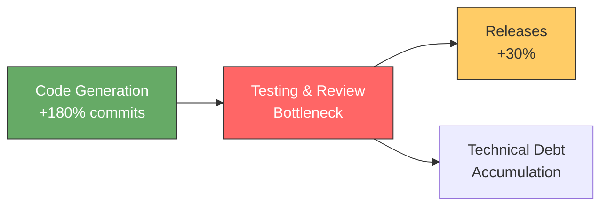
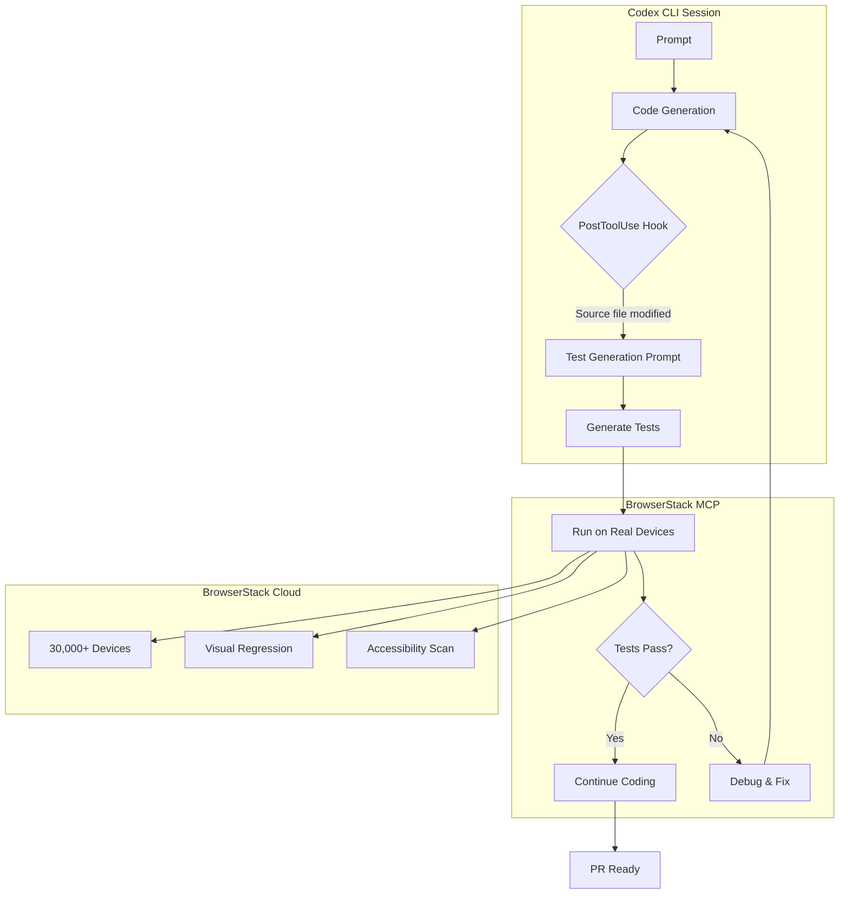

# BrowserStack Test Companion and Codex CLI: Closing the Verification Gap with Agentic Testing Pipelines


---

AI coding agents write code faster than any human team. They do not, however, ship faster — and the gap between generated code and production-ready software is almost entirely a testing problem. BrowserStack's Test Companion, launched on 29 July 2026, is the first purpose-built agentic testing tool designed to sit alongside coding agents like Codex CLI rather than compete with them [^1]. This article explores how to wire the two together into a pipeline that generates code *and* the tests to prove it works.

## The Verification Gap: 180 % More Commits, 30 % More Releases

A May 2026 NBER working paper by Demirer, Musolff, and Yang studied over 100,000 GitHub developers matched with Microsoft AI telemetry and found a stark pattern across three generations of AI coding tools [^2]:

- **Autocomplete** (Copilot-era): +40 % commits
- **Interactive agents** (chat-in-IDE): +140 % commits
- **Autonomous agents** (Codex CLI, Claude Code): +180 % commits

Yet production releases rose by only +30 %. The study measured an elasticity of substitution of 0.25, meaning code generation and code verification are strong complements — you cannot profitably scale one without scaling the other.



The practical implication is clear: if your Codex CLI workflow generates code without proportionally scaling test coverage, you are accumulating verification debt that will compound at release time.

## What Test Companion Actually Is

BrowserStack Test Companion is not another LLM wrapper that generates Playwright scripts. It is an agentic system with four distinct capabilities [^1]:

1. **Test authoring** — generates functional, visual, accessibility, and API tests from natural-language descriptions or product requirement documents
2. **Failure debugging** — analyses logs, network traces, and visual context when tests fail, then suggests root-cause fixes
3. **Test healing** — automatically updates brittle selectors and assertions when UI changes break existing tests
4. **Exploratory testing** — runs agent-driven exploration across web and mobile surfaces on BrowserStack's 30,000+ real devices

The key architectural decision is that Test Companion runs *inside the IDE* as an extension — available today for VS Code, JetBrains, Cursor, and Antigravity [^1]. It supports Playwright, Cypress, Selenium, WebdriverIO, Appium, and TestNG.

More than 1,000 teams are already using it, with BrowserStack claiming a 4× improvement in test authoring, debugging, and maintenance speed [^1].

### Why General Coding Agents Fall Short for Testing

As BrowserStack CTO Nakul Aggarwal put it: "The application changes, the test breaks, and someone has to fix it. Any AI that only writes tests solves the easy part. Test Companion owns the full cycle" [^1].

General-purpose coding agents like Codex CLI can certainly generate test code. But they lack the testing-specific infrastructure that purpose-built tools provide:

- **Real device execution** — Codex CLI's sandbox cannot run tests against iOS devices with biometric prompts or Android hardware with specific OS versions
- **Visual regression baselines** — comparing screenshots across browsers requires pixel-level infrastructure that coding agents do not carry
- **Test management state** — tracking which tests cover which requirements, which are flaky, and which need healing requires a persistent testing backend
- **Cross-browser matrix execution** — running the same test across 30,000 device/browser combinations is an infrastructure problem, not a code generation problem

## The BrowserStack MCP Server: Bridging Codex CLI to Testing Infrastructure

BrowserStack ships an open-source MCP server that connects AI agents directly to its testing platform [^3]. This is the integration point that turns Codex CLI from a code generator into part of a full verification pipeline.

### Installation and Configuration

Add the BrowserStack MCP server to your Codex CLI configuration. In your project's `.codex/config.toml`:

```toml
[[mcp_servers]]
name = "browserstack"
type = "command"
command = ["npx", "-y", "@browserstack/mcp-server"]

[mcp_servers.env]
BROWSERSTACK_USERNAME = "your_username"
BROWSERSTACK_ACCESS_KEY = "your_access_key"
```

Alternatively, for team-wide configuration, add the server definition to your `.github/mcp.json`:

```json
{
  "mcpServers": {
    "browserstack": {
      "command": "npx",
      "args": ["-y", "@browserstack/mcp-server"],
      "env": {
        "BROWSERSTACK_USERNAME": "${BROWSERSTACK_USERNAME}",
        "BROWSERSTACK_ACCESS_KEY": "${BROWSERSTACK_ACCESS_KEY}"
      }
    }
  }
}
```

Once connected, Codex CLI gains access to BrowserStack's MCP tools for test execution, debugging, and device management — all invocable through natural language within the agent session [^3].

### What the MCP Server Exposes

The BrowserStack MCP server provides tools across several categories [^3]:

- **Test execution** — run Playwright, Selenium, or Appium tests on real devices and browsers
- **Accessibility scanning** — automated WCAG/ADA compliance checks against live URLs
- **Test management** — create projects, manage test cases, track execution results
- **AI debugging** — failure analysis with suggested code fixes based on logs and visual context
- **Test generation** — create test cases from PRDs or convert manual tests to automated scripts

## Building the Pipeline: PostToolUse Hooks for Automatic Test Triggering

The most powerful integration pattern combines Codex CLI's `PostToolUse` hooks with the BrowserStack MCP server. The hook fires after every tool call, enabling you to automatically trigger test generation and execution whenever the agent modifies source code [^4].

### Hook Configuration

Create a hook script at `.codex/hooks/post-tool-test-trigger.sh`:

```bash
#!/usr/bin/env bash
# post-tool-test-trigger.sh
# Fires after write_file/edit_file to prompt test generation

set -euo pipefail

# Read the tool event from stdin
EVENT=$(cat)
TOOL_NAME=$(echo "$EVENT" | jq -r '.tool_name // empty')
FILE_PATH=$(echo "$EVENT" | jq -r '.arguments.file_path // .arguments.path // empty')

# Only trigger for source file modifications
case "$TOOL_NAME" in
  write_file|edit_file)
    # Skip test files themselves to avoid loops
    if echo "$FILE_PATH" | grep -qE '\.(test|spec)\.(ts|js|py)$'; then
      exit 0
    fi
    # Skip non-source files
    if ! echo "$FILE_PATH" | grep -qE '\.(ts|js|py|tsx|jsx)$'; then
      exit 0
    fi
    echo "Source file modified: $FILE_PATH"
    echo "Consider generating or updating tests for this change."
    ;;
esac
```

Register it in your `hooks.json`:

```json
{
  "hooks": [
    {
      "event": "PostToolUse",
      "command": [".codex/hooks/post-tool-test-trigger.sh"],
      "timeout_ms": 5000
    }
  ]
}
```

### AGENTS.md Integration

The hook alone prompts the agent; the instructions in `AGENTS.md` tell it what to do with that prompt. Add a testing section:

```markdown
## Testing Requirements

After modifying any source file in `src/`:
1. Check whether a corresponding test file exists in `__tests__/`
2. If not, use the BrowserStack MCP server to generate a test case
3. Run the test locally with `npx playwright test <test-file>`
4. If the test fails, fix the source code, not the test
5. For UI components, run an accessibility scan via BrowserStack
```

## The Combined Architecture



This architecture addresses the verification gap by making testing a continuous side-effect of code generation rather than a separate phase that happens after the coding agent finishes.

## Practical Considerations

### Cost Awareness

BrowserStack Test Companion requires a BrowserStack subscription beyond your Codex CLI costs. ⚠️ Exact pricing for Test Companion has not been publicly disclosed as of 31 July 2026. Factor this into your per-task cost calculations when using `rollout_token_budget` in `config.toml`.

The MCP server calls consume Codex CLI tokens for each tool invocation. A typical test-generation-and-execution cycle adds roughly 2,000–5,000 tokens per source file change. With GPT-5.6 Luna at \$0.20/\$1.20 per MTok [^5], the marginal cost is negligible — but it compounds across large refactoring sessions.

### Avoiding Feedback Loops

The `PostToolUse` hook must filter test files to avoid infinite loops where generating a test triggers another test generation cycle. The script above handles this with a regex filter, but more complex projects may need path-based exclusions in the hook configuration.

### Framework Selection

Test Companion supports six frameworks, but your AGENTS.md should specify exactly one to prevent the agent from mixing test styles:

```markdown
## Test Framework

All tests MUST use Playwright with TypeScript. Do not generate Cypress,
Selenium, or WebdriverIO tests. Test files go in `tests/` with the
`.spec.ts` extension.
```

### Latency Tradeoffs

`PostToolUse` hooks add latency to every tool call [^4]. For rapid prototyping sessions, consider disabling the testing hook temporarily:

```bash
CODEX_HOOKS_DISABLED=1 codex "scaffold the new dashboard component"
```

Then re-enable it for the refinement phase where verification matters.

## What This Changes

The testing bottleneck identified by the NBER study is not a tooling gap — it is an *integration* gap. Coding agents and testing agents exist independently; the missing piece is the connective tissue that makes them work as a single pipeline.

Codex CLI's MCP server support and hook system provide exactly that connective tissue. BrowserStack Test Companion provides the testing-specific intelligence that general coding agents lack. Together, they move testing from a sequential phase ("write code, then write tests, then run tests") to a concurrent activity that happens inside the same agent session.

The 180 %-to-30 % gap will not close by making coding agents faster. It will close by making verification automatic, continuous, and as effortless as the code generation that creates the need for it.

## Citations

[^1]: BrowserStack, "BrowserStack Launches Test Companion, Agentic AI That Brings Complete Test Automation Into the IDE," PR Newswire, 29 July 2026. [https://www.prnewswire.com/news-releases/browserstack-launches-test-companion-agentic-ai-that-brings-complete-test-automation-into-the-ide-302837727.html](https://www.prnewswire.com/news-releases/browserstack-launches-test-companion-agentic-ai-that-brings-complete-test-automation-into-the-ide-302837727.html)

[^2]: Demirer, M., Musolff, L., & Yang, H., "Writing Code vs. Shipping Code: The Production Hierarchy of AI-Assisted Software Development," NBER Working Paper 35275, May 2026. [https://www.nber.org/papers/w35275](https://www.nber.org/papers/w35275)

[^3]: BrowserStack, "Overview of the BrowserStack MCP server," BrowserStack Docs, 2026. [https://www.browserstack.com/docs/browserstack-mcp-server/overview](https://www.browserstack.com/docs/browserstack-mcp-server/overview)

[^4]: OpenAI, "Hooks System — openai/codex," DeepWiki, 2026. [https://deepwiki.com/openai/codex/3.11-hooks-system](https://deepwiki.com/openai/codex/3.11-hooks-system)

[^5]: OpenAI, "GPT-5.6 Price Restructuring," OpenAI Blog, 30 July 2026. [https://openai.com/index/introducing-upgrades-to-codex/](https://openai.com/index/introducing-upgrades-to-codex/)

[^6]: BrowserStack, "Meet Test Companion: AI That Helps QA Teams Keep Pace with Modern Development," BrowserStack Blog, 29 July 2026. [https://www.browserstack.com/blog/meet-test-companion-ai-that-helps-complete-test-automation-into-the-ide/](https://www.browserstack.com/blog/meet-test-companion-ai-that-helps-complete-test-automation-into-the-ide/)
