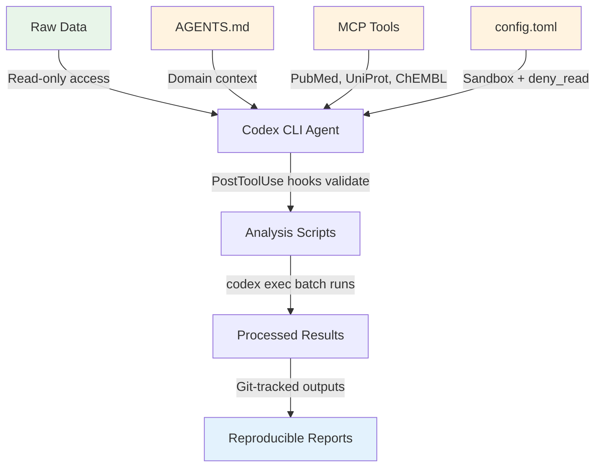

# ChatGPT for Academic Researchers: Configuring Codex CLI for Scientific Workflows, MCP Tool Chains, and Reproducible Research Automation


---

On 31 July 2026, OpenAI announced *ChatGPT for Academic Researchers*, a programme giving 100,000 scientists, mathematicians and engineers free access to GPT-5.6 Sol Pro, ChatGPT Work, and — critically for our purposes — Codex [^1]. The programme begins with 10,000 researchers at institutions including the Institute for Advanced Study and École Normale Supérieure, scaling to the full 100,000 through 2027 [^2]. Each researcher can invite up to four collaborators from the same institution, all receiving business-grade privacy protections where research data is excluded from model training by default [^1].

For working researchers, the Codex access is the most operationally significant component. This article covers what the programme delivers, how to configure Codex CLI for scientific computing workflows, and which MCP tool chains turn a terminal-based coding agent into a credible research automation layer.

## What Researchers Actually Get

The programme bundles three surfaces: ChatGPT (conversational), ChatGPT Work (task automation), and Codex (agentic coding) [^2]. The Codex component provides access to GPT-5.6 Sol Pro — the same model tier available on Pro subscriptions — with higher usage limits and larger context windows than standard plans [^1].

Researchers also receive expanded Deep Research capabilities, enabling the model to collect information from hundreds of websites or focus on specific sources such as scientific journals [^3]. Over 75 life-sciences research skills ship out of the box, covering genetics, genomics, protein modelling, and drug discovery, alongside connectors to scientific literature databases, public genomic databases, satellite imagery, and computational notebooks [^1].

The open-source Codex CLI harness is the same tool available to any developer, but the programme's elevated usage limits make long-running research sessions — protein folding analysis, genomic variant calling pipelines, multi-dataset statistical analyses — practically viable without hitting the standard five-hour rolling cap [^3].

## Initial Codex CLI Configuration for Research

Researchers joining the programme authenticate via ChatGPT sign-in rather than a separate API key. Once authenticated, the baseline configuration lives in `~/.codex/config.toml`:

```toml
# ~/.codex/config.toml — research-optimised baseline
model = "gpt-5.6-sol"
approval_policy = "unless-allow-listed"

[history]
persistence = "true"
save_history = true

[sandbox]
sandbox_mode = "workspace-write"
writable_roots = [
  "~/research/current-project",
  "~/data/processed"
]
```

The `workspace-write` sandbox prevents accidental writes outside designated directories — essential when analysis scripts sit alongside irreplaceable raw data. Adding `writable_roots` entries opens specific data directories without granting the agent blanket filesystem access.

For computationally intensive work, set the model to `gpt-5.6-sol` explicitly rather than relying on auto-routing. Sol's extended reasoning handles multi-step statistical derivations and complex code generation that Luna or Terra may truncate [^4].

## Connecting Scientific Tool Chains via MCP

The Model Context Protocol (MCP) transforms Codex CLI from a code generator into a research instrument by connecting it to domain-specific tools. The ToolUniverse MCP server provides access to over 600 scientific tools spanning ChEMBL, UniProt, PubMed, EuropePMC, ClinicalTrials.gov, and FDA databases [^5].

### Installing ToolUniverse

```bash
# Create a dedicated environment
mkdir -p ~/tooluniverse-env && cd ~/tooluniverse-env
uv init && uv add tooluniverse-smcp
```

### Configuring the MCP Server

Add the server definition to `~/.codex/config.toml`:

```toml
[mcp_servers.tooluniverse]
command = "uv"
args = [
  "--directory",
  "~/tooluniverse-env",
  "run",
  "tooluniverse-smcp-stdio"
]
```

For targeted research, filter the tool set to conserve context window budget:

```toml
[mcp_servers.tooluniverse]
command = "uv"
args = [
  "--directory",
  "~/tooluniverse-env",
  "run",
  "tooluniverse-smcp-stdio",
  "--include-tools",
  "PubMedSearch,UniProtFetch,ChEMBLQuery",
  "--hook-type",
  "SummarizationHook"
]
```

The `--include-tools` flag loads only the tools relevant to the current investigation, and the `SummarizationHook` automatically condenses lengthy API responses to preserve context for the agent's reasoning [^5].

Verify the connection from inside a Codex CLI session:

```bash
codex
# then type: /mcp
```

The `/mcp` command lists all registered servers and their available tools. If ToolUniverse does not appear, run `codex doctor --json` to diagnose path or authentication issues.

## Writing AGENTS.md for Research Repositories

An `AGENTS.md` file at the repository root tells Codex how to work within your research context. For scientific projects, this file bridges the gap between a general-purpose coding agent and a domain-aware research assistant.

```markdown
# AGENTS.md — Computational Biology Research

## Project Context
This repository contains analysis pipelines for single-cell RNA
sequencing data from patient tumour biopsies. All analyses must be
reproducible from raw FASTQ files through to publication figures.

## Tools and Environment
- Python 3.12 with dependencies managed via `uv`
- R 4.4 for Seurat-based clustering (call via `Rscript`)
- Use ToolUniverse MCP tools for literature and database queries
- Statistical tests require scipy or statsmodels, not manual formulae

## Validation Rules
- Every generated script must include a `if __name__ == "__main__"`
  block with example invocation
- All plots must be saved as both PNG (300 DPI) and SVG
- Statistical claims require p-values and confidence intervals
- Cross-validate results across at least two independent methods
  before reporting

## Data Governance
- Raw patient data lives in /data/raw/ — NEVER modify these files
- Processed outputs go to /data/processed/
- No patient identifiers in filenames or log output
- All intermediate files must be reproducible from raw data
```

The `## Data Governance` section is particularly important for research environments where regulatory compliance (GDPR, HIPAA for clinical data) constrains what an agent may read or write. Codex CLI's `deny_read` configuration provides an enforcement backstop:

```toml
[sandbox]
deny_read = ["/data/raw/patient_identifiers/"]
```

## Research Workflow Patterns

### Pattern 1: Literature-to-Hypothesis Pipeline

Combine Deep Research and Codex CLI for structured literature review:

```bash
codex --prompt "Search PubMed for papers on CRISPR base editing
  efficiency in primary T cells published 2025-2026. Summarise the
  top 10 by citation count into a markdown table with columns:
  Title, Authors, Year, Key Finding, Reported Efficiency.
  Save to reviews/crispr-base-editing-review.md"
```

The agent uses the ToolUniverse PubMed connector to query the database, retrieves abstracts, and produces a structured review. This replaces hours of manual searching whilst producing a version-controlled, diffable output.

### Pattern 2: Reproducible Analysis with PostToolUse Validation

Configure hooks to validate every script the agent writes:

```toml
[[hooks.post_tool_use]]
event = "post_tool_use"
tool_name = "write"
command = """
if echo "$CODEX_TOOL_ARGS" | grep -q '\.py"'; then
  FILE=$(echo "$CODEX_TOOL_ARGS" | jq -r '.file_path')
  python -m py_compile "$FILE" 2>&1
fi
"""
```

This hook syntax-checks every Python file Codex writes before the agent proceeds. For research code, extend this pattern with linting and type checking:

```toml
[[hooks.post_tool_use]]
event = "post_tool_use"
tool_name = "write"
command = """
if echo "$CODEX_TOOL_ARGS" | grep -q '\.py"'; then
  FILE=$(echo "$CODEX_TOOL_ARGS" | jq -r '.file_path')
  ruff check "$FILE" 2>&1 && mypy "$FILE" --ignore-missing-imports 2>&1
fi
"""
```

### Pattern 3: Batch Analysis with codex exec

For processing multiple datasets through the same pipeline, `codex exec` runs non-interactively — suitable for cron jobs, CI pipelines, or batch processing:

```bash
for SAMPLE in data/raw/sample_*.fastq.gz; do
  codex exec --prompt "Run the standard QC pipeline on $SAMPLE.
    Generate a FastQC report, trim adapters with fastp,
    and save the quality summary to reports/$(basename $SAMPLE .fastq.gz)_qc.md" \
    --json 2>&1 | tee "logs/$(basename $SAMPLE .fastq.gz).jsonl"
done
```

The `--json` flag produces JSONL output for programmatic parsing, and the log files create an auditable record of every agent action — critical for research reproducibility [^6].

## Research-Specific Configuration Profiles

Named profiles allow researchers to switch between different computational contexts without editing `config.toml`:

```toml
[profiles.genomics]
model = "gpt-5.6-sol"
sandbox_mode = "workspace-write"
writable_roots = ["~/research/genomics", "~/data/genomics"]

[profiles.statistics]
model = "gpt-5.6-terra"
sandbox_mode = "workspace-write"
writable_roots = ["~/research/stats"]

[profiles.literature]
model = "gpt-5.6-luna"
sandbox_mode = "read-only"
```

```bash
# Heavy genomics pipeline — use Sol for complex reasoning
codex --profile genomics

# Statistical modelling — Terra balances cost and capability
codex --profile statistics

# Literature review — Luna is sufficient and conserves quota
codex --profile literature
```

This tiered approach is particularly important under the programme's usage limits. Luna at \$0.20/\$1.20 per million tokens handles literature queries and data formatting at a fraction of Sol's cost, preserving the elevated quota for computationally demanding tasks [^4].

## The Reproducibility Architecture



The architecture separates concerns: raw data remains read-only and outside the agent's write scope, validation hooks catch errors before they propagate, and every action is logged to JSONL for audit. Git tracks both the analysis code and the generated reports, making the entire pipeline reproducible by any collaborator.

## Privacy and Data Governance

The programme's business-grade privacy protections mean research data is not used for model training by default [^1]. For institutions handling sensitive data, layer additional controls:

1. **`deny_read` for sensitive directories** — prevents the agent from reading files containing patient identifiers or unpublished results
2. **`shell_environment_policy`** — excludes credentials and tokens from the agent's environment variables
3. **Network allowlisting** — restrict outbound connections to approved scientific databases and institutional endpoints
4. **`requirements.toml`** — if your institution deploys managed configuration, enforce sandbox and model constraints centrally

These controls compose with the programme's default privacy guarantees to create a defence-in-depth posture suitable for regulated research environments.

## What This Means for Research Computing

The ChatGPT for Academic Researchers programme is OpenAI's most direct bid to embed frontier models into the scientific method. The \$250 million commitment through 2027 signals sustained investment rather than a promotional gesture [^1]. For researchers, the practical question is whether Codex CLI can replace or augment existing computational notebooks and batch processing pipelines.

The answer depends on configuration. An unconfigured Codex CLI session is a conversational code generator. A properly configured instance — with domain-specific AGENTS.md, MCP-connected scientific databases, PostToolUse validation hooks, and sandbox-enforced data governance — becomes a research automation layer that produces reproducible, version-controlled, auditable outputs.

The 75+ life-sciences skills and database connectors shipping with the programme lower the barrier to entry. Researchers who invest an afternoon in configuration will find that Codex CLI handles the mechanical parts of computational research — data wrangling, pipeline construction, visualisation, literature searching — whilst they focus on the parts that require domain expertise: experimental design, result interpretation, and the intellectual work that no model can yet replicate.

## Citations

[^1]: OpenAI, "Accelerating scientific discovery with ChatGPT for Academic Researchers," openai.com, July 2026. [https://openai.com/index/chatgpt-for-academic-researchers/](https://openai.com/index/chatgpt-for-academic-researchers/)

[^2]: SiliconANGLE, "OpenAI opens new ChatGPT for Academic Researchers program to 100,000 scientists," siliconangle.com, July 29, 2026. [https://siliconangle.com/2026/07/29/openai-opens-new-chatgpt-academic-researchers-program-100000-scientists/](https://siliconangle.com/2026/07/29/openai-opens-new-chatgpt-academic-researchers-program-100000-scientists/)

[^3]: EdTech Innovation Hub, "OpenAI opens free GPT-5.6 and Codex program for 100,000 researchers," edtechinnovationhub.com, July 2026. [https://www.edtechinnovationhub.com/news/openai-opens-free-gpt-56-and-codex-program-for-100000-researchers](https://www.edtechinnovationhub.com/news/openai-opens-free-gpt-56-and-codex-program-for-100000-researchers)

[^4]: Quartz, "OpenAI surpasses 1 billion users after cutting GPT-5.6 prices," qz.com, July 31, 2026. [https://qz.com/openai-billion-users-gpt-price-cuts-073126](https://qz.com/openai-billion-users-gpt-price-cuts-073126)

[^5]: Zitnik Lab, Harvard Medical School, "GPT Codex CLI — ToolUniverse Documentation," zitniklab.hms.harvard.edu, 2026. [https://zitniklab.hms.harvard.edu/bioagent/guide/building_ai_scientists/codex_cli.html](https://zitniklab.hms.harvard.edu/bioagent/guide/building_ai_scientists/codex_cli.html)

[^6]: The Next Web, "OpenAI gives 100,000 scientists free AI, and shows how," thenextweb.com, July 2026. [https://thenextweb.com/news/openai-chatgpt-academic-researchers-agent-harness-token-costs](https://thenextweb.com/news/openai-chatgpt-academic-researchers-agent-harness-token-costs)
