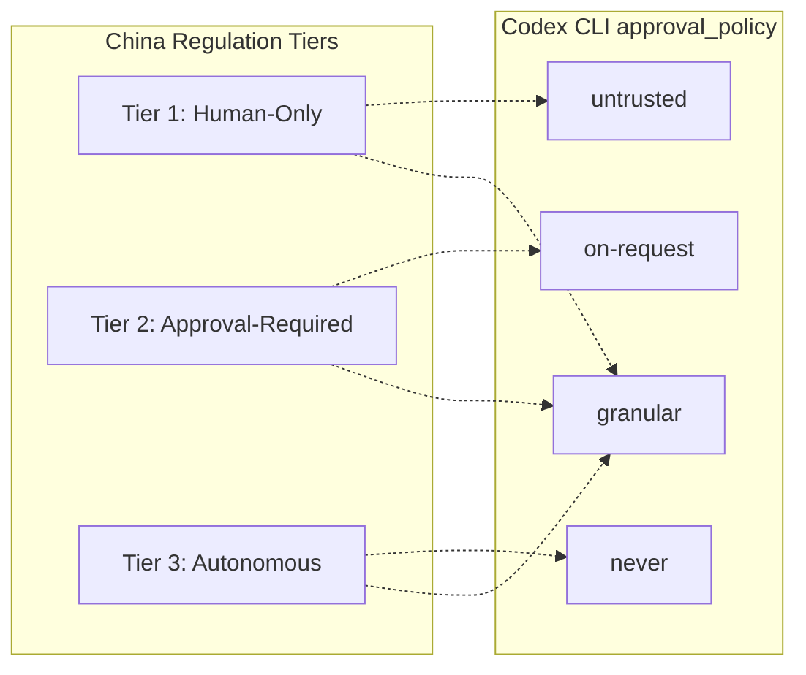

# China's Three-Tier AI Agent Regulation and Codex CLI: Mapping the Implementation Opinions to approval_policy, Sandbox Modes, and Audit Hooks


---

On 15 July 2026, China's *Implementation Opinions on the Standardised Application and Innovative Development of Intelligent Agents* — jointly issued by the CAC, NDRC, and MIIT — became the world's first binding regulatory framework built specifically for AI agents[^1]. The framework defines AI agents as systems capable of "autonomous perception, memory, decision-making, interaction, and execution," then imposes a three-tier decision-authority model, mandatory audit trails, and human-override guarantees[^2].

For enterprise teams deploying Codex CLI against codebases that serve Chinese markets, this is not a distant policy concern. The regulation's three tiers map directly onto Codex CLI's existing `approval_policy` and `sandbox_mode` architecture — and the audit requirements land squarely on the hooks system. This article walks through the mapping.

## The Three Tiers

The regulation requires every deploying organisation to classify agent decisions into three tiers *before deployment begins*[^2][^3]:

| Tier | Label | Description | Examples |
|------|-------|-------------|----------|
| 1 | **Human-Only** | Irreversible or rights-affecting decisions must remain under direct human control | Financial transfers, contract signing, production deployments |
| 2 | **Approval-Required** | Agent may propose but needs explicit user authorisation before execution | File mutations outside workspace, network access, database writes |
| 3 | **Autonomous** | Within delegated boundaries, the agent acts independently — but users retain override rights and must receive notifications | Read operations, linting, formatting, test execution |

The regulation further mandates that "three things must be left behind for every decision": the **outcome** (what action occurred), the **rationale** (data and documents consulted), and **accountability** (who approved and when)[^2]. Article 7 specifies a "verifiable, traceable mechanism" for preventing improper conduct[^3].

## How Codex CLI's Approval Architecture Already Fits

Codex CLI's two-axis security model — `approval_policy` on one axis, `sandbox_mode` on the other — was designed for developer productivity, not regulatory compliance. But the structural overlap is striking[^4].

### approval_policy → Tier Mapping



- **`untrusted`** corresponds to Tier 1. Every mutating action requires explicit human approval. Known-safe read operations run automatically, but anything that changes state — file writes, shell commands, network calls — triggers an approval prompt[^4].

- **`on-request`** corresponds to Tier 2. The agent operates within its sandbox boundary autonomously but escalates when it needs to cross that boundary: editing files outside the workspace, accessing the network, or running privileged commands[^4].

- **`never`** corresponds to Tier 3. No approval prompts fire; the sandbox is the sole guardrail. This suits CI pipelines and batch processing where a human is not present[^4].

- **`granular`** spans all three tiers. Since v0.122, granular policies let you keep specific categories interactive — sandbox escalations, MCP elicitations, skill scripts — while auto-approving others[^5]. This is the mechanism that lets you express the regulation's per-decision classification in a single `config.toml`.

### sandbox_mode as Defence in Depth

The sandbox constrains *what* the agent can touch, regardless of approval policy[^4]:

| sandbox_mode | Effect | Regulatory Role |
|-------------|--------|-----------------|
| `read-only` | No file writes, no network | Enforces Tier 1 boundary for read-only analysis tasks |
| `workspace-write` | Writes limited to project directory | Default for Tier 2 — agent proposes changes within a scoped boundary |
| `danger-full-access` | Unrestricted filesystem and network | Only appropriate with `untrusted` or `granular` approval for Tier 1 oversight |

## A Compliance-Oriented config.toml

The regulation's requirement to document tier assignments *before deployment* maps to named profiles in `config.toml`. Here is a profile structure that encodes all three tiers:

```toml
# ~/.codex/config.toml — China AI Agent Regulation compliance profiles

[profiles.tier1-human-only]
model = "gpt-5.6-sol"
approval_policy = "untrusted"
sandbox_mode = "read-only"
service_tier = "default"

[profiles.tier2-approval-required]
model = "gpt-5.6-terra"
approval_policy = "on-request"
sandbox_mode = "workspace-write"
service_tier = "default"

[profiles.tier3-autonomous]
model = "gpt-5.6-luna"
approval_policy = "never"
sandbox_mode = "workspace-write"
service_tier = "default"

[profiles.tier2-granular]
model = "gpt-5.6-terra"
sandbox_mode = "workspace-write"

[profiles.tier2-granular.approval_policy]
# Sandbox escalations require approval (Tier 2)
sandbox_escalation = "on-request"
# MCP tool calls require approval (Tier 2)
mcp_elicitation = "on-request"
# File edits within workspace are autonomous (Tier 3)
file_edit = "never"
# Shell commands require approval (Tier 2)
shell_command = "on-request"
```

Launch with the appropriate profile:

```bash
# Interactive code review — human approves every action
codex --profile tier1-human-only "Review the authentication module"

# Standard development — agent works within sandbox, escalates at boundary
codex --profile tier2-approval-required "Refactor the payment service"

# CI pipeline — autonomous within sandbox
codex --profile tier3-autonomous "Run the test suite and report failures"
```

## Meeting the Audit Trail Requirement with Hooks

The regulation's "three things left behind for every decision" — outcome, rationale, accountability — requires structured logging that goes beyond Codex CLI's default session history[^2]. The hooks system fills this gap.

### PostToolUse Audit Hook

A `PostToolUse` hook fires after every tool execution and receives the full result on stdin, including stdout, stderr, and exit code[^6]. While PostToolUse is observe-only (no output rewriting), it is the correct point to capture the regulatory audit record:

```json
{
  "hooks": [
    {
      "event": "PostToolUse",
      "matcher": { "tool_name": "*" },
      "handler": {
        "command": "python3 /opt/audit/log_decision.py",
        "timeout_ms": 5000
      }
    }
  ]
}
```

The handler script receives JSON on stdin containing the tool name, arguments, and result. A minimal compliant implementation writes JSONL records:

```python
#!/usr/bin/env python3
"""Audit logger for China AI Agent Regulation compliance."""
import json, sys, datetime, os

record = json.load(sys.stdin)
audit_entry = {
    "timestamp": datetime.datetime.utcnow().isoformat(),
    "outcome": {
        "tool": record.get("tool_name"),
        "exit_code": record.get("result", {}).get("exit_code"),
        "stdout_snippet": record.get("result", {}).get("stdout", "")[:500]
    },
    "rationale": {
        "arguments": record.get("arguments"),
        "session_id": os.environ.get("CODEX_SESSION_ID", "unknown")
    },
    "accountability": {
        "user": os.environ.get("USER", "unknown"),
        "approval_policy": os.environ.get("CODEX_APPROVAL_POLICY", "unknown"),
        "profile": os.environ.get("CODEX_PROFILE", "default")
    }
}

with open("/var/log/codex-audit/decisions.jsonl", "a") as f:
    f.write(json.dumps(audit_entry) + "\n")
```

### PreToolUse Gate for Tier 1 Operations

For Tier 1 (human-only) decisions that must *never* proceed without human approval — even if a profile misconfiguration allows it — a `PreToolUse` hook provides a hard block[^6]:

```json
{
  "event": "PreToolUse",
  "matcher": { "tool_name": "shell" },
  "handler": {
    "command": "python3 /opt/audit/tier1_gate.py",
    "timeout_ms": 3000
  }
}
```

The gate script inspects the command for Tier 1 patterns (database mutations, deployment triggers, financial API calls) and returns `{"decision": "block", "reason": "Tier 1: requires human-only decision"}` when matched.

## Sector-Specific Filing Requirements

The regulation imposes heavier obligations on "high-risk sectors" — finance, healthcare, judiciary, public security, energy, and transport — including mandatory filing with regulators, third-party evaluations, and product-recall readiness[^3]. For teams in these sectors, Codex CLI configuration alone is insufficient. You need:

1. **AGENTS.md documentation** of which operations are classified at which tier, serving as the pre-deployment authorisation policy the regulation demands.
2. **Immutable audit storage** — the JSONL approach above should write to append-only storage (S3 with Object Lock, or a blockchain-backed ledger as Article 7 suggests)[^3].
3. **Session export** for regulatory review. Codex CLI's `codex doctor --json` output and session history provide the technical evidence, but the regulation requires *business-level* decision records[^4][^2].

For lower-risk sectors (office tools, entertainment), self-assessment and compliance reporting suffice. The `config.toml` profiles plus audit hooks described above should meet that threshold[^3].

## The Override Guarantee

The regulation guarantees users "the right to know and the final decision-making power regarding autonomous decisions made by the intelligent agent"[^1]. Codex CLI satisfies this architecturally:

- **`on-request` and `untrusted`** policies require the user to press Enter before any escalating action proceeds.
- **`/stop`** halts execution at any point during a session.
- **`/undo`** reverts the last file change.
- **Goal mode** with `--max-tokens` budget caps the agent's total autonomous run length, and `/goal pause` suspends without losing state[^4].

The gap is *notification of autonomous decisions*. When running in `never` approval mode (Tier 3), Codex CLI does not push notifications to an external channel. Teams needing regulatory compliance should supplement with a PostToolUse hook that sends significant actions to a Slack channel or monitoring dashboard.

## Liability and the "Look at Control, Not Code" Principle

The regulation's liability framework holds the *deploying organisation* responsible — not the model provider and not the developer of the tooling[^2]. Compliance hinges on demonstrating "actual operational control through documented behaviour records."

This means your `config.toml` profiles, AGENTS.md tier classifications, and audit JSONL files collectively *are* your compliance evidence. Version-controlling all three in the repository — alongside the code they govern — creates a defensible record.

```bash
# Commit compliance configuration alongside code
git add .codex/config.toml AGENTS.md
git commit -m "compliance: update AI agent tier classifications per CAC Implementation Opinions"
```

## What This Means for Non-Chinese Teams

Even if your team does not operate in China, the regulation matters for two reasons. First, it establishes precedent: the EU AI Act's high-risk provisions and Illinois's third-party safety audit mandate (also effective July 2026) follow similar patterns[^3]. Second, 62% of enterprises surveyed identify data rights and compliance as their primary AI agent deployment obstacle[^2] — the tooling you build now for one jurisdiction transfers.

Codex CLI's approval_policy/sandbox_mode/hooks architecture was built for developer safety, but it happens to satisfy the structural requirements of the world's first AI agent regulation. The gap is documentation and audit persistence, not architecture.

## Citations

[^1]: Cyberspace Administration of China, NDRC, MIIT, "Implementation Opinions on the Standardised Application and Innovative Development of Intelligent Agents," effective 15 July 2026. Analysis: [Geopolitechs](https://www.geopolitechs.org/p/chinas-first-policy-framework-for)

[^2]: Pebblous, "China's AI Agent Rules: Three Tiers of Decision Authority," July 2026. [https://blog.pebblous.ai/blog/china-ai-agent-decision-tiers/en/](https://blog.pebblous.ai/blog/china-ai-agent-decision-tiers/en/)

[^3]: AI Governance Institute, "China's Agent Rules Take Effect July 15 and Illinois Mandates Third-Party Safety Audits," July 2026. [https://aigovernance.com/news/chinas-agent-rules-take-effect-july-15-and-illinois-mandates-third-party-safety-audits](https://aigovernance.com/news/chinas-agent-rules-take-effect-july-15-and-illinois-mandates-third-party-safety-audits)

[^4]: OpenAI, "Sandbox & Approvals — Codex CLI Documentation," 2026. [https://developers.openai.com/codex/cli](https://developers.openai.com/codex/cli)

[^5]: OpenAI, "Codex CLI Granular Approval Policies," v0.122+, 2026. [https://developers.openai.com/codex/changelog](https://developers.openai.com/codex/changelog)

[^6]: OpenAI, "Codex CLI Hooks — PreToolUse & PostToolUse Events," 2026. [https://developers.openai.com/codex/cli](https://developers.openai.com/codex/cli)
