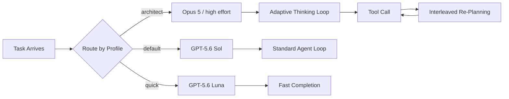

# Claude Opus 5 Lands: Configuring Codex CLI as a Multi-Model Routing Layer with Anthropic's New Frontier


---

Anthropic shipped Claude Opus 5 on 24 July 2026, and the benchmarks are hard to ignore: 43.3% on Frontier-Bench v0.1 (agentic coding), 96.0% on SWE-bench Verified, and 30.2% on ARC-AGI-3 — roughly four times GPT-5.6 Sol's 7.8% on the same novel-reasoning suite [^1][^2]. At \$5/\$25 per million input/output tokens — unchanged from Opus 4.8 — the model slots into a pricing tier that undercuts Sol on output (\$25 vs \$30 per MTok) whilst carrying a 1M-token context window and up to 128K synchronous output tokens [^3].

None of that matters, though, unless you can actually route Codex CLI tasks to it. This article walks through the provider configuration, named-profile model routing, and the practical considerations of running an Anthropic model inside OpenAI's harness.

## Why Opus 5 Matters for Codex CLI Users

The headline numbers tell one story; the architectural differences tell another. Three features set Opus 5 apart from what GPT-5.6 Sol offers natively inside Codex:

**Adaptive thinking.** Opus 5 replaces the binary extended-thinking toggle with a five-level effort parameter. The model dynamically allocates reasoning depth per sub-problem — spending compute on hard planning steps and skimming trivial ones — with interleaved thinking between tool calls [^1]. For long agentic runs, this means the model can reason *during* the tool loop rather than front-loading all deliberation into a single thinking block.

**Frontier-Bench lead.** On Anthropic's multi-step agentic coding evaluation, Opus 5 leads GPT-5.6 Sol by 8.9 percentage points (43.3% vs 34.4%) — a 26% relative advantage on exactly the workload Codex CLI orchestrates: plan, edit, run, fix [^2].

**Cost-per-task arithmetic.** With cache reads at \$0.50 per MTok and output at \$25 per MTok, Opus 5 is roughly 1.1× cheaper per token on a blended 3:1 input/output basis compared to Sol [^4]. Over a fleet of agents, that delta compounds.

The counterpoint is equally clear: GPT-5.6 Sol leads TerminalBench 2.1 at 91.9% (Ultra) and has native integration — no gateway required, no wire-protocol translation, no catalogue-refresh workarounds [^5]. The pragmatic answer is not to choose one model but to route both through named profiles.

## Provider Configuration via OpenRouter

Codex CLI dropped `wire_api = "chat"` support in v0.59 (February 2026); all providers must now speak the Responses API [^6]. Since Anthropic's own API does not implement the Responses wire format, you need a translating gateway. OpenRouter exposes a Responses-compatible surface that wraps Anthropic's native endpoint.

```toml
# ~/.codex/config.toml

model = "anthropic/claude-opus-5"
model_provider = "openrouter"
model_reasoning_effort = "high"

[model_providers.openrouter]
name = "openrouter"
base_url = "https://openrouter.ai/api/v1"

[model_providers.openrouter.auth]
command = "sh"
args = ["-c", "echo $OPENROUTER_KEY"]
```

Two things to note. First, the `auth.command` pattern (rather than a bare `env_key`) triggers Codex's model-catalogue refresh, which ensures non-OpenAI models receive correct token-limit metadata [^6]. Second, `model_reasoning_effort = "high"` maps to Opus 5's effort parameter — the adaptive thinking system uses this to calibrate how much internal deliberation to spend.

On Windows, substitute PowerShell:

```toml
[model_providers.openrouter.auth]
command = "powershell"
args = ["-NoProfile", "-Command", "Write-Output $env:OPENROUTER_KEY"]
```

Verify the provider is live:

```bash
codex --model anthropic/claude-opus-5 "return the string HELLO"
```

If you see a 404 or "unknown endpoint" error, confirm your OpenRouter plan supports Responses API passthrough — some legacy tiers do not.

## Named Profiles for Model Routing

The real power of multi-model Codex is not picking a single default but routing tasks by cognitive profile. Define named profiles in `config.toml`:

```toml
# Default: GPT-5.6 Sol for shell-heavy, terminal-oriented tasks
model = "gpt-5.6"

[profile.architect]
model = "anthropic/claude-opus-5"
model_provider = "openrouter"
model_reasoning_effort = "high"

[profile.review]
model = "anthropic/claude-opus-5"
model_provider = "openrouter"
model_reasoning_effort = "medium"

[profile.quick]
model = "gpt-5.6-luna"
```

Then invoke by profile:

```bash
# Deep architectural reasoning — Opus 5 with high effort
codex --profile architect "redesign the auth module to support OIDC federation"

# Code review — Opus 5 with medium effort (cheaper, still thorough)
codex --profile review "review the changes in this PR for security issues"

# Quick scripting — Luna for speed and cost
codex --profile quick "write a bash script to rotate log files older than 7 days"
```

This pattern lets you exploit each model's strengths: Sol's TerminalBench dominance for shell-heavy automation, Opus 5's Frontier-Bench lead for multi-step architectural work, and Luna's \$0.20/\$1.20 pricing for commodity tasks [^5][^4].

## Sub-Agent Model Overrides

With multi-agent V2 stabilised in v0.145.0 [^6], you can route sub-agent spawns to a different model than the orchestrator:

```toml
[profile.hybrid]
model = "anthropic/claude-opus-5"
model_provider = "openrouter"

[profile.hybrid.subagent]
model = "gpt-5.6-terra"
model_provider = "openai"
```

This puts Opus 5 in the planning seat — where its adaptive thinking and Frontier-Bench advantage pay off — whilst sub-agents execute file edits and shell commands through GPT-5.6 Terra at \$2/\$12 per MTok. The orchestrator reasons; the workers execute.

## The Adaptive Thinking Model

Opus 5's effort parameter deserves specific attention because it changes how you should configure `model_reasoning_effort`:

| Effort Level | Behaviour | Use Case |
|---|---|---|
| `low` | Most efficient, significant token savings | Trivial edits, renames, subagents |
| `medium` | Balanced approach, moderate token savings | Simple refactors, cost-sensitive agentic work |
| `high` | Default level, high capability | Code review, complex reasoning, bug triage |
| `xhigh` | Extended capability for long-horizon work | Long-running agentic and coding tasks (30+ min) |
| `max` | Absolute maximum, no token constraints | Novel algorithm design, deepest reasoning |

Unlike GPT-5.6's reasoning effort, which gates a separate reasoning phase, Opus 5's adaptive system interleaves thinking *between* tool calls [^1]. This means the model can reassess its plan after seeing each tool result — effectively thinking while acting rather than thinking then acting.

The practical implication: at `high` effort, Opus 5 may issue fewer but more precise tool calls than Sol, because it re-plans after each step. At `low` effort, it behaves more like a fast completion model. Monitor your OpenTelemetry traces to find the effort sweet spot for your workloads.



## Benchmark-Driven Routing Decisions

The benchmark landscape as of late July 2026 suggests a clear routing heuristic:

| Benchmark | Opus 5 | GPT-5.6 Sol | Winner |
|---|---|---|---|
| SWE-bench Verified | 96.0% | — | Opus 5 |
| SWE-bench Pro | 79.2% | — | Opus 5 |
| Frontier-Bench v0.1 | 43.3% | 34.4% | Opus 5 (+26% relative) |
| ARC-AGI-3 | 30.2% | 7.8% | Opus 5 (3.9×) |
| TerminalBench 2.1 | — | 91.9% (Ultra) | Sol |
| Context window | 1M | 1.05M | Sol (marginally) |
| Output | \$25/MTok | \$30/MTok | Opus 5 |

The pattern: **Opus 5 for reasoning-heavy, multi-file agentic work; Sol for terminal-native, shell-command-heavy automation** [^2][^5]. If your Codex CLI usage is predominantly `codex exec` in CI pipelines running shell scripts, Sol remains the stronger native choice. If you are using Codex for architectural refactors, complex feature implementation, or long autonomous runs, the Frontier-Bench gap justifies the gateway overhead.

## Caveats and Operational Considerations

**Gateway latency.** Routing through OpenRouter adds a hop. For interactive sessions, the added latency (typically 50–150ms per request) is negligible; for high-throughput CI pipelines running hundreds of `codex exec` invocations, it accumulates. Profile your P99 latencies before committing a fleet.

**Wire-protocol fidelity.** OpenRouter translates between the Responses API and Anthropic's native format. Edge cases in tool-call streaming, partial JSON responses, or unusual content types may behave differently than native OpenAI models. Test your critical workflows before switching production profiles.

**Skill and plugin compatibility.** Codex CLI skills and plugins assume tool-call semantics that map cleanly to the Responses API. Most translate correctly through OpenRouter, but executor-provided skills (new in v0.146.0) that rely on model-specific metadata may need testing [^6].

**Cost monitoring.** Use OpenTelemetry with `OTEL_RESOURCE_ATTRIBUTES` to segment costs by model and profile. Without per-model cost attribution, multi-provider routing becomes a budgeting blind spot.

⚠️ Opus 5's TerminalBench scores were not prominently published in Anthropic's launch materials. The comparison table above leaves these cells blank because independently verified figures were not available at time of writing.

## Quick-Start Checklist

1. **Set your OpenRouter key:** `export OPENROUTER_KEY="sk-or-..."`
2. **Add the provider block** to `~/.codex/config.toml` (see configuration above)
3. **Create named profiles** for architect/review/quick routing
4. **Test with a simple prompt:** `codex --profile architect "explain the auth flow in this repo"`
5. **Monitor costs** via OpenTelemetry or OpenRouter's usage dashboard
6. **Tune `model_reasoning_effort`** per profile based on task complexity

## Citations

[^1]: Anthropic, "Introducing Claude Opus 5", anthropic.com/news/claude-opus-5, 24 July 2026.
[^2]: Codersera, "Claude Opus 5 vs GPT-5.6 Sol: Coding & Reasoning Head-to-Head (2026)", codersera.com/blog/claude-opus-5-vs-gpt-5-6-2026/, July 2026.
[^3]: Claude Platform Docs, "What's new in Claude Opus 5", platform.claude.com/docs/en/about-claude/models/whats-new-opus-5, July 2026.
[^4]: CodingFleet, "Claude Opus 5 vs GPT-5.6 Sol: Full Benchmark Comparison (July 2026)", codingfleet.com/blog/claude-opus-5-vs-gpt-5-6-sol/, July 2026.
[^5]: Artificial Analysis, "GPT-5.6 benchmarks across Intelligence, Speed and Cost", artificialanalysis.ai/articles/gpt-5-6-has-landed, July 2026.
[^6]: OpenRouter, "Codex CLI Integration", openrouter.ai/docs/cookbook/coding-agents/codex-cli, 2026.
