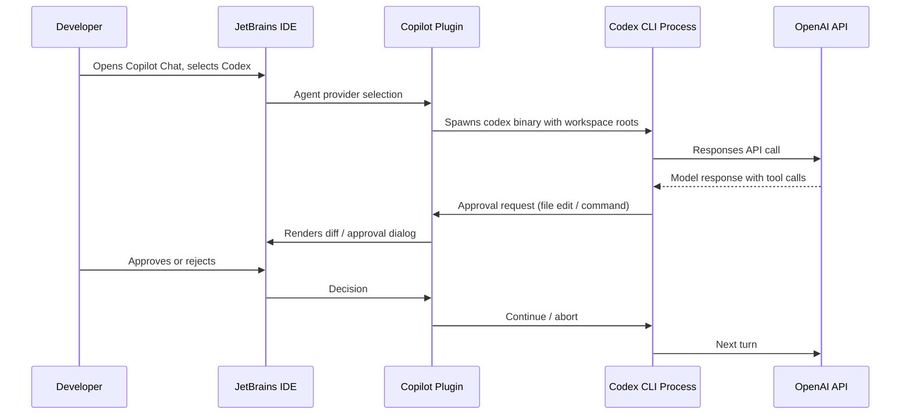

# Codex as Agent Provider in JetBrains IDEs: Configuration, Permission Modes, Hooks, and MCP Server Management


---

Since January 2026, JetBrains users have been able to interact with Codex through a basic AI Assistant integration[^1]. On 7 July 2026, GitHub shipped a materially different capability: Codex is now available as a full **agent provider** inside the Copilot Chat panel for JetBrains IDEs, in public preview[^2]. This is not the same feature. The agent-provider model lets Codex run autonomous, multi-step sessions — file edits, terminal commands, tool calls — directly inside IntelliJ IDEA, PyCharm, and WebStorm, with the same approval-policy and sandbox architecture that the CLI uses on the command line.

This article covers the architecture, setup, permission model, hooks, MCP server integration, and the `config.toml` caveats you need to know before deploying Codex as your primary agent inside a JetBrains IDE.

## Architecture: How the Agent-Provider Model Works

The key distinction from the earlier AI Assistant integration is that Codex now runs as a **Copilot CLI agent process** — the same Rust binary you install with `npm i -g @openai/codex` — spawned by the JetBrains Copilot plugin. The IDE acts as a thin host: it passes workspace roots, collects approval decisions, and renders diffs. The actual agent loop, tool calls, and model interactions happen inside the Codex process.



This means your `~/.codex/config.toml`, `AGENTS.md` files, and any `.codex/config.toml` project-level overrides are all respected — the JetBrains integration reads the same configuration hierarchy as the terminal CLI[^3].

## Setup

### Prerequisites

1. **Codex CLI** installed globally: `npm i -g @openai/codex` (v0.144.5 or later recommended)[^4]
2. **GitHub Copilot plugin** for JetBrains, updated to the July 2026 release or later
3. An **OpenAI API key** — third-party keys (e.g. Azure OpenAI) are not currently supported for the JetBrains agent provider integration[^5]

### Enabling the Agent Provider

1. Navigate to **Settings → Tools → GitHub Copilot → Chat**
2. Enable **Codex** and set the **Codex CLI path** (typically the output of `which codex`)
3. Close settings; in the Copilot Chat panel, select **Codex** from the agent picker

```bash
# Verify your CLI path
which codex
# → /usr/local/bin/codex

# Verify version
codex --version
# → 0.144.5
```

> **Copilot Business/Enterprise users:** Your organisation administrator must enable editor preview features before the Codex agent provider appears in the settings panel[^2].

## Permission Modes

The JetBrains integration exposes three approval settings for Copilot CLI sessions[^2]:

| Mode | Tool Calls | Clarifying Questions | Use Case |
|------|-----------|---------------------|----------|
| **Default Approvals** | Prompt per policy | Surfaced to developer | Interactive pairing |
| **Bypass Approvals** | Auto-approved | Surfaced to developer | Trusted repositories |
| **Autopilot** (Preview) | Auto-approved | Auto-responded | Fully autonomous sessions |

These map to the CLI's `approval_policy` values [^6]. If you have `approval_policy = "on-request"` in your `config.toml`, Default Approvals honours that. Bypass maps to `"never"`, and Autopilot adds automatic clarification handling on top.

### Sandbox Modes and Workspace Roots

The Codex process inherits your `sandbox_mode` configuration[^3]:

```toml
# ~/.codex/config.toml

# Recommended for JetBrains agent sessions
sandbox_mode = "workspace-write"
approval_policy = "on-request"
```

| `sandbox_mode` | Filesystem | Network | Notes |
|----------------|-----------|---------|-------|
| `read-only` | Read anywhere, no writes | Blocked | Safe for code review |
| `workspace-write` | Write inside workspace roots + `/tmp` | Blocked | Default; recommended |
| `danger-full-access` | Unrestricted | Unrestricted | Strongly discouraged |

The IDE passes its project root as the workspace root. If your `config.toml` declares explicit `workspace_roots`, those take precedence.

⚠️ **Known issue (LLM-24906):** The JetBrains Codex agent may override custom `config.toml` sandbox settings when cloud-managed requirements conflict with local configuration. If you experience unexpected sandbox behaviour, check whether a managed config layer is taking precedence.

## The JetBrains AI Assistant Integration vs. Copilot Agent Provider

These are two separate integration paths, and it is worth understanding which you are using:

| Aspect | AI Assistant (Jan 2026) | Copilot Agent Provider (Jul 2026) |
|--------|------------------------|-----------------------------------|
| Host plugin | JetBrains AI Assistant | GitHub Copilot |
| Agent process | JetBrains-managed | Codex CLI binary |
| Permission model | Read-only / Agent / Agent (full access)[^5] | Default / Bypass / Autopilot[^2] |
| `AGENTS.md` support | Yes | Yes |
| `config.toml` respected | Partially | Fully |
| MCP server management | Via IDE settings | In-session via Customisations editor |
| Hooks support | No | Yes (public preview) |
| Supported IDEs | All JetBrains IDEs | IntelliJ IDEA, PyCharm, WebStorm |

If you are already using Codex through JetBrains AI Assistant with an OpenAI API key, the Copilot agent provider gives you tighter config parity with the CLI and access to hooks and MCP management without leaving the IDE.

## Hooks: Running Custom Commands at Agent Lifecycle Points

The July 2026 update introduced hooks management directly in the Agent Customisations editor[^2]. Hooks let you run custom commands at key points during agent sessions:

```toml
# .codex/config.toml — project-level hooks

[[hooks.pre_tool_use]]
command = "echo 'Tool call: $CODEX_TOOL_NAME' >> /tmp/codex-audit.log"
description = "Audit trail for tool invocations"

[[hooks.post_tool_use]]
command = "./scripts/lint-changed-files.sh"
description = "Lint after every file edit"
on_tool = ["write_file", "patch_file"]
```

Within the JetBrains IDE, you can manage hooks through **Agent Customisations** in the Copilot Chat panel — no need to edit TOML by hand. The IDE also supports AI-assisted hook generation via the `/create-hook` command[^2].

Common hook patterns for JetBrains sessions:

- **Pre-tool-use:** Policy enforcement (block writes to protected paths), audit logging
- **Post-tool-use:** Run linters, formatters, or test suites after file modifications
- **Session start:** Load environment variables, activate virtual environments

## MCP Server Management

MCP (Model Context Protocol) servers extend Codex's tool repertoire — database queries, API calls, documentation lookups. The JetBrains integration now supports in-session MCP management[^2]:

1. **Browse Marketplace** — discover and install MCP servers from the Copilot ecosystem
2. **Add directly** — configure command-type or HTTP-type MCP servers
3. **Status monitoring** — view connection state, start/stop/restart servers
4. **Workspace-level servers** — define shared servers in `.github/mcp.json`

```json
// .github/mcp.json — workspace MCP servers
{
  "servers": [
    {
      "name": "postgres-dev",
      "type": "command",
      "command": "npx",
      "args": ["@modelcontextprotocol/server-postgres", "--connection-string", "postgresql://localhost:5432/dev"],
      "description": "Local PostgreSQL development database"
    }
  ]
}
```

The `/mcp list` command during an active session surfaces which servers are connected and their status.

## Practical Configuration: Multi-Profile Setup

A useful pattern is defining separate `config.toml` profiles for CLI and JetBrains use:

```toml
# ~/.codex/config.toml

model = "o3"
approval_policy = "on-request"
sandbox_mode = "workspace-write"

[profiles.jetbrains]
model = "gpt-5.6-sol"
approval_policy = "never"
sandbox_mode = "workspace-write"

[profiles.review]
model = "gpt-5.6-luna"
approval_policy = "on-request"
sandbox_mode = "read-only"
```

When launching from the CLI, you would use `codex --profile jetbrains`. Within the JetBrains IDE, the Copilot plugin currently uses the default profile unless you set `CODEX_PROFILE=jetbrains` in your shell environment before launching the IDE.

## Caveats and Limitations

1. **IDE support scope:** The Copilot agent provider is currently limited to IntelliJ IDEA, PyCharm, and WebStorm. Other JetBrains IDEs (GoLand, Rider, RubyMine, CLion) are not yet supported in the public preview[^2].

2. **API key requirement:** Only direct OpenAI API keys work. Third-party providers, OpenRouter, or Azure OpenAI are not supported through the JetBrains integration[^5]. If you need custom providers, use the CLI directly.

3. **`.aiignore` not respected:** Files listed in `.aiignore` can still be processed by the Codex agent in JetBrains — a known limitation that differs from some other agent integrations[^5].

4. **Public preview stability:** Both Autopilot mode and hooks management are in public preview. Expect rough edges, particularly around sandbox configuration conflicts with cloud-managed requirements.

5. **Context window visibility:** The IDE shows context-window percentage and token usage, but the budget calculations may differ slightly from CLI-reported values due to the host plugin injecting additional context.

## When to Use the IDE Integration vs. the CLI

The agent provider is not a replacement for the CLI — it is an alternative entry point. Use the IDE integration when:

- You want visual diff review in the editor's native diff viewer
- Your workflow benefits from the Copilot Chat panel's conversation history
- You need MCP servers that interact with IDE-specific state (database tools in DataGrip, etc.)
- You prefer GUI-based hook and server management

Use the CLI directly when:

- You need custom providers (OpenRouter, local models)
- You want full control over sandbox configuration without cloud-managed overrides
- You are running batch or CI/CD workloads
- You need the `/app` hand-off to Codex Desktop

## Citations

[^1]: JetBrains, "Codex Is Now Integrated Into JetBrains IDEs," JetBrains Blog, January 2026. [https://blog.jetbrains.com/ai/2026/01/codex-in-jetbrains-ides/](https://blog.jetbrains.com/ai/2026/01/codex-in-jetbrains-ides/)

[^2]: GitHub, "Codex as agent provider and agentic enhancements in JetBrains IDEs," GitHub Changelog, 7 July 2026. [https://github.blog/changelog/2026-07-07-codex-as-agent-provider-and-agentic-enhancements-in-jetbrains-ides/](https://github.blog/changelog/2026-07-07-codex-as-agent-provider-and-agentic-enhancements-in-jetbrains-ides/)

[^3]: OpenAI, "Advanced Configuration," Codex CLI Documentation, 2026. [https://developers.openai.com/codex/config-advanced](https://developers.openai.com/codex/config-advanced)

[^4]: OpenAI, "Release 0.144.5," GitHub Releases, 16 July 2026. [https://github.com/openai/codex/releases/tag/rust-v0.144.5](https://github.com/openai/codex/releases/tag/rust-v0.144.5)

[^5]: JetBrains, "Codex Agent," AI Assistant Documentation, 2026. [https://www.jetbrains.com/help/ai-assistant/codex-agent.html](https://www.jetbrains.com/help/ai-assistant/codex-agent.html)

[^6]: OpenAI, "Agent Approvals & Security," Codex CLI Documentation, 2026. [https://developers.openai.com/codex/agent-approvals-security](https://developers.openai.com/codex/agent-approvals-security)
