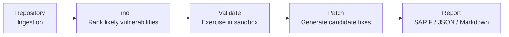
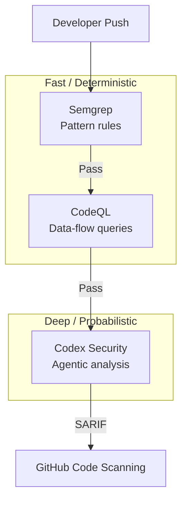

# Codex Security CLI Goes Open Source: Wiring Agentic Vulnerability Scanning into Your CI/CD Pipeline


---

On 29 July 2026, OpenAI quietly pushed `@openai/codex-security` v0.1.1 to npm under the Apache 2.0 licence — and Hacker News spotted it before OpenAI had a chance to write a blog post [^1]. The package wraps the same scanner that powers the Codex Security plugin (research preview since March 2026 [^2]) into a CLI and TypeScript SDK you can run locally, in CI, or as a pre-commit hook.

This article walks through what the CLI actually does, how to wire it into a GitHub Actions pipeline, where the cost model catches people out, and how it fits alongside traditional SAST tools in a defence-in-depth stack.

## What Codex Security CLI Is — and Isn't

Codex Security is not a pattern matcher. It is an **agentic scanner**: the tool reads your repository, builds an internal threat model, then exercises candidate vulnerabilities in a sandbox before reporting them [^3]. The pipeline runs in three stages:



Every scan produces four mandatory artefacts: `scan-manifest.json` (target and scope metadata), `findings.json` (vulnerability records with evidence), `coverage.json` (reviewed surfaces and completion status), and `report.md` (human-readable summary) [^3]. Producer identity is validated as `codex-security-plugin` with contract versioning, so downstream tooling can verify provenance.

The scanner runs against hosted OpenAI models — by default `gpt-5.6-sol` with extra-high reasoning effort [^4]. Code leaves your machine under the OpenAI API terms of service. This is not an air-gapped tool; teams with strict data-residency requirements should evaluate accordingly.

## Installation and Authentication

Requirements are Node.js 22+ and Python 3.10+ on macOS, Linux, or Windows [^4].

```bash
npm install @openai/codex-security
```

Authentication supports three paths:

```bash
# Interactive (local development)
npx codex-security login

# Headless (CI with device auth)
npx codex-security login --device-auth

# API key (CI/CD — set as secret)
export OPENAI_API_KEY="sk-..."
```

You can force a specific mode with `--auth chatgpt` or `--auth api-key` [^4]. Some capabilities — notably full-repository scans on certain plan tiers — require "Trusted Access for Cyber" verification [^5].

## Scan Modes

The CLI offers four scoping strategies:

| Mode | Command | Use Case |
|------|---------|----------|
| **Full repository** | `npx codex-security scan .` | Baseline audit |
| **Selected paths** | `npx codex-security scan src/auth src/payments` | High-risk surfaces |
| **Diff-scoped** | `npx codex-security scan . --diff origin/main --head HEAD` | PR gating |
| **Working tree** | `npx codex-security scan . --working-tree` | Pre-commit |

You can feed additional context — threat models, architecture documents, compliance requirements — via `--knowledge-base <path>`, accepting Markdown, PDF, and Word files [^4].

## CI/CD Integration

### GitHub Actions

The minimal severity-gated workflow:


```yaml
name: Security Scan
on:
  pull_request:

jobs:
  codex-security:
    runs-on: ubuntu-latest
    permissions:
      security-events: write
    steps:
      - uses: actions/checkout@v4
        with:
          fetch-depth: 0

      - uses: actions/setup-node@v4
        with:
          node-version: '22'

      - name: Run Codex Security scan
        env:
          OPENAI_API_KEY: ${{ secrets.OPENAI_API_KEY }}
        run: |
          npx @openai/codex-security scan . \
            --diff origin/main --head HEAD \
            --output-dir "$RUNNER_TEMP/codex-security" \
            --max-cost 5 \
            --fail-on-severity high

      - name: Export SARIF
        if: always()
        run: |
          npx @openai/codex-security export \
            "$RUNNER_TEMP/codex-security" \
            --export-format sarif \
            --source-root . \
            --output "$RUNNER_TEMP/codex-security/results.sarif"

      - name: Upload SARIF
        if: always()
        uses: github/codeql-action/upload-sarif@v3
        with:
          sarif_file: ${{ runner.temp }}/codex-security/results.sarif
```


Exit codes are well-defined: **0** for clean, **1** for findings at or above the severity threshold, **2** for incomplete scans [^4]. Exit code 2 is the critical design choice — errors never masquerade as passes.

### Pre-Commit Hook

```bash
npx codex-security install-hook
```

The installer respects `core.hooksPath` and never replaces existing hooks [^4]. It scans staged and unstaged changes on each commit.

## The Cost Model: What to Expect

This is where the CLI's agentic nature bites. Independent testing on a small (nine-file) repository produced scan costs ranging from **\$1.46 to \$8.54**, with scan times between 3m23s and 9m46s [^5]. The widely cited estimate of \$0.02 per 1,000 lines does not hold in practice — cost tracks the agent's reasoning loop, not line count.

A representative token breakdown from a single scan [^5]:

| Token Category | Count | Cost |
|---------------|-------|------|
| Cached input | 6,654,720 | \$3.33 |
| Fresh input | 331,330 | \$1.66 |
| Output | 34,946 | \$1.05 |

Approximately 95% of input tokens were cache reads — the agent repeatedly resends context rather than processing it fresh. The `--max-cost` flag provides a soft cap, but budget overruns of up to 46% have been observed [^5].

### Cost Defence Configuration

```bash
# Cap spend per scan
npx codex-security scan . --max-cost 5

# Use cheaper model
npx codex-security scan . --model gpt-5.6-terra

# Scope to changed files only
npx codex-security scan . --diff origin/main

# Dry run (no API calls)
npx codex-security scan . --dry-run
```

For CI pipelines, diff-scoped scanning on pull requests is the economically sane default. Reserve full-repository scans for scheduled baseline audits.

## The TypeScript SDK

For teams building custom security tooling, the SDK exposes typed interfaces:

```typescript
import { CodexSecurity } from '@openai/codex-security';

const security = new CodexSecurity();

// Preflight validation
await security.preflight();

// Run scan with progress callbacks and cancellation
const controller = new AbortController();

const result = await security.run('/path/to/repo', {
  outputDir: '/path/outside/repo/results',
  signal: controller.signal,
  onProgress: (event) => console.log(event),
});

// Access typed findings
for (const finding of result.findings) {
  console.log(finding.severity, finding.title);
}
```

**Critical requirement**: output directories must be external to the scanned repository and have mode 700 on Unix systems [^3]. Writing results into the scanned tree risks output contamination — findings contain reproduction steps that could themselves be exploitable.

## Bulk Scanning

For organisations with many repositories:

```bash
# Discover org repos (pushed in last 90 days, excludes forks/archived)
npx codex-security bulk-scan --org my-org --workers 4

# Resumable campaigns from CSV inventory
npx codex-security bulk-scan repos.csv --workers 8
```

The `--workers` flag enables concurrent scanning [^4]. The workbench maintains a SQLite-backed history with root-cause matching and false-positive feedback tracking across runs, so repeat scans converge rather than re-alerting on suppressed findings.

## Where It Fits: Agentic Scanner vs Traditional SAST



Codex Security excels at **multi-file attack path analysis** and **contextual reachability assessment** — the kind of vulnerabilities that demand understanding of application logic, not just syntax patterns [^3]. But it depends on hosted models and carries non-trivial per-scan cost.

The practical recommendation: use traditional SAST (Semgrep, CodeQL) for cheap, deterministic pattern matching on every push. Reserve Codex Security for deeper review passes on **high-risk surfaces** — authentication flows, payment processing, cryptographic implementations, and authorisation boundary changes [^3].

## Current Limitations

The CLI is pre-1.0 and comes with caveats worth noting:

- **API stability**: the v0.1.1 interface may change before 1.0 [^3]
- **Cost unpredictability**: scan cost correlates with reasoning complexity, not code volume [^5]
- **Finding quality**: ⚠️ independent testing found cases where intentional vulnerabilities (SQL injection, command injection, path traversal, hardcoded credentials) were not flagged, with scans stopping during preflight [^5]
- **Language coverage**: reportedly uneven across Python, JavaScript, TypeScript, Go, Java, Ruby, and PHP [^5]
- **Data residency**: code is processed server-side under OpenAI API terms; no offline mode available [^3]
- **Security reports**: vulnerabilities in the tool itself go through OpenAI's Bugcrowd programme, not GitHub Issues [^4]

## Getting Started Today

```bash
# Install
npm install @openai/codex-security

# Authenticate
npx codex-security login

# First scan (diff-scoped to keep costs down)
npx codex-security scan . --diff main --max-cost 3 --output-dir /tmp/scan-out

# Review findings
cat /tmp/scan-out/report.md

# Export for code scanning UI
npx codex-security export /tmp/scan-out --export-format sarif --output /tmp/scan-out/results.sarif
```

The open-source release makes agentic vulnerability scanning accessible beyond the Codex plugin ecosystem. Whether it delivers on the promise depends on OpenAI closing the gap between the threat-modelling capability — which is genuinely impressive — and the finding-detection reliability, which remains inconsistent at v0.1.1.

---

## Citations

[^1]: [OpenAI Open-Sources Codex Security CLI Under Apache-2.0 — AI Weekly](https://aiweekly.co/alerts/openai-open-sources-codex-security-cli-under-apache-20)
[^2]: [Codex Security: now in research preview — OpenAI](https://openai.com/index/codex-security-now-in-research-preview/)
[^3]: [OpenAI Open-Sourced the Codex Security CLI — TrilogyAI Substack](https://trilogyai.substack.com/p/openai-codex-security-cli)
[^4]: [OpenAI Codex Security CLI: AI Vulnerability Scanning Guide — Oflight Inc.](https://www.oflight.co.jp/en/columns/openai-codex-security-cli-guide-2026)
[^5]: [OpenAI Codex Security CLI: What One Real Scan Costs — AI Reiter](https://aireiter.com/blog/openai-codex-security-cli-review)
[^6]: [Codex Security CLI Open Source — explainx.ai](https://www.explainx.ai/blog/openai-codex-security-cli-sdk-open-source-july-2026)
