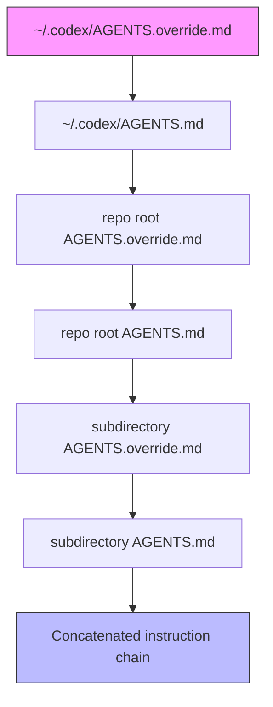
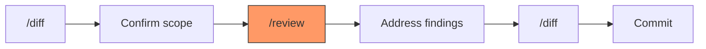

# Custom Code Review Rules in AGENTS.md: How Repository-Specific Invariants Lift Codex Review Coverage from 58% to 98%


---

Code review is the last bottleneck standing between agent-generated code and production. OpenAI's own engineering team saw weekly PR volume more than double since Q4 2025 [^1], and they found that without project-specific guidance, even a frontier model reviewing diffs missed 42% of the domain-specific invariants that experienced reviewers catch instinctively. Their solution — custom code review rules authored directly in `AGENTS.md` — recovered 98% of those findings in controlled evaluation [^1]. This article examines how the mechanism works, how to write effective rules, and how it integrates with both Codex Cloud review and Codex CLI's local `/review` command.

## The Problem: Institutional Knowledge Does Not Fit in a Model's Weights

Every mature codebase accumulates invariants that are obvious to the team but invisible to outsiders — and to AI models. A wire protocol field marked experimental that three downstream services already depend on. A migration pattern that must preserve backward compatibility for 90 days. A data boundary between PII-bearing services and analytics pipelines that no test enforces but every reviewer checks.

These invariants share a common structure: they are consequential, non-obvious, and recurrently violated by contributors who lack context. Traditional static analysis cannot express them because they require judgment, not pattern matching. And general-purpose LLM review cannot catch them because the constraints live in institutional memory, not in the code itself.

## How Custom Review Rules Work

Codex Code Review — whether triggered via `@codex review` in a GitHub PR comment or enabled for automatic review on every pull request — searches the repository for `AGENTS.md` files and applies the rules found in `## Code Review Rules` sections to the changed files [^2].

The discovery mechanism follows the same precedence chain used during coding tasks [^3]:



Files closer to the changed code take precedence. When Codex reviews a diff touching `services/experiment_reporting/handler.rs`, it reads the root `AGENTS.md` for repository-wide rules, then overlays any rules from `services/experiment_reporting/AGENTS.md`. This scoping is critical: narrow rules keep unrelated instructions from competing for attention and make ownership clear [^1].

## Anatomy of an Effective Rule

OpenAI's blog post illustrates the mechanism with a real breaking-change scenario from the Codex codebase itself [^1]. The app-server emits an internal notification named `rawResponseItem/completed`. Though marked experimental, Codex Cloud consumers already listen for it. A seemingly safe refactoring — renaming the wire name to `rawResponseItem/done` — would silently break those consumers.

The corresponding rule in `AGENTS.md`:

```markdown
## Code Review Rules

### Wire Protocol Stability

- Keep existing `rawResponseItem/*` events, even while experimental.
  Safe path: add new event names alongside existing ones; deprecate
  with a timeline, never rename in place.
```

When Codex reviews a diff containing the rename, it produces feedback citing the rule directly: *"Keep the existing `rawResponseItem/completed` notification. Codex Cloud consumers listen for this wire name, so renaming breaks them..."* [^1].

The rule succeeds because it follows four principles that OpenAI distilled from internal testing:

1. **Target consequential, non-obvious invariants.** Encode checks that reviewers repeatedly explain — compatibility requirements, data boundaries, security-sensitive patterns [^1].
2. **Scope appropriately.** Repository-wide rules at the root; service-specific rules in nested `AGENTS.md` files [^2].
3. **State the safe path.** Rules that only say "don't do X" leave contributors guessing. Effective rules articulate both the constraint and the viable alternative [^1].
4. **Maintain durability.** Describe outcomes rather than implementation details. A rule referencing a specific function name breaks when the function is renamed; a rule describing the behavioural contract survives refactoring [^1].

## Evaluation: Coverage, Restraint, Retention, Actionability

OpenAI evaluated custom review rules against a baseline (no rules) across four dimensions [^1]:

| Metric | Baseline | Rule-Guided | Interpretation |
|---|---|---|---|
| **Coverage** | 58.3% | 98% | Fraction of required domain-specific findings surfaced |
| **Restraint** | - | Clean | System avoided false positives on changes that did not violate rules |
| **Retention** | - | Preserved | Standard bug-catching (logic errors, security issues) was not displaced by custom rules |
| **Actionability** | - | High | Findings cited the rule location and priority, giving authors a clear path to resolution |

The coverage gap — 58.3% to 98% — is the headline figure, but restraint and retention matter equally in practice. A review system that fires on every change regardless of relevance trains developers to ignore it. OpenAI's evaluation confirmed that rule-guided review maintained precision: it surfaced domain-specific findings when relevant and stayed quiet when changes were clean [^1].

## Practical Implementation

### Step 1: Identify Your First Rule

Start with one explanation that reviewers keep repeating, or a consequential mistake specific to your codebase [^1]. Common candidates:

- API backward-compatibility constraints
- Data residency boundaries (PII must not cross service X)
- Migration patterns (schema changes require a backfill plan)
- Dependency policies (no new runtime dependencies without security review)

### Step 2: Write the Rule

Add a `## Code Review Rules` section to the `AGENTS.md` closest to the code the rule governs:

```markdown
## Code Review Rules

### Database Migration Safety

- Every schema migration must include a reversible down migration.
  Safe path: use the `reversible!` macro in migration files.
  Exception: data-only migrations that add nullable columns.

### API Versioning

- Do not remove or rename fields in public API response schemas.
  Safe path: deprecate with `@deprecated` annotation and add new
  field alongside the old one. Removal after two major versions.
```

### Step 3: Test With Three Changes

OpenAI recommends validating each rule against three diffs [^1]:

1. **A change that triggers the rule** — confirm the finding is surfaced.
2. **A safe counterexample** — confirm no false positive.
3. **An unrelated change** — confirm the rule does not introduce noise elsewhere.

For local testing with Codex CLI, create a test branch with the violating change and run:

```bash
codex review --uncommitted --title "rule-validation"
```

Or for a PR-scoped review against `main`:

```bash
codex exec "Review the diff between main and HEAD for code review rule violations" \
  --output-schema review-schema.json
```

### Step 4: Scope With Nested Files

For monorepos or large codebases, distribute rules across the directory tree. OpenAI's own Codex repository uses 88 `AGENTS.md` files across its directory structure [^4]. The general pattern:

```
repo/
  AGENTS.md                          # Repository-wide rules
  services/
    payments/
      AGENTS.md                      # PCI-DSS specific rules
    analytics/
      AGENTS.md                      # Data pipeline rules
  sdk/
    typescript/
      AGENTS.md                      # SDK backward-compat rules
```

The combined size of all `AGENTS.md` files in the chain is capped at 32 KiB by default (`project_doc_max_bytes`). Beyond this limit, Codex silently stops adding files. You can raise the cap in `config.toml`, but every additional byte competes for context window budget [^3]:

```toml
project_doc_max_bytes = 65536
```

## Integration With Codex CLI's /review Command

Custom review rules apply identically whether the review runs in Codex Cloud (via `@codex review` on GitHub) or locally via the CLI's `/review` command [^5]. The local workflow is particularly valuable for pre-commit validation:



The `/review` command runs as a read-only sub-turn — it never writes to the working tree. Findings appear as a separate turn in the transcript, so you can iterate: address an issue, rerun `/review`, and compare feedback without losing conversation context [^5].

For teams running Codex CLI in CI pipelines, `codex exec` with a review prompt respects the same `AGENTS.md` rules and can gate merges on severity:

```bash
codex exec "Review this diff for P0 and P1 issues. \
  Apply all Code Review Rules from AGENTS.md." \
  --output-schema review-findings.json
```

## When Rules Are Not the Right Tool

Custom review rules fill a specific gap: judgment-based checks that require institutional context. They are not a replacement for deterministic enforcement [^1]:

- **Formatting and lint checks** belong in CI (Prettier, ESLint, `rustfmt`).
- **Type safety** belongs in the compiler.
- **Test coverage thresholds** belong in coverage gates.
- **Security scanning** belongs in dedicated tooling like Codex Security CLI [^6].

Rules work best for the grey zone between "the compiler would catch it" and "only someone who was in that architecture meeting would know." Wire protocol stability, cross-service data contracts, and migration safety windows are precisely the kind of invariants that slip through static analysis but surface reliably under rule-guided review.

## The Broader Implication

The 98% vs 58.3% coverage gap reveals something important about the current generation of AI code review: the model is not the bottleneck — context is. A frontier model reviewing a diff without project-specific guidance will catch generic bugs (logic errors, null dereferences, SQL injection) but miss the domain-specific invariants that cause the most damaging production incidents. Custom review rules close that gap by encoding the institutional knowledge that would otherwise exist only in the heads of senior engineers.

For teams already using AGENTS.md to guide coding tasks, extending it with a `## Code Review Rules` section is a low-effort, high-leverage addition. The same file that tells the agent how to write code can now tell it how to review code — and the evaluation data suggests it does both jobs well.

## Citations

[^1]: "Custom Code Review rules for Codex," OpenAI Developers Blog, July 2026. [https://developers.openai.com/blog/custom-code-review-rules-for-codex](https://developers.openai.com/blog/custom-code-review-rules-for-codex)

[^2]: "Codex code review in GitHub," OpenAI Documentation, 2026. [https://developers.openai.com/codex/integrations/github](https://developers.openai.com/codex/integrations/github)

[^3]: "Custom instructions with AGENTS.md," OpenAI Documentation, 2026. [https://developers.openai.com/codex/guides/agents-md](https://developers.openai.com/codex/guides/agents-md)

[^4]: "AGENTS.md for Codex CLI (2026): Lookup Order, Limits & Monorepo Templates," CodeGateway, 2026. [https://www.codegateway.dev/en/blog/agents-md-playbook-2026](https://www.codegateway.dev/en/blog/agents-md-playbook-2026)

[^5]: "Codex CLI Code Review Workflows: /review, review_model, and the MCP Extension," Codex Knowledge Base, 2026. [https://codex.danielvaughan.com/2026/03/30/codex-cli-review-command-code-review-workflows/](https://codex.danielvaughan.com/2026/03/30/codex-cli-review-command-code-review-workflows/)

[^6]: "Codex Security CLI: OpenAI's Open-Source Security Agent," Codex Knowledge Base, 2026. [https://codex.danielvaughan.com/2026/07/29/codex-security-cli-open-source-vulnerability-scanning-validation-fix-generation-ci-cd-integration/](https://codex.danielvaughan.com/2026/07/29/codex-security-cli-open-source-vulnerability-scanning-validation-fix-generation-ci-cd-integration/)
