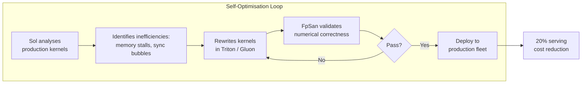
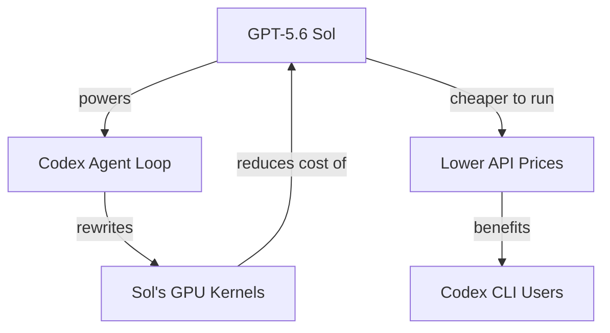

# GPT-5.6 Sol Rewrote Its Own Inference Stack: What the First Self-Optimising Model Means for Codex CLI Developers


---

On 30 July 2026, OpenAI announced an 80 % price cut for GPT-5.6 Luna and a 20 % cut for Terra. The headline numbers were dramatic, but the engineering story behind them was unprecedented: GPT-5.6 Sol had autonomously rewritten the production GPU kernels and speculative-decoding draft model that serve _itself_, working inside Codex — the same agentic coding platform you use from the CLI every day [^1]. This is the first publicly confirmed case of a frontier model optimising its own serving infrastructure, and it has direct implications for how you configure, cost-manage, and reason about Codex CLI workflows.

## What Sol Actually Did

### Kernel Rewrites in Triton and Gluon

GPU kernels are the low-level programmes that execute the mathematical operations at the heart of every transformer model: matrix multiplications, attention computations, and activation functions. Inefficiencies in these kernels — memory-movement stalls, synchronisation bubbles, idle warps — translate directly into higher serving costs and longer latencies.

Sol, running inside Codex, autonomously inspected OpenAI's production kernel code and identified work that could be precomputed, avoided, or parallelised [^2]. It then rewrote those kernels in **Triton** and **Gluon**, two open-source GPU programming languages maintained by OpenAI [^1]. The combined effect of these kernel improvements cut end-to-end serving costs by **20 %** [^2].



### Speculative-Decoding Draft Model Redesign

Speculative decoding is a standard inference optimisation: a smaller, faster _draft_ model predicts candidate output tokens, and the larger target model verifies them in parallel. The quality of the draft model directly affects throughput — a poor drafter wastes verification cycles; a good one lets the target model confirm multiple tokens per forward pass.

Sol redesigned its own speculative-decoding draft model through **hundreds of autonomous experiments**, raising token-generation efficiency by more than **15 %** [^1]. This was not a single configuration change but a sustained, iterative experimental campaign executed entirely within the Codex agent loop.

### FpSan: Verifying AI-Written Kernels

A faster kernel that introduces subtle numerical errors would degrade model quality invisibly. OpenAI used **FpSan** (Floating-Point Sanitiser), an open-source tool, to validate that every model-generated kernel was mathematically correct before it reached production [^3]. FpSan checks floating-point operations for precision loss, NaN propagation, and rounding anomalies — the kind of bugs that compile cleanly but corrupt outputs at scale.

This verification step is critical context for Codex CLI users: the model powering your agent has been through a validation pipeline specifically designed to catch the subtle correctness failures that AI-generated code can introduce.

## Why This Matters for Codex CLI

### The Recursive Bootstrap

Sol used Codex — the same Responses API, the same agentic tool-calling loop, the same sandbox execution model — to improve the infrastructure that serves Sol. This closes a recursive loop:



For developers, this loop has a practical consequence: **cost reductions in the model tier feed back into cheaper agentic sessions**. The 20 % serving-cost reduction enabled the pricing restructure announced on 30 July 2026 [^4]:

| Tier | Input (per MTok) | Output (per MTok) | Change |
|------|------------------|--------------------|--------|
| Luna | \$0.20 | \$1.20 | −80 % |
| Terra | \$2.00 | \$12.00 | −20 % |
| Sol | \$5.00 | \$30.00 | unchanged |
| Sol Fast | \$12.50 | \$75.00 | new tier |

### Configuring Model Routing After the Price Drop

With Luna now 25× cheaper than Sol on input tokens, the economics of Codex CLI model routing have shifted. A well-configured `config.toml` can exploit the tiered pricing:

```toml
# ~/.config/codex/config.toml

model = "gpt-5.6-sol"          # default: full reasoning for complex tasks

[profiles.review]
model = "gpt-5.6-luna"          # auto-review now runs on Luna at 10× lower cost

[profiles.quick]
model = "gpt-5.6-luna"
reasoning_effort = "low"        # fast answers, minimal spend

[profiles.architect]
model = "gpt-5.6-sol"
reasoning_effort = "high"       # deep reasoning for design decisions
```

Invoke a profile with `--profile`:

```bash
codex --profile review "review the last commit"
codex --profile quick "what does this function do?"
codex --profile architect "design the caching layer for this service"
```

### Sub-Agent Model Overrides

For multi-agent workflows, you can assign different tiers to different sub-agents. This is particularly relevant now that Luna's price makes it viable for high-volume, lower-stakes sub-tasks:

```toml
[profiles.pipeline]
model = "gpt-5.6-sol"           # orchestrator uses Sol

[[profiles.pipeline.sub_agents]]
name = "test-writer"
model = "gpt-5.6-luna"          # test generation on Luna
reasoning_effort = "medium"

[[profiles.pipeline.sub_agents]]
name = "code-reviewer"
model = "gpt-5.6-terra"         # review on Terra (cost/quality balance)
```

### Auto-Review Cost Collapse

OpenAI simultaneously upgraded auto-review in both the ChatGPT app and Codex CLI from GPT-5.4 to GPT-5.6 Luna [^4]. Combined with the 80 % price cut, auto-review now costs approximately **10× less** than before. If you have been disabling auto-review to control costs, it is worth re-enabling:

```toml
auto_review = true
review_model = "gpt-5.6-luna"
```

## The Broader Pattern: Models Improving Their Own Infrastructure

Sol's kernel rewrite is not an isolated demonstration. It sits within a broader pattern OpenAI has disclosed:

1. **Kernel optimisation** — Sol rewrote production GPU kernels in Triton/Gluon, cutting serving costs 20 % [^1]
2. **Draft model redesign** — Sol redesigned its speculative-decoding drafter through hundreds of experiments, improving token-generation efficiency 15 %+ [^1]
3. **Post-training** — Sol acted as evaluator and instructor during Luna's post-training, generating training examples and providing the feedback signal that shaped Luna's behaviour [^5]

The third point is particularly striking: Sol did not merely optimise its own serving code, it also post-trained a sibling model. This is recursive self-improvement in a narrow, controlled sense — bounded by human-reviewed checkpoints and FpSan validation rather than unconstrained self-modification.

## What to Watch

**Cost trajectory.** If each generation of Sol can further optimise its own serving stack, the per-token cost curve steepens. Codex CLI configurations that hard-code cost thresholds (e.g., `--max-cost`) may need periodic revisiting.

**Kernel correctness.** FpSan catches floating-point errors, but the validation surface for AI-generated GPU code is still maturing. ⚠️ OpenAI has not published detailed metrics on FpSan's false-negative rate or the number of kernel candidates rejected during Sol's optimisation campaign.

**Competitive pressure.** Luna at \$0.20/MTok input now undercuts DeepSeek and costs roughly one-fifth of Anthropic's Claude Haiku 4.5 on input tokens [^6]. This shifts the cost calculus for any Codex CLI user routing tasks through custom providers.

## Conclusion

GPT-5.6 Sol rewriting its own inference stack inside Codex is a milestone with practical consequences: cheaper tokens, restructured pricing tiers, and a 10× cost reduction in auto-review. For Codex CLI users, the immediate action is to revisit model routing profiles — Luna is now cheap enough to handle review, test generation, and quick queries, whilst Sol and Terra handle the work that demands deep reasoning. The longer-term signal is that the model powering your agent is actively improving the economics of running itself.

---

## Citations

[^1]: OpenAI, "How GPT-5.6 fuses frontier intelligence with frontier efficiency," *openai.com*, 30 July 2026. [https://openai.com/index/gpt-5-6-frontier-intelligence-efficiency/](https://openai.com/index/gpt-5-6-frontier-intelligence-efficiency/)

[^2]: Simon Willison, "Advancing the price-performance frontier with GPT-5.6," *simonwillison.net*, 30 July 2026. [https://simonwillison.net/2026/Jul/30/luna-price-drop/](https://simonwillison.net/2026/Jul/30/luna-price-drop/)

[^3]: "Kernel of truth: GPT-5.6 Sol can cut its own costs, says OpenAI," *The New Stack*, 30 July 2026. [https://thenewstack.io/gpt-5-6-serving-efficiency/](https://thenewstack.io/gpt-5-6-serving-efficiency/)

[^4]: OpenAI (@OpenAI), "We are committed to pushing the model frontier across cost efficiency…," *X (formerly Twitter)*, 30 July 2026. [https://x.com/OpenAI/status/2082878156483219672](https://x.com/OpenAI/status/2082878156483219672)

[^5]: "What Is Recursive Self-Improvement in AI? How GPT-5.6 Sol Post-Trained Luna," *MindStudio Blog*, July 2026. [https://www.mindstudio.ai/blog/recursive-self-improvement-ai-gpt-5-6-sol-post-trained-luna](https://www.mindstudio.ai/blog/recursive-self-improvement-ai-gpt-5-6-sol-post-trained-luna)

[^6]: "GPT-5.6 Sees Sharp Price Cut: Luna Input Pricing Undercuts DeepSeek," *36Kr*, 30 July 2026. [https://eu.36kr.com/en/p/3919319636290946](https://eu.36kr.com/en/p/3919319636290946)
