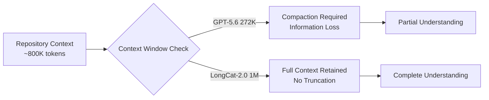
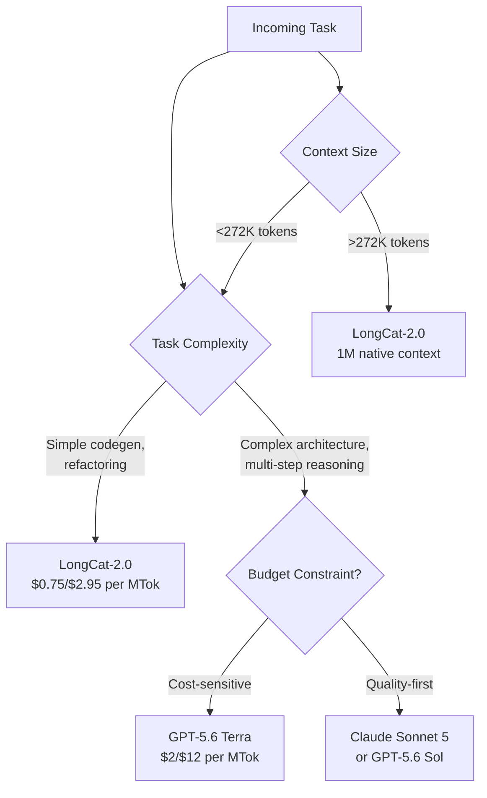

# LongCat-2.0: Configuring Meituan's 1.6T Open-Source Agentic Coding Model as a Codex CLI Provider


---

Meituan's LongCat-2.0 arrived on 30 June 2026 under an MIT licence, carrying 1.6 trillion parameters in a Mixture-of-Experts architecture that activates roughly 48 billion per token [^1]. It scored 59.5 on SWE-bench Pro — edging past GPT-5.5's 58.6 [^2] — and ships with a native one-million-token context window built on LongCat Sparse Attention, which reduces the usual quadratic attention cost to linear complexity [^1]. The model had been running anonymously on OpenRouter as "Owl Alpha" for two months before the reveal, reaching first place on the Hermes Agent workspace leaderboard [^3].

For Codex CLI users, the question is practical: can you wire LongCat-2.0 into your existing workflow, what does it cost, and where does it actually outperform the models you already use?

## Architecture in Brief

LongCat-2.0 is not a dense transformer. Its ScMoE (Scalable Mixture-of-Experts) routing dynamically activates between 33 and 56 billion parameters per token, averaging 48 billion [^1]. Post-training splits experts into three specialised categories:

- **Agent Experts** — tool use, function calling, structured output
- **Reasoning Experts** — multi-hop logic, chain-of-thought
- **Interaction Experts** — instruction following, conversational coherence

An additional 135 billion parameters are allocated to N-gram embeddings covering 5-gram combinations, which improve token prediction without increasing inference-time compute [^3].

The native million-token context comes from LongCat Sparse Attention (LSA), a mechanism that avoids the windowed-approximation approach used by many long-context models. Training ran on 50,000+ domestic Chinese ASIC accelerators over 30 trillion tokens, making LongCat-2.0 the first trillion-parameter model trained entirely on non-NVIDIA hardware [^1].

## Benchmark Position

The headline numbers tell a nuanced story. LongCat-2.0 leads GPT-5.5 on the coding-specific benchmarks but trails on general agent work:

| Benchmark | LongCat-2.0 | GPT-5.5 | Claude Sonnet 5 | Gemini 3.1 Pro |
|-----------|:-----------:|:-------:|:---------------:|:--------------:|
| SWE-bench Pro | **59.5** | 58.6 | 63.2 | 54.2 |
| SWE-bench Multilingual | **77.3** | — | — | — |
| Terminal-Bench 2.1 | 70.8 | — | 80.4 | — |
| FORTE | 73.2 | **77.8** | — | — |
| BrowseComp | **79.9** | — | — | — |

The 0.9-point SWE-bench Pro lead over GPT-5.5 falls within evaluation margins; all scores are vendor-reported and await independent verification [^2]. Claude Sonnet 5 still leads on both SWE-bench Pro (63.2) and Terminal-Bench 2.1 (80.4) [^2]. LongCat-2.0's strength is the combination of near-frontier coding performance at substantially lower cost.

⚠️ *All benchmark scores are self-reported by Meituan and have not yet been independently reproduced.*

## Pricing and Cost Position

This is where LongCat-2.0 changes the calculus:

| Model | Input (per MTok) | Output (per MTok) | Approx. Cost per Coding Task |
|-------|:----------------:|:------------------:|:----------------------------:|
| LongCat-2.0 (standard) | \$0.75 | \$2.95 | ~\$1.10 |
| LongCat-2.0 (promo) | \$0.30 | \$1.20 | ~\$0.45 |
| GPT-5.6 Luna | \$0.20 | \$1.20 | ~\$0.61 |
| GPT-5.6 Terra | \$2.00 | \$12.00 | ~\$3.96 |
| Claude Sonnet 4.6 | \$3.00 | \$15.00 | ~\$5.20 |

At promotional pricing, LongCat-2.0 undercuts everything except GPT-5.6 Luna on raw token cost. At standard pricing, it sits between Luna and Terra — but with SWE-bench Pro performance closer to Terra's tier [^4].

Cache reads are free on the LongCat API, which matters when you are re-running agents against the same repository context [^4].

## Configuring Codex CLI with LongCat-2.0 via OpenRouter

LongCat-2.0 is available through OpenRouter, the LongCat native API, and self-hosted inference. The OpenRouter path is the simplest for most Codex CLI users [^5].

### Step 1: Set the API key

Set your OpenRouter key in the environment using the standard `OPENROUTER` variable that Codex CLI reads.

### Step 2: Add the provider to `~/.codex/config.toml`

```toml
[model_providers.openrouter]
base_url = "https://openrouter.ai/api/v1"
wire_api = "responses"
env_key = "OPENROUTER"
```

Three provider names are reserved (`openai`, `ollama`, `lmstudio`) — `openrouter` is safe to use [^5].

### Step 3: Set LongCat-2.0 as the model

```toml
model_provider = "openrouter"
model = "meituan/longcat-2.0"
```

⚠️ *The exact OpenRouter slug for LongCat-2.0 should be verified against the current OpenRouter model catalogue; slugs occasionally change.*

### Step 4: Verify the connection

```bash
codex doctor
```

The `doctor` output should confirm the provider is reachable and the model responds to a health-check prompt.

## Direct LongCat API Configuration

For teams wanting to avoid OpenRouter's margin, the LongCat API is accessible directly:

```toml
[model_providers.longcat]
base_url = "https://api.longcat.chat/v1"
wire_api = "responses"
env_key = "LONGCAT_KEY"

model_provider = "longcat"
model = "longcat-2.0"
```

⚠️ *The LongCat API runs under Chinese regulatory oversight. Enterprise teams should evaluate data-residency and jurisdictional requirements before routing production traffic through it.*

## Named Profiles for Model Routing

LongCat-2.0 slots naturally into a tiered model-routing strategy. Use named profiles in `config.toml` to switch models by task complexity:

```toml
[profile.quick]
model_provider = "openrouter"
model = "meituan/longcat-2.0"

[profile.heavy]
model_provider = "openai"
model = "gpt-5.6-sol"

[profile.review]
model_provider = "openai"
model = "gpt-5.6-terra"
```

Then invoke by profile:

```bash
codex --profile quick "refactor the auth module to use dependency injection"
codex --profile heavy "redesign the event-sourcing pipeline"
```

This pattern lets you route straightforward refactoring and code-generation tasks to LongCat-2.0's cost-effective tier, reserving Sol or Sonnet for complex architectural work where the benchmark gap matters [^5].

## Sub-Agent Model Overrides

With Multi-Agent V2, you can assign LongCat-2.0 to specific sub-agents whilst keeping a different model for the orchestrator:

```toml
model_provider = "openai"
model = "gpt-5.6-terra"

[subagent_overrides.codegen]
model_provider = "openrouter"
model = "meituan/longcat-2.0"

[subagent_overrides.review]
model_provider = "openai"
model = "gpt-5.6-sol"
```

This is particularly effective for code-generation sub-agents, where LongCat-2.0's SWE-bench scores suggest it can handle the task at a fraction of the cost.

## The Million-Token Context Advantage

LongCat-2.0's native million-token context is genuinely useful for repository-scale operations. Where GPT-5.6 models cap at 272,000 tokens [^6], LongCat-2.0 can ingest roughly 3.7 times more context before hitting its limit. This matters for:

- **Whole-repo analysis** — scanning an entire monorepo without chunking
- **Cross-file refactoring** — understanding dependency chains across hundreds of files
- **Migration tasks** — framework upgrades that touch every layer of the stack



However, Codex CLI's `model_auto_compact_token_limit` still applies. If your `config.toml` sets a compaction threshold below the model's native window, compaction will trigger early regardless:

```toml
# Let LongCat-2.0 use its full context before compacting
model_auto_compact_token_limit = 900000
```

## Risks and Considerations

### Jurisdictional Exposure

LongCat-2.0's API endpoints operate under Chinese data-protection law. For enterprises with GDPR, SOC 2, or FedRAMP obligations, routing code through these endpoints may create compliance friction. Self-hosting the MIT-licensed weights on your own infrastructure sidesteps this, but requires significant GPU capacity (or compatible ASIC hardware) [^1].

### Benchmark Verification

All published benchmarks are vendor-reported. The SWE-bench Pro margin over GPT-5.5 is 0.9 points — well within the noise of evaluation variance. Until independent reproductions confirm the scores, treat them as indicative rather than definitive [^2].

### Wire API Compatibility

Codex CLI requires `wire_api = "responses"` for custom providers since the older `chat` protocol was removed in February 2026. Ensure your provider configuration includes this setting — omitting it causes startup failures [^5].

### Token-Pack Distribution

The LongCat direct API distributes promotional token packs via flash sales four times daily at Beijing time (10:00, 16:00, 21:00, 23:00). This model is unusual and may not suit teams that need predictable billing [^4].

## When to Use LongCat-2.0

The model fits a specific niche in your Codex CLI configuration:



Use LongCat-2.0 when you need near-frontier coding capability at open-source pricing, or when your context requirements exceed GPT-5.6's 272K window. Route elsewhere for tasks where the 3.7-point gap to Claude Sonnet 5 on SWE-bench Pro matters, or where jurisdictional constraints rule out Chinese-hosted inference.

## Citations

[^1]: Meituan, "LongCat-2.0: 1.6T Agentic Coding LLM — 1M Context, Open Source," longcatai.org, June 30, 2026. [https://www.longcatai.org/models/longcat-2](https://www.longcatai.org/models/longcat-2)

[^2]: "LongCat-2.0 vs Claude Code & Claude Sonnet 5 — Price & Coding Benchmarks," longcatai.org, July 2026. [https://www.longcatai.org/benchmarks/longcat-vs-claude-code](https://www.longcatai.org/benchmarks/longcat-vs-claude-code)

[^3]: "LongCat-2.0," Awesome Agents model card, July 2026. [https://awesomeagents.ai/models/longcat-2-0/](https://awesomeagents.ai/models/longcat-2-0/)

[^4]: "Meituan reveals LongCat-2.0, undercuts GPT-5.5 and Claude Sonnet 5 on pricing," Crypto Briefing, July 2026. [https://cryptobriefing.com/meituan-longcat-2-undercuts-gpt-claude-pricing/](https://cryptobriefing.com/meituan-longcat-2-undercuts-gpt-claude-pricing/)

[^5]: "Codex CLI with OpenRouter: config.toml Setup and Models," OpenRouter Blog, 2026. [https://openrouter.ai/blog/tutorials/codex-cli-openrouter/](https://openrouter.ai/blog/tutorials/codex-cli-openrouter/)

[^6]: "Codex CLI v0.144.6 — Refreshed bundled instructions for GPT-5.6 Sol, Terra, and Luna, corrected context windows to 272,000 tokens," OpenAI Codex changelog, July 29, 2026. [https://developers.openai.com/codex/changelog](https://developers.openai.com/codex/changelog)
