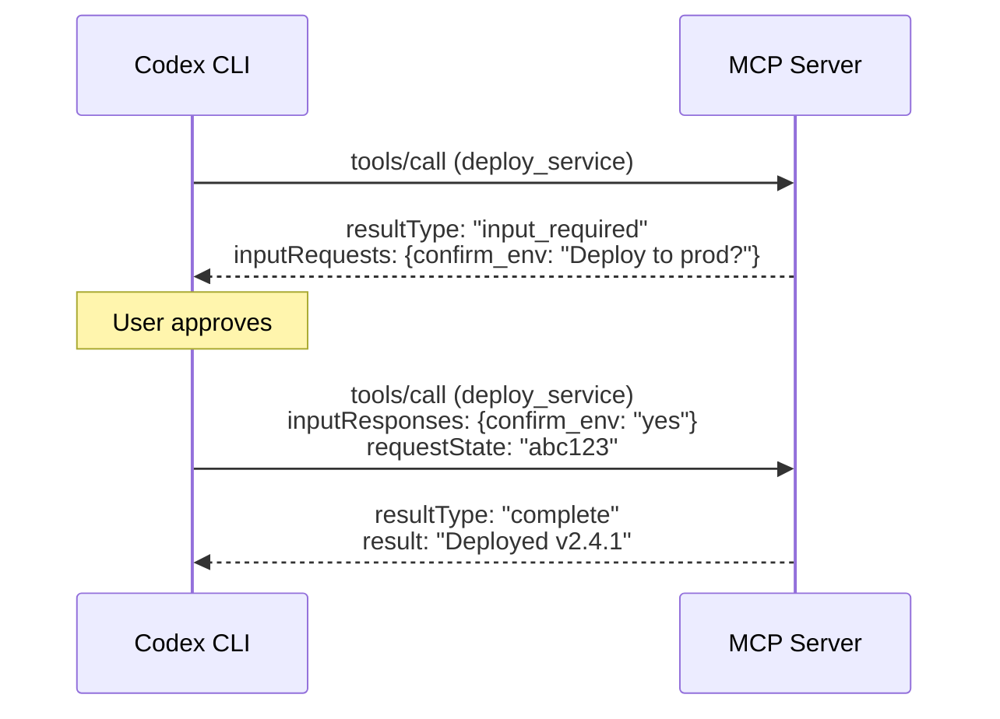
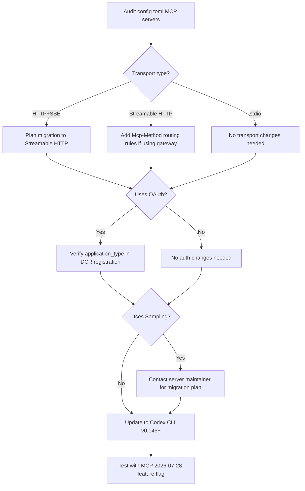

# MCP 2026-07-28 Final Specification Ships: Stateless Core, Tasks Extension, MCP Apps, and What Your Codex CLI Configuration Needs Now


---

The largest revision of the Model Context Protocol since launch went final on 28 July 2026 [^1]. After a ten-week validation window following the 21 May release candidate, the specification is now the normative reference for every MCP client and server [^2]. Codex CLI v0.146.0 already registers the `2026-07-28` feature flag [^3], signalling that the runtime is preparing for the transition. This article maps the final specification to concrete Codex CLI configuration decisions, covering what changed from the RC, what breaks, and what to do about it.

## The Stateless Core: Sessions Are Gone

The most consequential change is structural. MCP no longer maintains protocol-level sessions. The `initialize`/`initialized` handshake is retired, and the `Mcp-Session-Id` header no longer exists [^2]. Every request is now self-contained: protocol version, client identity, and client capabilities travel in a `_meta` object on each JSON-RPC message [^4].

```json
{
  "jsonrpc": "2.0",
  "method": "tools/call",
  "params": {
    "name": "run_query",
    "arguments": { "sql": "SELECT count(*) FROM orders" },
    "_meta": {
      "io.modelcontextprotocol/protocolVersion": "2026-07-28",
      "io.modelcontextprotocol/clientInfo": {
        "name": "codex-cli",
        "version": "0.146.0"
      },
      "io.modelcontextprotocol/clientCapabilities": {
        "extensions": ["io.modelcontextprotocol/tasks"]
      }
    }
  },
  "id": 1
}
```

For Codex CLI users, this means MCP servers can now sit behind standard round-robin load balancers without sticky sessions or shared state stores [^4]. If you run internal MCP servers on Kubernetes, you can remove session-affinity annotations. Servers that need cross-call state must mint their own explicit handles and pass them as ordinary tool arguments — the protocol will not do it for them.

Capability discovery shifts to a stateless `server/discover` RPC that clients call on demand [^2]. Codex CLI's MCP runtime already reconnects servers without restarting healthy connections when configuration changes [^3]; the stateless model simplifies this further by removing the handshake entirely.

## Header-Based Routing: Infrastructure Gets Cheaper

Every Streamable HTTP POST now requires `Mcp-Method` and `Mcp-Name` headers [^4]. Gateways, WAFs, and rate limiters can route and meter on these headers without parsing JSON bodies. For enterprise Codex CLI deployments behind an API gateway, this means you can write routing rules like:

```yaml
# Example: gateway routing rule for MCP traffic
routes:
  - match:
      headers:
        Mcp-Method: "tools/call"
        Mcp-Name: "run_query"
    route:
      cluster: mcp-database-tools
      rate_limit: 100/min
  - match:
      headers:
        Mcp-Method: "tools/list"
    route:
      cluster: mcp-registry
      rate_limit: 1000/min
```

If your `config.toml` MCP server entries use Streamable HTTP (`type = "http"`), your infrastructure tooling can now inspect traffic without deep packet inspection [^4].

## Response Caching: `ttlMs` and `cacheScope`

List endpoints — `tools/list`, `prompts/list`, `resources/list`, and `resources/read` — now include `ttlMs` and `cacheScope` fields in their responses [^2]. `cacheScope` is either `"public"` (safe for intermediary caches) or `"private"` (per-client only).

Codex CLI's MCP runtime already reconciles servers during configuration refreshes [^3]. With caching hints, the runtime can skip redundant `tools/list` calls when the TTL has not expired, reducing latency on every new thread. This matters when you have dozens of MCP servers registered: the tool-discovery phase at thread start currently involves a round-trip to each server.

## Multi Round-Trip Requests: MRTR

The specification introduces a new interaction pattern for tools that need user input mid-execution [^4]. Rather than holding a bidirectional stream open, servers return a result with `resultType: "input_required"`, an `inputRequests` map describing what they need, and an opaque `requestState` token [^2]. The client gathers the answers and re-issues the original `tools/call` with `inputResponses` and the echoed `requestState`.



For Codex CLI, MRTR interacts with the approval policy. A tool returning `input_required` will surface as an approval prompt in the TUI, exactly as a dangerous command would. The `approval_policy` in `config.toml` determines whether the user sees it or whether it is auto-approved.

## Tasks Extension: Asynchronous Long-Running Operations

Tasks graduated from the experimental core into a formal extension at `io.modelcontextprotocol/tasks` [^1]. The API is poll-based:

| Method | Purpose |
|--------|---------|
| `tasks/get` | Poll task status: `working`, `input_required`, `completed`, `failed`, `cancelled` |
| `tasks/update` | Send mid-flight input to a running task |
| `tasks/cancel` | Request cooperative cancellation |

A `tools/call` can now return a task handle instead of a direct result. The client drives the task lifecycle through polling. Terminal states (`completed`, `failed`, `cancelled`) are immutable with results or errors attached [^4].

This maps directly to Codex CLI's multi-agent architecture. A sub-agent spawned to handle a long-running MCP tool call (e.g. a database migration, a CI pipeline trigger) can poll `tasks/get` at intervals rather than holding a connection open. The `agents.max_threads` configuration in `config.toml` governs how many concurrent task-polling loops can run.

```toml
# config.toml — sub-agent concurrency for task-polling MCP tools
[agents]
max_threads = 8    # up from default 6 for task-heavy workflows
max_depth = 2
```

The removal of `tasks/list` from the extension means servers no longer expose an enumeration of all running tasks [^2]. Clients must track their own task handles. Codex CLI's thread-level state already handles this through its session persistence layer [^3].

## MCP Apps: Interactive UI in the Conversation

MCP Apps (`SEP-1865`) lets servers ship interactive HTML interfaces rendered in sandboxed iframes within the host application [^5]. Tools declare UI templates ahead of time via `_meta.ui.resourceUri` linking to `ui://` resources. The rendered UI communicates back to the host over the same JSON-RPC base protocol, so every UI-initiated action goes through the same audit and consent path as a direct tool call [^5].

For Codex CLI's TUI, MCP Apps support is limited — the terminal cannot render iframes. However, when running via the ChatGPT desktop app (which now subsumes Codex), MCP Apps render inline in the conversation pane. If you develop MCP servers that serve both CLI and desktop users, design for graceful degradation:

```json
{
  "name": "dashboard_query",
  "description": "Query metrics dashboard",
  "annotations": {
    "ui": {
      "resourceUri": "ui://metrics-dashboard",
      "fallback": "text"
    }
  }
}
```

Servers declaring MCP Apps should return plain-text results alongside the UI resource URI. Codex CLI will use the text fallback; the desktop app will render the interactive dashboard.

## Authorisation Hardening

Three authorisation changes tighten the security model [^4]:

1. **RFC 9207 issuer validation** — authorisation servers must include an `iss` parameter in responses, and clients must validate it against the recorded issuer before code redemption. This prevents authorisation-server mix-up attacks.

2. **`application_type` during Dynamic Client Registration (DCR)** — clients must specify their type, enabling servers to accept `localhost` redirects for CLI and desktop apps without weakening browser-based flows.

3. **Credential binding** — client credentials are bound to their issuing authorisation server. No cross-server reuse.

Additionally, DCR itself is formally deprecated in favour of Client ID Metadata Documents (CIMD) [^2]. The twelve-month deprecation window means DCR remains functional until at least July 2027, but new MCP server deployments should adopt CIMD.

For `config.toml`, OAuth-authenticated MCP servers continue to work. The `codex mcp add` subcommand handles OAuth flows transparently [^6]. If you manage MCP server registration through automation, ensure your tooling specifies `application_type` during registration.

## The Deprecation Clock

The specification establishes a formal deprecation policy with a twelve-month minimum window [^2]. Four features are now deprecated:

| Feature | Deprecation Date | Earliest Removal | Migration Path |
|---------|-----------------|-------------------|----------------|
| Roots | 2026-07-28 | 2027-07-28 | Pass paths as tool parameters or server configuration |
| Sampling | 2026-07-28 | 2027-07-28 | Integrate directly with LLM provider APIs server-side |
| Logging | 2026-07-28 | 2027-07-28 | Use `stderr` or OpenTelemetry |
| HTTP+SSE transport | 2026-07-28 | 2027-07-28 | Migrate to Streamable HTTP |

For Codex CLI users, the most actionable item is the HTTP+SSE transport deprecation. If your `config.toml` contains MCP servers using the legacy SSE transport, plan a migration to Streamable HTTP within the next twelve months. Codex CLI already supports Streamable HTTP for remote MCP servers [^6].

**Sampling deprecation** is worth watching. MCP servers that use sampling to call back into the host's LLM will need to bring their own model access. If you rely on MCP servers that use sampling (e.g. for server-side reasoning or re-ranking), confirm with the server maintainers that they have a migration plan.

## Migration Checklist for Codex CLI Users



### Immediate actions (July–August 2026)

1. **Update Codex CLI** to v0.146.0 or later — the `2026-07-28` feature flag is already registered [^3].
2. **Audit MCP server transports** in `config.toml`. Identify any HTTP+SSE servers.
3. **Test response caching** — watch for stale `tools/list` responses if your servers update tool definitions frequently.

### Medium-term actions (Q3–Q4 2026)

4. **Migrate HTTP+SSE servers** to Streamable HTTP.
5. **Evaluate Tasks extension** for long-running MCP tools — adjust `agents.max_threads` if polling concurrency becomes a bottleneck.
6. **If developing MCP servers**, implement `server/discover` and return `ttlMs`/`cacheScope` on list endpoints.

### Before July 2027

7. **Remove Sampling dependencies** from any MCP servers you maintain.
8. **Replace Roots** with explicit path parameters in tool definitions.
9. **Adopt CIMD** in place of Dynamic Client Registration for new server deployments.

## What Changed Between the RC and the Final Spec

The specification was locked as an RC on 21 May 2026 [^1]. The ten-week validation period produced one notable addition: the mandatory `resultType` field on every result, set to `"complete"` for ordinary responses and `"input_required"` for MRTR interim results [^2]. Servers conforming to the RC without `resultType` will need a one-line patch. The structural changes — stateless core, Tasks as an extension, MCP Apps, deprecation policy — shipped unchanged from the RC.

## Conclusion

The MCP 2026-07-28 specification is the protocol's maturity moment. The shift to a stateless core, the graduation of Tasks to a formal extension, and the introduction of MCP Apps transform MCP from a local-first tool-calling protocol into a distributed, scalable infrastructure component. For Codex CLI users, the migration is incremental: v0.146.0 lays the groundwork, the twelve-month deprecation windows provide breathing room, and the practical impact — faster tool discovery through caching, simpler load balancing through stateless requests, and richer interactions through MRTR and Tasks — makes the upgrade worth prioritising.

## Citations

[^1]: "The 2026-07-28 Specification," Model Context Protocol Blog, 28 July 2026. [https://blog.modelcontextprotocol.io/posts/2026-07-28/](https://blog.modelcontextprotocol.io/posts/2026-07-28/)

[^2]: "MCP 2026-07-28 spec: what changed, what breaks," Stacktree, July 2026. [https://stacktr.ee/blog/mcp-2026-spec-changes](https://stacktr.ee/blog/mcp-2026-spec-changes)

[^3]: "Release 0.146.0," openai/codex, GitHub, 29 July 2026. [https://github.com/openai/codex/releases/tag/rust-v0.146.0](https://github.com/openai/codex/releases/tag/rust-v0.146.0)

[^4]: "MCP 2026-07-28: From Local Tool to Distributed Protocol," Agentic AI Foundation (AAIF), July 2026. [https://aaif.io/blog/mcp-2026-07-28-whats-changing-and-how-to-migrate](https://aaif.io/blog/mcp-2026-07-28-whats-changing-and-how-to-migrate)

[^5]: "MCP Apps — Bringing UI Capabilities to MCP Clients," Model Context Protocol Blog, 26 January 2026. [https://blog.modelcontextprotocol.io/posts/2026-01-26-mcp-apps/](https://blog.modelcontextprotocol.io/posts/2026-01-26-mcp-apps/)

[^6]: "Model Context Protocol," OpenAI Developers, Codex documentation. [https://developers.openai.com/codex/mcp](https://developers.openai.com/codex/mcp)
