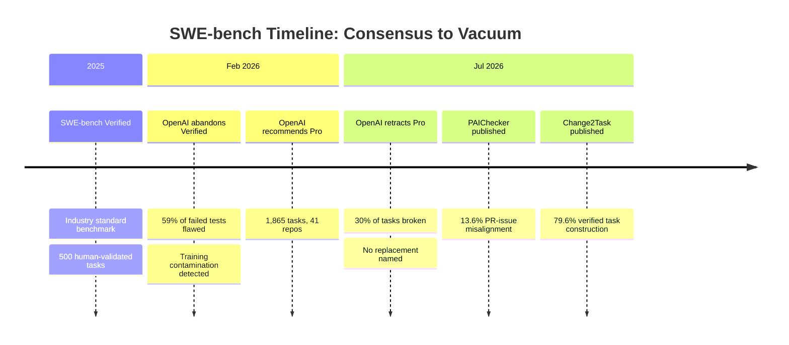
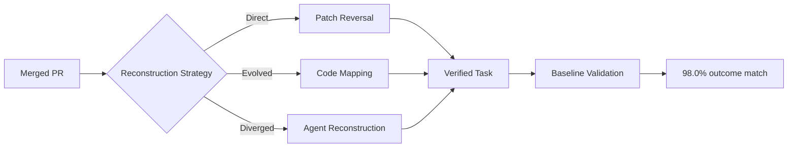

# The SWE-bench Reliability Crisis: PAIChecker, Change2Task, and What the Benchmark Vacuum Means for Codex CLI Evaluation


---

Within five months, the coding-agent evaluation landscape went from having a consensus benchmark to having none. OpenAI abandoned SWE-bench Verified in February 2026 after finding that 59% of failed tests were flawed [^1]. In July, it retracted its own recommendation of SWE-bench Pro after auditing 731 public tasks and discovering roughly 30% were broken [^2]. Two papers published on 30 July 2026 — PAIChecker and Change2Task — now explain precisely *why* these benchmarks keep breaking and offer structural remedies. If you evaluate Codex CLI or any other coding agent against SWE-bench scores, the ground has shifted under your feet.

## The Collapse of SWE-bench Verified

SWE-bench Verified was the industry standard: 500 human-validated tasks drawn from real GitHub issues, each executed in an isolated Docker container. OpenAI's Frontier Evals team stopped reporting scores in February 2026 after an internal audit of 138 problematic tasks found that more than 60% were unsolvable as written due to flawed tests [^1]. Evidence of training-data contamination across all major frontier models — GPT-5.2, Claude Opus 4.5, Gemini 3 Flash — rendered the remaining scores meaningless.

The scores had been impressive. GPT-5.6 Sol reports 96.2% on SWE-bench Verified via Vals AI's independent harness [^3]. But when METR asked four active maintainers from scikit-learn, Sphinx, and pytest to review 296 AI-generated PRs that passed the automated grader, approximately half would not have been merged [^4]. The automated grader inflated scores by 24.2 percentage points relative to actual maintainer merge decisions.

## SWE-bench Pro: Five Months and Out

OpenAI pivoted to SWE-bench Pro — 1,865 tasks across 41 repositories spanning Python, Go, TypeScript, and JavaScript — as a contamination-resistant alternative. Models scoring 80% on Verified dropped to roughly 23% on Pro, suggesting genuine discriminative power [^2].

The recommendation lasted barely five months. On 8 July 2026, OpenAI published "Separating signal from noise in coding evaluations," disclosing its audit results. An automated review pipeline flagged 200 of 731 public tasks (27.4%) as broken. A parallel human review by five experienced software engineers flagged 249 tasks (34.1%) [^2]. OpenAI formally retracted its recommendation, this time declining to name a replacement.



## PAIChecker: The Misalignment Nobody Measured

On 30 July 2026, Wang, Xu, and He published PAIChecker (arXiv:2607.28587), accepted at ASE 2026 [^5]. The paper targets a structural flaw that neither OpenAI's audits nor prior criticism had quantified: **misalignment between pull requests and their linked issues**.

SWE-bench assumes that a PR's code changes resolve the linked issue. PAIChecker deploys a multi-agent system with three phases — specific pattern identification, cross-agent label synthesis, and code-level validation — to test that assumption. The results: **13.6% of SWE-bench Verified instances exhibit misalignment across five patterns in eleven fine-grained scenarios** [^5].

When a PR does not actually resolve its linked issue, the benchmark's grader tests whether an agent reproduces code changes that were never a valid solution to the stated problem. An agent that genuinely solves the issue may produce a correct but different patch — and fail.

PAIChecker achieves 92.12% accuracy in detecting these misalignments, providing the first automated tool for benchmark hygiene at scale [^5].

### Implications for Codex CLI Evaluation

Consider Codex CLI's frozen GPT-5.6 Sol baseline: 83.40% across 735 valid trials from 11–24 July 2026 [^3]. If 13.6% of tasks are misaligned, the effective benchmark contains roughly 431 valid tasks from the original 500. The true pass rate on correctly-specified tasks is unknown — it could be higher (agents fail misaligned tasks they would otherwise solve) or lower (agents pass misaligned tasks by pattern-matching bad patches).

## Change2Task: Building Benchmarks from Repository Evolution

The same day, Qi et al. published Change2Task (arXiv:2607.28591), offering a constructive answer to the benchmark vacuum [^6]. Rather than curating issues and hoping PRs match, Change2Task converts merged pull requests into verified tasks on healthy, modern revisions of the same repository.

The pipeline uses three reconstruction strategies:

1. **Patch Reversal** — reversing committed changes to recreate the pre-fix state
2. **Code Mapping** — aligning historical evidence with evolved codebases
3. **Agent Reconstruction** — using agents to rebuild task states when code has diverged too far



Key results across five task families (bug fix, feature addition, test generation, API migration, security repair):

- **79.6% verified task construction success rate**
- **29.2% more verified tasks recovered** compared to PR-based baselines
- **98.0% matched outcome agreement** between historical and reconstructed cases
- **10.8% cost reduction** through modern repository base reuse [^6]

The approach sidesteps PAIChecker's misalignment problem entirely: because tasks derive from actual merged patches on actual codebases, the ground truth is the repository's own commit history.

## What This Means for Your Codex CLI Workflows

### Stop Trusting Single-Number Scores

SWE-bench scores conflate model capability, harness engineering, and benchmark quality. Identical model weights in different scaffolding harnesses commonly produce 10–20 percentage-point score differences [^3]. Layer on 13.6% task misalignment and 30% broken tasks, and the signal-to-noise ratio collapses.

For Codex CLI specifically, the harness matters enormously. The CLI's sandbox isolation, approval policies, and hook system all affect which tasks an agent can even attempt. A `config.toml` profile tuned for SWE-bench may produce meaningfully different results from one tuned for production work:

```toml
# SWE-bench evaluation profile — maximises autonomy
[profile.eval]
model = "gpt-5.6-sol"
approval_policy = "never"
sandbox_mode = "workspace-write"

# Production profile — adds guardrails that reduce raw benchmark scores
[profile.production]
model = "gpt-5.6-sol"
approval_policy = "on-request"
sandbox_mode = "workspace-write"
auto_review = true
```

### Build Your Own Evaluation Set

Change2Task's methodology maps directly onto an internal evaluation strategy. If your team maintains repositories with clean commit histories:

1. Select merged PRs that represent the classes of work Codex CLI handles in your codebase
2. Use patch reversal to create pre-fix states
3. Validate that your test suites discriminate between fixed and unfixed states
4. Run Codex CLI against these tasks with your production `config.toml` and AGENTS.md

This produces an evaluation set grounded in *your* repository conventions, *your* test standards, and *your* code style — precisely the factors METR showed maintainers care about when deciding whether to merge [^4].

### Use Terminal-Bench for CLI-Specific Evaluation

Terminal-Bench 2.1 evaluates the shell scripting, CLI tooling, and infrastructure automation tasks that SWE-bench's Python focus misses entirely. Codex CLI leads at 83.4% versus Claude Code at 78.9% [^3]. While Terminal-Bench has not yet faced the same scrutiny as SWE-bench, its task design — real terminal commands with observable outputs — is inherently less susceptible to PR-issue misalignment.

### Monitor the AGENTS.md Effect

Your AGENTS.md rules directly influence evaluation outcomes. Repository-specific invariants lift Codex review coverage from 58% to 98% in OpenAI's own measurements, but they also constrain agent behaviour in ways that benchmark graders do not account for. When evaluating Codex CLI performance, always test with the AGENTS.md configuration you intend to deploy:

```bash
# Run evaluation with production AGENTS.md in place
codex --profile eval \
  "Resolve the issue described in issue.md. Follow all rules in AGENTS.md."
```

## The Road Ahead

The coding-agent evaluation landscape is in genuine flux. OpenAI has abandoned both SWE-bench Verified and Pro without naming a successor. PAIChecker provides automated misalignment detection but does not fix the underlying benchmarks. Change2Task offers a scalable construction methodology but has not yet produced a widely-adopted benchmark dataset.

For Codex CLI developers, the practical takeaway is clear: **benchmark scores are marketing artefacts until you validate them against your own codebase**. The tools to do that — Change2Task's reconstruction pipeline, PAIChecker's misalignment detector, and Codex CLI's own profile and hook system — now exist. The question is whether you use them.

---

## Citations

[^1]: OpenAI, "Why SWE-bench Verified no longer measures frontier coding capabilities," OpenAI Blog, February 2026. [https://openai.com/index/why-we-no-longer-evaluate-swe-bench-verified/](https://openai.com/index/why-we-no-longer-evaluate-swe-bench-verified/)

[^2]: OpenAI, "Separating signal from noise in coding evaluations" (SWE-bench Pro audit and retraction), July 8, 2026. [https://blockchain.news/news/openai-abandons-swe-bench-verified-contamination-flawed-tests](https://blockchain.news/news/openai-abandons-swe-bench-verified-contamination-flawed-tests); [https://alphasignal.ai/news/openai-retracts-swe-bench-pro-after-finding-30-of-tasks-broken](https://alphasignal.ai/news/openai-retracts-swe-bench-pro-after-finding-30-of-tasks-broken)

[^3]: Vals AI, SWE-bench Verified independent harness results; Marginlab Codex GPT-5.6 Sol Performance Tracker; MorphLLM SWE-bench Pro Leaderboard, accessed July 2026. [https://www.vals.ai/benchmarks/swebench](https://www.vals.ai/benchmarks/swebench); [https://marginlab.ai/trackers/codex/](https://marginlab.ai/trackers/codex/)

[^4]: METR, "Many SWE-bench-Passing PRs Would Not Be Merged into Main," March 10, 2026. [https://metr.org/notes/2026-03-10-many-swe-bench-passing-prs-would-not-be-merged-into-main/](https://metr.org/notes/2026-03-10-many-swe-bench-passing-prs-would-not-be-merged-into-main/)

[^5]: Wang, M., Xu, J., & He, P., "PAIChecker: Uncovering and Checking PR-Issue Misalignment in SWE-Bench-Like Benchmarks," arXiv:2607.28587, July 30, 2026. Accepted at ASE 2026. [https://arxiv.org/abs/2607.28587](https://arxiv.org/abs/2607.28587)

[^6]: Qi, H., Wang, X., Gao, X., Sang, B., Zhang, X., Ma, M., Gao, P., Kang, Y., Lin, Q., Rajmohan, S., Zhang, D., & Zhang, Q., "Change2Task: From Repository Changes to Executable Coding Agent Tasks and Environments," arXiv:2607.28591, July 30, 2026. [https://arxiv.org/abs/2607.28591](https://arxiv.org/abs/2607.28591)
