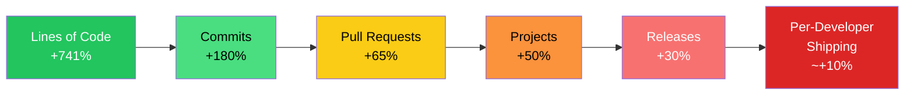
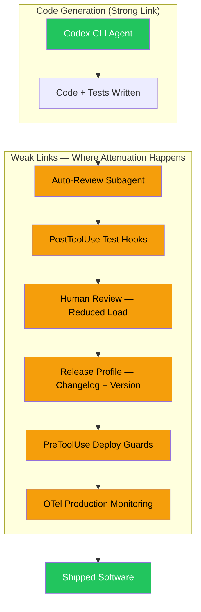

# Writing Code vs. Shipping Code: What the NBER Production Hierarchy Study Means for Your Codex CLI Release Workflows


---

In May 2026, economists Mert Demirer, Leon Musolff, and Liyuan Yang published NBER Working Paper 35275, "Writing Code vs. Shipping Code: Productivity Effects Across Generations of AI Coding Tools" [^1]. The study tracked over 100,000 GitHub developers matched with internal Microsoft AI usage telemetry [^2], producing the most rigorous empirical evidence yet that AI coding tools dramatically accelerate code production — but that those gains attenuate sharply as work moves through the production hierarchy towards shipped software.

The paper's central finding deserves the attention of every team deploying Codex CLI: **autonomous agents increase commits by 180%, but releases rise by only 30%** [^1]. The gap is not a tooling problem. It is a workflow architecture problem. And Codex CLI's configuration surface is unusually well-suited to addressing it.

## The Production Hierarchy Attenuation

The study identifies three generations of AI coding tools and measures their cumulative effect across four levels of the production hierarchy [^1]:

| Generation | Commits | Projects | Releases |
|---|---|---|---|
| Autocomplete (Copilot-era) | +40% | — | — |
| Interactive agents (Claude Code, local) | +140% | — | — |
| Autonomous agents (Codex, remote) | +180% | +50% | +30% |

The pattern is consistent: each generation amplifies code production more than the last, but the amplification compresses as it travels from individual commits through projects to actual releases. Lines of code increase by 741%, pull requests by 65%, but individual-developer shipping rises by roughly 10% [^3].



The authors estimate an elasticity of substitution of 0.25 between AI output and human effort [^3], meaning AI and human work are strong complements, not substitutes. When the AI-accelerated stage races ahead whilst human bottlenecks — code review, integration testing, release management, deployment security — remain unchanged, the overall pipeline barely speeds up.

## The Weak-Link Hypothesis

Demirer, Musolff, and Yang frame this through O-ring production theory: software delivery is a chain of sequential, complementary tasks where the weakest link determines throughput [^1]. Pouring more capacity into the strongest link (code generation) yields diminishing returns if the weakest links (review, verification, release) remain untouched.

They validate this across four major app marketplaces, finding that new application submissions increased but total user engagement remained flat [^3]. More code is being written; roughly the same amount of value is being delivered.

This has a direct implication for Codex CLI configuration. If your team's bottleneck is code review, no amount of `model = "gpt-5.6-sol"` or multi-agent parallelism will move your release cadence. You need to configure the agent to address the weak links.

## Mapping the Bottlenecks to Codex CLI Configuration

The NBER study identifies five human bottlenecks: integration, code review, release management, deployment security, and production maintenance [^3]. Each maps to specific Codex CLI configuration and workflow patterns.

### Bottleneck 1: Code Review

Code review is the most common weak link. Codex CLI's `auto_review` subagent can serve as a first-pass reviewer, catching style violations, security anti-patterns, and logic errors before human review [^4]:

```toml
# config.toml — enable guardian auto-review
approval_policy = "on-request"
approvals_reviewer = "auto_review"

[profiles.review]
model = "gpt-5.6-sol"
system_prompt = """
You are a code reviewer. Focus on:
1. Security vulnerabilities (injection, auth bypass, secrets in code)
2. Correctness errors (off-by-one, null handling, race conditions)
3. Performance regressions (N+1 queries, unbounded allocations)
Approve safe operations. Escalate anything uncertain.
"""
```

The `/review` command integrates with pull request workflows, providing structured feedback before human reviewers see the code [^4]. Combined with GitHub Copilot code review (GA since 29 July 2026), this creates a layered review pipeline that addresses the review bottleneck without removing human oversight [^5].

### Bottleneck 2: Integration Testing

The NBER data shows that more code does not mean more tested code. Codex CLI's `PostToolUse` hooks can enforce test execution after every file modification:

```toml
# Run tests after file writes
[[hooks.post_tool_use]]
event = "post_tool_use"
tool = "write"
command = "npm test -- --bail 2>&1 | tail -20"
```

For stronger guarantees, configure the agent to generate tests as part of every implementation task via AGENTS.md:

```markdown
## Testing Requirements

Every implementation MUST include:
1. Unit tests covering the happy path and at least two edge cases
2. Integration tests if the change touches API boundaries
3. All existing tests must pass before marking work complete

Do NOT claim completion without running `npm test` and confirming zero failures.
```

### Bottleneck 3: Release Management

The production hierarchy attenuation is steepest between "projects" (+50%) and "releases" (+30%). Release management — changelog generation, version bumping, deployment orchestration — is precisely the kind of structured, rule-bound work that agents handle well.

```toml
# config.toml — release profile
[profiles.release]
model = "gpt-5.6-terra"
approval_policy = "on-request"
system_prompt = """
You are a release engineer. Follow semantic versioning strictly.
Generate changelogs from git log --oneline since last tag.
Never skip the test suite. Never force-push to main.
"""
```

### Bottleneck 4: Deployment Security

The study's finding that deployment security gates absorb productivity gains aligns with Codex CLI's sandbox architecture. The `sandbox_mode` and network allowlisting provide containment, whilst `PreToolUse` hooks can validate commands before execution [^6]:

```toml
# Restrict network access during deployment scripts
sandbox_network_allow = [
  "registry.npmjs.org:443",
  "api.github.com:443",
  "ghcr.io:443"
]

[[hooks.pre_tool_use]]
event = "pre_tool_use"
tool = "shell"
command = "echo $CODEX_TOOL_ARGS | grep -qE '(rm -rf /|force-push|--no-verify)' && exit 1 || exit 0"
```

### Bottleneck 5: Production Maintenance

Corrective maintenance — the post-merge work of monitoring, debugging, and patching — is the final attenuation stage. Codex CLI's OpenTelemetry integration surfaces the data needed to close this loop:

```toml
# config.toml — enable telemetry for production feedback
[otel.metrics_exporter]
type = "otlp"
endpoint = "https://otel-collector.internal:4318"

[otel.resource_attributes]
service.name = "codex-cli"
deployment.environment = "production"
```

## The Token Budget Paradox

The NBER elasticity finding (0.25) has a practical correlate in token economics. The SWE-Marathon benchmark found that the lowest-spending token quintile achieved 11.3% task completion versus 8.3% for the highest quintile [^6]. Spending more tokens does not produce proportionally more shipped software — precisely the weak-link prediction.

Codex CLI's configurable rollout token budgets address this directly:

```toml
# config.toml — prevent runaway token spend
[rollout_budget]
limit_tokens = 500000
reminder_interval_tokens = 50000
```

The budget forces the agent to work within constraints, which the evidence suggests produces better outcomes than unbounded generation.

## A Workflow Architecture for Shipping, Not Just Committing

The NBER study's core lesson is architectural: teams that invest exclusively in code generation capacity are optimising the wrong link. The production hierarchy demands investment across the entire chain.



The practical configuration recipe combines four patterns:

1. **Layered review** — `auto_review` subagent + Copilot code review + reduced human review surface
2. **Test enforcement** — `PostToolUse` hooks that run the test suite after every code change
3. **Release automation** — Named profiles with release-specific system prompts and approval policies
4. **Production telemetry** — OpenTelemetry metrics feeding back into agent context for corrective maintenance

## What the Data Does Not Tell Us

The NBER study measures aggregate effects across a large population. It does not control for team-level workflow configuration — which is precisely the variable Codex CLI lets you tune. Teams that have already addressed their weak links may see substantially higher release-to-commit ratios than the population average.

The study also predates several July 2026 Codex CLI features: v0.146's improved skill retention under context budget pressure, the open-source Codex Security CLI for automated vulnerability scanning in CI [^5], and the MCP 2026-07-28 specification's Tasks extension for structured agent polling. Each of these targets a specific weak link.

⚠️ The app marketplace validation (new submissions up, engagement flat) is reported second-hand through summaries of the paper. The specific marketplace names and exact engagement figures require verification against the full NBER working paper.

## Conclusion

Demirer, Musolff, and Yang have quantified what many teams sense intuitively: agents make writing code dramatically faster, but shipping code is a fundamentally different problem. The 0.25 elasticity of substitution means that doubling AI output yields roughly a 19% increase in final output — unless you simultaneously strengthen the human links in the chain.

Codex CLI's configuration surface — hooks, profiles, auto-review, token budgets, sandbox policies, and telemetry — is designed to be deployed across the entire production hierarchy, not just at the code generation stage. The teams that close the 180%-to-30% gap will be those that configure their agents to address weak links, not just accelerate strong ones.

---

## Citations

[^1]: Demirer, M., Musolff, L., & Yang, L. (2026). "Writing Code vs. Shipping Code: Productivity Effects Across Generations of AI Coding Tools." NBER Working Paper No. 35275. [https://www.nber.org/papers/w35275](https://www.nber.org/papers/w35275)

[^2]: Freund, L. (2026). Discussion of NBER WP 35275 methodology — Microsoft telemetry matched with GitHub data. [https://x.com/_LukasFreund_/status/2061337947912523921](https://x.com/_LukasFreund_/status/2061337947912523921)

[^3]: Elest.io (2026). "AI Writes Code 7x Faster. Shipping It Is the New Bottleneck." — Summary of NBER WP 35275 findings including elasticity and marketplace validation. [https://blog.elest.io/ai-writes-code-7x-faster-shipping-it-is-the-new-bottleneck/](https://blog.elest.io/ai-writes-code-7x-faster-shipping-it-is-the-new-bottleneck/)

[^4]: Codex Knowledge Base (2026). "Codex CLI Guardian Approval: Configuring Auto-Review Policies." [https://codex.danielvaughan.com/2026/04/20/codex-cli-guardian-approval-configuring-auto-review-policies/](https://codex.danielvaughan.com/2026/04/20/codex-cli-guardian-approval-configuring-auto-review-policies/)

[^5]: GitHub Blog (2026). "Copilot Code Review GA with Agent Skills and MCP." [https://github.blog/changelog/2026-07-29-copilot-code-review-agent-skills-mcp/](https://github.blog/changelog/2026-07-29-copilot-code-review-agent-skills-mcp/)

[^6]: OpenAI (2026). Codex CLI Configuration Reference — sandbox_mode, hooks, otel, rollout_budget. [https://developers.openai.com/codex/config-reference](https://developers.openai.com/codex/config-reference)
