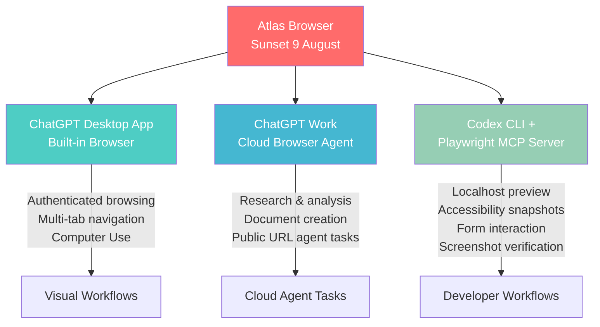
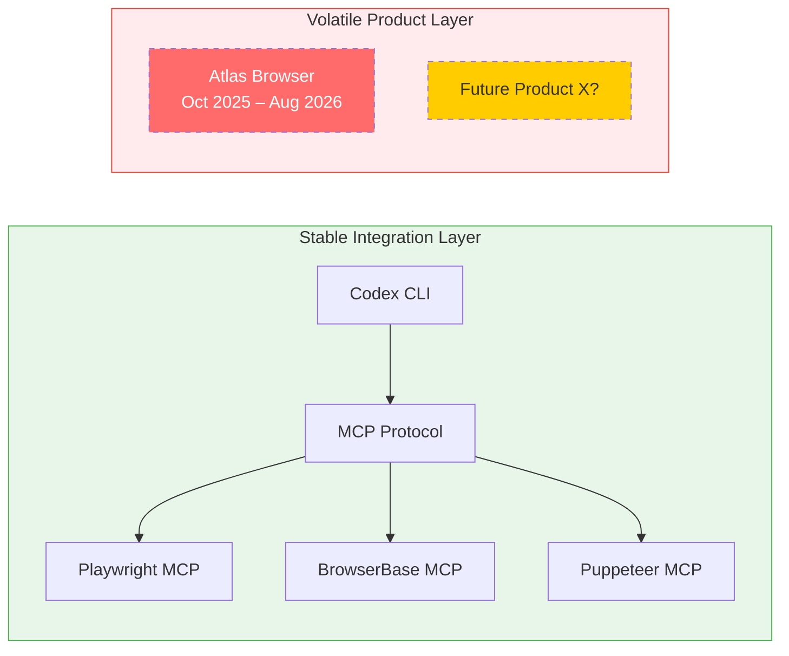

# Atlas Sunsets on 9 August: Migrating Browser-Agent Workflows to Codex CLI, Playwright MCP, and the ChatGPT Desktop App


---

OpenAI's Atlas browser — launched on 21 October 2025 as a standalone desktop browser with AI at its core — stops working on 9 August 2026 [^1]. That gives teams eight days to migrate any browser-dependent agentic workflows before the lights go off. For developers who had woven Atlas into their Codex CLI pipelines — previewing localhost builds, automating form-heavy test scenarios, or orchestrating cross-site research — the question is not whether to move, but where each workflow lands in the post-Atlas landscape.

This article maps every Atlas capability to its successor surface and shows how to configure Codex CLI for the transition.

## What Atlas Was — and Why It Mattered to Developers

Atlas shipped as a Chromium-based desktop browser with ChatGPT embedded directly in the navigation experience [^1]. Its Agent mode, previewed in early 2026, could autonomously visit pages, fill forms, download files, and maintain authenticated sessions across sites like GitHub, Linear, Jira, and Figma — all without the copy-paste friction of switching between a browser and an AI assistant [^2].

For Codex CLI users, Atlas offered something no MCP server could: a visual browser with persistent login state running on the same machine as the agent. Developers used it to:

- Preview localhost renders during front-end iteration loops
- Verify deployed staging environments mid-task
- Scrape authenticated internal tools (wikis, dashboards, admin panels)
- Drive form-heavy QA scenarios that Playwright scripts had not yet covered

The nine-month experiment is ending because OpenAI is consolidating Atlas's capabilities into two durable surfaces: the ChatGPT desktop application and ChatGPT Work [^2].

## The Replacement Architecture

The post-Atlas world splits browser-agent capabilities across three surfaces, each with a distinct scope:



### ChatGPT Desktop App: Authenticated Browsing and Computer Use

The merged ChatGPT desktop application — which now houses Chat, Work, and Codex on every plan, including Free [^3] — inherits Atlas's built-in browser with support for multiple tabs, downloads, improved navigation, and account login persistence [^2]. Computer Use, powered by GPT-5.6, handles click-type-move operations for one-off or scheduled tasks [^3].

For developers, this covers the "visual verification" use case: reviewing rendered pages, annotating UI issues, and instructing the agent to fix them without leaving the window [^4].

### ChatGPT Work: Cloud-Hosted Agent Tasks

ChatGPT Work, launched on 9 July 2026, handles research, analysis, and document creation using a cloud-hosted browser [^3]. It breaks goals into steps and returns finished artefacts — spreadsheets, presentations, reports, and Sites.

The critical architectural difference from Atlas: Work's browser runs in the cloud, not locally [^5]. Workflows that required access to `localhost` or internal network services cannot migrate here without rearchitecting.

### Codex CLI + Playwright MCP: The Developer Path

For Codex CLI users, the most capable replacement for Atlas's developer-facing workflows is the Playwright MCP server [^6]. Unlike Atlas's visual browser, Playwright MCP operates through structured accessibility snapshots — bypassing the need for screenshots or visually-tuned models — and provides deterministic, scriptable browser interaction.

## Configuring Playwright MCP for Codex CLI

The Playwright MCP server integrates with Codex CLI through the standard MCP configuration in `config.toml`:

```toml
[mcp_servers.playwright]
command = "npx"
args = ["@anthropic-ai/mcp-playwright"]
enabled = true
```

Alternatively, register it via the CLI:

```bash
codex mcp add playwright -- npx @anthropic-ai/mcp-playwright
```

The server exposes tools for navigation, element interaction, screenshot capture, and accessibility tree inspection [^6]. For localhost preview workflows — the most common Atlas use case among Codex CLI developers — this provides a direct replacement:

```bash
# Start your dev server, then use Codex CLI with Playwright MCP
npm run dev &
codex "Navigate to http://localhost:3000, verify the login page renders correctly, \
       check that the form fields are accessible, and screenshot the result"
```

### Scoping Playwright Access in the Sandbox

Codex CLI's sandbox restricts network access by default. For Playwright MCP to reach localhost or staging URLs, configure the network proxy allowlist:

```toml
[sandbox]
network_proxy_allowed_domains = [
  "localhost",
  "127.0.0.1",
  "*.staging.internal.example.com"
]
```

For production-like environments behind authentication, pair Playwright MCP with a cookie-injection pattern or use environment variables for service tokens:

```toml
[env]
STAGING_TOKEN = "env:STAGING_AUTH_TOKEN"
```

## Migration Decision Matrix

Not every Atlas workflow maps to the same successor. Use this decision matrix:

| Atlas Workflow | Successor | Configuration |
|---|---|---|
| Localhost front-end preview | Codex CLI + Playwright MCP | `config.toml` MCP server + sandbox allowlist |
| Authenticated site browsing (GitHub, Jira, Figma) | ChatGPT Desktop App browser | Built-in, no CLI configuration needed |
| Autonomous web research | ChatGPT Work | Cloud-hosted, no CLI configuration needed |
| Form-heavy QA automation | Codex CLI + Playwright MCP | Accessibility snapshots + element interaction tools |
| Visual regression checking | Codex CLI + Playwright MCP | Screenshot tool + comparison in AGENTS.md workflow |
| Cross-site data gathering | ChatGPT Work or Codex CLI web search | `codex --web-search` or indexed search mode |
| Computer Use (click-type-move) | ChatGPT Desktop App | GPT-5.6 powered, desktop-only |

## AGENTS.md Patterns for Browser-Agent Workflows

With Atlas gone, browser interaction via Playwright MCP requires explicit guidance in your `AGENTS.md` to prevent the agent from attempting browser operations without the MCP server:

```markdown
## Browser Interaction Rules

- ALWAYS use the Playwright MCP server for browser interaction — never attempt
  to launch a browser directly
- For localhost previews, ensure the dev server is running before navigation
- Use accessibility snapshots over screenshots where possible — they consume
  fewer tokens and provide structured data
- Screenshot only for visual regression verification or layout debugging
- Never store authentication credentials in AGENTS.md — use environment
  variables via config.toml [env] section
```

## Data Export Before 9 August

Atlas data does not transfer automatically [^2]. Before the shutdown:

1. **Bookmarks**: Export to Chrome or the ChatGPT desktop app
2. **Passwords and cookies**: Export to the ChatGPT desktop app's integrated browser
3. **Browser history**: No automated export — manually save any critical URLs
4. **Saved pages or downloads**: Already on your local filesystem; no action needed

For teams that built Atlas-dependent automations (scheduled browsing tasks, recurring form submissions), audit these now and rebuild them as either ChatGPT Work tasks or Codex CLI + Playwright MCP workflows.

## The Architectural Lesson

Atlas's nine-month lifespan underscores a pattern that senior developers should internalise: OpenAI's durable integration surfaces are the ChatGPT API, Codex (both CLI and cloud), and the Realtime API [^5]. Standalone product experiments like Atlas are useful for proving capabilities but carry deprecation risk.

For Codex CLI users, the lesson is practical: build browser-dependent workflows on the MCP server layer, not on first-party GUI products. Playwright MCP, BrowserBase MCP, and Puppeteer MCP servers all provide browser automation through the stable MCP protocol — a protocol that survives product consolidation because it sits below the application layer.



## What Changes on 10 August

After 9 August 2026:

- Atlas will no longer open or support browser-based agentic workflows [^2]
- The ChatGPT desktop app's built-in browser becomes the primary visual browsing surface
- ChatGPT Work handles cloud-hosted autonomous browser tasks
- Codex CLI + Playwright MCP remains the developer-native path for programmatic browser interaction
- No Codex CLI configuration changes are required — the CLI never depended on Atlas directly

The transition is less a migration and more a clarification: Atlas was always a preview of capabilities that now live in more durable homes. For CLI-first developers, nothing breaks on 10 August — provided you were already using MCP servers rather than relying on Atlas as a manual bridge.

## Citations

[^1]: [OpenAI Pulls Plug on ChatGPT Atlas Browser After Nine Months](https://www.webpronews.com/openai-pulls-plug-on-chatgpt-atlas-browser-after-nine-months/) — WebProNews, July 2026

[^2]: [Evolving Atlas into ChatGPT for browser-based agentic work](https://help.openai.com/en/articles/20001371-evolving-atlas-into-chatgpt-for-browser-based-agentic-work) — OpenAI Help Centre, July 2026

[^3]: [ChatGPT is now a partner for your most ambitious work](https://openai.com/index/chatgpt-for-your-most-ambitious-work/) — OpenAI, July 2026

[^4]: [Codex Merged With ChatGPT App: What Changed & How to Access](https://coursiv.io/blog/codex-merged-with-chatgpt-app) — Coursiv, July 2026

[^5]: [OpenAI Atlas Browser Shuts Down August 9, 2026: Migration Guide](https://chatforest.com/builders-log/openai-atlas-browser-shutdown-august-9-chatgpt-work-migration-builder-guide/) — ChatForest Builder's Guide, July 2026

[^6]: [Playwright MCP Server Documentation](https://playwright.dev/docs/getting-started-mcp) — Microsoft Playwright, 2026
