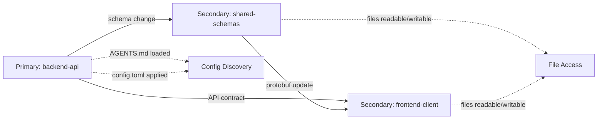
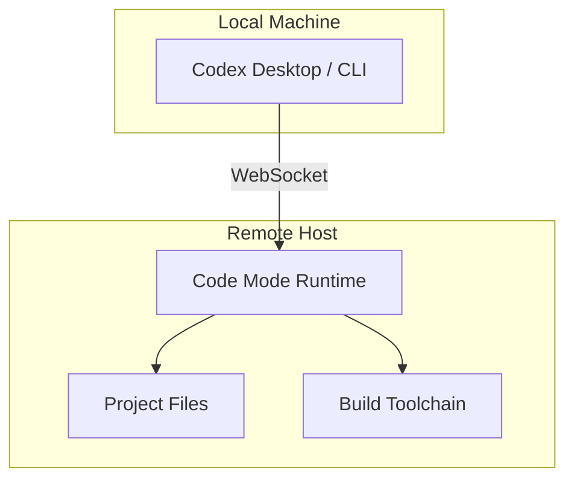

# Codex CLI v0.146: Multi-Folder Projects, Primary Folder Discovery, and Voice-Driven Agent Orchestration


---

Codex CLI v0.146.0, released on 29 July 2026, ships three features that collectively reshape how developers interact with multi-repository codebases: **multi-folder project support**, **ChatGPT Voice integration powered by GPT-Live**, and **WebSocket transport for remote Code Mode hosts**[^1]. This article unpacks each feature, walks through the configuration mechanics, and examines how they compose into workflows that were previously impossible with a single-folder agent session.

## The Problem: Agents That Cannot See Across Repository Boundaries

Most non-trivial development tasks span multiple repositories. A typical full-stack change might touch a backend API service, a shared protobuf or OpenAPI schema repository, a frontend client, and an infrastructure-as-code repository[^2]. Until v0.146, Codex CLI sessions were anchored to a single project root — the nearest `.git` directory found by walking up from the working directory. The `--add-dir` flag offered a workaround by making additional directories writable, but it carried limitations: the diff panel only showed changes for the starting repository, and configuration discovery (AGENTS.md, skills, config.toml) remained tied to the initial root[^3].

Multi-folder projects address this gap directly.

## Multi-Folder Projects: How It Works

### Primary and Secondary Folders

In the ChatGPT desktop app (build 26.715), a local project can now include multiple related folders[^1]. One folder is designated as the **primary folder**; the remainder are **secondary folders**. The distinction governs three of Codex's core systems simultaneously:

| Concern | Primary Folder | Secondary Folders |
|---------|---------------|-------------------|
| New chats | ✅ Started here | — |
| Git operations | ✅ PRs, commits, branches | Read/write access only |
| AGENTS.md discovery | ✅ Loaded as operating contract | Readable as a file, not loaded |
| Skills discovery | ✅ Auto-discovered | Not auto-discovered |
| config.toml discovery | ✅ Applied | Not applied |
| File search, read, edit | ✅ | ✅ |

This is the critical design decision: an `AGENTS.md` in a secondary folder is a file Codex can open — not an operating contract it loads[^4]. Configuration authority flows exclusively from the primary folder.

### Setting Up Multi-Folder Projects

From the desktop app, the setup is straightforward:

1. Open the project menu for an existing local project
2. Select **Edit project**
3. Add folders and designate the primary folder
4. Save — Codex immediately discovers the updated folder set

The configuration is stored within `.codex/` at the project root and can be checked into Git for team-wide consistency[^4].

### CLI Behaviour

For CLI users, Codex continues to discover project configuration by walking up from the working directory until it reaches a `.git` root[^5]. The `--add-dir` flag remains available for ad-hoc multi-directory sessions:

```bash
# CLI: add secondary folders to a session
codex --add-dir ../shared-schemas --add-dir ../frontend-client
```

The desktop app's multi-folder feature provides a persistent, project-level equivalent of this pattern — folders persist across sessions rather than requiring re-specification on each launch.

## Practical Workflow: Full-Stack API Change

Consider a common scenario: adding a new field to a backend API that must propagate through a shared schema repository and into a frontend client.



With multi-folder projects, a single Codex session can:

1. Read the existing schema definition in `shared-schemas/`
2. Add the new field to the protobuf definition
3. Regenerate the Go/TypeScript stubs
4. Update the backend handler in `backend-api/`
5. Update the frontend component in `frontend-client/`

All changes appear in a unified context. Git operations — commits, branch creation, PR drafting — route through the primary folder's repository.

## ChatGPT Voice: Talking to Your Agent Fleet

The second headline feature in v0.146 is ChatGPT Voice integration in the desktop app, powered by GPT-Live[^1][^6].

### Dual-Model Architecture

Voice uses a two-model delegation system:

- **GPT-Live** handles real-time conversation — listening and speaking simultaneously, deciding multiple times per second when to speak, pause, or invoke tools
- **GPT-5.6 Terra** coordinates background task execution, spawning and steering concurrent coding agents

A single voice instruction can fan out into multiple parallel agent threads: investigating bugs, reviewing pull requests, generating unit tests, and tracing issues across Slack, GitHub, and local codebases[^6].

### Plan and Usage Metering

Voice minutes operate on rolling five-hour cycles, separate from Codex task budgets[^6]:

| Plan | Voice Window | Codex Tasks |
|------|-------------|-------------|
| Plus | 15–30 min / 5 hr | Metered |
| Pro (\$200/mo) | Unlimited minutes | Still metered |
| Business / Enterprise | 45 min / 5 hr | Credit-based |

### Limitations Worth Noting

Voice remains app-locked — there is no developer API for GPT-Live, and it cannot be integrated into custom products or CI/CD pipelines. The Realtime API remains the only buildable path for developers creating their own voice agents[^6]. On Windows, Appshots (screen context sharing) are unavailable at launch.

## WebSocket Transport for Remote Code Mode

The third feature is less visible but architecturally significant: v0.146 enables the app-server to connect to remote Code Mode hosts over WebSocket[^1]. Previously, the code-mode runtime had to live on the same machine as the client. With WebSocket transport, the execution environment can run on a remote server — a cloud VM, a devbox, or a shared team machine — whilst the local client handles the user interface.

This pairs naturally with Codex Remote (GA since May 2026), which already allows sessions to be supervised from the ChatGPT mobile app on iOS[^7]. WebSocket transport extends the same principle to the CLI and desktop app, enabling scenarios like:



For enterprise teams with centralised development servers or regulated environments where code must not leave specific infrastructure, this is a meaningful unlock.

## Additional Changes in v0.146

Beyond the headline features, v0.146 includes several targeted improvements[^1]:

- **Standalone web search for custom model providers** — web search now works with compatible custom providers, not just OpenAI's default models
- **Agent Plugins manifests** — workspace plugin publishing now extends to Amazon Bedrock and Claude Code marketplaces
- **Proxy consistency fixes** — configured proxies now function correctly across authentication, plugin downloads, MCP authorisation, remote execution, WebSockets, and LM Studio connections
- **Enterprise plan (ent26) recognition** — administrator controls for in-app updates
- **Terminal responsiveness** — nonblocking interrupts and enhanced keyboard handling

## Configuration Checklist

For teams adopting multi-folder projects, here is a minimal configuration checklist:

```toml
# config.toml — primary folder only
# This file is discovered from the primary folder's .codex/ directory

[model]
default = "gpt-5.6-terra"          # Default model for all sessions
review_model = "gpt-5.6-luna"      # Cheaper model for review tasks

[sandbox]
mode = "workspace-write"           # Allow writes across all project folders

[tui]
vim_mode_default = true            # Optional: Vim keybindings
```

Ensure your primary folder's `AGENTS.md` references conventions that span all secondary folders:

```markdown
<!-- AGENTS.md in the primary folder -->
# Project Context

This project spans three repositories:
- `backend-api/` — Go service, primary folder
- `shared-schemas/` — Protobuf definitions
- `frontend-client/` — React TypeScript app

## Conventions
- All API changes must update the protobuf schema first
- Frontend types are auto-generated from protobuf — never edit manually
- Run `make proto-gen` in shared-schemas/ after schema changes
```

## When to Use Multi-Folder vs --add-dir

| Scenario | Recommended Approach |
|----------|---------------------|
| Persistent team project with stable folder set | Multi-folder project (desktop app) |
| One-off cross-repo investigation | `--add-dir` flag (CLI) |
| CI/CD pipeline with multiple checkouts | `--add-dir` flag (CLI) |
| Monorepo with internal packages | Single folder — no multi-folder needed |

## What This Means for Polyrepo Teams

Multi-folder projects are Codex's answer to the polyrepo reality of enterprise development. Rather than forcing teams into monorepo structures or accepting the friction of single-folder agent sessions, v0.146 lets the agent see and operate across repository boundaries whilst maintaining clear configuration authority through the primary folder model.

Combined with Voice for hands-free orchestration and WebSocket for remote execution, this release marks a shift from Codex as a single-directory coding assistant to Codex as a workspace-aware development platform.

---

## Citations

[^1]: OpenAI Developers, "Codex changelog — v0.146.0 (26.715)", ChatGPT Learn, 29 July 2026. [https://learn.chatgpt.com/docs/changelog](https://learn.chatgpt.com/docs/changelog)

[^2]: Daniel Vaughan, "Codex CLI for Cross-Repository Development: Multi-Repo Sessions, Coordination Patterns, and MCP-Bridged Workflows", Codex Knowledge Base, 19 May 2026. [https://codex.danielvaughan.com/2026/05/19/codex-cli-cross-repository-development-multi-repo-sessions-coordination-patterns/](https://codex.danielvaughan.com/2026/05/19/codex-cli-cross-repository-development-multi-repo-sessions-coordination-patterns/)

[^3]: GitHub, "workspace-level multi-repo support in Codex app — Issue #15168", openai/codex, 19 March 2026. [https://github.com/openai/codex/issues/15168](https://github.com/openai/codex/issues/15168)

[^4]: @CodexReleases, "Multi-folder projects: From a project's menu, select Edit project to add folders and designate the primary folder", X (formerly Twitter), 29 July 2026. [https://x.com/CodexReleases/status/2080374815760789985](https://x.com/CodexReleases/status/2080374815760789985)

[^5]: OpenAI Developers, "Advanced Configuration — Project root detection", ChatGPT Learn, 2026. [https://learn.chatgpt.com/docs/config-file/config-advanced](https://learn.chatgpt.com/docs/config-file/config-advanced)

[^6]: Digital Applied, "ChatGPT Voice Hits Desktop — and It Can Drive Codex", 23 July 2026. [https://www.digitalapplied.com/blog/chatgpt-voice-desktop-codex-hands-free-agentic-coding](https://www.digitalapplied.com/blog/chatgpt-voice-desktop-codex-hands-free-agentic-coding)

[^7]: OpenAI, "Work with Codex from anywhere", openai.com, May 2026. [https://openai.com/index/work-with-codex-from-anywhere/](https://openai.com/index/work-with-codex-from-anywhere/)
