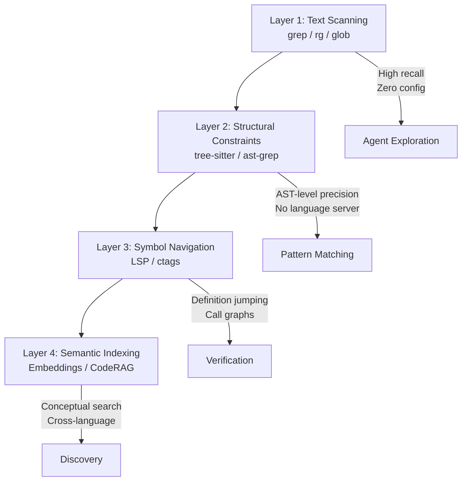

# CORE-Bench and the Code Retrieval Gap: Why Your Agent's grep Habit Isn't Enough — and How to Build a Retrieval Funnel in Codex CLI


---

Every coding agent on the market — Codex CLI, Claude Code, Cursor, Aider — defaults to the same search primitive: `ripgrep` [^1]. It is fast, stateless, universally available, and produces false positives that LLMs filter comfortably. For most tasks, grep is good enough. But a new benchmark from Zhang et al. quantifies exactly where "good enough" breaks down, and the numbers are stark.

## The CORE-Bench Contribution

CORE-Bench (Comprehensive Benchmark for Code Retrieval in the Era of Agentic Coding) was submitted to arXiv on 10 June 2026 and revised on 13 July 2026 [^2]. It evaluates code retrieval at three increasingly difficult levels:

| Level | Task | Scale |
|-------|------|-------|
| **L1: Code Understanding** | Text-to-code, code-to-text, code-to-code snippet matching | 172K queries, 2.4M corpus items |
| **L2: Issue-to-Edit Localisation** | Given a bug report or feature request, find the files requiring modification | 5,061 queries across 632 repositories |
| **L3: Broader Context Retrieval** | Retrieve auxiliary code, documentation, and tests needed to understand the change | 2,580 queries, 106K relevance labels |

L2 and L3 are built from SWE-bench-series instances, grounding them in real resolved issues rather than synthetic tasks [^2].

## The Performance Cliff

The headline result is a dramatic performance collapse as retrieval moves from snippet-level matching to repository-aware search:

| Model | L1 NDCG@10 | L2 NDCG@10 | L3 NDCG@10 | L1→L2 Drop |
|-------|-----------|-----------|-----------|-----------|
| Qwen3-8B | 71.7 | 20.3 | 34.4 | ~72% |
| e5-mistral-7b | 54.7 | 18.3 | 33.9 | ~67% |
| CodeRankEmbed (137M) | — | moderate | moderate | — |
| SweRankEmbed-Large (7B) | — | competitive | competitive | — |

Code-specific embedding models (CodeRankEmbed, Jina Code, SweRankEmbed-Large) do not meaningfully close the gap [^2]. The problem is structural: L1 asks "which function matches this description?" while L2 asks "given this bug report with an error string, a stack trace, and a vague title, which of 9.38 million chunks in this repository need changing?"

Three findings stand out for agent builders:

1. **Cross-level correlation is weak.** A model's L1 score only moderately predicts its L2 score. Evaluating your retrieval on snippet benchmarks tells you almost nothing about real-world agent performance [^2].

2. **Dense repositories punish recall.** Recall@100 drops sharply in large, tightly-coupled codebases even when NDCG@10 remains stable — relevant chunks are pushed beyond the top-100 results [^2].

3. **Query rewriting can hurt.** Cleaning up issue text sometimes removes repository-specific anchors (error strings, API names, concrete URLs) that are critical retrieval signals [^2].

## Why Codex CLI Defaults to grep — and Why That's Mostly Right

Codex CLI's search architecture is deliberately minimal. The agent operates through a shell tool, and OpenAI's own documentation instructs it to prefer `rg` and `rg --files` because ripgrep is faster than grep [^3]. There is no built-in embedding index, no LSP integration, and no AST-aware search.

This is a defensible design choice for several reasons that Boris Cherny articulated for Claude Code: "Claude Code's agentic search is really just glob and grep, and it outperformed RAG" [^1]. The argument rests on three properties:

- **Zero startup cost.** No indexing step, no daemon, no configuration. The agent works immediately on any repository.
- **Universal file coverage.** grep searches YAML, Dockerfiles, shell scripts, markdown — everything LSP cannot reach.
- **Benign failure mode.** grep produces false positives that LLMs filter easily. LSP and embedding search produce false negatives that create dangerous blind spots in agent reasoning.

But CORE-Bench's L2 results expose the ceiling. When the agent needs to find the right file to edit in a 10,000-file monorepo from a vague bug report, grep alone forces it into a multi-step exploratory loop: grep for the error string, read surrounding files, grep again with refined terms, read more files. Each round-trip consumes tokens and latency. In CORE-Bench's terms, the agent is doing agentic search — using reasoning between retrieval steps — rather than retrieval in a single pass [^4].

## The Retrieval Funnel: Four Layers

The industry has converged on a layered retrieval architecture that maps cleanly onto Codex CLI's extensibility model [^1][^5]:



Each layer trades recall for precision and adds configuration cost. The key insight from CORE-Bench is that L2 tasks (issue-to-edit localisation) sit squarely in the gap between Layer 1 and Layer 3 — too vague for grep, too concrete for pure semantic search [^2].

## Wiring the Funnel into Codex CLI

Codex CLI's MCP integration makes it straightforward to add retrieval layers without modifying the core agent. Here is a practical four-layer configuration:

### Layer 1: Built-in grep (already active)

No configuration needed. Codex CLI's shell tool has access to `rg` by default.

### Layer 2: Structural search via ast-grep MCP

```toml
# ~/.codex/config.toml

[mcp_servers.ast-grep]
command = "npx"
args = ["-y", "@anthropic/ast-grep-mcp"]
enabled_tools = ["ast_grep_search", "ast_grep_match"]
```

ast-grep uses tree-sitter grammars to match structural patterns — "find all functions that call `db.query` with an unchecked error" — without the overhead of a full language server [^5].

### Layer 3: Symbol navigation via LSP MCP

```toml
[mcp_servers.lsp-bridge]
command = "lsp-mcp-bridge"
args = ["--workspace", "."]
enabled_tools = ["goto_definition", "find_references", "workspace_symbols"]
```

LSP provides precise definition jumping, reference finding, and type information. It requires language server installation per language, making it higher-friction but essential for verification tasks [^1].

### Layer 4: Semantic search via CodeRAG MCP

```toml
[mcp_servers.coderag]
command = "coderag"
args = ["serve", "--workspace", ".", "--index-on-start"]
enabled_tools = ["search_code", "search_files"]
```

CodeRAG provides hybrid BM25 + embedding search with symbol-aware chunking [^6]. The `search_code` tool handles semantic queries ("find the authentication middleware") while `search_files` falls back to ripgrep for exact matches.

### AGENTS.md Retrieval Strategy

The retrieval funnel only works if the agent knows when to use each layer. Add this to your `AGENTS.md`:

```markdown
## Code Search Strategy

1. **Start with grep** (`rg`) for error strings, function names, and exact identifiers.
2. **Escalate to ast-grep** when searching for structural patterns (e.g., "all async functions that don't await their return value").
3. **Use LSP tools** for definition jumping, call graphs, and type verification — never for exploratory search.
4. **Use CodeRAG search_code** when the query is conceptual ("where is rate limiting implemented?") or when grep returns too many results to filter.

Never start with semantic search. Always start with grep.
```

## Supervised Fine-Tuning: The CORE-Bench Escape Hatch

CORE-Bench's most actionable finding is that supervised fine-tuning on repository-level retrieval data dramatically improves L2 and L3 performance [^2]:

| Model | L2 NDCG Baseline | L2 NDCG After SFT | Improvement |
|-------|-----------------|-------------------|-------------|
| Qwen3-0.6B | 17.0 | 26.5 | +56% |
| Qwen3-8B | 20.3 | 32.8 | +62% |

The training data was 53,301 GitHub pull requests across 628 repositories, using multi-positive InfoNCE loss with repository-local hard negatives [^2]. This matters for Codex CLI users because it suggests that a fine-tuned embedding model, served locally via an MCP server, could close most of the retrieval gap at modest computational cost — a 0.6B parameter model running on CPU achieves 80% of the 8B model's SFT performance.

WarpGrep from Morph already implements a version of this approach: a purpose-trained reinforcement-learning model that takes a natural-language question and returns `(file, [start_line, end_line])` spans, shipped as an MCP server [^7].

## What CORE-Bench Does Not Measure

Three limitations worth noting:

1. **Token cost of multi-step search.** CORE-Bench evaluates single-pass retrieval quality. It does not measure the token cost of an agent's exploratory grep loops, which is where the real production cost lies.

2. **Repository freshness.** The benchmark uses fixed repository snapshots. In practice, agents work on actively modified codebases where the index may be stale. ⚠️

3. **Cross-language retrieval.** L2 and L3 tasks are segmented by language. The benchmark does not evaluate retrieval across language boundaries (e.g., finding the Python test for a TypeScript function), which is increasingly common in polyglot repositories.

## Practical Recommendations

For teams running Codex CLI on repositories under 5,000 files, grep alone is likely sufficient — the agent's multi-step exploration loop converges quickly enough that the token overhead is acceptable.

For larger repositories, or repositories with high issue-to-edit ambiguity (vague bug reports, cross-cutting concerns), adding a semantic retrieval layer via MCP delivers measurable improvement. CORE-Bench's SFT results suggest that even a small, locally-hosted embedding model — paired with grep as the primary search tool — can reduce the number of exploratory round-trips by pushing relevant files into the top-10 results on the first query.

The retrieval funnel is not about replacing grep. It is about knowing when grep is not enough and having the next layer ready.

---

## Citations

[^1]: "Why Coding Agents Still Use grep as Their Search Backbone," YageAI, 27 March 2026. [https://yage.ai/share/why-coding-agents-still-use-grep-en-20260327.html](https://yage.ai/share/why-coding-agents-still-use-grep-en-20260327.html)

[^2]: Zhang, F., Zhang, Y., Li, M., Long, D., Hu, L., Xie, P., Zhang, Z. & Zhuang, F. "CORE-Bench: A Comprehensive Benchmark for Code Retrieval in the Era of Agentic Coding." arXiv:2606.11864v2, 13 July 2026. [https://arxiv.org/abs/2606.11864](https://arxiv.org/abs/2606.11864)

[^3]: OpenAI. "Codex CLI Documentation." OpenAI Developers, 2026. [https://developers.openai.com/codex/cli](https://developers.openai.com/codex/cli)

[^4]: "Agentic Search: How Coding Agents Find the Right Code," Morph, 2026. [https://www.morphllm.com/agentic-search](https://www.morphllm.com/agentic-search)

[^5]: "Code search for AI agents: the grep replacement is three tools, not one," Andrey Kumanyaev, 2026. [https://zzet.org/gortex/grep-replacement-for-ai-agents/](https://zzet.org/gortex/grep-replacement-for-ai-agents/)

[^6]: CodeRAG. "Local-first, zero-key semantic code search for large and custom codebases." GitHub, 2026. [https://github.com/Neverdecel/CodeRAG](https://github.com/Neverdecel/CodeRAG)

[^7]: "WarpGrep and Codex CLI: Adding an RL-Trained Code Search Subagent via MCP," Codex Knowledge Base, 12 May 2026. [https://codex.danielvaughan.com/2026/05/12/codex-cli-warpgrep-mcp-rl-code-search-subagent-morph/](https://codex.danielvaughan.com/2026/05/12/codex-cli-warpgrep-mcp-rl-code-search-subagent-morph/)
