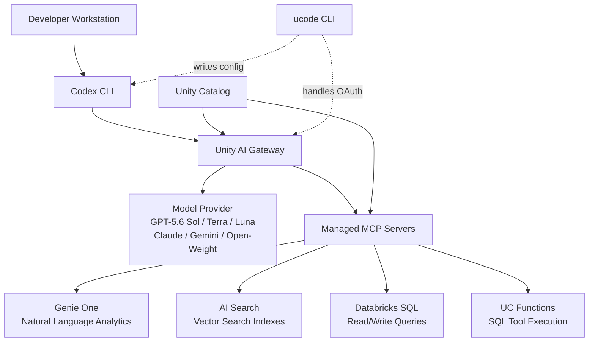
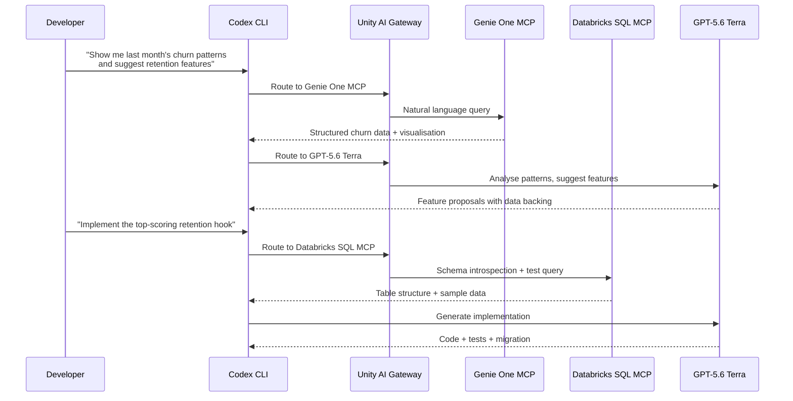

# Databricks Unity AI Gateway and Codex CLI: Governed Enterprise Data Access via Agent Bricks, Managed MCP Servers, and the ucode CLI


---

Most organisations running Codex CLI at scale hit the same wall: developers adopt the tool faster than platform teams can govern it. Individual engineers configure API keys in `~/.codex/config.toml`, route through personal OpenAI accounts, and submit tokens against models the security team has never approved. Databricks calls this **coding agent sprawl**, and at Data + AI Summit (DAIS) 2026 on 16 June, they shipped the infrastructure to fix it — Unity AI Gateway for coding agents, managed MCP servers backed by Unity Catalog, and a companion CLI called `ucode` that writes Codex CLI configuration automatically.[^1]

This article walks through the integration architecture, the configuration surface, and the governance model that connects Codex CLI to enterprise data through Databricks.

## The Problem: Ungoverned Agent Sprawl

A 2026 Databricks survey found that enterprise engineering teams now use an average of three to four coding agents simultaneously — Codex CLI, Cursor, Gemini CLI, GitHub Copilot, and others.[^2] Each agent brings its own authentication, model selection, and cost tracking. Platform teams lose visibility into which models are being called, how many tokens are consumed, and whether sensitive enterprise data is being exposed to external providers.

Unity AI Gateway addresses this by routing every model and MCP request through a centralised governance layer that enforces rate limits, per-user budgets, guardrails, and audit logging across all coding agents from a single control plane.[^2]

## Architecture Overview

The integration spans three layers:



Unity Catalog enforces permissions at every layer. Agents and users access only the tools and data explicitly granted to them — the same governance model that controls table-level access for human analysts now extends to agent tool calls.[^3]

## Quick Start: The ucode CLI

The fastest path to a governed Codex CLI setup is `ucode`, an open-source CLI from Databricks that handles OAuth, writes the agent's configuration file, and routes traffic through any LLM or MCP server registered in Unity AI Gateway.[^4]

### Installation

```bash
uv tool install git+https://github.com/databricks/ucode
```

Requires Python 3.12 or later and the `uv` package manager.[^4]

### First Launch

```bash
ucode codex
```

On first launch, `ucode` prompts for your Databricks workspace URL, authenticates via browser-based OAuth, and writes `~/.codex/config.toml` automatically. Subsequent launches go straight to the Codex CLI session.[^4]

### Supported Agents

`ucode` supports six agents as of v0.146.0:

| Command | Agent |
|---|---|
| `ucode codex` | OpenAI Codex CLI |
| `ucode claude` | Claude Code |
| `ucode gemini` | Gemini CLI |
| `ucode opencode` | OpenCode |
| `ucode copilot` | GitHub Copilot CLI |
| `ucode pi` | Pi |

The `ucode configure` command sets up multiple agents simultaneously, and `ucode usage` displays a seven-day usage summary across all configured agents.[^4]

## Manual Configuration: config.toml

For teams that prefer explicit configuration or need to customise beyond what `ucode` generates, the manual setup requires three steps.

### Step 1: Authenticate with Databricks

```bash
databricks auth login --host https://your-workspace.cloud.databricks.com
```

This stores OAuth credentials locally. The token is refreshed automatically by the `auth.command` configuration below.[^4]

### Step 2: Configure the Model Provider

Create or update `~/.codex/config.toml`:

```toml
profile = "databricks"

[profiles.databricks]
model_provider = "Databricks"

[model_providers.Databricks]
name = "Databricks Unity AI Gateway"
base_url = "https://your-workspace.cloud.databricks.com/ai-gateway/codex/v1"
wire_api = "responses"

[model_providers.Databricks.auth]
command = "sh"
args = ["-c", "databricks auth token --host https://your-workspace.cloud.databricks.com --output json | jq -r '.access_token'"]
timeout_ms = 5000
refresh_interval_ms = 1800000
```

The `auth.command` approach is identical to how Codex CLI handles Amazon Bedrock authentication — the CLI calls the specified command, captures the token from stdout, and refreshes it every 30 minutes.[^4]

### Step 3: Select a Model

Launch Codex CLI and use the `/model` command to switch between models registered in your AI Gateway. Models appear with the `system.ai.` prefix — for example, `system.ai.databricks-gpt-5-6-sol` or `system.ai.glm-5-2` for open-weight alternatives.[^4]

## Five Managed MCP Servers

Databricks hosts and manages five production-ready MCP servers, each backed by Unity Catalog governance. No infrastructure setup is required — they are available at workspace-level URLs.[^3]

### Genie One (Beta)

Genie One brings agentic analytics into Codex CLI sessions. Ask natural-language questions against enterprise datasets and receive structured answers grounded in Genie Ontology, with inline visualisations.[^3]

```
URL: https://<workspace>/api/2.0/mcp/genie-one/sse
OAuth scope: genie
```

### Genie Agent

Query individual Genie Agents in read-only mode. A critical limitation: Genie Agent does not pass conversation history to the Genie API, so multi-turn analytical conversations require the orchestrating agent (Codex CLI) to preserve context.[^3]

### AI Search (Formerly Vector Search)

Query AI Search indexes backed by Databricks-managed embeddings. Useful for retrieval-augmented generation workflows where Codex CLI needs to search documentation, internal wikis, or knowledge bases stored in Unity Catalog.[^3]

```
URL: https://<workspace>/api/2.0/mcp/ai-search/sse
OAuth scope: ai-search
```

### Databricks SQL

Read and write access to SQL warehouses. SQL queries run asynchronously — the MCP tool starts the query, then Codex CLI polls until the response completes. This is a deliberate design choice for long-running analytical queries that may take minutes.[^3]

```
URL: https://<workspace>/api/2.0/mcp/sql/sse
OAuth scope: sql
```

### Unity Catalog Functions

Execute predefined SQL functions registered in Unity Catalog. The server dynamically infers available tools at startup based on the functions within the specified schema, replicating their names, arguments, and return types as MCP tool definitions.[^3]

```
URL: https://<workspace>/api/2.0/mcp/unity-catalog/sse
OAuth scope: unity-catalog
```

## Connecting MCP Servers to Codex CLI

Add managed MCP servers to your `config.toml`:

```toml
[mcp_servers.databricks-genie]
url = "https://your-workspace.cloud.databricks.com/api/2.0/mcp/genie-one/sse"
headers = { Authorization = "Bearer ${DATABRICKS_TOKEN}" }

[mcp_servers.databricks-sql]
url = "https://your-workspace.cloud.databricks.com/api/2.0/mcp/sql/sse"
headers = { Authorization = "Bearer ${DATABRICKS_TOKEN}" }

[mcp_servers.databricks-ai-search]
url = "https://your-workspace.cloud.databricks.com/api/2.0/mcp/ai-search/sse"
headers = { Authorization = "Bearer ${DATABRICKS_TOKEN}" }
```

For dynamic token injection, use the `auth.command` pattern from the model provider configuration to avoid hardcoding tokens. Alternatively, set `DATABRICKS_TOKEN` as an environment variable populated by `databricks auth token`.[^4]

## Governance: What Platform Teams Control

Unity AI Gateway provides four governance dimensions relevant to Codex CLI deployments.[^2]

### Rate Limiting and Cost Caps

Administrators set per-user and per-team token budgets across all coding agents. A developer burning through tokens in Codex CLI and Cursor simultaneously draws from the same budget pool, preventing shadow spend.[^2]

### Model Access Policies

Gateway policies can allow, deny, or require approval for specific models. An organisation might permit GPT-5.6 Terra for general development but restrict GPT-5.6 Sol to production incident investigation, routing the decision through Unity AI Gateway rather than relying on each developer's `config.toml`.[^2]

### Runtime Guardrails

Policies can be applied based on user identity, agent type, model provider, MCP service, specific tool being invoked, or the contents of the request and response. For example, a guardrail might block queries containing personally identifiable information from being sent to external model providers.[^2]

### Audit Logging

Every model interaction and MCP tool call is recorded in inference tables, providing the audit trail required for SOC 2, HIPAA, and financial services compliance. Platform teams gain the same visibility into agent interactions that they already have for human database queries.[^1]

## The Labs MCP Server (Legacy)

Before managed MCP servers shipped, Databricks Labs published an open-source MCP server at `databrickslabs/mcp` on GitHub.[^5] This server exposed Unity Catalog functions, vector search indexes, and Genie spaces via STDIO transport. It is now deprecated in favour of the managed servers, but remains functional for teams running self-hosted Databricks or needing STDIO rather than HTTP transport.[^5]

### When to Use the Labs Server

- Air-gapped deployments without internet access to managed endpoints
- Development environments where STDIO transport is preferred
- Databricks Community Edition workspaces without managed MCP support

For all other scenarios, the managed servers provide better reliability, automatic updates, and centralised governance.[^3]

## Practical Workflow: Data-Driven Feature Development

A concrete example combining model routing and MCP data access:



The developer never leaves the Codex CLI session. Genie One handles the analytical query, Databricks SQL provides schema context, and the model generates code — all governed by Unity AI Gateway.[^1]

## Requirements and Limitations

### Prerequisites

- Databricks workspace with Unity Catalog enabled[^4]
- Unity AI Gateway preview enabled (contact your Databricks account team)[^4]
- Codex CLI v0.118.0 or later (v0.146.0 recommended for full MCP authentication support)[^4]
- Python 3.12+ and `uv` for `ucode` installation[^4]

### Known Limitations

- **Genie Agent conversation history**: The Genie Agent MCP server does not pass conversation history to the Genie API. Multi-turn analytical sessions require Codex CLI to maintain context in its own conversation window.[^3]
- **SQL async polling**: Databricks SQL queries run asynchronously, which can cause Codex CLI to wait for long-running queries. Set appropriate `timeout_ms` values in your MCP server configuration.[^3]
- **Regional availability**: Managed MCP servers require the workspace to be in a supported region. Check Databricks documentation for the current availability matrix.[^4]
- **Labs server deprecation**: The `databrickslabs/mcp` server is experimental and not formally supported. Migration to managed servers is recommended for production use.[^5]
- **Model catalogue lag**: Open-weight models registered through AI Gateway may lag behind upstream releases. The `system.ai.` prefix reflects the Databricks-curated catalogue, not the raw provider endpoint. &#x26A0;&#xFE0F;

## Citations

[^1]: Databricks Blog, "OpenAI and Databricks at DAIS 2026: Making enterprise AI real," 6 July 2026. [https://www.databricks.com/blog/openai-and-databricks-dais-2026-making-enterprise-ai-real](https://www.databricks.com/blog/openai-and-databricks-dais-2026-making-enterprise-ai-real)

[^2]: Databricks Blog, "Governing coding agent sprawl with Unity AI Gateway," June 2026. [https://www.databricks.com/blog/governing-coding-agent-sprawl-unity-ai-gateway](https://www.databricks.com/blog/governing-coding-agent-sprawl-unity-ai-gateway)

[^3]: Databricks Documentation, "Databricks managed MCP servers," 2026. [https://docs.databricks.com/aws/en/generative-ai/mcp/managed-mcp](https://docs.databricks.com/aws/en/generative-ai/mcp/managed-mcp)

[^4]: Databricks Documentation, "Integrate with coding agents," 2026. [https://docs.databricks.com/aws/en/ai-gateway/coding-agent-integration-model-services](https://docs.databricks.com/aws/en/ai-gateway/coding-agent-integration-model-services)

[^5]: Databricks Labs, "databrickslabs/mcp — Unity Catalog MCP Server," GitHub, 2026. [https://github.com/databrickslabs/mcp](https://github.com/databrickslabs/mcp)
