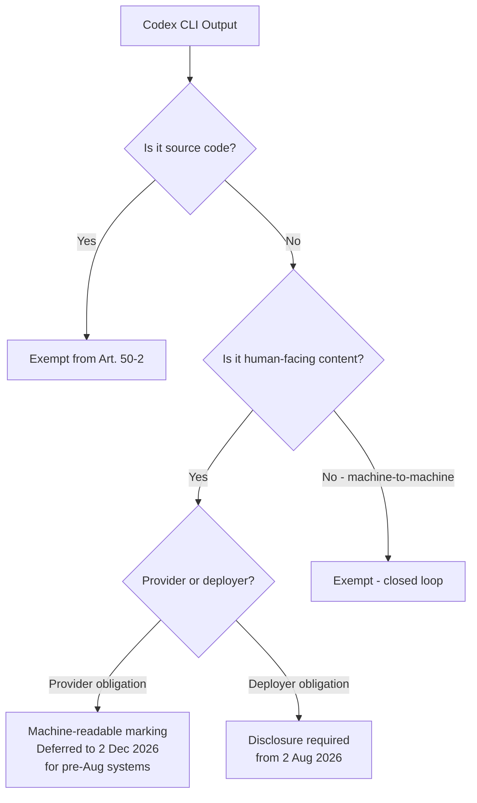

# EU AI Act Enforcement Day: What Article 50 Transparency Actually Requires from Codex CLI Developers After the Digital Omnibus


---

Tomorrow — 2 August 2026 — the EU AI Act's **Article 50 transparency obligations** become enforceable [^1]. If you have been following this space casually, you might think the whole regulation was pushed back. It was not. The Digital Omnibus, formally adopted by the European Parliament on 16 June and the Council on 29 June, deferred the heavy **high-risk system obligations** (Articles 9–17) to December 2027 for stand-alone Annex III systems and August 2028 for AI embedded in regulated products [^2]. But Article 50 — the transparency layer — held its original date.

For teams running Codex CLI against EU-deployed codebases, the practical question is narrow but non-trivial: which of your agent outputs trigger disclosure duties, and which are explicitly exempt?

## What Article 50 Actually Says

Article 50 creates four transparency obligations [^3]:

1. **Chatbot disclosure** — deployers must tell users they are interacting with an AI system, in plain and accessible language, at the start of the interaction.
2. **AI-generated content marking** — providers of systems generating synthetic audio, image, video, or text must ensure outputs are machine-readable as AI-generated.
3. **Deep-fake labelling** — deployers publishing AI-generated or manipulated content depicting real people must disclose the artificial nature.
4. **Emotion recognition / biometric disclosure** — deployers of such systems must inform affected individuals.

The first and fourth obligations are deployer responsibilities; the second and third fall on providers. All four become enforceable from 2 August 2026 [^1].

### The Watermarking Carve-Out

There is one significant concession. Article 50(2) — the machine-readable marking requirement for providers — has been deferred to **2 December 2026** for systems already on the market before 2 August 2026 [^2]. OpenAI, as the GPAI provider behind Codex CLI, falls into this category. New systems placed on the market from 2 August must comply immediately.

## Source Code Is Exempt — but Your README Is Not

The most important detail for Codex CLI developers: **source code is not within the scope of Article 50(2)** [^4]. The European Commission guidelines treat source code as a technical output rather than human-facing content capable of misleading users. Inline comments and docstrings that form part of the code artefact share this exemption.

However, the exemption does not extend to:

- Standalone documentation (README files, architecture guides)
- Marketing-style product descriptions
- Natural-language explanations generated outside the code artefact
- User-facing chatbot interactions where the AI agent communicates directly

If your Codex CLI workflow generates a PR description, a changelog entry, or a customer-facing release note, that output sits inside Article 50's scope.



## The Five-Question Classification Test

Before reaching for configuration files, run your Codex CLI usage through this decision tree [^5]:

1. **Does it evaluate, rank, or monitor employees?** — Annex III Point 4 worker management. If yes, high-risk (deferred to December 2027).
2. **Is it embedded in an Annex I regulated product?** — Medical devices, machinery, automotive. If yes, high-risk (deferred to August 2028).
3. **Does it fall within other Annex III domains?** — Biometrics, critical infrastructure, law enforcement.
4. **Has the underlying model been substantially modified?** — Fine-tuning or rebranding can convert a deployer into a provider under Article 25.
5. **Does the output trigger Article 50 transparency?** — Chatbot interaction or AI-generated human-facing content.

Most standard Codex CLI usage — generating code, running tests, reviewing diffs — answers "no" across all five questions. The exposure is near-zero for ordinary development workflows.

The risk emerges at the edges: piping GitHub telemetry into manager-facing dashboards, using AI to triage PR reviewers based on developer history, or generating user-facing documentation without disclosure.

## Practical Codex CLI Configuration for Article 50

### Audit Logging with PostToolUse Hooks

Article 12 of the EU AI Act requires automatic logging to be integrated into system design, not bolted on afterwards [^5]. Codex CLI's hooks system maps directly to this requirement. A `PostToolUse` hook can capture every tool execution for compliance:

```json
{
  "hooks": [
    {
      "event": "PostToolUse",
      "command": "python3 /opt/compliance/audit_log.py --session $CODEX_SESSION_ID --tool $TOOL_NAME --timestamp $(date -u +%Y-%m-%dT%H:%M:%SZ)",
      "timeout_ms": 5000
    }
  ]
}
```

The minimum viable audit schema, aligned with Article 12's requirements, should capture [^6]:

- **User identifier** — who initiated the session
- **Model identifier** — which model processed the request (e.g., `gpt-5.6-terra`)
- **Input context** — the prompt or task specification
- **Output artefact** — what was generated
- **Disposition** — whether the output was accepted, modified, or rejected
- **Timestamp** — ISO 8601, UTC

Logs must be retained for a minimum of six months under Article 12 [^5].

### Disclosure Headers for Generated Documentation

If your Codex CLI workflow produces human-facing content — release notes, documentation, PR descriptions — Article 50(1) deployer obligations require disclosure. A `PostToolUse` hook can inject a disclosure header:

```json
{
  "hooks": [
    {
      "event": "PostToolUse",
      "tools": ["write_file"],
      "match_args": "*.md",
      "command": "python3 /opt/compliance/inject_disclosure.py --file $OUTPUT_PATH --marker 'This content was generated with AI assistance'",
      "timeout_ms": 3000
    }
  ]
}
```

### Enterprise Managed Configuration

For organisations enforcing compliance across teams, Codex CLI's managed configuration system delivers admin-controlled policies through `requirements.toml` and `managed_config.toml` [^6]. These files can enforce:

```toml
# requirements.toml — admin-enforced, users cannot override
[hooks]
audit_logging = "required"
minimum_log_retention_days = 180

[sandbox]
sandbox_mode = "workspace-write"   # prevent full-access in regulated environments

[approval]
approval_policy = "on-request"     # human oversight for Article 14 compliance
```

Delivery mechanisms include the ChatGPT Codex Policies page for ChatGPT Enterprise organisations, macOS MDM (Jamf, Kandji, Mosyle), and filesystem-based deployment for Linux CI/CD environments.

## The Deferral Is Relief, Not Reprieve

The Digital Omnibus bought eighteen months for high-risk classification work. But the compliance machinery it deferred — risk management, data governance, technical documentation, human oversight, conformity assessment — depends on **AI system classification** that most organisations have not started [^2].

The practical advice: use the deferral period to classify every AI use in your organisation. Determine which Codex CLI workflows might accidentally cross into Annex III territory. The five-question test above is a starting point; the formal conformity assessment process under Articles 9–17 is substantially more involved.

## Timeline Summary

| Date | What Applies | Scope |
|------|-------------|-------|
| **2 Aug 2026** | Article 50 transparency (chatbot disclosure, deployer obligations) | All AI systems with EU exposure |
| **2 Dec 2026** | Article 50(2) machine-readable marking for pre-Aug providers | GPAI providers (OpenAI, etc.) |
| **2 Dec 2027** | High-risk obligations for stand-alone Annex III systems | Worker management, biometrics, critical infra |
| **2 Aug 2028** | High-risk obligations for AI in Annex I regulated products | Medical devices, machinery, automotive |

Penalties remain unchanged by the Omnibus: up to **€35 million or 7% of global turnover** for prohibited practices, and **€15 million or 3%** for transparency and high-risk breaches [^1].

## What You Should Do This Week

1. **Classify your Codex CLI workflows.** Run the five-question test. Most will land outside high-risk scope entirely.
2. **Audit your non-code outputs.** Any human-facing content generated by Codex CLI — documentation, release notes, PR descriptions — needs disclosure mechanisms.
3. **Enable audit logging.** Wire up `PostToolUse` hooks for Article 12 compliance. The six-month retention requirement is a hard floor.
4. **Review managed configuration.** If you are running Codex CLI across teams in the EU, push compliance baselines through `requirements.toml`.
5. **Start classification work.** The high-risk obligations are deferred, not cancelled. December 2027 arrives faster than it sounds.

Source code generated by Codex CLI is explicitly exempt from Article 50(2) marking requirements. That exemption is a meaningful relief — but only for code. Everything around the code is fair game.

## Citations

[^1]: European Commission, "Transparency obligations under Article 50 of the AI Act," Digital Strategy, August 2026. [https://digital-strategy.ec.europa.eu/en/faqs/transparency-obligations-under-article-50-ai-act](https://digital-strategy.ec.europa.eu/en/faqs/transparency-obligations-under-article-50-ai-act)

[^2]: Gibson Dunn, "EU AI Act Omnibus Agreement — Postponed High-Risk Deadlines and Other Key Changes," July 2026. [https://www.gibsondunn.com/eu-ai-act-omnibus-agreement-postponed-high-risk-deadlines-and-other-key-changes/](https://www.gibsondunn.com/eu-ai-act-omnibus-agreement-postponed-high-risk-deadlines-and-other-key-changes/)

[^3]: EU Artificial Intelligence Act, "The EU AI Act's Transparency Rules: A Practical Guide to Article 50," 2026. [https://artificialintelligenceact.eu/transparency-rules-article-50/](https://artificialintelligenceact.eu/transparency-rules-article-50/)

[^4]: Stibbe, "The AI Act's Transparency Obligations: Rules, Scope and Timeline," 2026. [https://www.stibbe.com/publications-and-insights/the-ai-acts-transparency-obligations-rules-scope-and-timeline](https://www.stibbe.com/publications-and-insights/the-ai-acts-transparency-obligations-rules-scope-and-timeline)

[^5]: Augment Code, "The 2026 EU AI Act and AI-Generated Code: What Changes for Dev Teams," 2026. [https://www.augmentcode.com/guides/eu-ai-act-2026](https://www.augmentcode.com/guides/eu-ai-act-2026)

[^6]: Codex CLI Hooks Reference, "hooks.json, PreToolUse & PostToolUse," Agentic Control Plane, 2026. [https://agenticcontrolplane.com/blog/codex-cli-hooks-reference](https://agenticcontrolplane.com/blog/codex-cli-hooks-reference)
