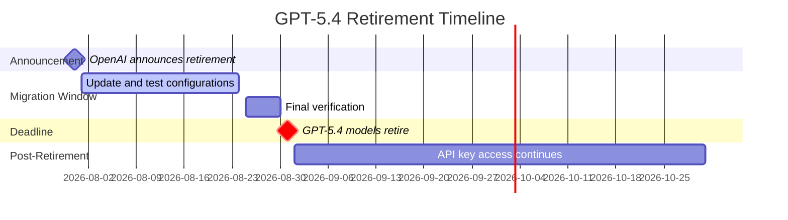

# GPT-5.4 Retires on 31 August: The Codex CLI Migration Checklist for GPT-5.6 Terra and Luna


---

OpenAI announced on 31 July 2026 that GPT-5.4 and GPT-5.4 mini will retire from Codex on 31 August 2026 for users signed in with ChatGPT [^1]. The recommended replacements are GPT-5.6 Terra (for GPT-5.4) and GPT-5.6 Luna (for GPT-5.4 mini). OpenAI API access and Codex usage with your own API key are not affected by this retirement [^1].

This is the third model deprecation wave to hit Codex CLI in 2026, following the GPT-5.2/5.3-Codex sunset in June and the legacy model purge in April. Each wave has caught teams with hardcoded model strings in CI pipelines, stale named profiles, and config files scattered across developer machines. This article provides the concrete migration steps, performance comparison data, and configuration patterns you need to complete the transition before the deadline.

## What Is Changing

On 31 August 2026, two models disappear from the Codex model picker for ChatGPT-authenticated users:

| Retiring Model | Replacement | Status |
|---|---|---|
| GPT-5.4 | GPT-5.6 Terra | GA since 9 July 2026 |
| GPT-5.4 mini | GPT-5.6 Luna | GA since 9 July 2026 |

Users authenticating via API key (`OPENAI_API_KEY` or `CODEX_API_KEY`) retain access to GPT-5.4 models through the standard API deprecation schedule, which typically runs longer [^1]. However, relying on this grace period is unwise — the replacement models are superior on nearly every benchmark that matters for coding tasks.

## The Performance Case for Migration

### GPT-5.4 → GPT-5.6 Terra

Terra is not a compromise. On the benchmarks that correlate with real-world coding agent performance, it matches or exceeds GPT-5.4 [^2]:

| Benchmark | GPT-5.4 | GPT-5.6 Terra | Delta |
|---|---|---|---|
| SWE-bench Pro | 57.7% | 63.4% | +5.7pp |
| DeepSWE 1.1 | 52.0% | 70.0% | +18.0pp |
| GPQA | 92.8% | 92.9% | +0.1pp |
| FrontierMath | 47.6% | 84.9% | +37.3pp |
| BrowseComp | 82.7% | 87.5% | +4.8pp |
| Graphwalks BFS >128k | 21.4% | 76.9% | +55.5pp |

The long-context performance gap (Graphwalks BFS >128k) is particularly relevant for Codex CLI sessions that accumulate substantial tool-call history before compaction triggers. Terra also expands the context window from 1.0M to 1.05M tokens [^2].

GPT-5.4 edges ahead only on MMMU-Pro (81.2% vs 80.7%) and Toolathlon (specific scores vary by configuration) [^2] — neither of which is a primary concern for terminal-based coding workflows.

### GPT-5.4 mini → GPT-5.6 Luna

Luna's lead is even more decisive [^3]:

| Benchmark | GPT-5.4 mini | GPT-5.6 Luna | Delta |
|---|---|---|---|
| SWE-bench Pro | 54.4% | 62.7% | +8.3pp |
| GPQA | 88.0% | 92.3% | +4.3pp |
| MMMU-Pro | 76.6% | 78.4% | +1.8pp |
| Toolathlon | 42.9% | 53.4% | +10.5pp |
| MRCR v2 (8-needle) | 33.6% | 41.3% | +7.7pp |

Luna outperforms GPT-5.4 mini on every shared benchmark tested. The context window jumps from 400K to 1.05M tokens — a 2.6× increase that eliminates many premature compaction events in long-running sessions [^3].

## The Pricing Case

Following the 30 July 2026 price restructuring [^4], migration delivers both better performance and lower costs:

| Model | Input (per MTok) | Output (per MTok) |
|---|---|---|
| GPT-5.4 (retiring) | \$2.50 | \$15.00 |
| **GPT-5.6 Terra** | **\$2.00** | **\$12.00** |
| GPT-5.4 mini (retiring) | \$0.75 | \$4.50 |
| **GPT-5.6 Luna** | **\$0.20** | **\$1.20** |

Terra saves 20% on both input and output tokens compared with GPT-5.4. Luna saves 73% on input and 73% on output compared with GPT-5.4 mini [^4]. For teams that were using GPT-5.4 mini as a cost-conscious default, Luna is now nearly four times cheaper whilst being measurably more capable.

The auto-review subagent, which OpenAI upgraded from GPT-5.4 to GPT-5.6 Luna in late July 2026, benefits directly from this pricing — auto-review costs roughly 10× less than before [^5].

## Migration Checklist

### 1. Update config.toml

The primary configuration lives at `~/.codex/config.toml` (or `$CODEX_HOME/config.toml`). Replace the model string:

```toml
# Before
model = "gpt-5.4"
model_reasoning_effort = "high"

# After
model = "gpt-5.6-terra"
model_reasoning_effort = "high"
```

For teams that were using GPT-5.4 mini:

```toml
# Before
model = "gpt-5.4-mini"

# After
model = "gpt-5.6-luna"
```

The `model_reasoning_effort` options (`minimal`, `low`, `medium`, `high`, `xhigh`) carry over unchanged [^6]. Terra supports all five levels; Luna supports all five. Only Sol adds the `max` level.

### 2. Update Named Profiles

Named profiles live as `$CODEX_HOME/<profile-name>.config.toml`. Check every profile that references a GPT-5.4 model:

```bash
# Find all profiles referencing retiring models
grep -r "gpt-5.4" ~/.codex/*.config.toml
```

Common profile patterns to update:

```toml
# ~/.codex/review.config.toml
model = "gpt-5.6-terra"
model_reasoning_effort = "high"

# ~/.codex/quick.config.toml
model = "gpt-5.6-luna"
model_reasoning_effort = "medium"

# ~/.codex/ci.config.toml
model = "gpt-5.6-luna"
model_reasoning_effort = "low"
```

### 3. Update review_model

If you set `review_model` explicitly in any configuration file, update it too:

```toml
# Before
review_model = "gpt-5.4"

# After
review_model = "gpt-5.6-terra"
```

When `review_model` is unset, the `/review` command uses the current session model [^6]. Since auto-review already moved to Luna, you may want to set this explicitly if you prefer Terra-grade reviews.

### 4. Update CI/CD Pipelines

Any GitHub Actions workflow, shell script, or automation that passes a model flag needs updating:

```bash
# Before
codex exec --model gpt-5.4-mini "Run the test suite and fix failures"

# After
codex exec --model gpt-5.6-luna "Run the test suite and fix failures"
```

For the official `openai/codex-action@v1` GitHub Action, check the `model` input parameter in your workflow YAML.

### 5. Update managed_config.toml (Enterprise)

Enterprise administrators using `managed_config.toml` or `requirements.toml` for fleet-wide model policies must update these separately. These files take precedence over user-level configuration and will silently override individual developer settings [^6]:

```toml
# /etc/codex/managed_config.toml or cloud-managed equivalent
model = "gpt-5.6-terra"
```

If your `requirements.toml` constrains allowed models, add the GPT-5.6 variants:

```toml
# Ensure the new models are permitted
[requirements]
allowed_models = ["gpt-5.6-sol", "gpt-5.6-terra", "gpt-5.6-luna"]
```

### 6. Verify with codex doctor

After updating configuration, run the diagnostic command to confirm your setup:

```bash
codex doctor --json | jq '.checks[] | select(.category == "model")'
```

This validates that the configured model is reachable and that your authentication method supports it.

## Latency Considerations

One area where the migration requires awareness is latency behaviour. GPT-5.6 Terra at medium reasoning effort reports a time-to-first-token (TTFT) of approximately 1.5 seconds, compared with GPT-5.4 at xhigh effort at approximately 145 seconds [^2]. This is a dramatic improvement — Terra's architecture delivers faster initial responses at comparable quality.

However, Luna's latency profile varies significantly with reasoning effort. At low effort, TTFT is approximately 1.5 seconds; at max effort, it climbs to approximately 117 seconds [^3]. If your workflows relied on GPT-5.4 mini's consistent ~10-second TTFT at xhigh effort, you may want to tune `model_reasoning_effort` when switching to Luna.

## Migration Timeline



The 31-day migration window is generous by OpenAI's recent standards — the GPT-5.2 removal in June came with no advance notice [^1]. Use the time to test, not to procrastinate.

## Subagent Model Overrides

If you use multi-agent workflows with subagent model overrides, check these separately. Subagent configurations that hardcode `gpt-5.4-mini` as a cost-efficient worker model should switch to `gpt-5.6-luna`:

```toml
# Subagent model override in config.toml
[subagent]
model = "gpt-5.6-luna"
model_reasoning_effort = "medium"
```

A common pattern post-migration is to use Sol or Terra as the orchestrator and Luna as the worker:

```toml
# Primary session uses Terra
model = "gpt-5.6-terra"
model_reasoning_effort = "high"

# Subagents use Luna for cost efficiency
[subagent]
model = "gpt-5.6-luna"
model_reasoning_effort = "medium"
```

This combination gives you Terra-grade planning with Luna-grade execution — and at post-restructuring prices, the blended cost is lower than GPT-5.4 alone.

## What Happens If You Do Nothing

After 31 August, ChatGPT-authenticated Codex CLI sessions that request `gpt-5.4` or `gpt-5.4-mini` will fail. Based on previous retirement waves, the failure mode is an HTTP 404 or a model-not-found error that halts the session immediately. There is no automatic fallback to a replacement model [^1].

CI pipelines running `codex exec` with ChatGPT authentication will break silently — the exit code will be non-zero, but the error message may not clearly indicate a model retirement issue. API-key authenticated workflows will continue working until OpenAI announces the broader API deprecation date.

## Recommended Model Routing Post-Migration

For teams completing this migration, consider establishing a model routing strategy that accounts for the full GPT-5.6 family:

| Workflow | Recommended Model | Reasoning Effort | Rationale |
|---|---|---|---|
| Complex refactoring | Sol | high/xhigh | Highest capability ceiling |
| Code review | Terra | high | Best quality-to-cost ratio for review |
| Test generation | Terra | medium | Sufficient capability, lower cost |
| CI auto-fix | Luna | medium | Fast iteration, lowest cost |
| Linting / formatting | Luna | low | Minimal reasoning needed |
| Goal mode tasks | Sol or Terra | high | Long-running tasks need capable models |

## Conclusion

The GPT-5.4 retirement is the easiest model migration Codex CLI users have faced. The replacements are faster, more capable on coding benchmarks, cheaper after the July pricing restructure, and offer larger context windows. The migration is a configuration change, not an architecture change. Find every `gpt-5.4` string in your configuration files, CI workflows, and enterprise policies; replace it; verify with `codex doctor`; and move on.

The 31 August deadline is firm. Start now.

## Citations

[^1]: OpenAI, "ChatGPT — Release Notes," 31 July 2026. [https://help.openai.com/en/articles/6825453-chatgpt-release-notes](https://help.openai.com/en/articles/6825453-chatgpt-release-notes)

[^2]: LLM Stats, "GPT-5.4 vs GPT-5.6 Terra: Benchmarks, Pricing & Which Is Better in 2026." [https://llm-stats.com/models/compare/gpt-5.4-vs-gpt-5.6-terra](https://llm-stats.com/models/compare/gpt-5.4-vs-gpt-5.6-terra)

[^3]: LLM Stats, "GPT-5.4 mini vs GPT-5.6 Luna: Benchmarks, Pricing & Which Is Better in 2026." [https://llm-stats.com/models/compare/gpt-5.4-mini-vs-gpt-5.6-luna](https://llm-stats.com/models/compare/gpt-5.4-mini-vs-gpt-5.6-luna)

[^4]: OpenAI, "GPT-5.6: Frontier intelligence that scales with your ambition," July 2026. [https://openai.com/index/gpt-5-6/](https://openai.com/index/gpt-5-6/)

[^5]: OpenAI, "Codex Updates — July 2026." [https://releasebot.io/updates/openai/codex](https://releasebot.io/updates/openai/codex)

[^6]: OpenAI, "Configuration Reference," ChatGPT Learn. [https://learn.chatgpt.com/docs/config-file/config-reference](https://learn.chatgpt.com/docs/config-file/config-reference)
