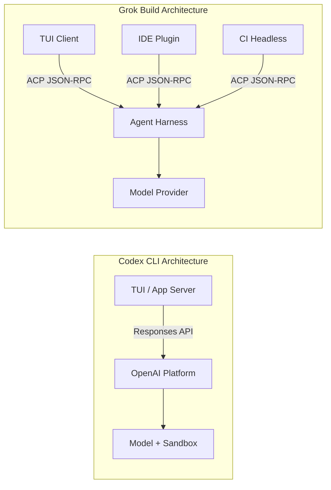
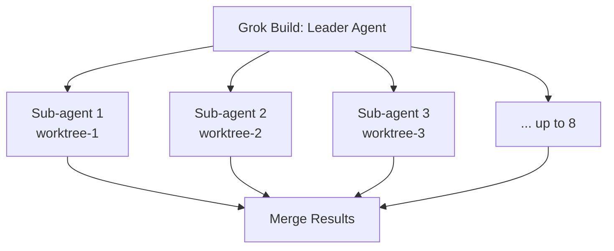

# Grok Build Goes Open Source: What xAI's 840,000-Line Rust Release Means for Codex CLI Developers


---

## The Release

On 16 July 2026, xAI (operating as SpaceXAI) published the full source of Grok Build — its terminal-native coding agent — under the Apache 2.0 licence [^1]. The repository at `github.com/xai-org/grok-build` contains roughly 840,000 lines of Rust: the agent loop, the full-screen TUI, the tool layer, the extension system (skills, plugins, hooks, MCP servers, subagents), and the workspace checkpoint machinery [^2]. Within forty-eight hours the repository had accumulated over 4,400 stars and 655 forks [^3].

This is not a community-governed project. Issues and pull requests are disabled; the `CONTRIBUTING.md` states explicitly that external contributions are not accepted [^3]. xAI syncs a public mirror from an internal monorepo, making Grok Build "source-available" in spirit despite the permissive licence. Security reports route through HackerOne, not GitHub [^3]. Nevertheless, the release marks the second time a major coding agent CLI has shipped its full harness as open source — Codex CLI itself being the first, released under the Apache 2.0 licence in April 2025 [^4].

For Codex CLI developers, the release is worth studying for three reasons: architectural divergence, tool-layer convergence, and the emergence of the Agent Client Protocol.

---

## Architectural Divergence: ACP vs the Responses Wire

The deepest difference between Grok Build and Codex CLI is the client–agent boundary.

Codex CLI communicates with its backend through OpenAI's Responses API. The TUI, the app-server, and the IDE extension all consume the same wire protocol — but that protocol is tied to the OpenAI platform. When Codex CLI v0.146 added WebSocket transport for remote Code Mode hosts [^5], it extended this model rather than replacing it: the wire still carries Responses-shaped messages.

Grok Build takes a different bet. Its official TUI is an ACP (Agent Client Protocol) client sitting on a public JSON-RPC–shaped wire [^2]. Any ACP-compliant client — a different TUI, an IDE plugin, a CI harness, a WebSocket dashboard — can drive the same agent process. The consequence is **leader mode**: one shared agent process serving multiple client connections simultaneously, where disconnecting a UI does not kill in-flight work [^6].



The practical implication: Grok Build treats multi-surface access as a first-class architectural primitive. Codex CLI achieves similar reach — the ChatGPT Desktop app, the IDE extension, Codex Remote — but does so through surface-specific integrations rather than a single protocol spine. Whether one approach proves more durable is an open question. OpenAI's tight coupling to the Responses API enables features like cloud-hosted sandbox execution and built-in auto-review that Grok Build's local-first model cannot replicate without additional infrastructure.

---

## Tool-Layer Convergence: Ported from Codex, Attributed under Apache §4(b)

The most striking section of Grok Build's `THIRD_PARTY_NOTICES.md` is the list of tool implementations ported directly from Codex CLI [^3]:

| Tool | Origin | Licence |
|------|--------|---------|
| `apply_patch` | OpenAI Codex | Apache 2.0 |
| `grep_files` | OpenAI Codex | Apache 2.0 |
| `list_dir` | OpenAI Codex | Apache 2.0 |
| `read_file` | OpenAI Codex | Apache 2.0 |
| `bash` | OpenCode | MIT |
| `edit` | OpenCode | MIT |
| `glob` | OpenCode | MIT |
| `write` | OpenCode | MIT |

xAI labels these as "modified ports" with attribution under Apache §4(b) [^3]. The pattern is instructive: the file-system and search primitives that coding agents need have converged to a near-identical interface. `apply_patch`, Codex CLI's V4A diff format, has become a de facto standard for agent-driven file edits — now adopted by a direct competitor.

For Codex CLI developers, the takeaway is pragmatic: skills, hooks, and AGENTS.md files that rely on these tool interfaces are increasingly portable. Grok Build explicitly reads existing `AGENTS.md` files, honours MCP server configurations, and loads skills from the same directory conventions [^2]. The terminal agent ecosystem is converging on a shared tool vocabulary, even as the agent harnesses diverge architecturally.

---

## Configuration Convergence: config.toml Everywhere

Both Codex CLI and Grok Build use `config.toml` as their primary configuration surface, stored under `~/.codex/` and `~/.grok/` respectively [^1] [^5]. The key structures are remarkably similar:

```toml
# ~/.grok/config.toml — custom model provider
[model.my-local]
base_url = "https://api.example.com/v1"
```

```toml
# ~/.codex/config.toml — custom model provider
[model_provider]
name = "custom"
base_url = "https://api.example.com/v1"
```

Both support named profiles, both support MCP server declarations, and both support approval/permission policies. This convergence is not coincidental — it reflects the same engineering constraints: terminal agents need a human-readable, version-controllable configuration layer that separates model routing from agent behaviour.

---

## The Parallelism Bet

Grok Build's most visible architectural difference from Codex CLI is its approach to subagents. Where Codex CLI runs subagents within a shared sandbox context, Grok Build launches up to eight parallel subagents, each in its own Git worktree [^2]. The model is closer to a distributed build system: sub-agents explore, experiment, and merge independently.



Codex CLI's subagent model is tighter — subagents share the parent's sandbox and workspace, communicate through the agent mail system, and are governed by the same approval policy [^5]. This design favours consistency over throughput: you get fewer parallel explorations but stronger guarantees about workspace coherence.

The right choice depends on workload shape. For large refactoring tasks across isolated modules, Grok Build's worktree parallelism is genuinely faster. For tasks requiring coordinated changes across tightly coupled files — the majority of real-world coding work — Codex CLI's shared-context model avoids the merge-conflict overhead that parallel worktrees introduce.

---

## What Codex CLI Developers Should Take Away

### 1. Read the Source for Architectural Patterns

Grok Build's crate structure — `xai-grok-shell` (agent runtime), `xai-grok-tools` (tool implementations), `xai-grok-workspace` (VCS and checkpoints), `xai-grok-pager` (TUI rendering) — is a clean decomposition of a terminal agent [^3]. If you are building custom tooling around Codex CLI, studying how Grok Build separates concerns between agent dispatch, tool execution, and UI rendering is time well spent.

### 2. ACP Is Worth Watching

The Agent Client Protocol may become a meaningful interoperability layer. If ACP gains adoption beyond xAI — JetBrains IDE plugins already integrate through it [^2] — Codex CLI may need to support it alongside MCP and the Responses wire. The Codex v0.146 release already registered the MCP 2026-07-28 feature flag [^5], suggesting OpenAI is tracking protocol evolution closely.

### 3. Tool Portability Is Real

The fact that Grok Build ported Codex CLI's core tools verbatim — and that both agents read `AGENTS.md` — means your repository-level configuration is increasingly agent-agnostic. Investing in well-structured `AGENTS.md` files, MCP server configurations, and skill definitions pays dividends regardless of which agent your team runs.

### 4. The Governance Model Matters

Grok Build's "source-available but no contributions" model is a deliberate choice. For enterprise teams evaluating coding agents, the distinction between "open source" and "source-transparent" is material: you can audit the code but cannot influence its direction. Codex CLI's open-source repository accepts community contributions through the standard pull-request process [^4], giving enterprise adopters a different risk profile.

---

## The Competitive Landscape in August 2026

With Grok Build's open-sourcing, the terminal coding agent market now has three major open-source or source-available entries:

| Agent | Language | Licence | Contributions | Primary Model |
|-------|----------|---------|---------------|---------------|
| Codex CLI | Rust | Apache 2.0 | Accepted | GPT-5.6 Sol/Terra/Luna |
| Grok Build | Rust | Apache 2.0 | Rejected | Grok 4.5 |
| Claude Code | ⚠️ Closed | Proprietary | N/A | Claude Opus 5 |

⚠️ Claude Code remains closed-source as of August 2026, though Anthropic has published the Sub-Agent Protocol specification separately.

The convergence on Rust is notable. Both Codex CLI and Grok Build chose Rust for the agent harness — prioritising memory safety, single-binary distribution, and terminal rendering performance over the ecosystem breadth of TypeScript or Python. Gemini CLI, the fourth major entrant, is written in TypeScript but faces the same tool-vocabulary convergence pressures.

For Codex CLI developers, the Grok Build release is less a competitive threat than a validation: the architectural patterns that Codex CLI pioneered — TOML configuration, skill-based extensibility, sandbox-first execution, MCP integration — are becoming the industry standard for terminal coding agents. The question is no longer whether these patterns are correct, but which implementation executes them best.

---

## Citations

[^1]: SpaceXAI, "SpaceXAI Open-Sources Grok Build: The Rust Agent Harness, TUI, and Tool Layer Behind Its Coding CLI," *MarkTechPost*, 15 July 2026. [https://www.marktechpost.com/2026/07/15/spacexai-open-sources-grok-build-the-rust-agent-harness-tui-and-tool-layer-behind-its-coding-cli/](https://www.marktechpost.com/2026/07/15/spacexai-open-sources-grok-build-the-rust-agent-harness-tui-and-tool-layer-behind-its-coding-cli/)

[^2]: visionik, "Claude Code Is a Great App. Grok Build Is a Platform," *visionik blog*, July 2026. [https://blog.visionik.com/how-grok-build-the-harness-works/](https://blog.visionik.com/how-grok-build-the-harness-works/)

[^3]: explainx.ai, "Grok Build Open Source: Install, License, Privacy," *explainx.ai Blog*, July 2026. [https://explainx.ai/blog/grok-build-open-source-spacexai-july-2026](https://explainx.ai/blog/grok-build-open-source-spacexai-july-2026)

[^4]: OpenAI, "Codex CLI," *GitHub*, 2025–2026. [https://github.com/openai/codex](https://github.com/openai/codex)

[^5]: OpenAI, "Codex CLI v0.146.0 Release Notes," *GitHub Releases*, 29 July 2026. [https://github.com/openai/codex/releases/tag/rust-v0.146.0](https://github.com/openai/codex/releases/tag/rust-v0.146.0)

[^6]: xAI, "Grok Build — Open Source," *x.ai*, July 2026. [https://x.ai/open-source](https://x.ai/open-source)
