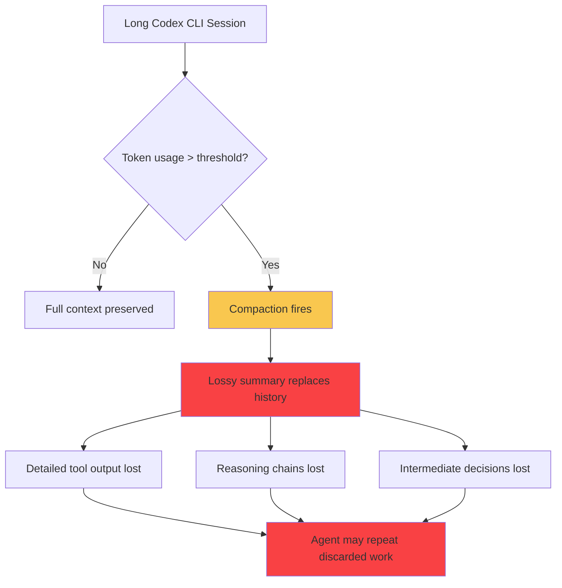
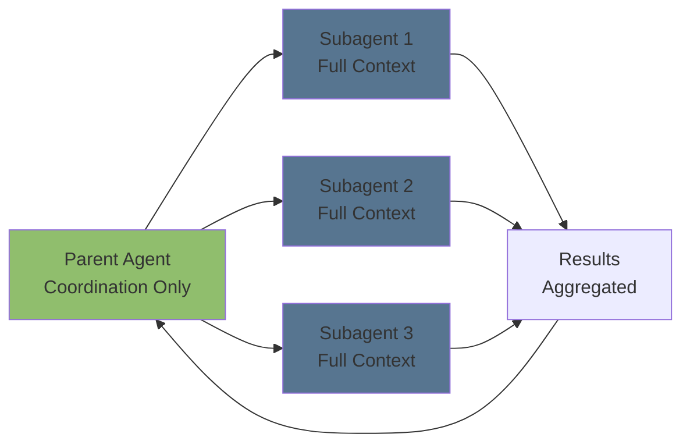

# PRO-LONG and the Lossless Memory Thesis: What Programmatic Session Logs Mean for Codex CLI's Compaction Tradeoff


---

Every developer who has watched a Codex CLI session lose track of a decision made three hundred turns ago knows the sensation: the agent's compaction just ate something important, and now it is confidently re-inventing a solution you already discarded. A paper published on 22 July 2026 — *PRO-LONG: Programmatic Memory Enables Long-Horizon Reasoning* — offers empirical evidence that keeping everything and searching it programmatically beats both lossy compression and specialised memory harnesses[^1]. The implications for how you configure Codex CLI sessions are immediate and practical.

## The Core Claim

PRO-LONG is a minimal context-management framework that appends every observation, action, result and short plan to a single structured `logs.txt` file. The agent never summarises or discards anything at write time. When it needs historical context, it searches the log with `grep`, `sed`, `awk` or Python — tools already native to every coding agent harness[^1].

The results on the full ARC-AGI-3 public game set are striking:

- **18.0 percentage-point improvement** over the same coding agents without the log[^1]
- **4.2–5.8× fewer billed tokens** than specialised harnesses (WorldModeler, Schema, Arcgentica) while matching or exceeding their accuracy[^1]
- **97.4% best@2** with Fable 5 at \$1,750 total cost, versus Schema's \$6,447 for comparable performance[^1]

The key insight is deceptively simple: reducing what you save at write time makes retrieval easier, but discards details whose relevance becomes apparent only in hindsight. PRO-LONG sidesteps this by treating history as a searchable database rather than something to compress.

## Why This Matters for Codex CLI

Codex CLI's context-management architecture faces precisely the tradeoff PRO-LONG challenges. When a session's token usage exceeds `model_auto_compact_token_limit` (default: around 80% of the context window), Codex triggers automatic compaction — a summarisation pass that itself consumes tokens and irreversibly discards detailed reasoning chains, exact tool output, and intermediate debugging context[^2].

This compaction is lossy and all-or-nothing. Unlike Claude Code's three-layer progressive approach, Codex CLI's default path either keeps everything or summarises aggressively[^3]. For Codex-model paths, compaction calls OpenAI's remote `compact()` endpoint and returns an AES-encrypted blob — opaque to the developer and impossible to grep[^3].

PRO-LONG's ablation data quantifies the cost of this design:

| Tool Access Level | ARC-AGI-3 pass@1 |
|---|---|
| Read-only log | 23.1% |
| + Grep/regex | 27.2% |
| + Python | 38.3% |
| + Write/edit tools | 41.2% |

Each layer of programmatic access to the full log materially improves performance. The jump from read-only to Python-searchable (+15.2pp) is larger than many model upgrades[^1].

## The Compaction Tradeoff in Practice



The compaction threshold is configurable downward only — you cannot raise it above 90% of the context window[^2]. This means you can trigger compaction earlier (smaller but more frequent information losses) but never later (preserving more context at the risk of hitting hard limits).

PRO-LONG's data suggests a different approach entirely: rather than tuning *when* to compress, avoid compression altogether and search the uncompressed log.

## Applying PRO-LONG Patterns to Codex CLI

You cannot disable Codex CLI's compaction outright, but you can structure your workflows to approximate PRO-LONG's lossless memory model.

### 1. Session JSONL as Your Programmatic Log

Every Codex CLI session is automatically saved as a JSONL file in `~/.codex/sessions/YYYY/MM/DD/`[^4]. Each file contains the full conversation transcript — prompts, model responses, tool calls, tool results — timestamped and structured. This is your PRO-LONG equivalent, and it persists even after compaction has discarded the in-context history.

```bash
# Search all sessions for a specific decision or pattern
grep -r "migration strategy" ~/.codex/sessions/2026/08/ | \
  jq -r '.content // .text // empty'

# Find sessions where a specific file was modified
grep -rl "src/auth/token.rs" ~/.codex/sessions/2026/07/
```

### 2. Subagent Decomposition Over Long Sessions

The compounding information loss from repeated compactions makes subagent architecture the practical PRO-LONG equivalent for Codex CLI[^2]. Rather than one session that compacts six times, spawn focused subagents with fresh context windows:

```toml
# config.toml — multi-agent v2 settings
[multi_agent]
enabled = true
max_threads = 4
max_depth = 1
default_subagent_model = "gpt-5.6-luna"
default_subagent_reasoning_effort = "medium"
```

Each subagent operates within its full context window. The parent agent coordinates results without carrying the full history of each subtask[^5].



### 3. Explicit Log Files in AGENTS.md

PRO-LONG's ~30-line prompt instructs the agent to write structured entries to a persistent log file. You can encode the same pattern in your `AGENTS.md`:

```markdown
## Session Logging

When working on long tasks:
1. Maintain a `DECISIONS.md` file in the project root
2. Append every significant decision with rationale and timestamp
3. Before proposing changes, grep DECISIONS.md for prior decisions on the same area
4. Never delete entries from DECISIONS.md — append corrections, do not overwrite
```

This creates an agent-readable, developer-readable, grep-searchable decision log that survives compaction because it lives in the filesystem rather than the context window.

### 4. Raising the Compaction Threshold

For sessions where you know you need deep history, push the threshold as high as Codex CLI allows:

```toml
# config.toml — delay compaction
[model]
model_auto_compact_token_limit = 360000  # 90% of GPT-5.6 Terra's 400K window
```

This buys time but does not eliminate the cliff. When compaction eventually fires, the loss is larger[^2]. Combine with the explicit log file pattern above for a belt-and-braces approach.

### 5. codex resume for Cross-Session Search

The v0.145 paginated thread history feature adds efficient resume, search, and persisted names to session management[^6]. Use it to search across prior sessions:

```bash
# Resume the last session with full history
codex resume --last

# List recent sessions with names
codex sessions list --limit 20

# Resume a specific named session
codex resume "auth-refactor-sprint"
```

Combined with `codex exec resume --output-schema`, you can build automation pipelines that carry session context across runs without relying on in-context memory.

## When to Use Which Strategy

| Scenario | Strategy | PRO-LONG Alignment |
|---|---|---|
| Short task (<50 turns) | Default compaction | Not needed — full context fits |
| Medium task (50–200 turns) | Raise threshold + DECISIONS.md | Partial — log survives, context may not |
| Long task (200+ turns) | Subagent decomposition | High — each agent has full context |
| Multi-day project | Session JSONL + resume | High — full log persists on disk |
| CI/CD batch pipeline | `codex exec --ephemeral` | N/A — fresh context per run |

## The Broader Lesson

PRO-LONG's most provocative finding is that a ~30-line prompt with a structured log outperforms 600-line prompts with custom subagents and MCP tool servers[^1]. WorldModeler's two subagents, Schema's twelve MCP tools, Arcgentica's four specialised agents — all beaten by `grep` and `logs.txt`.

For Codex CLI developers, the takeaway is not to abandon the tool's architecture but to recognise that **the filesystem is your memory layer**. Codex CLI already writes JSONL session logs, already supports file creation and search, and already provides `grep_files` and Python execution. The gap is in how we instruct the agent to use these capabilities for self-reference.

The next time you write an `AGENTS.md` file, consider adding a single rule: *Before making a decision, search the project's decision log for prior work on the same problem.* PRO-LONG's 18-percentage-point improvement suggests that rule alone may be worth more than a model upgrade.

## Citations

[^1]: Fox, A., Wang, J., Rosu, P. & Dhingra, B. (2026). *PRO-LONG: Programmatic Memory Enables Long-Horizon Reasoning*. arXiv:2607.20064. [https://arxiv.org/abs/2607.20064](https://arxiv.org/abs/2607.20064)

[^2]: Codex CLI Context Compaction: Architecture, Configuration, and Managing Long Sessions. Codex Knowledge Base. [https://codex.danielvaughan.com/2026/03/31/codex-cli-context-compaction-architecture/](https://codex.danielvaughan.com/2026/03/31/codex-cli-context-compaction-architecture/)

[^3]: Context Compaction Deep Dive: How Codex CLI, Claude Code, and OpenCode Manage Long Sessions. Codex Knowledge Base. [https://codex.danielvaughan.com/2026/04/14/context-compaction-deep-dive-codex-cli-claude-code-opencode/](https://codex.danielvaughan.com/2026/04/14/context-compaction-deep-dive-codex-cli-claude-code-opencode/)

[^4]: Codex CLI Session Lifecycle: Archive, Resume, Fork, and Compact. Codex Knowledge Base. [https://codex.danielvaughan.com/2026/06/05/codex-cli-session-lifecycle-archive-resume-fork-compact-management/](https://codex.danielvaughan.com/2026/06/05/codex-cli-session-lifecycle-archive-resume-fork-compact-management/)

[^5]: Codex CLI Multi-Agent Orchestration v2: Complete Guide. Codex Knowledge Base. [https://codex.danielvaughan.com/2026/04/11/codex-cli-multi-agent-orchestration-v2-complete-guide/](https://codex.danielvaughan.com/2026/04/11/codex-cli-multi-agent-orchestration-v2-complete-guide/)

[^6]: OpenAI. (2026). *Codex CLI v0.145.0 Release Notes*. GitHub. [https://github.com/openai/codex/releases/tag/rust-v0.145.0](https://github.com/openai/codex/releases/tag/rust-v0.145.0)
