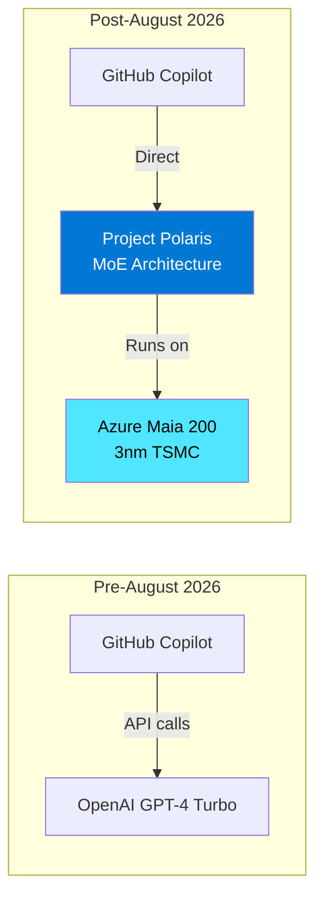
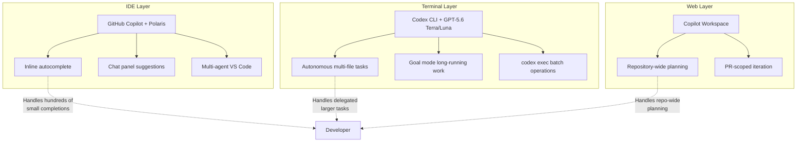

# Project Polaris Lands in August: What Microsoft's In-House Copilot Model Means for Codex CLI Developers


---

This month, GitHub Copilot replaces GPT-4 Turbo with Project Polaris — Microsoft's first in-house coding model — as the default engine for all subscribers [^1]. The automatic migration begins in August 2026 with an opt-out fallback window running until November [^2]. For developers who use Codex CLI alongside Copilot, this shift reshapes the competitive landscape, changes the economics of multi-model workflows, and raises practical questions about coexistence.

## What Is Project Polaris?

Project Polaris is a mixture-of-experts (MoE) model purpose-built for software engineering tasks: code generation, multi-file refactoring, test writing, code review, and documentation [^1]. Unlike GPT-4 Turbo — a general-purpose model adapted for coding — Polaris has specialised sub-modules tuned for individual programming languages and frameworks [^2].

Microsoft claims Polaris outperforms GPT-4 Turbo on HumanEval and MBPP across most languages, with the strongest gains in lower-resource languages like Rust and Haskell [^1]. Those figures remain unaudited at the time of writing — a caveat worth bearing in mind given recent benchmark reliability concerns across the industry [^3].



## The Maia Advantage

Polaris runs on Microsoft's custom Maia 200 AI accelerators inside Azure, rather than routing through OpenAI's inference backend [^4]. Maia 200, built on TSMC's 3nm process and available since January 2026, delivers what Microsoft claims is 30% better performance-per-dollar than its previous generation hardware [^4]. The practical consequence: faster inline completions and lower operational cost for Microsoft — though whether that translates to pricing changes for subscribers remains to be seen.

This is the vertical integration play: model, silicon, and cloud under one roof. It mirrors the direction Apple took with its ML accelerators and the path Anthropic is pursuing with custom training clusters — the era of API-rented inference as the default is narrowing for the largest platform vendors.

## The Migration Timeline

| Date | Event |
|------|-------|
| 2 June 2026 | Polaris announced at Build 2026 [^1] |
| August 2026 | Automatic rollout as Copilot default |
| August–November 2026 | Opt-out fallback to GPT-4 Turbo [^2] |
| November 2026 | GPT-4 Turbo removed as Copilot default |

For Copilot Pro, Business, and Enterprise subscribers, the migration is automatic. Teams that need to test integrations before switching can revert through Copilot settings during the three-month window [^2].

## What Shipped Alongside Polaris

Build 2026 delivered two additional Copilot features that matter for Codex CLI users:

### Multi-Agent VS Code

Multi-agent mode, available in public preview on VS Code 1.102+, lets an orchestrator agent decompose a task and spawn parallel subagents for linting, testing, documentation, and security review simultaneously [^1]. Each subagent runs with an isolated context window rather than competing for shared budget [^5].

This is conceptually similar to Codex CLI's sub-agent model with per-subagent model overrides in `config.toml`, but implemented at the IDE layer rather than the terminal. The isolation model differs: Copilot's subagents get separate context windows within the same VS Code session, while Codex CLI subagents run as independent processes with their own sandbox constraints.

### Copilot Workspace GA

Copilot Workspace — Microsoft's agentic development environment — reached general availability at Build [^1]. It reasons across an entire repository, proposes multi-file edits, runs tests, and iterates on scoped tasks. In practice, this positions it against Codex CLI's goal mode and `codex exec` patterns, but from within the GitHub web interface rather than the terminal.

## Copilot and Codex CLI: Complementary, Not Competing

The critical point for developers already using Codex CLI: these tools occupy different parts of the workflow and do not conflict [^6].



Copilot handles the hundreds of small inline completions whilst you type. Codex CLI handles the larger tasks you want to delegate entirely — multi-file refactors, migrations, test generation across a codebase [^6]. Because Codex operates outside the IDE via the terminal, desktop app, or web interface, it does not interfere with Copilot running locally in VS Code or JetBrains [^6].

## Configuring the Multi-Model Stack

With Polaris now powering Copilot and GPT-5.6 Terra/Luna powering Codex CLI, a typical developer stack becomes genuinely multi-vendor and multi-model. Here is how to configure Codex CLI's side of that stack:

```toml
# ~/.codex/config.toml — Codex CLI configuration

model = "gpt-5.6-terra"          # Default for interactive sessions

[profiles.quick]
model = "gpt-5.6-luna"           # Fast, cheap tasks
model_reasoning_effort = "low"

[profiles.architect]
model = "gpt-5.6-terra"          # Complex planning
model_reasoning_effort = "high"

[profiles.review]
model = "gpt-5.6-luna"           # Code review at 10x lower cost
```

For teams that also route some Codex CLI work through OpenRouter to access Claude Opus 5 or other models:

```toml
[model_providers.openrouter]
base_url = "https://openrouter.ai/api/v1"
wire_api = "chat"

[profiles.deep-analysis]
model = "anthropic/claude-opus-5"
model_provider = "openrouter"
model_reasoning_effort = "high"
```

This creates a four-model stack: Polaris for IDE inline completions (managed by Copilot), GPT-5.6 Terra for complex Codex CLI tasks, Luna for lightweight Codex CLI operations, and Opus 5 via OpenRouter for cross-vendor analysis — each model hitting the price-performance sweet spot for its task type.

## The Copilot-Codex Proxy: An Experimental Path

Some developers have explored routing Codex CLI traffic through Copilot's API endpoint at `api.githubcopilot.com/responses` — the same Responses API wire protocol Codex uses [^7]. However, the Copilot API enforces a client handshake that only recognised integrations can complete, requiring either a proxy that handles the authentication dance or a fork of the Codex binary [^7]. This remains experimental and unsupported; the cleaner path is to use each tool with its intended backend.

## What This Means Strategically

### 1. Model Portability Matters More Than Ever

The coding agent market now has four major model strategies running simultaneously:

- **Microsoft/GitHub**: Polaris (in-house MoE) for Copilot
- **OpenAI**: GPT-5.6 Terra/Luna/Sol for Codex CLI
- **Anthropic**: Claude Opus 5 for Claude Code
- **xAI**: Grok models for Grok Build

Developers who hard-code assumptions about a single model are accumulating technical debt. Codex CLI's `config.toml` profile system — with per-task model routing and provider abstraction — positions it well for a multi-model world.

### 2. The Benchmark Gap Still Exists

Microsoft's Polaris benchmarks are self-reported on HumanEval and MBPP [^1]. As the SWE-bench reliability crisis has shown — OpenAI retracted SWE-bench Pro in July 2026 after finding 30% broken tasks [^3] — coding benchmarks remain fragile. The practical test is whether Copilot completions feel faster and more accurate after August, not whether HumanEval scores went up.

### 3. The Vertical Integration Trend

Polaris on Maia accelerators is the same structural play as Apple's neural engines, Google's TPUs for Gemini, and Amazon's Trainium for Bedrock models. For developers, this means faster inference on the vendor's own platform but reduced portability. Codex CLI's model-agnostic architecture — where the model is a configuration value, not a hard dependency — becomes a hedge against vendor lock-in.

## Practical Checklist for August 2026

For developers using both Copilot and Codex CLI:

1. **Let Polaris roll out** — the automatic migration is non-destructive and includes a three-month fallback
2. **Test your language coverage** — if you work heavily in Rust, Haskell, or other lower-resource languages, monitor whether Polaris completions improve as claimed
3. **Update Codex CLI models** — if you haven't already migrated from GPT-5.4 to GPT-5.6 Terra/Luna, the 31 August retirement deadline applies independently of the Polaris change
4. **Review your multi-agent strategy** — Copilot's multi-agent VS Code mode and Codex CLI's sub-agent model serve different layers; decide which handles which class of task
5. **Audit your cost model** — Polilaris changes nothing about Copilot subscription pricing, but GPT-5.6 Terra is 20% cheaper and Luna is 73% cheaper than their GPT-5.4 predecessors

## Citations

[^1]: TechTimes, "GitHub Copilot Replaces GPT-4 With Project Polaris, Ships Multi-Agent VS Code at Build", 2 June 2026. [https://www.techtimes.com/articles/317596/20260602/github-copilot-replaces-gpt-4-project-polaris-ships-multi-agent-vs-code-build.htm](https://www.techtimes.com/articles/317596/20260602/github-copilot-replaces-gpt-4-project-polaris-ships-multi-agent-vs-code-build.htm)

[^2]: Windows Forum, "Project Polaris Set as Default GitHub Copilot Engine in August 2026". [https://windowsforum.com/windows-news.4/project-polaris-set-as-default-github-copilot-engine-in-august-2026.421826/](https://windowsforum.com/windows-news.4/project-polaris-set-as-default-github-copilot-engine-in-august-2026.421826/)

[^3]: ⚠️ SWE-bench reliability context based on prior coverage; specific retraction details from OpenAI announcements in July 2026.

[^4]: The GPU Trade, "Microsoft's Project Polaris to Replace GPT-4 Turbo in Copilot". [https://thegputrade.com/news/microsofts-project-polaris-to-replace-gpt-4-turbo-in-copilot-ksu7t3sn/](https://thegputrade.com/news/microsofts-project-polaris-to-replace-gpt-4-turbo-in-copilot-ksu7t3sn/)

[^5]: Vibe Coder Blog, "GitHub Copilot Ships Project Polaris and Multi-Agent VS Code". [https://blog.vibecoder.me/github-copilot-project-polaris-multi-agent-vscode](https://blog.vibecoder.me/github-copilot-project-polaris-multi-agent-vscode)

[^6]: Morph, "OpenAI Codex vs GitHub Copilot (2026): Terminal Agent vs IDE Assistant". [https://www.morphllm.com/comparisons/codex-vs-copilot](https://www.morphllm.com/comparisons/codex-vs-copilot)

[^7]: GitHub, "codex-copilot: Use OpenAI Codex CLI with GitHub Copilot — no OpenAI API key needed". [https://github.com/Arthur742Ramos/codex-copilot](https://github.com/Arthur742Ramos/codex-copilot)
