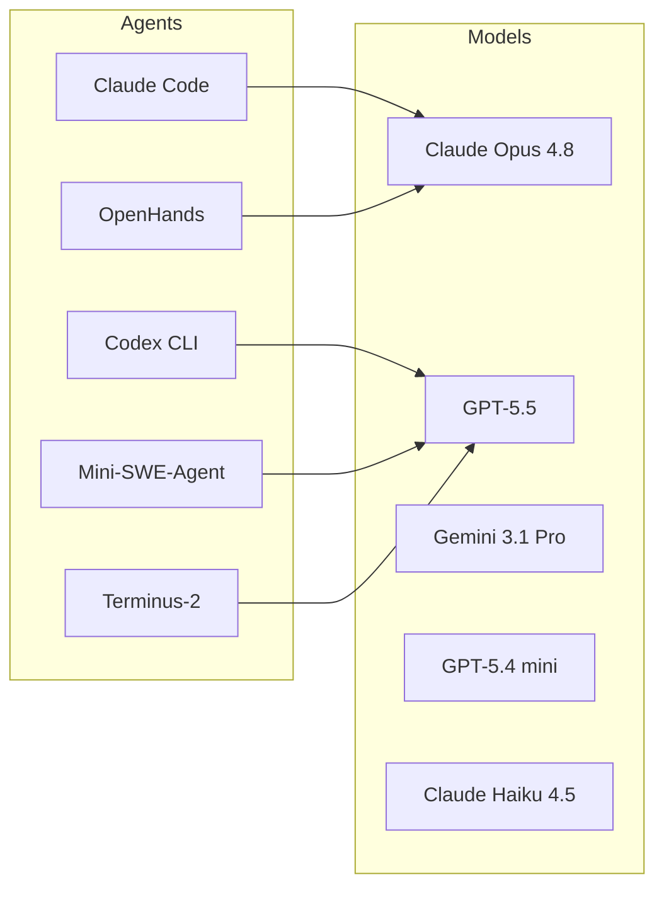
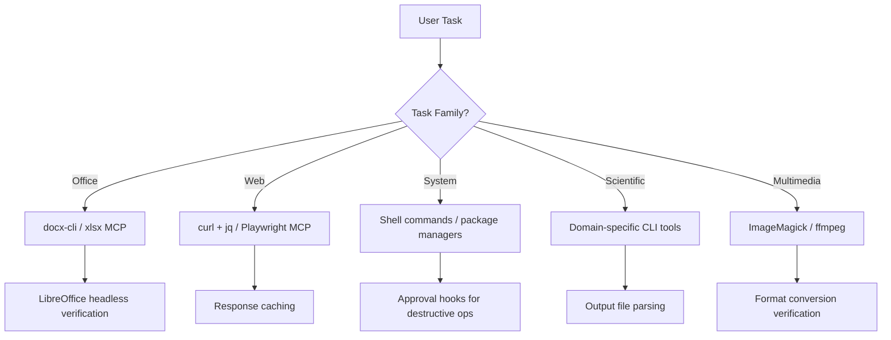
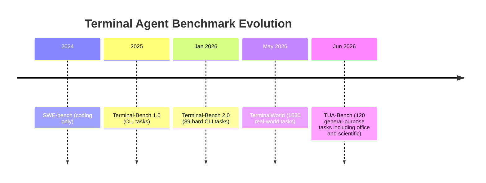

# TUA-Bench and the General-Purpose Terminal Agent: What 120 Non-Coding Tasks Reveal About Codex CLI's Next Frontier


---

Every benchmark Codex CLI has conquered so far — SWE-bench, Terminal-Bench, DeepSWE — frames the terminal agent as a *coding* tool. TUA-Bench, published on 26 June 2026 by Chen et al., reframes the question entirely: can the same agent that patches your Go service also resize a chart in a LibreOffice spreadsheet, draft an email, run an OpenFOAM simulation, and segment a medical image — all from a terminal session?[^1]

The answer, across five agent frameworks and eight frontier models, is "sometimes" — and the gap between "sometimes" and "reliably" is where the next wave of Codex CLI configuration work lives.

## What TUA-Bench Actually Measures

TUA-Bench comprises 120 hand-crafted tasks across five families, each validated by domain experts at PhD level[^1]:

| Task Family | Tasks | Share | Example |
|---|---|---|---|
| Office & Productivity | 46 | 38.3% | Resize a chart in a `.xlsx`, reformat a `.docx` table |
| Web & Information | 22 | 18.3% | Retrieve live-web data, summarise search results |
| System & Software Ops | 20 | 16.7% | Configure a service, parse logs, manage packages |
| Scientific & Engineering | 20 | 16.7% | Run CellProfiler pipelines, OpenFOAM CFD, EnergyPlus |
| Multimedia & Design | 12 | 13.3% | Edit images, process audio, manipulate slides |

Each task runs inside an isolated Linux container with a deterministic setup script. Scoring is execution-based — it checks the final environment state against ground truth, not the trajectory the agent took to get there[^1]. Each task has a 2,400-second time limit. Pass@1, pass@5, and all-5 (consistent success across five attempts) metrics are reported.

## How Codex CLI Performed

Five agent frameworks were evaluated, each paired with multiple models[^1]:



The top configurations on pass@1:

| Agent + Model | Score |
|---|---|
| Claude Code + Opus 4.8 (max reasoning) | 65.8% |
| Codex CLI + GPT-5.5 | 64.7% |
| OpenHands + Opus 4.8 | 63.4% |
| Mini-SWE-Agent + GPT-5.5 | 62.4% |
| Terminus-2 + GPT-5.5 | 60.1% |

The 1.1 percentage point gap between Claude Code and Codex CLI is within noise, but three findings matter for Codex CLI practitioners.

## Three Findings That Matter

### 1. The Harness Effect Persists Beyond Coding

TUA-Bench confirms what PERFOPT-Bench and Terminal-Bench established for coding tasks: **the choice of harness can have a comparable effect to the choice of underlying model**[^1]. Claude Opus 4.8 achieved 63.4% with OpenHands but only 59.7% with Terminus-2 — a 3.7pp swing from scaffold alone. GPT-5.5 showed a 4.6pp spread across the three frameworks it was tested with.

For Codex CLI users, this means your `config.toml` settings, AGENTS.md instructions, MCP server configuration, and sandbox mode matter as much for non-coding tasks as they do for SWE-bench. The agent harness *is* the product.

### 2. Office & Productivity Is the Hardest Family

Despite being the most "routine" category, Office & Productivity tasks showed the widest variance across agents. Chart resizing, slide layout modification, and spreadsheet formula manipulation in headless LibreOffice consistently defeated all configurations[^1]. Several tasks appeared as "near-horizontal red bands" in the results matrix — persistent failures that no model or harness could solve.

This matters because Codex CLI's 8 million users now include roughly 20% non-developers[^2]. These knowledge workers are precisely the users most likely to attempt document-editing workflows through the terminal. TUA-Bench suggests the tooling gap here is real: without proper MCP servers or skills wrapping LibreOffice CLI operations, even frontier models struggle.

### 3. Reasoning Effort Hits Diminishing Returns

Increasing Claude Opus 4.8 from high to extreme (max) reasoning effort added only 2.3 percentage points while nearly doubling token costs[^1]. For Codex CLI, this maps directly to the `reasoning_effort` configuration key and the Ultra mode toggle. The TUA-Bench evidence suggests that for general-purpose terminal tasks, the `high` setting delivers the best cost-performance ratio — reserving `max` for scientific/engineering tasks where the marginal gain justifies the spend.

## Configuring Codex CLI for General-Purpose Terminal Work

TUA-Bench tasks demand capabilities that a default Codex CLI installation lacks. Here is a configuration pattern for general-purpose terminal workflows:

### config.toml: Sandbox and Network Access

Most TUA-Bench tasks require network access (web research, email, package installation) and filesystem writes outside the project directory:

```toml
[sandbox]
mode = "danger-full-access"   # Required for system-level tasks

[network]
network_proxy_allowed_domains = [
  "*.google.com",
  "*.wikipedia.org",
  "api.openweathermap.org",
]
```

⚠️ `danger-full-access` should only be used in disposable container environments, never on a development machine with production credentials. For TUA-Bench-style workflows on real machines, use `workspace-write` with explicit approval for system-level operations.

### AGENTS.md: Task-Family Routing

An AGENTS.md file can encode task-family awareness:

```markdown
## General-Purpose Terminal Agent

### Document Editing
- Use `libreoffice --headless --calc` for spreadsheet operations
- Use `libreoffice --headless --writer` for document manipulation
- Always verify output with `libreoffice --headless --convert-to pdf` and check page count
- Prefer python-docx / openpyxl over raw LibreOffice CLI when the task permits

### Web Research
- Use `curl` with `-L` for redirects and `jq` for JSON APIs
- Prefer structured APIs over scraping when available
- Cache responses to avoid repeated network calls

### Scientific Workflows
- Check that simulation tools (OpenFOAM, CellProfiler, EnergyPlus) are installed before attempting tasks
- Parse output files programmatically rather than visually inspecting them
```

### MCP Servers for Non-Coding Tasks

The TUA-Bench results highlight a tooling gap that MCP servers can fill. Several community MCP servers already exist for document workflows[^3]:

```toml
[mcp_servers.docx-cli]
command = "npx"
args = ["docx-cli", "serve"]

[mcp_servers.xlsx-tools]
command = "npx"
args = ["xlsx-mcp-server"]
```



### Named Profiles for Task Families

Codex CLI's named profiles (available since v0.142) let you switch configurations per task type without editing `config.toml`:

```toml
[profiles.office]
model = "gpt-5.6-luna"
reasoning_effort = "medium"
sandbox_mode = "workspace-write"

[profiles.scientific]
model = "gpt-5.6-terra"
reasoning_effort = "high"
sandbox_mode = "danger-full-access"

[profiles.coding]
model = "gpt-5.6-terra"
reasoning_effort = "high"
sandbox_mode = "workspace-write"
```

Then invoke with:

```bash
codex --profile scientific "Run the OpenFOAM mesh generation and report convergence"
codex --profile office "Resize the chart in Q3-report.xlsx to 800x600 and bold the axis labels"
```

## The Broader Signal: Terminal Agents Are Becoming General Agents

TUA-Bench sits alongside TerminalWorld (1,530 tasks from 80,870 terminal recordings)[^4] and Terminal-Bench 2.0 (89 tasks, ICLR 2026)[^5] in a growing family of benchmarks that evaluate terminal agents as *general-purpose computer-use agents*, not just coding assistants.

The trajectory is clear:



For Codex CLI developers, the implication is that your AGENTS.md, config.toml, MCP servers, and skills are not just coding infrastructure — they are the scaffolding for a general-purpose terminal agent. The 20% of Codex users who are non-developers[^2] are the leading indicator. The benchmark frontier has followed them.

## What to Watch

Three developments will determine whether Codex CLI closes the TUA-Bench gap:

1. **LibreOffice MCP server maturity.** Office & Productivity tasks are the weakest family. A robust LibreOffice MCP server that exposes chart manipulation, slide layout, and formula editing as structured tools would shift scores significantly.

2. **GPT-5.6 Terra on TUA-Bench.** The benchmark tested GPT-5.5; Terra's improved long-context performance (+55.5pp on Graphwalks)[^6] could help with the multi-step scientific workflows where context accumulates rapidly.

3. **Agent Plugins for domain tools.** Codex CLI v0.146 introduced Agent Plugin manifests[^7]. Scientific task families need plugins that wrap CellProfiler, OpenFOAM, and EnergyPlus CLI interfaces with structured input/output schemas.

## Citations

[^1]: Chen, S., Wang, L., Yang, X., Liu, Z., Cong, Y., Ji, Y., Zhou, F., Zhang, X., Yang, F., & Zeng, B. (2026). "TUA-Bench: A Benchmark for General-Purpose Terminal-Use Agents." arXiv:2606.28480. [https://arxiv.org/abs/2606.28480](https://arxiv.org/abs/2606.28480)

[^2]: OpenAI. (2026). "Codex Passes 5 Million Weekly Users." Reported by Tech Insider Ireland, June 2026. [https://tech-insider.org/ie/openai-codex-5-million-users-2026/](https://tech-insider.org/ie/openai-codex-5-million-users-2026/)

[^3]: docx-cli: MIT-licensed CLI and agent skill for Word .docx files. [https://vibecodinghub.org/tools/docx-cli](https://vibecodinghub.org/tools/docx-cli)

[^4]: TerminalWorld: Benchmarking Agents on Real-World Terminal Tasks. arXiv:2605.22535. [https://arxiv.org/abs/2605.22535](https://arxiv.org/abs/2605.22535)

[^5]: Terminal-Bench: Benchmarking Agents on Hard, Realistic Tasks in Command Line Interfaces. arXiv:2601.11868, ICLR 2026. [https://arxiv.org/abs/2601.11868](https://arxiv.org/abs/2601.11868)

[^6]: OpenAI. (2026). "GPT-5.4 Retirement and GPT-5.6 Terra/Luna Migration." Announced 31 July 2026. [https://developers.openai.com/codex/changelog](https://developers.openai.com/codex/changelog)

[^7]: OpenAI. (2026). Codex CLI v0.146.0 release notes, 29 July 2026. [https://github.com/openai/codex/releases](https://github.com/openai/codex/releases)
