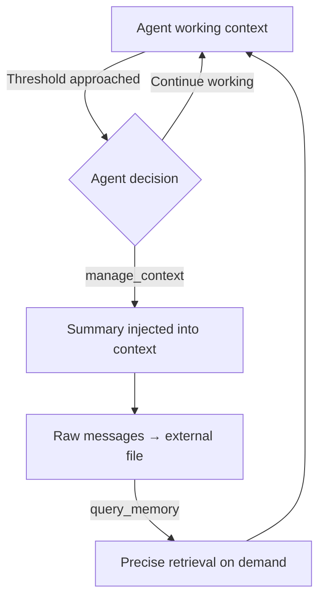
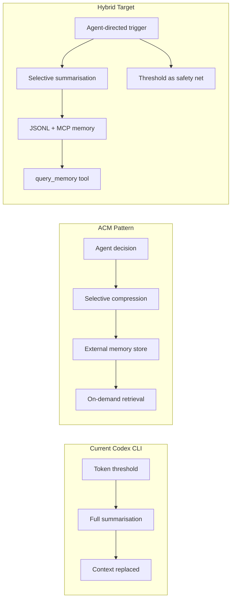

# ACM and the Agentic Context Management Thesis: Why Your Agent Should Decide When to Compress — and How to Build Lossless External Memory for Codex CLI


---

## The Problem with Threshold-Based Compaction

Every production coding agent eventually hits the same wall: context grows monotonically as tools return output, the token budget fills, and something must give. Codex CLI's built-in response is `model_auto_compact_token_limit` — a threshold trigger that fires a summarisation pass when accumulated tokens cross a configured percentage of the context window[^1]. The mechanism is simple, predictable, and lossy.

Li et al. (Meta/CMU, July 2026) argue in their ACM paper that this heuristic approach is fundamentally misaligned with how agents actually work[^2]. The compaction trigger fires based on a token count, not based on what the agent is *doing*. A threshold hit during file exploration has different information-preservation requirements than one during a multi-step refactoring. The agent knows the difference; the threshold does not.

## What ACM Proposes

Agentic Context Management (ACM) replaces rigid threshold triggers with two purpose-built tools that the agent invokes autonomously[^2]:

| Tool | Purpose |
|------|---------|
| `manage_context` | Compresses previous turns into a summary and offloads raw messages to an external file on disk |
| `query_memory` | Retrieves specific content from stored raw messages using identifiers |

The critical insight: **compression is lossless** because the original content persists in external storage. The agent can retrieve it later if the summary proves insufficient. This mirrors human memory — we compress routine information but can reconstruct detail by consulting notes.



## Quantitative Results

ACM was evaluated on a 9B parameter model (Qwen3.5-9B) post-trained with demonstrations from a 397B teacher model[^2]:

| Benchmark | ReAct Baseline | ACM Post-Trained | Relative Gain |
|-----------|---------------|-----------------|---------------|
| BrowseComp-Plus | 0.570 | 0.727 | +27% |
| DeepSearchQA | 0.367 | 0.425 | +16% |
| SWE-Bench Verified | 0.489 | 0.530 | +8% |

Peak token pressure dropped approximately 20%, and average tool invocations nearly tripled on BrowseComp-Plus (19.5 → 46.2), demonstrating that context relief enables *more* exploration rather than less[^2].

## How Codex CLI's Compaction Compares

Codex CLI's current architecture treats compaction as a system-level event, not an agent-level decision[^1]:

1. Context accumulates past `model_auto_compact_token_limit` (default: 80% of window)
2. The entire conversation is handed to a summarisation LLM
3. History is replaced with the summary
4. Up to five recently edited files are re-read (budgeted at 50,000 tokens)
5. A lead-in message orients the model

This design has three structural limitations that ACM addresses:

**Trigger misalignment.** Compaction fires on token count regardless of task phase. An agent mid-way through a multi-file refactoring loses context it will need in three turns[^3].

**Lossy by default.** Once summarised, the original messages are gone from the session. If the summary drops a critical detail — an error message, a configuration value — the agent cannot recover it without re-executing the tool call.

**No selective retrieval.** Post-compaction, the agent operates on the summary or nothing. There is no mechanism to query "what was the output of that grep I ran 40 turns ago?"

## Bridging ACM Patterns into Codex CLI Today

While Codex CLI does not natively offer `manage_context` and `query_memory` tools, the architecture is extensible enough to approximate ACM's approach using existing primitives.

### Strategy 1: MCP-Based External Memory Server

Build a lightweight MCP server that implements ACM's two-tool pattern:

```toml
# config.toml
[mcp_servers.context-memory]
command = "npx"
args = ["@acme/context-memory-mcp", "--store", "/tmp/codex-memory"]
enabled_tools = ["manage_context", "query_memory"]
```

The MCP server stores offloaded context as indexed JSON files, queryable by turn number, tool name, or content hash. The agent calls `manage_context` before hitting the compaction threshold, preserving retrieval access[^4].

### Strategy 2: AGENTS.md Context Governance

Encode context management policy directly in AGENTS.md so the agent knows *when* to compress:

```markdown
## Context Management Rules

- Before any compaction trigger, offload tool outputs longer than 500 lines
  to `.codex/memory/` using the write_file tool
- When working on multi-file refactoring, preserve file paths and line ranges
  in a scratchpad file at `.codex/memory/active-refactor.md`
- After completing a subtask, summarise findings in `.codex/memory/findings.md`
  before moving to the next subtask
- Reference memory files with read_file when encountering "I don't have context
  for..." reasoning patterns
```

### Strategy 3: Lowered Threshold with Pre-emptive Offload

Configure aggressive compaction thresholds combined with filesystem persistence:

```toml
# config.toml — ACM-inspired configuration
model_auto_compact_token_limit = 120000  # Fire early at 60%
model_context_window = 200000
tool_output_token_limit = 8000           # Cap individual tool outputs
```

The lowered `tool_output_token_limit` acts as ACM's ingestion gate — large outputs are truncated in-context but the agent can write the full output to a file for later retrieval[^5].

### Strategy 4: Session JSONL as External Memory

Codex CLI already persists every session as JSONL in `~/.codex/sessions/`[^6]. A PostToolUse hook can index these transcripts:

```bash
#!/bin/bash
# .codex/hooks/post-tool-use/index-memory.sh
# Index tool outputs for later grep-based retrieval

TOOL_NAME="$CODEX_TOOL_NAME"
OUTPUT_FILE="$CODEX_TOOL_OUTPUT_FILE"

if [ -f "$OUTPUT_FILE" ] && [ "$(wc -c < "$OUTPUT_FILE")" -gt 4096 ]; then
  HASH=$(sha256sum "$OUTPUT_FILE" | cut -c1-8)
  cp "$OUTPUT_FILE" ".codex/memory/${TOOL_NAME}-${HASH}.txt"
  echo "Stored large output: .codex/memory/${TOOL_NAME}-${HASH}.txt"
fi
```

## The Broader Context: Compaction Is a Spectrum

ACM sits within a broader research trend recognising that context management is not a single mechanism but a lifecycle discipline. Dadhich (arXiv:2607.21503, July 2026) formalises this into five primitives: architecting, ingesting, scoping, anticipating, and compacting — arguing that naive accumulation produces quadratic cost growth, crude summarisation achieves linear cost but sacrifices accuracy, and only validated compaction maintains both linear efficiency and fidelity[^7].

The earlier TokenPilot framework (Xu et al., June 2026) demonstrated that cache-aware compaction — timing compression to avoid prompt cache invalidation — can reduce costs by 61–87% while maintaining cache hit rates of 79.2%[^5]. ACM complements this by making the *decision* agentic rather than heuristic.



## Practical Implications for Long-Horizon Tasks

The ACM results on SWE-Bench Verified (+8%) are modest but the mechanism matters more than the headline number. For a 9B model to match larger open-source models 40× its size through better context management alone suggests that the ceiling on Codex CLI's GPT-5.6 Terra or Sol performance may be constrained more by context architecture than by model capability[^2].

For teams running long-horizon tasks — monorepo migrations, large refactoring campaigns, multi-day feature branches — the difference between lossy compaction and lossless external memory compounds over sessions. Each compaction event that drops a detail the agent needed forces a recovery cycle: re-reading files, re-running tools, re-establishing state. ACM's retrieval mechanism eliminates this tax.

## Configuration Recommendations

For teams wanting to move toward agentic context management today:

| Scenario | Configuration |
|----------|--------------|
| Standard development | `model_auto_compact_token_limit = 160000` (default behaviour) |
| Long-horizon refactoring | `model_auto_compact_token_limit = 100000` + AGENTS.md memory rules |
| Multi-session campaigns | Add MCP memory server + `codex resume` for cross-session continuity |
| Cost-sensitive pipelines | `tool_output_token_limit = 4000` + PostToolUse indexing hook |

## What to Watch

ACM's post-training pipeline — using a large teacher model to generate context management demonstrations, then distilling into a smaller policy model — is the pattern most likely to land in production harnesses. If OpenAI applies this to GPT-5.6 Terra's system prompt or Codex CLI's built-in instructions, the threshold-based compaction could evolve into an agent-directed hybrid where `model_auto_compact_token_limit` becomes a safety net rather than the primary mechanism.

⚠️ Whether OpenAI is actively working on this integration is unconfirmed — but the architectural direction is consistent with the v0.146 trend toward giving agents more control over their own execution environment (session naming, thread forking, skill selection).

---

## Citations

[^1]: OpenAI, "Codex CLI Context Compaction: Architecture, Configuration, and Managing Long Sessions," *Codex CLI Documentation*, March 2026. [https://codex.danielvaughan.com/2026/03/31/codex-cli-context-compaction-architecture/](https://codex.danielvaughan.com/2026/03/31/codex-cli-context-compaction-architecture/)

[^2]: Xiaochuan Li, Ryan Ming, Meng Chu, Shuai Shao, Rong Jin, and Chenyan Xiong, "ACM: Agentic Context Management for Long Horizon Tasks," *arXiv:2607.23809*, July 26, 2026. [https://arxiv.org/abs/2607.23809](https://arxiv.org/abs/2607.23809)

[^3]: OpenAI, "Support `model_context_window`/`model_auto_compact_token_limit` in profiles," *GitHub Issue #14456*, openai/codex, 2026. [https://github.com/openai/codex/issues/14456](https://github.com/openai/codex/issues/14456)

[^4]: Anthropic, "Model Context Protocol Specification v1.1," *modelcontextprotocol.io*, 2026. [https://modelcontextprotocol.io/specification](https://modelcontextprotocol.io/specification)

[^5]: Xu et al., "TokenPilot: Cache-Efficient Context Management for LLM Agents," *arXiv:2606.17016*, June 2026. [https://arxiv.org/abs/2606.17016](https://arxiv.org/abs/2606.17016)

[^6]: OpenAI, "Codex CLI Session Lifecycle: Archive, Resume, Fork, and Compact," *Codex CLI Documentation*, June 2026. [https://codex.danielvaughan.com/2026/06/05/codex-cli-session-lifecycle-archive-resume-fork-compact-management/](https://codex.danielvaughan.com/2026/06/05/codex-cli-session-lifecycle-archive-resume-fork-compact-management/)

[^7]: Gaurav Dadhich, "Agentic Context Management: Solving Agent Memory and Cost by Treating Them as Lifecycle and Architecture Problems," *arXiv:2607.21503*, July 23, 2026. [https://arxiv.org/abs/2607.21503v1](https://arxiv.org/abs/2607.21503v1)
