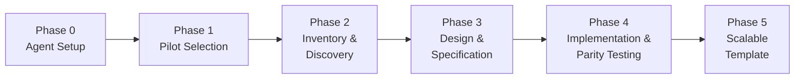
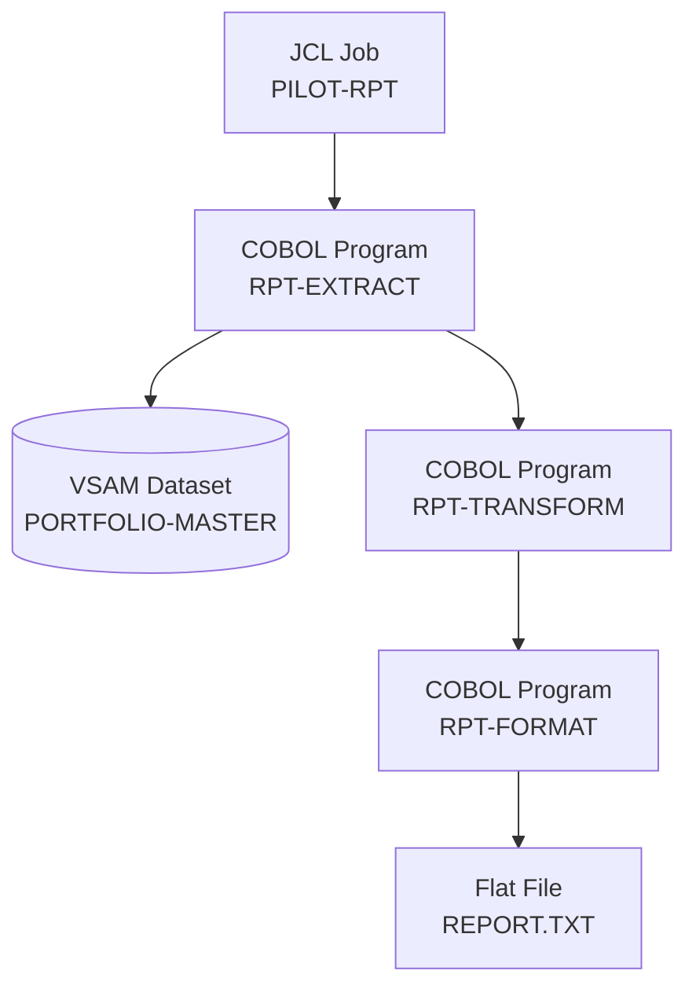
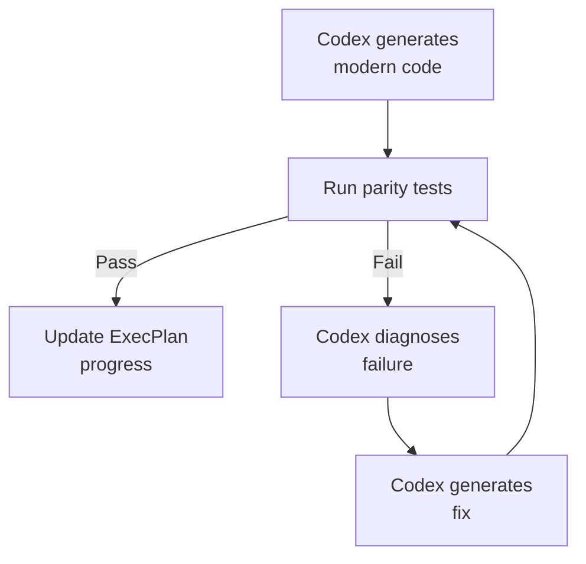

# Code Modernisation with Codex CLI: The ExecPlan Pattern for Legacy Codebase Migration


---

Code modernisation has become one of Codex CLI's most common enterprise use cases [^1]. OpenAI's official cookbook now documents a structured five-phase methodology — centred on what it calls an *ExecPlan* — that turns "modernise our codebase" into a series of small, testable steps [^2]. This article unpacks that pattern, maps it to current Codex CLI configuration, and connects it to recent research on deterministic validation of AI-generated migration code.

## Why legacy modernisation still fails

Industry data is sobering: 79% of organisations have had at least one modernisation project fail [^1]. The reasons are structural, not technical. Veteran engineers retire, taking undocumented domain knowledge with them. Legacy systems accumulate millions of lines in COBOL, PL/SQL, or early Java, laced with implicit business rules that no specification captures. And the testing surface for a 40-year-old batch system rarely exists in a form that automated tools can consume.

AI-assisted modernisation does not eliminate these problems, but it shifts the bottleneck. In measured deployments, AI-generated code covers 70–80% of conversion automatically, developers complete tasks roughly 55% faster, and post-migration downtime drops by around 40% through AI-generated parity tests [^1]. The remaining 20–30% — the business logic that lives in comments, operator knowledge, and production workarounds — still requires human judgement.

## The ExecPlan pattern

The OpenAI cookbook structures modernisation around an *ExecPlan*: a living design document that the agent follows to deliver system change [^2]. The pattern is stack-agnostic — it works for COBOL-to-Java, monolith-to-microservices, or PL/SQL-to-Python — and breaks into five phases.



### Phase 0: Agent setup

Establish the configuration surface that will govern every subsequent interaction. This means two files in `.agent/`:

- **AGENTS.md** — defines how Codex should reason about the repository, which files to read first, and what conventions to follow.
- **PLANS.md** — establishes the ExecPlan skeleton: what sections an ExecPlan must contain, what "done" looks like for each phase, and how to update progress.

```bash
codex /init
# Review and edit .agent/AGENTS.md to add modernisation-specific rules
```

A practical AGENTS.md excerpt for a COBOL modernisation project:

```toml
# .agent/AGENTS.md (relevant section)
## Modernisation Rules
- Never delete legacy source files; move them to `legacy/` after parity is confirmed
- Every generated module must have a corresponding parity test
- Reference the ExecPlan before starting any implementation task
- Use British English in all generated documentation
```

### Phase 1: Pilot selection

Choose a bounded, representative flow. The cookbook recommends a reporting flow — it touches data access, transformation logic, and output formatting without requiring real-time transaction handling [^2]. Ask Codex to propose candidates:

```
Read the repository structure and propose three candidate pilot flows
for modernisation. For each, estimate the number of programs involved,
the data sources touched, and the risk level.
```

The output feeds into `pilot_execplan.md`, which follows the PLANS.md skeleton with concrete references to actual legacy files.

### Phase 2: Inventory and discovery

Codex generates `pilot_reporting_overview.md` containing:

1. **Inventory** — programs, jobs, datasets, copybooks, and a data flow diagram (rendered as a Mermaid graph, not ASCII art).
2. **Modernisation Technical Report** — extracted business scenarios, detailed behaviours, data models, and technical risks.



Engineers validate the inventory against production JCL and fill knowledge gaps. The ExecPlan is updated to reflect discoveries — this is the critical human-in-the-loop checkpoint.

### Phase 3: Design, specification, and validation

This phase produces three artefacts:

| Artefact | Purpose |
|----------|---------|
| `pilot_reporting_design.md` | Target service design, data models, API overview |
| `modern/openapi/pilot.yaml` | Language-agnostic OpenAPI specification |
| `pilot_reporting_validation.md` | Test scenarios, parity comparison strategy |

The OpenAPI spec is the contract between old and new. Codex generates it from the discovered data models, and engineers review it before implementation begins.

```yaml
# modern/openapi/pilot.yaml (excerpt)
paths:
  /reports/portfolio:
    get:
      summary: Generate portfolio report
      parameters:
        - name: asOfDate
          in: query
          schema:
            type: string
            format: date
      responses:
        '200':
          description: Portfolio report
          content:
            application/json:
              schema:
                $ref: '#/components/schemas/PortfolioReport'
```

### Phase 4: Implementation and parity testing

This is where Codex does the heavy lifting. It generates modern code under `modern/<stack>/pilot/`, wires up parity tests, and enters an iterative repair loop:



Parity testing invokes both legacy and modern implementations with identical inputs, comparing outputs field by field. For COBOL systems, this traditionally required mainframe access. Recent research offers an alternative.

## The Locksmith Loop: deterministic validation off-mainframe

Ferenczi et al. (July 2026) introduced the *Locksmith Loop*, an agentic method for deterministic validation of COBOL-to-Java migrations that runs entirely on commodity hardware [^3]. The approach:

1. Instruments both COBOL source and generated Java with mocks.
2. Uses *Witness Search* to discover input combinations that exercise different program branches.
3. Applies mutations while preserving program behaviour.
4. Identifies *Locked Paragraphs* — conditions blocking deeper exploration.

The results are significant: 91.90% branch coverage on a production-like COBOL application, with generated Java matching the COBOL reference under deterministic parity checks in all accepted test cases [^3].

For Codex CLI users, the Locksmith Loop complements the ExecPlan pattern. Where the ExecPlan structures *what* to modernise and *how*, the Locksmith Loop provides *objective verification* that the migration preserves behaviour — without mainframe access.

## Codex CLI configuration for modernisation projects

A modernisation project benefits from specific `config.toml` settings:

```toml
# ~/.codex/config.toml

[model]
default = "gpt-5.6-terra"        # Strong reasoning for analysis phases
# Switch to Sol for complex cross-file refactoring:
# default = "gpt-5.6-sol"

[model.auto_compact]
token_limit = 180000              # Legacy codebases generate large contexts

[sandbox]
mode = "workspace-write"          # Codex needs to create modern/ directory tree

[agents]
max_concurrent_threads_per_session = 4  # Parallel module modernisation
```

For the analysis-heavy phases (0–3), GPT-5.6 Terra provides the best cost-to-reasoning ratio at \$2/\$12 per million tokens [^4]. For Phase 4 implementation, consider switching to Sol for complex cross-file refactoring, particularly when business logic spans multiple COBOL programs linked by copybooks.

### Named profiles for phase switching

```toml
# ~/.codex/config.toml

[profiles.modernise-analyse]
model = "gpt-5.6-terra"
reasoning_effort = "high"

[profiles.modernise-implement]
model = "gpt-5.6-sol"
reasoning_effort = "medium"

[profiles.modernise-test]
model = "gpt-5.6-luna"
reasoning_effort = "low"
```

Switch profiles per phase:

```bash
codex --profile modernise-analyse   # Phases 0-3
codex --profile modernise-implement # Phase 4 implementation
codex --profile modernise-test      # Phase 4 parity test iteration
```

## Six practical use cases

The DevOps.com analysis identifies six primary modernisation patterns where Codex CLI delivers measurable value [^1]:

1. **Legacy code understanding and documentation** — Codex reads COBOL/PL/SQL and generates structured documentation that captures business rules otherwise locked in retirement-risk engineers' heads.
2. **Automated refactoring** — monolith-to-microservices decomposition guided by data flow analysis.
3. **Language transformation** — direct COBOL-to-Java or PL/SQL-to-Python translation with structural preservation.
4. **API enablement** — wrapping legacy functionality behind OpenAPI contracts for incremental migration.
5. **Test-case generation** — creating parity test suites from legacy execution traces.
6. **Cloud-native migration** — generating Dockerfiles, Kubernetes manifests, and CI/CD pipelines for modernised services.

## Governance and the human-in-the-loop

The ExecPlan pattern enforces governance structurally. Each phase produces artefacts that engineers must review before the next phase begins. This maps directly to Codex CLI's approval mechanisms:

```toml
# config.toml
[approval]
policy = "unless-allow-listed"
```

Combined with AGENTS.md rules that prohibit deleting legacy source and require parity test coverage, the pattern creates an audit trail that satisfies enterprise change-management requirements [^5].

The key insight from the cookbook is that engineers focus on architecture and business rules whilst Codex handles translation, documentation synchronisation, and test scaffolding [^2]. This division of labour is what makes the 55% productivity gain achievable — not by replacing engineering judgement, but by eliminating the mechanical translation work that dominates legacy modernisation projects.

## Phase 5: Scaling the pattern

Once the pilot succeeds, Phase 5 creates reusable templates:

- `template_modernisation_execplan.md` — parameterised ExecPlan for additional flows.
- `how_to_use_codex_for_modernisation.md` — team guide documenting phases, Codex's role in each, and reference artefacts.

This is where the 30% reduction in unnecessary code rewriting effort compounds [^1]. Each subsequent flow benefits from the patterns established during the pilot, and the ExecPlan template ensures consistency across teams.

## What to watch

- **Locksmith Loop tooling** — if Ferenczi et al. release their instrumentation framework, integrating it as an MCP server for Codex CLI would close the parity-testing loop for COBOL migrations entirely [^3].
- **ExecPlan as a first-class Codex primitive** — the cookbook currently treats the ExecPlan as a markdown convention. A future `/modernise` command that scaffolds the full five-phase structure would lower the barrier to adoption.
- **Model cost trajectory** — Luna's recent 80% price cut [^4] makes the test-iteration loop in Phase 4 dramatically cheaper. Watch for similar reductions in Terra and Sol that could make Sol viable for the full pipeline.

## Citations

[^1]: "OpenAI Codex: A New Frontier in Application Modernization," DevOps.com, 2026. [https://devops.com/openai-codex-a-new-frontier-in-application-modernization/](https://devops.com/openai-codex-a-new-frontier-in-application-modernization/)

[^2]: "Modernizing your Codebase with Codex," OpenAI Cookbook, 2026. [https://developers.openai.com/cookbook/examples/codex/code_modernization](https://developers.openai.com/cookbook/examples/codex/code_modernization)

[^3]: Ferenczi, A. et al., "Agentic Method for Deterministic Validation of Legacy Code Migration," arXiv:2607.28271, July 2026. [https://arxiv.org/abs/2607.28271](https://arxiv.org/abs/2607.28271)

[^4]: "GPT-5.6 Price Restructuring," OpenAI, July 2026. GPT-5.6 Luna at \$0.20/\$1.20 per million tokens, Terra at \$2/\$12, Sol at \$5/\$30. [https://openai.com/index/previewing-gpt-5-6-sol/](https://openai.com/index/previewing-gpt-5-6-sol/)

[^5]: "Custom instructions with AGENTS.md," OpenAI Codex Documentation, 2026. [https://developers.openai.com/codex/guides/agents-md](https://developers.openai.com/codex/guides/agents-md)
