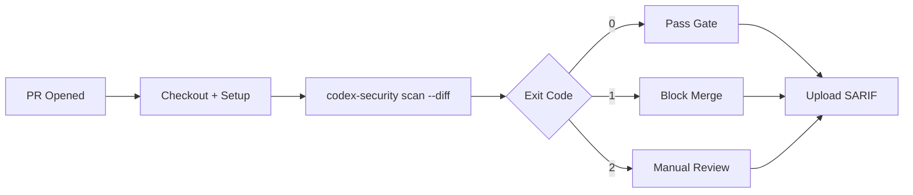

# Codex Security CLI Goes Open Source: A Practitioner's Guide to the Scanning Harness, CI Gating, and Pre-Commit Workflow


---

On 29 July 2026, OpenAI quietly released the Codex Security CLI and TypeScript SDK as open-source software under the Apache 2.0 licence[^1]. The `@openai/codex-security` npm package — which had been in research preview since March 2026 — surfaced on Hacker News before OpenAI had a chance to announce it, accumulating 2.1k GitHub stars and 392 HN points within days[^2]. For developers already using Codex CLI for day-to-day coding, the open-source release transforms security scanning from a hosted black box into an inspectable, composable pipeline component.

This article covers what the CLI actually does, how to wire it into CI/CD and pre-commit workflows, and why the *harness* around the scanner matters more than the scanner itself.

## What Changed: From Daybreak Preview to Open Harness

The Daybreak announcement in May 2026 positioned Codex Security as an enterprise platform bundling GPT-5.5-Cyber, partner integrations, and the Trusted Access for Cyber (TAC1) programme. The open-source release shifts the emphasis. The CLI code is now fully inspectable — you can read every TypeScript skill definition that instructs the model on vulnerability identification patterns[^1]. The backend analysis service remains hosted by OpenAI, but the orchestration, deduplication, false-positive tracking, cost controls, and CI gating logic are all in your hands.

As one Hacker News commenter observed: "The scanner is the least interesting part… The harness around it is the product: dedup across runs, false-positive tracking, budget controls, CI gating"[^2].

## Installation and Authentication

Prerequisites: Node.js 22+ and Python 3.10+ (the latter for scan execution and SARIF export)[^3].

```bash
npm install @openai/codex-security
```

Three authentication paths are available:

```bash
# Interactive ChatGPT login
npx @openai/codex-security login

# Headless device auth (CI-friendly)
npx @openai/codex-security login --device-auth

# API key via environment variable
export OPENAI_API_KEY="sk-..."
```

When both a ChatGPT session and an API key are present, the API key takes priority — the correct default for unattended pipelines[^3].

## Scanning Modes

The `scan` command supports four target types, selectable via mutually exclusive flags:

| Target | Flag | Use Case |
|--------|------|----------|
| Full repository | *(default)* | Baseline audit |
| Path-limited | `--path src/auth/` | Scope to a service boundary |
| Diff | `--diff origin/main --head HEAD` | PR review |
| Working tree | `--working-tree` | Pre-commit check |

Two depth modes control the analysis:

- **`--mode standard`** — optimised for speed and common vulnerability patterns (default).
- **`--mode deep`** — multi-pass analysis for complex logic flaws, at higher cost[^3].

A typical first scan:

```bash
REPOSITORY=/path/to/repo
SCAN_DIR=/tmp/codex-security-results

# Dry run first — validates config without spending tokens
npx @openai/codex-security scan "$REPOSITORY" \
  --output-dir "$SCAN_DIR" \
  --dry-run

# Execute
npx @openai/codex-security scan "$REPOSITORY" \
  --output-dir "$SCAN_DIR" \
  --model gpt-5.6-sol \
  --effort high \
  --max-cost 5
```

The `--max-cost` flag is essential. Early adopters reported 50-minute scans consuming half a weekly API quota before failing, with no resume capability[^2]. Set a budget ceiling from day one.

## Scan Artefacts and Output Formats

Every completed scan writes a structured directory:

```bash
<scan-directory>/
├── scan-manifest.json   # identity, status, sealed records
├── findings.json        # vulnerabilities with full detail
├── coverage.json        # reviewed surfaces, completeness
├── report.md            # human-readable summary
├── artifacts/
└── exports/
    └── results.sarif    # SARIF v2.1.0 for IDE/CI ingestion
```

Coverage values are `complete`, `partial`, or `unknown` — a candid acknowledgement that AI scans cannot guarantee exhaustive analysis[^3]. The `--format` flag supports `toon` (text), `json`, `yaml`, and `jsonl` for structured output.

Export to standard formats:

```bash
npx @openai/codex-security export \
  --export-format sarif \
  --source-root /path/to/repo \
  --output results.sarif
```

SARIF v2.1.0 output integrates directly with GitHub Code Scanning, GitLab SAST, and any IDE that supports the SARIF Viewer extension[^3].

## The CI/CD Integration Pattern

The key to production use is the `--fail-on-severity` flag, which maps directly to CI exit codes:

| Exit Code | Condition |
|-----------|-----------|
| 0 | Scan passed severity policy, complete coverage |
| 1 | Finding at or above configured severity threshold |
| 2 | Input/runtime error, incomplete coverage |
| 130 | Ctrl-C interrupt |
| 143 | SIGTERM |

A minimal GitHub Actions workflow:


```yaml
name: Codex Security Gate
on:
  pull_request:
    branches: [main]

jobs:
  security-scan:
    runs-on: ubuntu-latest
    steps:
      - uses: actions/checkout@v4
        with:
          fetch-depth: 0

      - uses: actions/setup-node@v4
        with:
          node-version: '22'

      - uses: actions/setup-python@v5
        with:
          python-version: '3.12'

      - name: Install Codex Security
        run: npm install @openai/codex-security

      - name: Scan PR diff
        env:
          OPENAI_API_KEY: ${{ secrets.OPENAI_API_KEY }}
        run: |
          npx @openai/codex-security scan . \
            --diff origin/main --head HEAD \
            --output-dir /tmp/scan-results \
            --fail-on-severity high \
            --max-cost 10 \
            --format json

      - name: Upload SARIF
        if: always()
        uses: github/codeql-action/upload-sarif@v3
        with:
          sarif_file: /tmp/scan-results/exports/results.sarif
```




OpenAI themselves acknowledge that "AI scans can produce different results even when the configuration remains unchanged"[^4]. This non-determinism is precisely why the harness matters: the `--fail-on-severity` gate, combined with `scans match` for cross-scan deduplication, turns a probabilistic scanner into a usable policy gate.

## Pre-Commit Hook Integration

The simplest integration for individual developers:

```bash
npx @openai/codex-security install-hook
```

This installs a Git pre-commit hook that scans staged and unstaged changes, respects `core.hooksPath`, and blocks commits containing high-severity findings[^3]. It does not replace an existing pre-commit hook — it chains alongside it.

For teams already using a pre-commit framework, the hook scans `--working-tree --base HEAD`, meaning it evaluates only the delta you are about to commit, not the entire repository.

## Bulk Scanning and Historical Tracking

The `bulk-scan` command processes multiple repositories in parallel via worker pools[^3]. It supports two discovery modes:

- **GitHub GraphQL** — discovers repositories in an organisation automatically.
- **CSV inventory** — a file listing repository paths.

Progress is tracked via a resumable ledger, so interrupted bulk scans pick up where they left off. This is the enterprise workflow: scan 200 repositories overnight, review the consolidated findings in the morning.

Historical scan management uses a local SQLite workbench:

```bash
# List past scans
npx @openai/codex-security scans list --format json

# Compare two scans to see new vs. resolved findings
npx @openai/codex-security scans compare SCAN_ID_A SCAN_ID_B

# Semantically match findings across scans
npx @openai/codex-security scans match SCAN_ID_A SCAN_ID_B --all
```

The `scans match` command uses semantic matching rather than line-number comparison — critical when code refactoring moves a vulnerability without fixing it.

## Finding Management: Validate, Patch, Dismiss

The workflow beyond scanning is where Codex Security diverges from traditional SAST tools:

```bash
# Validate a finding — attempts reproduction in isolation
npx @openai/codex-security validate findings.json \
  "SQL injection in user search endpoint" \
  --effort high

# Generate a patch
npx @openai/codex-security patch findings.json \
  "SQL injection in user search endpoint" \
  --effort high

# Mark false positive with reason
npx @openai/codex-security findings false-positive \
  OCCURRENCE_ID \
  --reason "Input is pre-validated by middleware"
```

The `validate` command attempts to reproduce the vulnerability in an isolated environment, providing evidence rather than speculation[^4]. The `patch` command proposes fixes for human review — never auto-applying.

## Connecting Codex Security to Codex CLI Workflows

For teams using Codex CLI as their primary coding agent, the security scanner slots into the existing configuration surface. The `--codex` flag accepts TOML overrides:

```bash
npx @openai/codex-security scan . \
  --codex 'model_reasoning_effort="high"' \
  --knowledge-base docs/threat-model.md
```

The `--knowledge-base` flag is particularly powerful: feed it your architecture documentation, threat model, or API specification, and the scanner uses it as additional context when evaluating findings[^3]. This mirrors the AGENTS.md pattern in Codex CLI — grounding the AI in project-specific knowledge rather than relying on generic vulnerability patterns.

## Cost and Reliability Realities

Early adoption has surfaced genuine concerns. Community reports include scans consuming \$13 in charges before failing due to rate limits, and `Repository HEAD changed` errors terminating long scans with no resume capability[^2]. The mitigations are straightforward but essential:

1. **Always set `--max-cost`** — start with \$5 for diff scans, \$20 for full repository baselines.
2. **Use diff scanning for PRs** — scanning only the changed code is dramatically cheaper than full repository scans.
3. **Pin the model** — `--model gpt-5.6-terra` is cheaper than the default `gpt-5.6-sol` for standard-mode scans.
4. **Store results outside the repository** — the `--output-dir` flag prevents scan artefacts from polluting your working tree.

⚠️ The scanner requires sending code to OpenAI's servers. Local endpoint support is planned but not yet available. Organisations with strict data residency requirements should evaluate this constraint before adoption.

## The Harness Thesis

The most important insight from the open-source release is architectural: the *scanner* is a commodity — any sufficiently capable LLM can identify common vulnerabilities. What makes Codex Security production-viable is the harness:

- **Deduplication** across runs prevents alert fatigue from the same finding appearing in every scan.
- **False-positive tracking** with `findings false-positive` maintains institutional memory.
- **Budget controls** via `--max-cost` prevent runaway API spend.
- **Severity gating** via `--fail-on-severity` creates a deterministic policy boundary around a non-deterministic process.
- **SARIF export** connects the output to the existing security tooling ecosystem.

This is the pattern that matters for AI-augmented development tooling in general: wrap probabilistic AI capabilities in deterministic harness infrastructure. The open-source release lets you inspect, extend, and trust that harness.

---

## Citations

[^1]: OpenAI, "Codex Security CLI and TypeScript SDK", GitHub repository (Apache 2.0), [https://github.com/openai/codex-security](https://github.com/openai/codex-security)

[^2]: Developers Digest, "OpenAI Open-Sourced Codex Security: What HN Thinks", July 2026, [https://www.developersdigest.tech/blog/codex-security-open-source-cli-sdk-hn-analysis](https://www.developersdigest.tech/blog/codex-security-open-source-cli-sdk-hn-analysis)

[^3]: OpenAI, "Codex Security CLI Reference", ChatGPT Learn documentation, [https://learn.chatgpt.com/docs/security/cli/reference](https://learn.chatgpt.com/docs/security/cli/reference)

[^4]: DevOps.com, "OpenAI Open Sources Codex Security CLI for the Merge Path", July 2026, [https://devops.com/openai-open-sources-codex-security-cli-for-the-merge-path/](https://devops.com/openai-open-sources-codex-security-cli-for-the-merge-path/)
