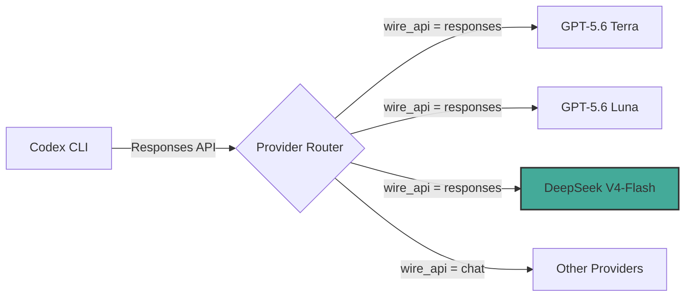
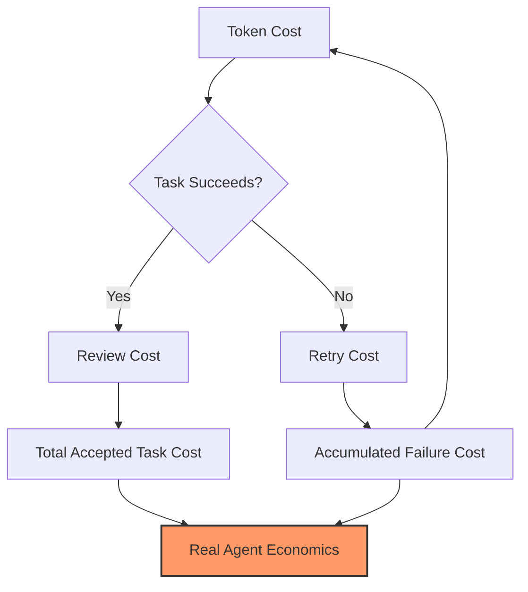

# DeepSeek V4-Flash-0731: Native Codex Support, Open Weights, and the Agent Economics Question


On 31 July 2026 DeepSeek released V4-Flash-0731, a retrained checkpoint of its 284-billion-parameter mixture-of-experts model that does two things the April preview could not: it speaks the OpenAI Responses API natively, and it beats DeepSeek's own V4-Pro-Preview on nine published agent and coding benchmarks[^1]. The weights sit on Hugging Face under MIT, meaning you can run them on-premise or route through the DeepSeek API at \$0.14 per million input tokens[^2]. For Codex CLI users, the integration story is now a six-line config.toml edit rather than an adapter layer.

This article walks through what changed in the retrain, how to configure Codex CLI as a provider, where the benchmark numbers genuinely hold up, and why cost per accepted task — not cost per token — is the metric that matters.

## What Changed in the 0731 Retrain

V4-Flash-0731 is not a new architecture. The 284B MoE hull with 13B active parameters per token is identical to the April preview[^1]. What changed is the post-training pipeline: DeepSeek retrained the model's instruction-following, tool-use, and agentic reasoning layers using what they describe as an enhanced reinforcement learning stage[^3]. The result is dramatic benchmark movement without touching the base weights.

The headline numbers[^1][^4]:

| Benchmark | April Preview | 0731 | Delta |
|-----------|--------------|------|-------|
| Terminal-Bench 2.1 | 56.9 | 82.7 | +25.8 |
| DeepSWE | 7.3 | 54.4 | +47.1 |
| Cybergym | 38.7 | 76.7 | +38.0 |
| Toolathlon-Verified | 49.7 | 70.3 | +20.6 |
| NL2Repo | 39.4 | 54.2 | +14.8 |
| Agents' Last Exam | 15.8 | 25.2 | +9.4 |

Two internal benchmarks — DSBench-FullStack (68.7) and DSBench-Hard (59.6) — lack external validation and should be treated with appropriate scepticism[^4].

A significant caveat: the Terminal-Bench 2.1 score of 82.7 was obtained using DeepSeek's unreleased "DeepSeek Harness" in minimal mode with maximum reasoning effort, which prevents independent reproduction[^4]. Until a third party runs the same evaluation, that number carries an asterisk. ⚠️ Artificial Analysis did report approximately a ten-point jump on its Intelligence Index compared to the earlier V4-Flash, which lends some credibility to the general trend if not the specific number[^5].

## Native Codex Support via the Responses API

The most consequential change for Codex CLI users is native Responses API support[^2]. Previous DeepSeek models required the `wire_api = "chat"` compatibility path, which meant Codex had to translate its internal tool-call and structured-output protocol into OpenAI Chat Completions format. The translation layer worked but introduced edge cases around multi-step tool chains and streaming.

With `wire_api = "responses"`, V4-Flash-0731 speaks the same protocol that GPT-5.6 Terra and Luna use. Tool calls, structured outputs, and multi-turn agent loops work without translation.



DeepSeek's V4-Pro is expected to gain Responses API support in early August 2026[^6]. Until then, V4-Flash is the only DeepSeek model that can be configured as a native Codex provider.

## Configuring Codex CLI

The configuration lives in `~/.codex/config.toml`. Because Codex CLI, the ChatGPT desktop app, and the VS Code extension all read the same file, a single configuration makes V4-Flash available across all three surfaces[^6].

### Provider Configuration

```toml
model = "deepseek-v4-flash"
model_provider = "deepseek"
preferred_auth_method = "apikey"
forced_login_method = "api"
model_reasoning_effort = "high"
model_catalog_json = "~/.codex/models.json"

[model_providers.deepseek]
name = "deepseek"
base_url = "https://api.deepseek.com/"
wire_api = "responses"
experimental_bearer_token = "<your DeepSeek API Key>"
```

Key fields:

| Field | Purpose |
|-------|---------|
| `wire_api = "responses"` | Uses the native Responses API — do not fall back to `"chat"` |
| `model_reasoning_effort` | `"high"` is recommended for agentic tasks; `"medium"` for cost-sensitive drafting |
| `model_catalog_json` | Points to a local model metadata file for token limits and pricing display |
| `experimental_bearer_token` | Your DeepSeek Platform API key |

### Model Catalogue Entry

Create or update `~/.codex/models.json` to register the model's capabilities:

```json
{
  "deepseek-v4-flash": {
    "name": "DeepSeek V4-Flash (0731)",
    "provider": "deepseek",
    "max_input_tokens": 1000000,
    "max_output_tokens": 384000,
    "supports_reasoning": true,
    "supports_streaming": true
  }
}
```

The 1-million-token context window and 384,000-token maximum output match the model's published specifications[^4].

### Named Profiles for Model Routing

A practical pattern is to keep GPT-5.6 Terra as the default for high-stakes work and route cost-sensitive tasks to V4-Flash via named profiles:

```toml
# Default profile — GPT-5.6 Terra
model = "gpt-5.6-terra"

[profiles.draft]
model = "deepseek-v4-flash"
model_provider = "deepseek"
model_reasoning_effort = "medium"

[profiles.review]
model = "gpt-5.6-terra"
model_reasoning_effort = "high"
```

Switch at the command line:

```bash
# Draft a migration with V4-Flash
codex --profile draft "Migrate the auth module from Express to Fastify"

# Review the output with Terra
codex --profile review "Review the migration diff for correctness and security"
```

## Pricing and the Agent Economics Question

The raw token economics are compelling[^2]:

| | Cached Input | Uncached Input | Output |
|--|-------------|----------------|--------|
| DeepSeek V4-Flash | \$0.0028/M | \$0.14/M | \$0.28/M |

DeepSeek has announced but not yet activated peak-hour pricing at 2× regular rates during specified Beijing-time windows[^2].

A worked example: a 20-million-token agent run at a 3:1 input-to-output blend costs approximately \$3.50 before cache discounts[^5]. The same run on GPT-5.6 Terra would cost substantially more.

But token price is a misleading proxy for agent cost. As the analysis from NxCode correctly frames it: **cost per accepted task is the important ratio, not cost per token**[^5]. A three-pence failed run repeated ten times exceeds a one-pound successful run. A model that drafts a correct patch but consumes forty minutes of senior review may be more expensive than its invoice suggests.



### Where V4-Flash Makes Economic Sense

The favourable use cases for a cheap, capable model with unverified top-end benchmarks[^5]:

- **Deterministic verification loops** — tasks with strong test suites where failures are caught automatically, making retries cheap
- **Repository migrations with parity tests** — the Locksmith Loop pattern where functional equivalence is machine-verified
- **Internal evaluations and prompt experimentation** — exploratory runs where the output quality bar is lower
- **Draft-only workflows** — generating initial implementations that a human or a second model (Terra, Opus 5) will review

### Where V4-Flash Is a False Economy

- **Production-critical code without comprehensive tests** — you cannot verify what you cannot test, and review time dominates the cost
- **Security-sensitive workflows** — the model's Cybergym score is strong but obtained under unverifiable harness conditions ⚠️
- **Long-horizon autonomous tasks** — the Agents' Last Exam score of 25.2 suggests the model still struggles with extended multi-step reasoning

## Licensing and Self-Hosting

The MIT licence on the Hugging Face weights (48 Safetensors shards, approximately 160 GB in FP4/FP8 mixed precision) permits commercial deployment without restriction[^1]. For organisations with GPU infrastructure and data sovereignty requirements, this opens a self-hosted Codex provider path:

1. Download weights from Hugging Face
2. Serve behind a vLLM or TGI endpoint with Responses API compatibility
3. Point `base_url` in config.toml to your internal endpoint
4. Remove the `experimental_bearer_token` field if using network-level authentication

Self-hosting requires significant GPU capacity (multiple A100 or H100 nodes for the full MoE), but the 13B active parameter count means inference throughput is more favourable than the 284B total suggests.

## The Reproducibility Problem

The elephant in the room is reproducibility. DeepSeek's benchmark numbers were obtained using their proprietary harness[^4]. This is not unusual — most frontier lab evaluations use internal scaffolding — but it means the comparison between V4-Flash-0731's Terminal-Bench 82.7 and, say, GPT-5.6 Terra's published Terminal-Bench score is not like-for-like unless run under identical conditions.

The Tessl position paper from the SE 3.0 Workshop at KDD 2026 articulates this problem precisely: a coding agent is not a model but a system harness, and benchmark scores conflate the model with the rest of the harness[^7]. Any component — prompt template, retry logic, reasoning budget — can move the score by margins comparable to those between adjacent model generations.

Pragmatic recommendation: run your own evaluation. Configure V4-Flash alongside Terra in named profiles, route a week's worth of real tasks through both, and measure accepted-task rate and total review time. Your codebase's evaluation is the only benchmark that matters.

## What This Means for Multi-Provider Strategy

V4-Flash-0731's native Codex support reinforces the multi-provider configuration pattern that Codex CLI was designed for. With DeepSeek, OpenAI, and Anthropic (via custom provider) all supporting the Responses API wire format, the `[model_providers]` section of config.toml becomes a genuine routing table:

```toml
[model_providers.openai]
name = "openai"
base_url = "https://api.openai.com/v1/"
wire_api = "responses"

[model_providers.deepseek]
name = "deepseek"
base_url = "https://api.deepseek.com/"
wire_api = "responses"
experimental_bearer_token = "<deepseek-key>"

[model_providers.anthropic]
name = "anthropic"
base_url = "https://api.anthropic.com/"
wire_api = "responses"
experimental_bearer_token = "<anthropic-key>"
```

The competitive pressure is healthy. DeepSeek's pricing forces OpenAI and Anthropic to justify their premium through reliability, review-time reduction, and first-attempt success rate — exactly the metrics that matter for agent economics.

## Verdict

DeepSeek V4-Flash-0731 is a credible Codex CLI provider for cost-sensitive, verification-heavy workflows. The native Responses API support eliminates the compatibility tax. The MIT licence enables self-hosting. The benchmark gains over the April preview are real, even if the absolute numbers carry reproducibility caveats.

But do not optimise for token price alone. The cheapest model is the one that produces accepted code on the first attempt with minimal review. For many teams, that will still be GPT-5.6 Terra or Claude Opus 5. V4-Flash earns its place in the routing table as the draft-and-verify model — the one you reach for when failures are cheap and retries are automated.

## Citations

[^1]: MarkTechPost, "DeepSeek Upgrades DeepSeek-V4-Flash-0731 with Major Agentic and Coding Gains," 31 July 2026. [https://www.marktechpost.com/2026/07/31/deepseek-upgrades-deepseek-v4-flash-0731-with-major-agentic-and-coding-gains/](https://www.marktechpost.com/2026/07/31/deepseek-upgrades-deepseek-v4-flash-0731-with-major-agentic-and-coding-gains/)

[^2]: Kingy AI, "DeepSeek V4-Flash 0731: Codex API Beta and Pricing," 31 July 2026. [https://kingy.ai/ai-launch-tracker/deepseek-v4-flash-0731-codex-api-beta/](https://kingy.ai/ai-launch-tracker/deepseek-v4-flash-0731-codex-api-beta/)

[^3]: TechTimes, "DeepSeek Retrained V4-Flash Beats Its Flagship Pro on Nine Agent Benchmarks," 31 July 2026. [https://www.techtimes.com/articles/322513/20260731/deepseek-retrained-v4-flash-beats-its-flagship-pro-nine-agent-benchmarks.htm](https://www.techtimes.com/articles/322513/20260731/deepseek-retrained-v4-flash-beats-its-flagship-pro-nine-agent-benchmarks.htm)

[^4]: Kingy AI, "DeepSeek V4-Flash 0731 Adds Codex Support, Claims 82.7 on Terminal-Bench," 31 July 2026. [https://kingy.ai/news/deepseek-v4-flash-0731-codex-terminal-bench/](https://kingy.ai/news/deepseek-v4-flash-0731-codex-terminal-bench/)

[^5]: NxCode, "DeepSeek V4-Flash 0731: The Update That Repriced Coding," 2026. [https://www.nxcode.io/resources/news/deepseek-v4-flash-0731-agent-economics-2026](https://www.nxcode.io/resources/news/deepseek-v4-flash-0731-agent-economics-2026)

[^6]: DeepSeek API Docs, "Integrate with Codex," 2026. [https://api-docs.deepseek.com/quick_start/agent_integrations/codex/](https://api-docs.deepseek.com/quick_start/agent_integrations/codex/)

[^7]: Gorinova, M. I. et al., "Position: Coding Benchmarks Are Misaligned with Agentic Software Engineering," arXiv:2606.17799, presented at SE 3.0 Workshop, KDD 2026, Jeju. [https://arxiv.org/abs/2606.17799](https://arxiv.org/abs/2606.17799)
