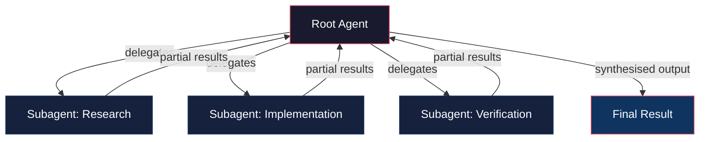
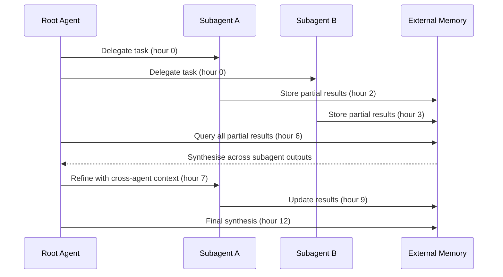

# OpenAI Astra and the Multi-Agent Horizon: What a Model That Works for Days Means for Codex CLI Developers


On 1 August 2026, OpenAI announced the first results from Astra, the company's next major model family [^1]. Researcher Noam Brown, who worked on the test-time reasoning technology behind the system, commented on the achievement on X [^1]. The headline: an internal version of Astra solved ten mathematical problems that had been open for at least a decade — spanning group theory, coding theory, quantum complexity, lattice cryptography, and high-dimensional geometry — at a total compute cost of roughly \$2,000 at current Sol API rates [^2]. The proofs shipped as machine-checkable Lean 4 certificates in the public `openai/ten-proofs` repository under Apache 2.0 [^3].

The mathematics is striking, but the architecture behind it matters more to Codex CLI practitioners. Astra is not GPT-5.6 with longer context. It is a different model class designed for multi-agent coordination over extended time horizons — hours or days rather than minutes [^4]. That design philosophy has direct implications for how we configure, govern, and reason about coding agents.

## What Astra Is (and Is Not)

Astra sits above the current GPT-5.6 tier (Terra, Sol, Luna) as a model family optimised for persistent, collaborative agent work [^1]. Where GPT-5.6 Sol already supports multi-agent orchestration in beta — spinning up subagents in parallel, synthesising results — Astra extends this to scenarios where coherence, context, and coordination must survive across multiple sessions [^4].

The distinction matters:

| Dimension | GPT-5.6 Sol (current) | Astra (announced) |
|---|---|---|
| Session duration | Minutes to low hours | Hours to days |
| Agent coordination | API-level multi-agent beta | Native persistent collaboration |
| Context management | 400K window with compaction | Unknown (expected larger) |
| Availability | GA via API and Codex | Not yet released; pending safety review |
| Naming | Confirmed (Terra/Sol/Luna) | Undecided — may ship as GPT-6 or GPT-5.7 [^5] |

OpenAI CEO Sam Altman previewed Astra to US senators on 29–30 July 2026 as part of a federal 30-day model review framework [^5]. No API access, pricing, or release date has been confirmed. ⚠️ *Any configuration advice below is preparatory, not production-ready.*

## Multi-Agent Architecture: From Orchestration to Delegation

Astra's architecture follows a pattern that Codex CLI developers using multi-agent v2 will recognise, but takes it further. The system uses a root agent that creates subagents, distributes work, waits for partial results, and synthesises a final answer — crucially, without requiring the consuming application to implement orchestration logic [^4].



For Codex CLI v0.145.0, multi-agent v2 already supports configurable subagent models [^6]. The current `config.toml` pattern for multi-agent work looks like this:

```toml
[profiles.multi-agent]
model = "gpt-5.6-sol"
approval_policy = "on-request"

[profiles.multi-agent.sub_agents]
model = "gpt-5.6-luna"
max_concurrent = 4
```

When Astra arrives, expect a model identifier (whether `astra`, `gpt-6`, or `gpt-5.7`) that slots into this same configuration surface. The preparation you can do now is structural: ensuring your `AGENTS.md` files document subagent boundaries, your approval policies cover delegated work, and your `PostToolUse` hooks capture audit trails across agent handoffs.

## Lean 4 and Formal Verification: A New Developer Skill Signal

The `openai/ten-proofs` repository is small — one `.lean` file per result — but its implications are large [^3]. Astra produced proofs that compile against Lean 4.32.0 and the mathlib library. Verification is deterministic: clone the repository, run `lake exe cache get && lake build All`, and the certificates either check or they do not.

This establishes Lean 4 as the standard format for AI-generated formal proofs. For Codex CLI developers, this matters in three domains:

1. **Smart contract verification** — Formal proofs of contract invariants become feasible at \$2,000 compute budgets rather than six-figure research grants
2. **Security protocol proofs** — Cryptographic property verification can be automated and machine-checked
3. **Specification-to-proof pipelines** — An `AGENTS.md` file that instructs the agent to produce Lean 4 certificates alongside implementation code creates a verifiable development workflow

An `AGENTS.md` section for formal verification work might look like this:

```markdown
## Formal Verification Rules

- All security-critical functions MUST have accompanying Lean 4 proofs
- Proofs MUST compile against mathlib without sorry tactics
- Run `lake build` as a verification gate before marking work complete
- Store proof certificates in `proofs/` alongside the implementation
```

## Context Management at Multi-Day Horizons

Astra's ability to operate across hours or days directly challenges the context management patterns Codex CLI developers have built around GPT-5.6's 400K token window. Current strategies — compaction via `model_auto_compact_token_limit`, MCP-based memory servers, session JSONL as retrieval stores — are designed for sessions measured in minutes [^7].

Multi-day agent coordination introduces new failure modes:

- **State drift**: subagents operating on stale context as the codebase changes beneath them
- **Coherence decay**: synthesised results from agents that lost track of requirements hours ago
- **Audit fragmentation**: governance hooks that track individual sessions but miss cross-session delegation chains

The ACM (Agentic Context Management) framework from Li et al. [^7] offers relevant primitives here: `manage_context` and `query_memory` tools that let agents autonomously decide when to compress and what to retrieve from external memory. When Astra ships, these patterns will move from research curiosity to operational necessity.



## Governance Gaps in Long-Horizon Agents

Current Codex CLI governance is session-scoped. Your `approval_policy` applies to a single agent session. Your `PostToolUse` hooks fire within that session's lifecycle. Your sandbox boundaries — `writable_roots`, network domain allowlists — are set at session start.

Astra's multi-day operation model breaks these assumptions:

- **Approval fatigue**: an agent running for 48 hours under `on-request` approval policy will generate hundreds of approval prompts — no human will maintain vigilance
- **Scope creep**: subagents delegated narrow tasks may require broader permissions as they encounter unexpected dependencies
- **Audit continuity**: session JSONL files capture single sessions, but Astra's delegation chains span multiple sessions

Preparing your governance stack means:

```toml
# Anticipatory governance configuration
[profiles.long-horizon]
model = "gpt-5.6-sol"  # Current best; replace with Astra identifier when available
approval_policy = "granular"
sandbox_mode = "workspace-write"

# Restrict network access tightly for multi-day runs
[profiles.long-horizon.network]
allowed_domains = ["github.com", "registry.npmjs.org", "api.openai.com"]

# Set cost ceiling for extended sessions
[profiles.long-horizon.budget]
max_cost_usd = 50.0
```

And in `AGENTS.md`:

```markdown
## Long-Horizon Session Rules

- Checkpoint all work to git every 30 minutes of wall-clock time
- Log all subagent delegations with task descriptions to session audit
- Do NOT expand scope beyond the original task without explicit approval
- If a subtask requires network access beyond the allowlist, STOP and request approval
```

## The Safety Review Precedent

Astra will be the first model required to pass a US government Comprehensive Frontier Testing (CFT) framework review before public release [^5]. This is new territory — previous model releases were governed by voluntary commitments and internal red-teaming.

For enterprise Codex CLI deployments, this creates a useful procurement signal. Models that have passed CFT review carry a regulatory imprimatur that simplifies compliance conversations. It also establishes a precedent: future models may face mandatory pre-release review, which affects deployment timelines and vendor commitments in `managed_config.toml` policies.

## What to Do Now

Astra is not available and may not be for months. But the patterns it represents — persistent multi-agent coordination, formal verification, extended autonomy — are trends you can prepare for:

1. **Audit your multi-agent configuration**: ensure `config.toml` profiles for subagent work are documented and version-controlled
2. **Strengthen delegation governance**: add `AGENTS.md` rules that explicitly address subagent scope boundaries and checkpoint requirements
3. **Evaluate Lean 4 tooling**: if you work in domains where formal verification matters (smart contracts, cryptographic protocols, safety-critical systems), set up a Lean 4 build environment now
4. **Review budget controls**: multi-day agent runs at Sol rates can accumulate significant costs; ensure `max_cost_usd` ceilings are in your profiles
5. **Pin your current models**: when Astra ships (as GPT-6, GPT-5.7, or something else), you want explicit model pinning in `config.toml` rather than floating defaults that auto-upgrade

The \$2,000 price tag for solving decade-old mathematical conjectures rewrites what "funded lab" means [^2]. When that same capability points at codebases instead of group theory, the developers who have their governance, context management, and verification pipelines already in place will be the ones who benefit most.

## Citations

[^1]: Brown, N. "Introducing Astra." OpenAI, 1 August 2026. [https://openai.com/index/introducing-astra/](https://openai.com/index/introducing-astra/) — Announcement of the Astra model family with multi-agent, long-horizon capabilities.

[^2]: OpenAI. "Ten Open Problems Solved by Astra." openai/ten-proofs, GitHub, 1 August 2026. [https://github.com/openai/ten-proofs](https://github.com/openai/ten-proofs) — Apache 2.0 repository of Lean 4 certificates for ten decade-old mathematical proofs; compute cost approximately \$2,000 at Sol API rates.

[^3]: OpenAI. "ten-proofs: Lean certificates accompanying proofs in mathematics and theoretical computer science." GitHub, 1 August 2026. [https://github.com/openai/ten-proofs](https://github.com/openai/ten-proofs) — Repository structure, Lean 4.32.0 build instructions, and mathlib dependency.

[^4]: byteiota. "OpenAI Astra: Multi-Agent Model Solves 10 Decade-Old Math Problems." byteiota, August 2026. [https://byteiota.com/openai-astra-multi-agent-model/](https://byteiota.com/openai-astra-multi-agent-model/) — Technical analysis of Astra's multi-agent architecture: root agent delegation, subagent coordination, and persistent collaboration design.

[^5]: Yellow. "OpenAI Shows Senators New Model Astra Days Before A 30-Day Review Framework Lands." Yellow, August 2026. [https://yellow.com/news/openai-senators-astra-30-day-review-framework](https://yellow.com/news/openai-senators-astra-30-day-review-framework) — Altman's Washington demonstration, CFT framework, and model naming uncertainty (GPT-6 vs GPT-5.7).

[^6]: Codex CLI Changelog. "v0.145.0 — Multi-agent v2 stabilised with configurable sub-agent models." July 2026. [https://learn.chatgpt.com/docs/changelog](https://learn.chatgpt.com/docs/changelog) — Multi-agent v2, /import feature, voice streaming, Amazon Bedrock login.

[^7]: Li, H. et al. "ACM: Agentic Context Management for Long Horizon Tasks." arXiv:2607.23809, July 2026. [https://arxiv.org/abs/2607.23809](https://arxiv.org/abs/2607.23809) — Meta/CMU framework equipping agents with manage_context and query_memory tools; 27% improvement on BrowseComp-Plus; 20% peak token reduction.
