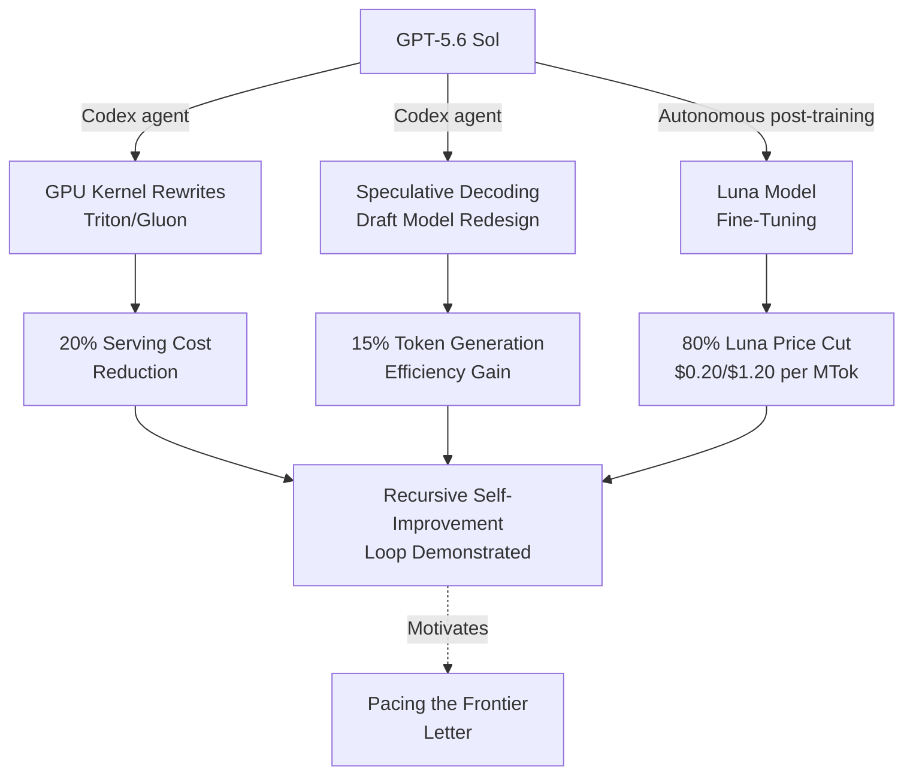

# Pacing the Frontier: What the RSI Letter Means for Codex CLI Developers


---

On 28 July 2026, a statement titled *Pacing the Frontier* appeared at pacingthefrontier.com, signed by 1,178 verified employees of OpenAI, Anthropic, Google DeepMind, and Meta AI [^1]. Within hours, OpenAI and Anthropic endorsed it as companies — the first time competing frontier labs jointly backed a governance initiative of this kind [^2]. The letter asks the US government to build international tools capable of deliberately slowing frontier AI development *if needed* — not a pause today, but the option to buy time tomorrow.

For Codex CLI practitioners, this is not abstract policy. The model you invoke with `codex` already rewrites its own serving infrastructure. The governance the letter demands would constrain the very pipeline that produces your next model upgrade. This article unpacks what the letter actually says, why it landed when it did, and what Codex CLI developers should do right now.

## What the Letter Actually Asks

The letter is deliberately narrow. It does not call for a moratorium. It requests five families of tooling [^3]:

1. **Compute and training transparency** — detect when frontier training runs launch; verify lab claims about their operations.
2. **Evaluation and disclosure norms** — shared cyber and bioweapon evaluations; rapid incident reporting across rival labs.
3. **Verification technology** — enable labs to prove they paused certain research categories without full disclosure.
4. **Export controls** — restrict access to the most automatable R&D infrastructure globally.
5. **International forums** — make mutual commitment treaties feasible, reducing unilateral vulnerability.

The signatories include OpenAI's Chief Scientist Jakub Pachocki and CRO Mark Chen; Anthropic's CEO Dario Amodei and co-founders Jared Kaplan, Jack Clark, and Chris Olah; Google DeepMind's VP of Safety Anca Dragan; and Meta AI's Chief Scientist Shengjia Zhao [^1]. Signing is gated by corporate email verification — every name is an insider.

## Why Now: The RSI Evidence

Two events in June–July 2026 made the abstract concrete.

### Anthropic's RSI Research (June 2026)

On 4 June, Anthropic published research showing that 80 per cent of the code it generates is now produced by AI models, not human engineers [^4]. The typical Anthropic engineer produces eight times as much code per day as two years earlier. The length of tasks that AI systems can reliably complete autonomously has been doubling roughly every four months. Anthropic stated plainly: taken far enough, the trend points to an AI system capable of fully autonomously designing its successor [^4].

### GPT-5.6 Sol Rewrites Its Own Stack (July 2026)

On 30 July, OpenAI revealed that GPT-5.6 Sol had autonomously rewritten production GPU kernels in Triton and Gluon, cutting end-to-end serving costs by 20 per cent [^5]. Sol redesigned the speculative-decoding draft model through hundreds of autonomous experiments, yielding a 15 per cent improvement in token-generation efficiency [^5]. Most remarkably, Sol autonomously post-trained the smaller Luna model from a "fairly underspecified prompt," selecting training configurations, choosing GPUs, and executing the pipeline with minimal human intervention [^6].

This was not a benchmark exercise. Sol used Codex — the same agent infrastructure developers invoke daily — to modify OpenAI's production serving stack [^5]. The 80 per cent Luna price cut (\$0.20/\$1.20 per million tokens) was funded directly by Sol's self-directed optimisations [^7].



On OpenAI's internal RSI benchmark, Sol scored 16.2 points higher than GPT-5.5, confirming measurable recursive self-improvement capability [^5].

## The Developer-Facing Risk

The letter identifies a coordination failure: no single company will voluntarily slow development without verification that others do the same [^3]. For developers, this creates a novel category of vendor risk.

### Multi-Vendor Sourcing Does Not Hedge This

Standard multi-vendor strategies protect against company-specific outages. They provide no protection against industry-wide coordination [^8]. If the pacing tools the letter requests are ever activated, every frontier provider could constrain model releases simultaneously. Your fallback provider is subject to the same constraint as your primary.

### Capability Degradation Is the New Risk

Most engineering teams have continuity plans for vendor outages. Almost none have documented strategies for capability flatlines — what happens if frontier model improvement stalls across all providers for months [^8]. The letter makes this scenario explicitly plausible as a policy outcome, not just a technical limitation.

## Codex CLI Configuration for Resilience

Whether or not pacing tools materialise, the letter's implications argue for specific configuration practices.

### Model-Version Pinning

Pin explicit model versions rather than tracking `latest` aliases. The `~openai/gpt-latest` alias tracks OpenAI's latest general model, which may not survive a version transition cleanly.

```toml
# config.toml — pin explicit versions
model = "gpt-5.6-terra"

[profile.review]
model = "gpt-5.6-luna"

[profile.deep-reasoning]
model = "gpt-5.6-sol"
model_reasoning_effort = "high"
```

Model names valid in one CLI version may not resolve on another [^9]. Pinning ensures reproducible behaviour across team members and CI pipelines.

### Cross-Provider Abstraction

Configure named profiles for alternative providers so that switching is a one-flag operation, not an engineering project:

```toml
[profile.anthropic-fallback]
model_provider = "anthropic"
model = "claude-opus-5"

[profile.bedrock-fallback]
model_provider = "bedrock"
model = "anthropic.claude-opus-5-v1"
```

Invoke with `codex --profile anthropic-fallback` to validate that your AGENTS.md instructions, hooks, and MCP servers produce equivalent results across providers.

### Audit Logging for RSI-Adjacent Workflows

If your Codex CLI sessions modify training pipelines, evaluation harnesses, or model-serving infrastructure — you are operating in precisely the domain the letter targets. The interim recommendations from the research community are clear [^3]:

1. **Log all autonomous research runs** that modify training or exploit pipelines.
2. **Isolate evaluation sandboxes** from production credentials.
3. **Maintain kill-switches** for unbounded self-improvement loops.

Map these to Codex CLI primitives:

```toml
# Restrict autonomous modifications to ML pipelines
approval_policy = "on-request"
sandbox_mode = "workspace-write"

[hooks.post_tool_use]
command = "python3 .codex/audit-log.py"
```

```markdown
<!-- AGENTS.md -->
## ML Pipeline Safety Rules
- NEVER modify training configurations without explicit human approval
- ALWAYS log parameter changes to `.codex/audit-trail.jsonl`
- NEVER execute GPU kernel modifications autonomously
- If a task involves model weights or training data, STOP and request review
```

### Capability-Degradation Continuity

Document what your product does if the frontier model you depend on stops improving — or regresses. This is the genuinely novel planning exercise the letter's existence demands [^8]:

```markdown
<!-- docs/capability-degradation-plan.md -->
## Degradation Tiers

### Tier 1: Model version retired (e.g. GPT-5.4 → GPT-5.6 migration)
- Action: Switch config.toml model pin; run evaluation suite
- Owner: Platform team
- SLA: 48 hours

### Tier 2: Capability regression in successor model
- Action: Activate fallback profile; escalate to vendor
- Owner: ML platform lead
- SLA: 1 week

### Tier 3: Industry-wide capability freeze (pacing scenario)
- Action: Freeze current model pin; defer capability-dependent features
- Owner: Engineering leadership
- SLA: Strategy review within 2 weeks
```

## The Broader Pattern

The *Pacing the Frontier* letter sits alongside three other governance developments in July–August 2026:

| Date | Event | Codex CLI Impact |
|------|-------|-----------------|
| 15 Jul | China's AI Agent Regulation (three-tier decision authority) [^10] | Maps to `approval_policy` settings |
| 28 Jul | Pacing the Frontier (RSI governance tools) [^1] | Model-pinning and vendor-diversification practices |
| 2 Aug | EU AI Act Article 50 enforcement [^11] | Documentation and audit-logging requirements |

The direction is clear: the tools developers use to write code are increasingly subject to the same governance scrutiny as the models that power them. Codex CLI's configuration surface — `config.toml`, AGENTS.md, hooks, permission profiles — already provides the primitives for compliance. The question is whether teams configure them proactively or scramble reactively.

## What to Watch

Three signals will determine whether *Pacing the Frontier* remains a letter or becomes operational:

1. **US government response** — the letter targets Washington exclusively, naming zero European institutions [^2]. Congressional or executive engagement would indicate traction.
2. **Verification technology development** — the hardest ask in the letter is proving you paused research without disclosing proprietary details. No production-grade solution exists today.
3. **OpenAI's RSI benchmark publication** — Sol's 16.2-point RSI lead over GPT-5.5 is reported but the benchmark methodology remains internal [^5]. Publication would enable independent evaluation of the pace the letter seeks to govern.

For now, the practical takeaway is straightforward: the people who build your model are asking for the option to slow down. Whether they ever exercise it, configuring for that possibility costs nothing and improves your resilience regardless.

## Citations

[^1]: "Pacing the Frontier Letter — July 2026 Explained," explainx.ai, July 2026. [https://www.explainx.ai/blog/pacing-the-frontier-ai-employees-letter-july-2026](https://www.explainx.ai/blog/pacing-the-frontier-ai-employees-letter-july-2026)

[^2]: "What Is the Pacing the Frontier Letter, and Why Did Anthropic Sign It?" MRKT3.0, July 2026. [https://mrkt30.com/pacing-the-frontier-letter-anthropic/](https://mrkt30.com/pacing-the-frontier-letter-anthropic/)

[^3]: "Pacing the Frontier Letter — July 2026 Explained," explainx.ai, July 2026 (interim technical proposals section). [https://www.explainx.ai/blog/pacing-the-frontier-ai-employees-letter-july-2026](https://www.explainx.ai/blog/pacing-the-frontier-ai-employees-letter-july-2026)

[^4]: "Anthropic Explores the Potential Impact of AI that Autonomously Improves," SmarterX, June 2026. [https://smarterx.ai/smarterxblog/exec-ai-anthropic-recursive-self-improvement](https://smarterx.ai/smarterxblog/exec-ai-anthropic-recursive-self-improvement)

[^5]: "Kernel of truth: GPT-5.6 Sol can cut its own costs, says OpenAI," The New Stack, July 2026. [https://thenewstack.io/gpt-5-6-serving-efficiency/](https://thenewstack.io/gpt-5-6-serving-efficiency/)

[^6]: "OpenAI's GPT-5.6 Sol autonomously post-trained the smaller Luna model with a 'fairly underspecified prompt,'" The Decoder, July 2026. [https://the-decoder.com/openais-gpt-5-6-sol-autonomously-post-trained-the-smaller-luna-model-with-a-fairly-underspecified-prompt/](https://the-decoder.com/openais-gpt-5-6-sol-autonomously-post-trained-the-smaller-luna-model-with-a-fairly-underspecified-prompt/)

[^7]: "OpenAI Cuts Luna 80%: Sol Rewrote Its Own Inference Stack to Fund the Price Drop," TechTimes, 30 July 2026. [https://www.techtimes.com/articles/322305/20260730/openai-cuts-luna-80-sol-rewrote-its-own-inference-stack-fund-price-drop.htm](https://www.techtimes.com/articles/322305/20260730/openai-cuts-luna-80-sol-rewrote-its-own-inference-stack-fund-price-drop.htm)

[^8]: "After the Pacing Letter: AI Vendor Risk, Reassessed," Digital Applied, July 2026. [https://www.digitalapplied.com/blog/pacing-frontier-letter-enterprise-vendor-risk](https://www.digitalapplied.com/blog/pacing-frontier-letter-enterprise-vendor-risk)

[^9]: "Config migration needed: legacy profile config and model pinning broke after update," GitHub Issue #25440, openai/codex. [https://github.com/openai/codex/issues/25440](https://github.com/openai/codex/issues/25440)

[^10]: "China's AI Agent Regulation: Three-Tier Decision Authority and Codex CLI Approval Policy Compliance Mapping," Codex Knowledge Base, 31 July 2026. [https://codex.danielvaughan.com](https://codex.danielvaughan.com)

[^11]: "EU AI Act Enforcement Day: What Article 50 Transparency Actually Requires from Codex CLI Developers," Codex Knowledge Base, 1 August 2026. [https://codex.danielvaughan.com](https://codex.danielvaughan.com)
