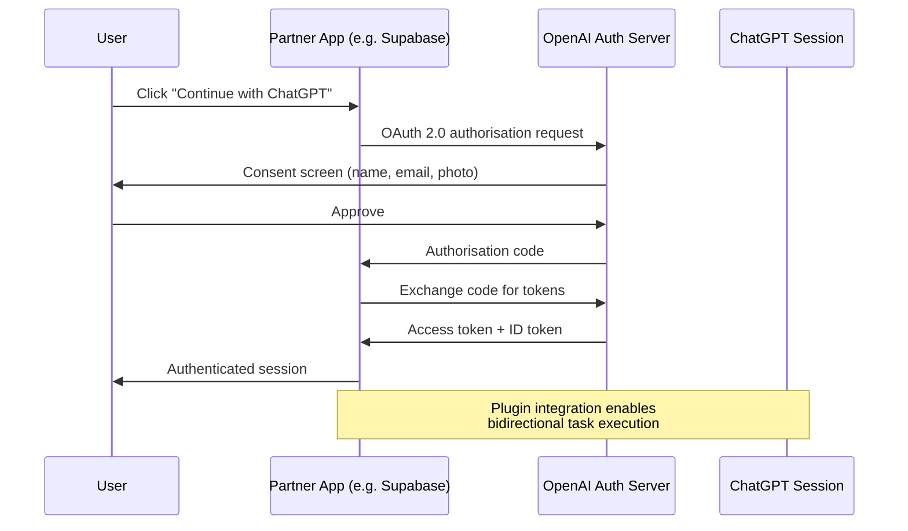
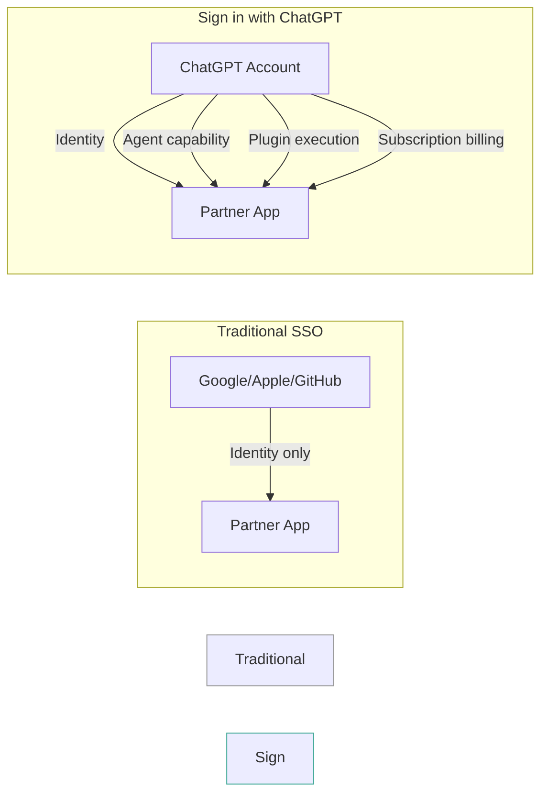

# Sign in with ChatGPT: What OpenAI's Identity Platform Play Means for Codex CLI Developers


---

On 29 July 2026, OpenAI began rolling out "Sign in with ChatGPT" in beta across six launch partners: Airtable, GitLab, HubSpot, Notion, Supabase, and Vercel [^1][^2][^3]. The move positions OpenAI alongside Google, Apple, and Microsoft as an identity provider — but with a twist. Unlike passive SSO providers that verify identity and step aside, Sign in with ChatGPT ties authentication to an active AI runtime capable of executing tasks within the authenticated service. For Codex CLI developers, this is not merely an authentication convenience; it reshapes how agent sessions, billing, and cross-service workflows connect.

## What Sign in with ChatGPT Actually Does

The mechanism follows a standard OAuth 2.0 flow [^4]. A user clicks "Continue with ChatGPT" on a participating site, is redirected to OpenAI's authorisation server, confirms consent, and returns to the partner application with an authenticated session. The data shared is deliberately minimal: name, email address, and profile picture [^5]. No ChatGPT conversation history, usage data, or AI preferences cross the boundary.



Account linking is automatic when the ChatGPT email matches an existing account on the partner service. SSO-managed accounts remain separate, and users can revoke connections at any time from the partner's settings [^1].

## Two Authentication Surfaces, One Identity

The beta operates across two surfaces simultaneously. On the **partner site**, "Continue with ChatGPT" appears as a standard login button alongside Google and GitHub options. Inside **ChatGPT itself**, users install a partner plugin from the directory and authenticate with the partner service without leaving the ChatGPT interface [^1][^2].

This bidirectional flow is the critical architectural distinction. Traditional SSO is unidirectional: the relying party delegates authentication to the identity provider. Sign in with ChatGPT creates a two-way channel where ChatGPT can also authenticate back to the partner, enabling the AI to execute tasks — deploy a Vercel project, query a Supabase database, create a Notion page — within the user's authenticated context.

## How This Connects to Codex CLI

Codex CLI already supports two authentication methods: browser-based ChatGPT OAuth (the default `codex login` flow) and API key authentication via `printenv OPENAI_API_KEY | codex login --with-api-key` [^4]. Sign in with ChatGPT extends the same identity substrate that Codex CLI uses, creating a unified authentication layer across terminal, desktop, and web surfaces.

### The Billing Implication

Authentication method determines billing. ChatGPT OAuth routes usage through the user's subscription plan (Free, Plus, Pro) with workspace-level controls. API key authentication charges against the organisation's API balance [^4]. As Sign in with ChatGPT propagates to more services, Codex CLI sessions authenticated via ChatGPT gain implicit access to partner services the user has linked — without additional credential management.

```toml
# config.toml — authentication routing
[auth]
# ChatGPT OAuth (default): subscription billing, workspace RBAC
# API key: usage-based billing, organisation policies
method = "chatgpt"  # or "api-key"

[auth.chatgpt]
# Workspace selection affects retention, RBAC, and plugin access
workspace = "engineering"
```

### Plugin-Authenticated MCP Servers

The August 2026 changelog confirms that "ChatGPT-hosted MCP servers can explicitly use session authentication" [^6]. This means MCP servers connected through the plugin ecosystem can leverage the Sign in with ChatGPT session token rather than requiring separate API keys. For Codex CLI, this translates to MCP tools that inherit the user's authenticated context with partner services:

```toml
# config.toml — MCP server using ChatGPT session auth
[mcp_servers.supabase]
type = "chatgpt-hosted"
auth = "session"  # Uses Sign in with ChatGPT token
```

When a Codex CLI session spawns a Supabase MCP tool, the tool executes with the permissions the user granted when linking Supabase via Sign in with ChatGPT — no separate Supabase API key required.

## The Identity Provider Landscape Shift

OpenAI's 600 million monthly active users give Sign in with ChatGPT immediate scale [^7]. But the strategic significance lies in what the identity carries. A Google account is a passive credential. A ChatGPT account is an active agent runtime.



For developers building on Codex CLI, this creates a new integration pattern: instead of configuring separate credentials for each service your agent touches, you configure Sign in with ChatGPT once and let the plugin layer handle authorisation delegation.

## Security Model and Open Questions

The data-sharing boundary is deliberately narrow — name, email, and photo only [^5]. Any additional permissions (project access, repository write, database queries) require separate, explicit consent shown to the user. Team-level controls like 2FA and SSO enforcement still apply on the partner side [^2].

However, several questions remain unanswered for Codex CLI workflows:

1. **Token lifetime and refresh**: The official documentation does not specify session token TTL for plugin-authenticated MCP servers. Long-running Codex CLI sessions may encounter token expiry mid-task.

2. **Sandbox interaction**: It is unclear whether Sign in with ChatGPT session tokens are available inside sandboxed Codex CLI environments, where network access is restricted by `sandbox_permissions`.

3. **Enterprise workspace routing**: For organisations with multiple ChatGPT workspaces, the authentication flow does not yet specify how workspace selection propagates to partner service permissions. ⚠️

4. **Revocation propagation**: Revoking a partner connection from ChatGPT settings should invalidate active MCP server sessions, but the propagation latency and failure mode are undocumented. ⚠️

## Practical Configuration for Codex CLI Developers

### Scenario 1: Plugin-First Workflow

If you primarily work with partner services that support Sign in with ChatGPT, lean into the ChatGPT OAuth path:

```bash
# Authenticate via ChatGPT (default)
codex login

# Verify linked services
codex plugins list --auth-status
```

Your `AGENTS.md` should document which partner services the agent expects to be linked:

```markdown
## Required Plugin Connections

This agent requires the following Sign in with ChatGPT connections:
- **Supabase**: For database migrations and edge function deployment
- **Vercel**: For preview deployment and DNS configuration
- **GitLab**: For merge request creation and CI pipeline monitoring

If a plugin connection is missing, prompt the user to link the service
via ChatGPT Settings → Connected Apps before proceeding.
```

### Scenario 2: API Key Isolation

For CI/CD pipelines, production environments, or workflows requiring deterministic billing, continue using API key authentication. Sign in with ChatGPT is not designed for headless contexts:

```bash
# CI/CD: API key authentication
printenv OPENAI_API_KEY | codex login --with-api-key

# MCP servers use explicit credentials, not session auth
```

```toml
# config.toml — CI/CD profile
[profiles.ci]
auth.method = "api-key"

[profiles.ci.mcp_servers.supabase]
type = "stdio"
command = "supabase-mcp"
env = { SUPABASE_ACCESS_TOKEN = "${SUPABASE_ACCESS_TOKEN}" }
```

### Scenario 3: Hybrid — Local Development

For local development, use ChatGPT OAuth for interactive sessions and partner plugin access, but keep explicit credentials for services not yet supporting Sign in with ChatGPT:

```toml
# config.toml — hybrid authentication
[auth]
method = "chatgpt"

# Plugin-authenticated (uses ChatGPT session)
[mcp_servers.supabase]
type = "chatgpt-hosted"
auth = "session"

# Explicit credentials (service doesn't support SiwC yet)
[mcp_servers.aws]
type = "stdio"
command = "aws-mcp-server"
env = { AWS_PROFILE = "dev" }
```

## What This Means for Your Agent Architecture

Sign in with ChatGPT is OpenAI's bid to become the identity layer for AI-augmented development workflows. The six launch partners are not arbitrary — they represent the core stack of a modern development team: version control (GitLab), deployment (Vercel), database (Supabase), documentation (Notion), CRM (HubSpot), and workflow automation (Airtable) [^3].

For Codex CLI developers, the practical takeaway is threefold:

1. **Audit your credential surface**: List every API key, token, and secret your Codex CLI workflows consume. As partner services adopt Sign in with ChatGPT, some of those credentials can be replaced by plugin-authenticated sessions — reducing secret sprawl.

2. **Separate interactive from headless**: Sign in with ChatGPT is inherently interactive. Design your agent configurations with named profiles that cleanly separate ChatGPT OAuth paths (local development) from API key paths (CI/CD, production).

3. **Watch the plugin directory**: The current six partners will expand. Each new Sign in with ChatGPT partner that ships an MCP server is one fewer credential you need to manage in `config.toml`.

The identity wars have a new entrant — and this one brings 600 million users and an agent runtime to the table.

## Citations

[^1]: Supabase, "Sign in with ChatGPT is in beta on Supabase," supabase.com, 29 July 2026. [https://supabase.com/blog/sign-in-with-chatgpt-beta](https://supabase.com/blog/sign-in-with-chatgpt-beta)

[^2]: Vercel, "Sign in with ChatGPT is now available on Vercel," vercel.com/changelog, 29 July 2026. [https://vercel.com/changelog/sign-in-with-chatgpt-is-now-available-on-vercel](https://vercel.com/changelog/sign-in-with-chatgpt-is-now-available-on-vercel)

[^3]: OpenAI, "ChatGPT & Codex changelog," learn.chatgpt.com, 29 July 2026. [https://learn.chatgpt.com/docs/changelog](https://learn.chatgpt.com/docs/changelog)

[^4]: OpenAI, "Authentication," learn.chatgpt.com. [https://learn.chatgpt.com/docs/auth](https://learn.chatgpt.com/docs/auth)

[^5]: OpenAI, "Sign in with ChatGPT," help.openai.com. [https://help.openai.com/en/articles/20001410-sign-in-with-chatgpt](https://help.openai.com/en/articles/20001410-sign-in-with-chatgpt)

[^6]: OpenAI, "Codex CLI Changelog — August 2026," gradually.ai. [https://www.gradually.ai/en/changelogs/codex-cli/](https://www.gradually.ai/en/changelogs/codex-cli/)

[^7]: ChatGPT AI Hub, "ChatGPT's 500 Million Users: Inside OpenAI's Q2 2026 Growth Report," chatgptaihub.com, 2026. [https://chatgptaihub.com/chatgpts-500-million-users-inside-openais-q2-2026-growth-report-and-what-it-means-for-the-ai-market/](https://chatgptaihub.com/chatgpts-500-million-users-inside-openais-q2-2026-growth-report-and-what-it-means-for-the-ai-market/)
