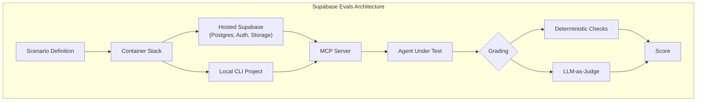
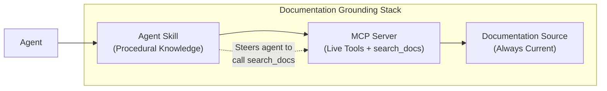

# Supabase Evals and the Documentation Grounding Problem: What a Product-Specific Agent Benchmark Reveals About Codex CLI Skill Design


---

On 1 August 2026 Supabase open-sourced **supabase/evals**, an Apache-2.0 benchmark framework that scores how well coding agents — Claude Code, Codex CLI, and OpenCode — perform on real Supabase tasks [^1][^6]. Unlike synthetic benchmarks such as SWE-Bench or Terminal-Bench, Supabase Evals boots a full hosted-like Supabase stack inside containers, hands the agent a live MCP server and CLI project, and grades the result with a hybrid of deterministic checks and LLM-as-judge [^2].

The headline numbers matter less than the structural finding beneath them: **agents that have access to documentation tools routinely ignore them**, and raw model capability is not the binding constraint — contextual awareness is.

## Why Product-Specific Benchmarks Exist

General-purpose coding benchmarks measure whether an agent can write correct code. They do not measure whether an agent can write correct code *for a particular platform*. Supabase discovered this the hard way: frontier models would skip Row Level Security policies on exposed schemas, invent non-existent CLI commands like `supabase db execute`, and create views without `security_invoker = true` — silently bypassing RLS [^3]. The models *knew* SQL. They did not know Supabase.

Supabase Evals addresses this by defining scenarios across three dimensions:

- **Products**: database, auth, storage, edge-functions, realtime, cron, queues, vectors, data-api
- **Topics**: RLS, security, migrations, SQL, SDK, observability, self-hosting, tests, declarative-schema
- **Stages**: build, deploy, investigate, resolve

The benchmark picks the smallest scenario set that touches each dimension at least once, grounded in real support tickets, bug reports, and GitHub issues [^2].



## The Documentation Grounding Problem

The most consequential finding from Supabase's benchmarking is not which model wins — it is that **MCP alone is insufficient**. Their earlier blog post, "AI Agents Know About Supabase. They Don't Always Use It Right," documented the failure mode in detail [^3].

When agents were given access to Supabase's MCP server (which includes a `search_docs` tool), without any skill guidance:

| Model | Baseline | MCP Only | With Skill |
|:------|:--------:|:--------:|:----------:|
| Claude Opus 4.6 | 58% | 50% | **67%** |
| Claude Sonnet 4.6 | 46% | 58% | **71%** |
| GPT-5.4 Codex | 71% | 71% | **88%** |
| GPT-5.4 Mini | 42% | 63% | **71%** |

The MCP-only column tells the story: giving Claude Opus access to live documentation tools *decreased* its score by 8 percentage points. The agent never called `search_docs` [^3]. It preferred its (outdated) training data to the cost of an extra round-trip.

This is the documentation grounding problem. Models have latent knowledge about popular platforms, but that knowledge decays with each API change. Tools exist to retrieve current documentation, but agents treat tool invocation as expensive and default to parametric memory unless explicitly steered.

## How Skills Close the Gap

Supabase's solution is **Agent Skills** — portable, on-demand instruction files that agents load when they need Supabase- or Postgres-specific procedural knowledge [^4]. Skills do not require a live connection and work across different agents. They function as a guidance layer atop MCP: the MCP server provides structured tools, but without workflow guidance, "agents guess at how to combine tools" [^3].

The Supabase Evals Build stage results with skills loaded show the pattern clearly [^1]:

- Opus 5 and Kimi K3 scored 100% unaided
- Sonnet 5 rose from 78% to 100%
- GPT-5.6 Sol rose from 89% to 100%
- GPT-5.4 Mini rose from 78% to 89%

Skills encode opinionated practices: always enable RLS on exposed schemas, use `security_invoker = true` on views, prefer declarative schema workflows over hand-written migrations. Every model correctly implemented `security_invoker` when the skill provided guidance — the capability gap was actually a contextual awareness problem [^3].

One telling detail: a skill covering Postgres best practices originally loaded in only about one in ten sessions. After rewriting the skill description to lead with clearer triggers, activation increased to 60% [^1]. Skill *discoverability* matters as much as skill content.

## What This Means for Codex CLI Practitioners

### Configure the Supabase MCP Server

If you work with Supabase, the hosted MCP server at `mcp.supabase.com` provides over 20 tools for database queries, schema inspection, migration generation, Edge Function management, and database branching [^5]:

```toml
# ~/.codex/config.toml or .codex/config.toml (project-scoped)
[mcp_servers.supabase]
url = "https://mcp.supabase.com/mcp?project_ref=your-project-ref"
startup_timeout_sec = 120
tool_timeout_sec = 600
```

Authenticate with `codex mcp login supabase` and verify with `/mcp` [^5].

### Load Agent Skills

The Supabase Plugin bundles the MCP server and agent skills together. For Codex CLI, install skills so the agent receives procedural guidance alongside tool access [^4]:

```bash
# Install the Supabase plugin (bundles MCP + skills)
codex plugin install supabase
```

The skills are compatible with 18+ agents including Claude Code, GitHub Copilot, Cursor, and Cline [^4].

### Apply the Pattern to Your Own Stack

The documentation grounding problem is not Supabase-specific. Any platform with a rapidly evolving API surface — your internal platform, your cloud provider's SDK, your ORM — will exhibit the same failure mode. The Supabase approach suggests a three-layer architecture for domain-specific agent work:



1. **Documentation source** — the canonical, always-current reference
2. **MCP server** — exposes tools including `search_docs` for retrieval
3. **Agent skill** — encodes when and how to use those tools, preventing the agent from falling back to stale parametric memory

For Codex CLI, this maps to your `AGENTS.md` and project-scoped configuration:

```markdown
<!-- AGENTS.md -->
## Supabase Development Rules

1. ALWAYS call `search_docs` before implementing any Supabase feature
2. NEVER create views without `security_invoker = true`
3. ALWAYS enable RLS on tables in exposed schemas
4. Prefer declarative schema (`supabase db diff`) over hand-written migrations
5. Check SDK import paths against current docs — `@supabase/server` replaces legacy patterns
```

### Run the Benchmark Yourself

Supabase Evals runs locally via `pnpm` and is available at `github.com/supabase/evals` [^2]. If you maintain internal platform tooling, the framework's three-dimensional scenario design (products × topics × stages) and hybrid scoring methodology (deterministic checks + LLM-as-judge with a single retry) provide a reusable template for building your own product-specific agent benchmarks.

```bash
git clone https://github.com/supabase/evals.git
cd evals
pnpm install
pnpm run eval
```

Results are filterable by product, stage, and agent on the live leaderboard at `supabase.com/evals` [^1].

## The Broader Lesson: Tools Without Skills Are Incomplete

The Supabase Evals data reinforces a pattern that Codex CLI practitioners should internalise: **giving an agent access to a tool is not the same as teaching it when to use that tool**. Claude Code checked Supabase docs in under 40% of scenarios even with skills loaded, reading approximately 2 documentation pages per scenario. Codex-based agents checked docs more frequently — roughly 8 pages per scenario [^1].

This asymmetry matters for how you design your own `AGENTS.md` files and project configuration. Explicit procedural instructions ("before implementing any database change, call `search_docs` with the relevant table name") outperform implicit tool availability every time.

The Supabase team's finding that skill description wording affected activation rates from 10% to 60% [^1] should give every `AGENTS.md` author pause. Your instructions are not just documentation — they are prompts. Write them accordingly.

---

## Citations

[^1]: Supabase, "Introducing Supabase Evals," supabase.com/blog, 1 August 2026. [https://supabase.com/blog/introducing-supabase-evals](https://supabase.com/blog/introducing-supabase-evals)

[^2]: Supabase, "Introducing Supabase Evals — Discussion #48554," github.com, 1 August 2026. [https://github.com/orgs/supabase/discussions/48554](https://github.com/orgs/supabase/discussions/48554)

[^3]: Supabase, "AI Agents Know About Supabase. They Don't Always Use It Right," supabase.com/blog, 2026. [https://supabase.com/blog/supabase-agent-skills](https://supabase.com/blog/supabase-agent-skills)

[^4]: Supabase, "Agent Skills — Supabase Docs," supabase.com, 2026. [https://supabase.com/docs/guides/ai-tools/ai-skills](https://supabase.com/docs/guides/ai-tools/ai-skills)

[^5]: Supabase, "Supabase MCP Server — Supabase Docs," supabase.com, 2026. [https://supabase.com/docs/guides/ai-tools/mcp](https://supabase.com/docs/guides/ai-tools/mcp)

[^6]: MarkTechPost, "Supabase Releases Evals: an Open Source Benchmark That Scores Claude Code, Codex and OpenCode on Real Supabase Tasks," marktechpost.com, 1 August 2026. [https://www.marktechpost.com/2026/08/01/supabase-releases-evals-an-open-source-benchmark-that-scores-claude-code-codex-and-opencode-on-real-supabase-tasks/](https://www.marktechpost.com/2026/08/01/supabase-releases-evals-an-open-source-benchmark-that-scores-claude-code-codex-and-opencode-on-real-supabase-tasks/)
