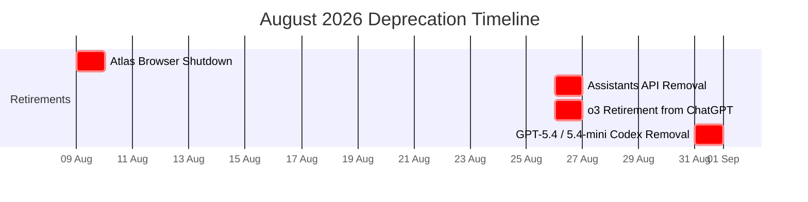
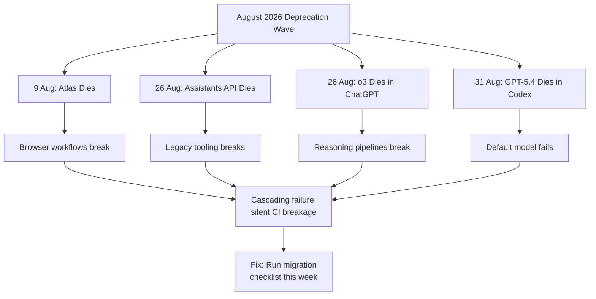

# The August 2026 Deprecation Wave: Four Sunsets in One Month and What Codex CLI Developers Must Migrate Now


---

August 2026 is the most concentrated deprecation month in OpenAI's history. Four separate retirements land within five weeks, each touching a different surface of the Codex CLI developer workflow. Miss one and your CI pipeline breaks silently; miss all four and you are building on sand.

This article maps the four sunsets, explains what each means for Codex CLI configuration and tooling, and provides concrete migration recipes you can apply today.

## The Four Sunsets at a Glance



| Date | What Dies | Replacement | Codex CLI Impact |
|------|-----------|-------------|-----------------|
| 9 Aug | Atlas standalone browser | ChatGPT desktop browser capabilities | Workflows relying on Atlas for browser-based agent tasks |
| 26 Aug | Assistants API (`/v1/assistants`, `/v1/threads`) | Responses API + Conversations API | Any tooling still calling legacy endpoints |
| 26 Aug | o3 model in ChatGPT | GPT-5.6 Sol (with pro reasoning mode) | Teams routing reasoning tasks through o3 |
| 31 Aug | GPT-5.4 / GPT-5.4-mini in Codex (ChatGPT auth) | GPT-5.6 Terra / GPT-5.6 Luna | Every `config.toml` and named profile specifying `gpt-5.4` |

## Sunset 1: Atlas Browser — 9 August

OpenAI launched Atlas as a standalone Mac desktop browser in October 2025, positioning it as the bridge between ChatGPT and agentic web tasks [^1]. Less than a year later, it is being folded back into the ChatGPT desktop application.

**What is lost:** Atlas user data — bookmarks, browsing history, open tabs, saved passwords, and cookies — will not transfer automatically [^1]. If you scripted Atlas interactions for Codex CLI browser-based workflows, those integrations break on 9 August.

**What replaces it:** The ChatGPT desktop app absorbs Atlas's capabilities, including multiple tabs, downloads, improved navigation, and account login support [^1]. For Codex CLI, the indexed web-search mode (shipped in v0.142.2) already provides live search with server-gated URL access, making Atlas redundant for most agent-driven research tasks.

**Action required:** Export Atlas bookmarks as HTML before 9 August. If you have Codex CLI workflows that launch Atlas via shell commands, migrate them to use the indexed web-search mode or MCP browser tools instead.

## Sunset 2: Assistants API — 26 August

The Assistants API enters its final day on 26 August, exactly one year after OpenAI issued the deprecation notice [^2]. All requests to `/v1/assistants`, `/v1/threads`, and related endpoints will fail permanently.

**Codex CLI itself is unaffected.** The CLI migrated to the Responses API as its sole wire protocol in February 2026, and Chat Completions support was removed at the same time [^3]. The migration reportedly improved cache utilisation substantially and lifted SWE-bench scores by freeing compute for reasoning within the same budget [^3].

However, if your team maintains adjacent tooling — custom dashboards, Slack bots, or orchestration layers — that still calls the Assistants API, those break on 26 August.

**Migration path:** OpenAI's conceptual mapping is straightforward [^2]:

| Assistants API | Responses + Conversations API |
|---------------|-------------------------------|
| Assistants | Prompts (dashboard-only) |
| Threads | Conversations |
| Runs | Responses |
| Run Steps | Items |

For codebases still using `/v1/chat/completions`, OpenAI's open-source `completions-responses-migration-pack` automates the bulk of the conversion: it finds legacy usage, proposes edits, updates import and request shapes, runs tests and lints, then creates a clean branch with a pull request [^3].

```bash
# Scan your repo for legacy API usage
npx @openai/completions-responses-migration-pack scan .

# Apply automated fixes
npx @openai/completions-responses-migration-pack fix . --branch migrate-to-responses
```

## Sunset 3: o3 Retirement — 26 August

OpenAI o3 will be retired from ChatGPT on 26 August, completing a 90-day sunset period [^4]. The API snapshot `o3-2025-04-16` survives until 11 December 2026, when it too maps to `gpt-5.6-sol` [^5].

**Why this matters for Codex CLI:** Teams that pinned `o3` in their `config.toml` for its distinctive chain-of-thought reasoning characteristics need to evaluate whether GPT-5.6 Sol replicates those behaviours. On Terminal-Bench 2.1, GPT-5.6 Sol at extended effort scores 89.5%, making it the current leader [^6]. The `pro` reasoning mode on Sol is the direct replacement for `o3-pro` [^5].

```toml
# Before: o3-pinned config
[profile.reasoning]
model = "o3"
model_reasoning_effort = "high"

# After: GPT-5.6 Sol replacement
[profile.reasoning]
model = "gpt-5.6-sol"
model_reasoning_effort = "high"
```

**Important caveat:** If you authenticate with an API key rather than ChatGPT, the o3 API snapshot remains available until December. But relying on a model with a published death date is technical debt with a known maturity date.

## Sunset 4: GPT-5.4 and GPT-5.4-mini in Codex — 31 August

This is the sunset most likely to catch Codex CLI users off guard. On 31 August, GPT-5.4 and GPT-5.4-mini will no longer be available in Codex for users authenticated via ChatGPT [^7]. API-key authenticated sessions retain access, but the writing is on the wall.

**Recommended replacements [^7]:**

| Retiring Model | Replacement | Tier |
|---------------|-------------|------|
| `gpt-5.4` | `gpt-5.6-terra` | Balanced — large-scale business work |
| `gpt-5.4-mini` | `gpt-5.6-luna` | Fast — summarisation, automation |

The GPT-5.6 family launched on 9 July 2026 in three tiers: Sol (flagship, $5/$30 per 1M tokens), Terra (balanced, $2.50/$15), and Luna (fast, $1/$6) [^6]. On 30 July, OpenAI reduced Luna's price by 80% and Terra's by 20%, making the migration a net cost reduction for most workloads [^6].

### Migration Recipe

**Step 1 — Audit your configuration:**

```bash
# Find all model references in your Codex config
grep -r "gpt-5.4" ~/.codex/ .codex/ AGENTS.md 2>/dev/null
```

**Step 2 — Update `config.toml`:**

```toml
# Before
model = "gpt-5.4"

# After — choose your tier
model = "gpt-5.6-terra"   # Balanced replacement for gpt-5.4
# model = "gpt-5.6-sol"   # If you need maximum capability
# model = "gpt-5.6-luna"  # If you need maximum speed
```

**Step 3 — Update named profiles:**

Named profiles now live in separate files. Replace any `gpt-5.4` references in `~/.codex/<profile-name>.config.toml`:

```toml
# ~/.codex/review.config.toml
model = "gpt-5.6-terra"
model_reasoning_effort = "medium"
approval_policy = "on-request"
```

**Step 4 — Update CI/CD overrides:**

```bash
# CLI flag override for a single run
codex --model gpt-5.6-terra "run the test suite"

# Or via --config for arbitrary keys
codex --config model='"gpt-5.6-terra"' "review this PR"
```

**Step 5 — Update managed configurations:**

If your organisation uses `requirements.toml` for fleet-wide model pinning, update the model constraint there. Any scheduled tasks, custom agents, or workspace defaults referencing `gpt-5.4` need the same treatment.

## The Compound Risk

Each sunset in isolation is manageable. The danger is the compound effect: a team that ignores all four finds itself on 1 September with broken browser workflows, dead API integrations, a retired reasoning model, and a default model that no longer resolves.



## The Migration Checklist

Complete these before 9 August to cover all four sunsets:

1. **Export Atlas data** — bookmarks as HTML, any saved passwords to your password manager
2. **Grep for legacy API calls** — `grep -r "v1/assistants\|v1/threads" .` across all repositories
3. **Run the migration pack** — `npx @openai/completions-responses-migration-pack scan .` on any repo still using Chat Completions
4. **Audit model references** — `grep -r "gpt-5.4\|\"o3\"" ~/.codex/ .codex/ AGENTS.md requirements.toml` across every workspace
5. **Update `config.toml`** — replace `gpt-5.4` with `gpt-5.6-terra`, `gpt-5.4-mini` with `gpt-5.6-luna`, `o3` with `gpt-5.6-sol`
6. **Update named profiles** — check every `~/.codex/<name>.config.toml` file
7. **Update CI/CD** — any `--model` flags, environment variables, or orchestration configs
8. **Update `requirements.toml`** — if your organisation enforces fleet-wide model constraints
9. **Test with new models** — run your standard validation suite against the replacement models before the deadlines
10. **Set calendar reminders** — 8 Aug (Atlas), 25 Aug (Assistants + o3), 30 Aug (GPT-5.4)

## Looking Ahead: December 2026

The deprecation cadence does not slow down. On 11 December 2026, the original GPT-5 snapshots (`gpt-5-2025-08-07`, `gpt-5-mini-2025-08-07`, `gpt-5-nano-2025-08-07`) and the o3 API snapshots (`o3-2025-04-16`, `o3-pro-2025-06-10`) all retire, mapping to their GPT-5.6 equivalents [^5]. Teams that migrate now to GPT-5.6 Sol/Terra/Luna are already positioned for December.

The pattern is clear: OpenAI is consolidating its model portfolio around the GPT-5.6 family. Fighting that consolidation costs more than embracing it. Update your configs this week, not this month.

## Citations

[^1]: OpenAI Help Center, "Evolving Atlas into ChatGPT for browser-based agentic work", [https://help.openai.com/en/articles/20001371-evolving-atlas-into-chatgpt-for-browser-based-agentic-work](https://help.openai.com/en/articles/20001371-evolving-atlas-into-chatgpt-for-browser-based-agentic-work)

[^2]: OpenAI Developer Community, "Assistants API beta deprecation — August 26, 2026 sunset", [https://community.openai.com/t/assistants-api-beta-deprecation-august-26-2026-sunset/1354666](https://community.openai.com/t/assistants-api-beta-deprecation-august-26-2026-sunset/1354666)

[^3]: Codex Knowledge Base, "The Completions-to-Responses Migration Pack", [https://codex.danielvaughan.com/2026/05/11/completions-responses-migration-pack-codex-cli-automated-api-migration/](https://codex.danielvaughan.com/2026/05/11/completions-responses-migration-pack-codex-cli-automated-api-migration/)

[^4]: gHacks Tech News, "OpenAI Upgrades GPT-5.5 Instant and Confirms Retirement of o3 and GPT-4.5 Models", [https://www.ghacks.net/2026/06/03/openai-upgrades-gpt-5-5-instant-and-confirms-retirement-of-o3-and-gpt-4-5-models/](https://www.ghacks.net/2026/06/03/openai-upgrades-gpt-5-5-instant-and-confirms-retirement-of-o3-and-gpt-4-5-models/)

[^5]: OpenAI API Deprecations, [https://developers.openai.com/api/docs/deprecations](https://developers.openai.com/api/docs/deprecations)

[^6]: OpenAI, "GPT-5.6: Frontier intelligence that scales with your ambition", [https://openai.com/index/gpt-5-6/](https://openai.com/index/gpt-5-6/)

[^7]: ChatGPT & Codex Changelog, [https://developers.openai.com/codex/changelog](https://developers.openai.com/codex/changelog)
