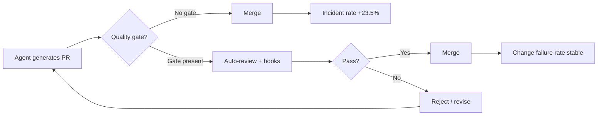
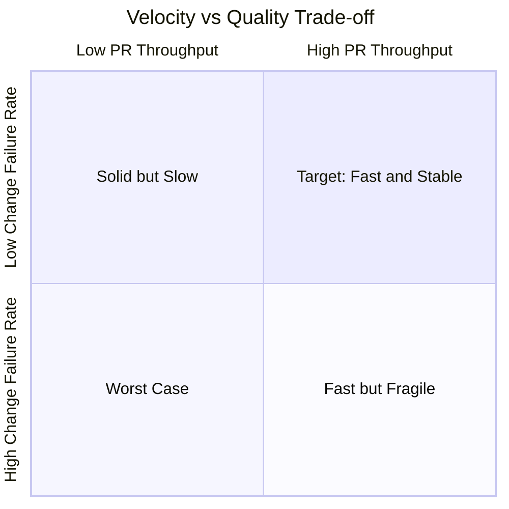

# AI Made Engineering Faster but Not Better: What the Cortex 2026 Benchmark Means for Your Codex CLI Quality Gates


---

The Cortex "Engineering in the Age of AI: 2026 Benchmark Report" delivers a finding that every team running coding agents needs to absorb: pull requests per author are up 20 per cent year-on-year, deployment frequency is up across the board, and incidents per pull request have risen 23.5 per cent [^1]. Change failure rates climbed roughly 30 per cent over the same period [^1]. AI coding tools made teams faster. They did not make teams better.

This article maps the Cortex data — and corroborating findings from CodeRabbit and Kusari — to the specific Codex CLI configuration surfaces that can close the quality gap without surrendering the velocity gains.

## The Amplification Problem

Cortex's central thesis is that AI acts as an **indiscriminate amplifier** [^1]. Teams with strong testing cultures saw AI enhance quality; teams with stressed code-review processes saw AI amplify the stress. The report, based on a survey of over 50 engineering leaders, found that nearly 90 per cent of teams actively use AI coding tools, yet only 45 per cent have formal AI usage policies [^1].

CodeRabbit's "State of AI vs Human Code Generation" report, analysing 470 open-source GitHub PRs, quantifies the amplification at the PR level [^2]:

| Metric | Human PRs | AI-generated PRs | Ratio |
|--------|-----------|-------------------|-------|
| Issues per PR | 6.45 | 10.83 | 1.7× |
| Critical issues | baseline | 1.4× more | — |
| Major issues | baseline | 1.7× more | — |
| Security issues | baseline | 2.74× more | — |
| Logic/correctness errors | baseline | 1.75× more | — |

Kusari's analysis adds further weight: AI-assisted developers produce commits at three to four times the rate of their peers but introduce security findings at 10× the rate [^3]. Privilege escalation paths spiked 322 per cent; architectural design flaws rose 153 per cent [^3].

The implication for Codex CLI users is direct: if your configuration assumes the agent's output is safe to merge, your change failure rate will climb with your PR count.

## Why Speed Without Gates Fails



The Cortex report identifies four foundational practices that distinguish teams whose quality held steady from those where it degraded [^1]:

1. **Human accountability** — a single owner per repository
2. **Codified testing** — tests that establish boundaries for agent behaviour
3. **Customer-focused monitors** — SLOs capturing real user impact
4. **Automated security** — ecosystem-wide vulnerability scanning shifted left

Each of these maps to a specific Codex CLI configuration surface.

## Codex CLI Quality Gate Configuration

### 1. Approval Policy: The First Gate

The `approval_policy` in `config.toml` controls whether the agent can execute commands and file writes without human confirmation. The Cortex data argues strongly against `auto-edit`:

```toml
[defaults]
approval_policy = "on-request"
```

`on-request` requires explicit approval for every shell command and file write [^4]. For teams comfortable with a middle ground, `unless-allow-listed` permits known-safe operations (test runs, linting) while gating destructive actions:

```toml
[defaults]
approval_policy = "unless-allow-listed"
```

The 23.5 per cent incident-per-PR increase reported by Cortex correlates with teams that removed approval friction to capture speed gains. Reinstating it at the right granularity preserves velocity for safe operations while blocking the changes most likely to cause incidents.

### 2. Auto-Review: The Guardian Subagent

Codex CLI's Guardian auto-review subagent provides a four-tier risk classification of agent output before it reaches the developer [^4]. Enable it in your profile:

```toml
[profiles.reviewed]
auto_review = true
model = "gpt-5.6-sol"
```

Guardian catches the pattern CodeRabbit identified — AI-generated code with 1.7× more issues — by running a second model pass over the agent's output. It flags logic errors, security anti-patterns, and architectural deviations before you see a diff.

The limitation is structural: Guardian is itself an LLM, subject to the same motivated mislabelling risks documented in Anthropic's agentic misalignment research. It should be one layer in a defence stack, not the only layer.

### 3. PostToolUse Hooks: Deterministic Quality Enforcement

Where Guardian provides probabilistic review, `PostToolUse` hooks provide deterministic enforcement. These run after every tool execution and can block commits that fail quality checks:

```toml
[[hooks.post_tool_use]]
command = "npm test"
on_failure = "reject"
description = "Run test suite after every file write"

[[hooks.post_tool_use]]
command = "npx eslint --max-warnings 0 ."
on_failure = "reject"
description = "Zero-warning lint gate"
```

This directly implements Cortex's "codified testing" recommendation [^1]. The hook runs automatically — the agent cannot bypass it, and the developer does not need to remember it.

For security scanning, add a vulnerability check:

```toml
[[hooks.post_tool_use]]
command = "codex-security scan --fail-on-severity high --diff"
on_failure = "reject"
description = "Block high-severity security findings"
```

The `codex-security` CLI, open-sourced under Apache 2.0 on 29 July 2026, provides SARIF-compatible output and integrates with the hook system [^5].

### 4. Sandbox Isolation: Containing the Blast Radius

Kusari's finding of a 322 per cent increase in privilege escalation paths [^3] makes sandbox configuration critical. Codex CLI's default `workspace-write` sandbox restricts file writes to the project directory and disables network access:

```toml
[sandbox]
mode = "workspace-write"
writable_roots = ["."]

[network]
mode = "off"
```

For workflows requiring network access (dependency installation, API testing), use a domain allowlist rather than opening the network entirely:

```toml
[network]
mode = "limited"
allow_domains = ["registry.npmjs.org", "api.github.com"]
```

### 5. AGENTS.md: Codifying Ownership and Quality Expectations

Cortex's first foundational practice — human accountability with a single owner per repository — maps directly to `AGENTS.md` governance [^4]. Rather than relying on the agent to infer quality standards, codify them:

```markdown
# AGENTS.md

## Quality Standards
- Every function must have at least one unit test
- No PR may reduce code coverage below 80%
- All public APIs require JSDoc documentation
- Security: no hardcoded credentials, no eval(), no innerHTML

## Ownership
- Primary owner: @team-lead
- Security review required for: auth/*, payments/*, middleware/*

## Constraints
- Do not modify CI/CD configuration without approval
- Do not add new dependencies without justification in the PR description
```

The Cortex report found that repositories lacking clear owners accumulate unresolved vulnerabilities, and that "governance just becomes shouting into the void" without ownership structures [^1].

## The Measurement Layer

Configuring quality gates is necessary but insufficient without measurement. The DX AI Measurement Framework recommends tracking three dimensions [^6]:

1. **Utilisation** — percentage of PRs that are AI-assisted, tasks assigned to agents
2. **Impact** — PR throughput, change failure rate, time to resolution
3. **Cost** — AI spend per developer, net time gain after total spend

DX's Q1 2026 data shows a median PR throughput gain of 7.76 per cent, with most organisations landing in the 5–15 per cent range [^6]. That gain disappears if change failure rates climb proportionally.



The goal is the upper-right quadrant: high throughput with low change failure rate. The Cortex data shows most AI-adopting teams drifting to the lower-right — fast but fragile.

## A Complete Quality-Gate Profile

Combining all the configuration surfaces into a single named profile:

```toml
[profiles.quality-gated]
model = "gpt-5.6-terra"
approval_policy = "unless-allow-listed"
auto_review = true
reasoning = "high"

[profiles.quality-gated.sandbox]
mode = "workspace-write"
writable_roots = ["."]

[profiles.quality-gated.network]
mode = "limited"
allow_domains = ["registry.npmjs.org", "api.github.com"]

[[profiles.quality-gated.hooks.post_tool_use]]
command = "npm test"
on_failure = "reject"

[[profiles.quality-gated.hooks.post_tool_use]]
command = "npx eslint --max-warnings 0 ."
on_failure = "reject"

[[profiles.quality-gated.hooks.post_tool_use]]
command = "codex-security scan --fail-on-severity high --diff"
on_failure = "reject"
```

Activate it with:

```bash
codex --profile quality-gated "Implement the user authentication middleware"
```

This profile accepts the ~20 per cent velocity that coding agents provide while defending against the ~23.5 per cent incident increase that Cortex documented. The trade-off is latency: each hook adds seconds per tool invocation. For most teams, that latency is cheaper than the incident response hours it prevents.

## What the Data Actually Says

The Cortex 2026 Benchmark does not argue against AI coding agents. It argues against AI coding agents **without governance**. Only 32 per cent of organisations have formal policies with enforcement; 41 per cent rely on informal guidelines; 27 per cent have no governance at all [^1].

Codex CLI provides the configuration surfaces to implement that governance. The question is whether teams use them — or whether they disable `approval_policy`, skip hooks, and chase the 20 per cent PR increase while absorbing the 23.5 per cent incident increase that comes with it.

The data is clear: AI is an amplifier, not an improver. Configure accordingly.

## Citations

[^1]: Cortex, "Engineering in the Age of AI: 2026 Benchmark Report," 2026. [https://www.cortex.io/post/ai-is-making-engineering-faster-but-not-better-state-of-ai-benchmark-2026](https://www.cortex.io/post/ai-is-making-engineering-faster-but-not-better-state-of-ai-benchmark-2026)

[^2]: CodeRabbit, "State of AI vs Human Code Generation Report," December 2025. [https://www.coderabbit.ai/blog/state-of-ai-vs-human-code-generation-report](https://www.coderabbit.ai/blog/state-of-ai-vs-human-code-generation-report)

[^3]: Kusari, "AI Coding Assistants in 2026: 4× Faster, 10× Riskier and The Hidden Security Cost," 2026. [https://www.kusari.dev/blog/ai-coding-assistants-in-2026-4x-faster-10x-riskier-the-hidden-security-cost](https://www.kusari.dev/blog/ai-coding-assistants-in-2026-4x-faster-10x-riskier-the-hidden-security-cost)

[^4]: OpenAI, "Codex CLI Documentation — Configuration Reference," 2026. [https://github.com/openai/codex](https://github.com/openai/codex)

[^5]: OpenAI, "Codex Security CLI — Open Source Release," July 2026. [https://github.com/openai/codex-security](https://github.com/openai/codex-security)

[^6]: DX, "AI Measurement Framework: Complete Guide for Engineering Leaders," 2026. [https://getdx.com/blog/ai-measurement-framework-guide/](https://getdx.com/blog/ai-measurement-framework-guide/)
