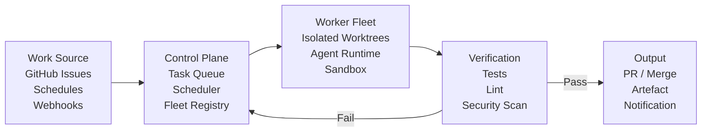
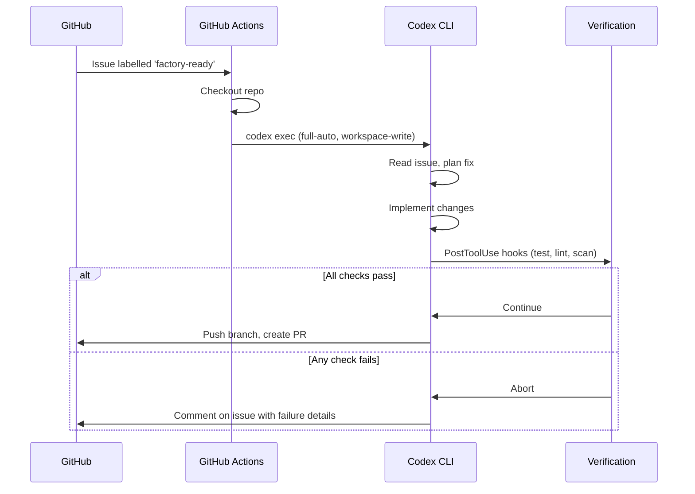

# The Software Factory Pattern: Building Agent Pipelines for Autonomous Development with Codex CLI


---

## The Factory Is Not a Metaphor

In manufacturing, a "dark factory" runs without lights because no human is on the floor. In August 2026, the same idea has arrived in software engineering — and it is no longer theoretical. StrongDM shipped 32,200 lines of production Rust, Go, and TypeScript over seven months under two rules: code must not be written by humans, and code must not be reviewed by humans[^1]. Spotify merges roughly 650 AI-generated pull requests per month, reporting 60–90% time savings on large-scale migrations[^2]. BCG Platinion documented 50% productivity gains at scale in legacy migration projects using autonomous agent delivery[^2].

The pattern underpinning these results is the **software factory**: a control plane that polls for work, dispatches it to coding agents in isolated environments, validates the output through automated verification, and publishes the result — all without a developer touching a diff.

This article examines how to build a software factory using Codex CLI as the agent runtime, what governance controls you need before turning the lights off, and where the pattern breaks down.

## Anatomy of a Software Factory

A software factory has four structural components, regardless of which agent runtime powers it.



### 1. Work Source

Work enters the factory through one of three channels:

- **GitHub issue polling**: a scheduler queries for issues matching a label (e.g. `factory-ready`) and converts them into tasks.
- **Scheduled automations**: cron-triggered sweeps — dependency updates, documentation generation, test coverage expansion.
- **Webhook events**: PR comments, deployment failures, or external triggers via Codex Triggers[^3].

### 2. Control Plane

The control plane owns the task lifecycle: queuing, assignment, lease management, cancellation, and retry. Owain Lewis's [Factory](https://github.com/owainlewis/factory) project demonstrates one implementation: a Go control plane backed by SQLite, with typed automation evaluators for issues, pull requests, and schedules[^4]. Each worker polls the API — no WebSockets required — claims a task, and reports completion or failure.

The critical design decision is **one worker, one runtime identity**. A worker running Codex CLI should not simultaneously run Claude Code. Mixing runtimes within a single execution context conflates sandbox boundaries, model routing, and AGENTS.md discovery.

### 3. Worker Fleet with Worktree Isolation

Each worker checks out a dedicated Git worktree for every task. This provides:

- **Filesystem isolation**: concurrent tasks never share a working directory.
- **Clean rollback**: a failed task is discarded by deleting the worktree; the main branch is untouched.
- **Parallel throughput**: multiple workers process independent issues simultaneously.

For Codex CLI, the worker invokes `codex exec` in non-interactive mode within the worktree:

```bash
#!/usr/bin/env bash
set -euo pipefail

REPO_DIR="$HOME/.factory/repos/my-project"
WORKTREE_DIR="$(mktemp -d)/task-${TASK_ID}"

# Create isolated worktree
git -C "$REPO_DIR" worktree add "$WORKTREE_DIR" -b "factory/task-${TASK_ID}" origin/main

# Run Codex in non-interactive mode
cd "$WORKTREE_DIR"
codex exec \
  --approval-mode full-auto \
  --sandbox-mode workspace-write \
  --model gpt-5.6-terra \
  "Fix issue #${TASK_ID}: ${TASK_DESCRIPTION}" \
  2>"$LOG_DIR/task-${TASK_ID}.stderr"

# Push and create PR
git push origin "factory/task-${TASK_ID}"
gh pr create \
  --title "fix: resolve #${TASK_ID}" \
  --body "Automated fix by software factory. Closes #${TASK_ID}." \
  --base main
```

The `--sandbox-mode workspace-write` flag restricts the agent to the worktree directory. The `--approval-mode full-auto` flag removes human approval gates — appropriate only when verification is airtight[^5].

### 4. Verification Layer

The verification layer is what separates a software factory from a reckless script. Without it, `full-auto` is negligence.

```toml
# config.toml — factory worker profile
[profiles.factory-worker]
model = "gpt-5.6-terra"
approval_policy = "full-auto"
sandbox_mode = "workspace-write"

[profiles.factory-worker.hooks]
post_tool_use = [
  "npm test",
  "npm run lint",
  "codex-security scan --fail-on-severity high --diff HEAD~1"
]
```

Every tool invocation is followed by test, lint, and security scan. If any hook fails, the task fails and returns to the queue. The `codex-security` CLI, open-sourced under Apache 2.0 in July 2026, provides SARIF-format output suitable for automated triage[^6].

## The Five-Level Maturity Model

Dan Shapiro's five-level framework, published in January 2026 and now the most widely referenced maturity taxonomy for agentic development, maps directly to Codex CLI configuration[^1]:

| Level | Description | Codex CLI Configuration |
|-------|-------------|------------------------|
| **L1** — Autocomplete | Inline suggestions | Not applicable (IDE-level) |
| **L2** — Copilot | Chat-driven assistance | Interactive mode, `suggest` approval |
| **L3** — Supervised Agent | Agent executes, human approves | `approval_policy = "on-request"` |
| **L4** — Autonomous Agent | Agent executes within guardrails | `approval_policy = "unless-allow-listed"` |
| **L5** — Dark Factory | Lights-off autonomous delivery | `approval_policy = "full-auto"` + verification hooks |

Most production teams in 2026 operate at Level 3–4. Level 5 is credibly demonstrated only by small teams with exceptional test infrastructure[^1]. The honest assessment: **L5 is an aspiration, not a default practice**. Simon Willison's observation that "97% effectiveness is a failing grade" for security-grade software remains the sobering counterweight[^1].

## Governance Controls for Factory Operation

Running a factory at L4 or L5 demands governance controls that go beyond what interactive Codex CLI sessions require. The following controls form a minimum viable governance stack.

### AGENTS.md as Factory Constitution

```markdown
# AGENTS.md — Factory Worker Governance

## Execution Boundaries
- NEVER modify CI/CD pipeline configuration files
- NEVER alter security-related code without adding corresponding test coverage
- NEVER commit secrets, credentials, or API keys
- ALL database schema changes require migration files

## Quality Standards
- Every change must pass existing tests before creating a PR
- New functionality requires at least one unit test
- No PR may exceed 500 lines of diff without decomposition

## Escalation Protocol
- If a task requires changes to more than 3 files, create a plan comment on the issue before proceeding
- If tests fail after 3 retry attempts, label the issue `factory-blocked` and stop
```

AGENTS.md is discovered from the primary folder's root[^5]. In a multi-folder project, secondary folders inherit the primary folder's governance — which is exactly the behaviour you want in a factory where one control plane governs many repositories.

### requirements.toml for Fleet Enforcement

For teams running multiple factory workers, `requirements.toml` provides admin-enforced constraints distributed via MDM or configuration management:

```toml
# requirements.toml — fleet-wide factory constraints
[model]
allowed = ["gpt-5.6-terra", "gpt-5.6-sol"]

[sandbox]
mode = "workspace-write"
network_access = false

[approval]
policy = "full-auto"

[hooks]
post_tool_use_required = true
```

This prevents individual workers from overriding sandbox or approval settings — a critical control when the factory scales beyond a single developer's oversight[^5].

### Session JSONL as Audit Trail

Every `codex exec` invocation produces a session JSONL log. In a factory context, these logs serve as the **evidence chain** connecting a business requirement (the GitHub issue) to every agent action, tool invocation, and file modification. The EU AI Act Article 50, enforceable since 2 August 2026, requires exactly this kind of traceability for AI-generated outputs in regulated sectors[^7].

```bash
# Archive session logs per task
cp ~/.codex/sessions/latest.jsonl \
   "$AUDIT_DIR/task-${TASK_ID}-$(date +%Y%m%dT%H%M%S).jsonl"
```

## The Factory Pipeline with GitHub Actions

For teams already invested in GitHub Actions, `openai/codex-action@v1` wraps `codex exec` with runner-level safety controls:


```yaml
# .github/workflows/factory-triage.yml
name: Factory Issue Triage
on:
  schedule:
    - cron: '0 */4 * * *'  # Every 4 hours
  issues:
    types: [labeled]

jobs:
  factory-fix:
    if: contains(github.event.issue.labels.*.name, 'factory-ready')
    runs-on: ubuntu-latest
    steps:
      - uses: actions/checkout@v4
      - uses: openai/codex-action@v1
        with:
          codex-api-key: ${{ secrets.OPENAI_API_KEY }}
          approval-mode: full-auto
          safety-strategy: drop-sudo
          prompt: |
            Read issue #${{ github.event.issue.number }}.
            Implement the fix. Run all tests. Create a PR if tests pass.
```


The `safety-strategy: drop-sudo` input irreversibly removes sudo privileges before the agent runs, protecting secrets held in runner memory[^3].



## Where the Pattern Breaks

The software factory pattern has structural limitations that no configuration can fully resolve.

**Specification quality is the bottleneck.** BCG Platinion identifies "intent thinking" — translating business needs into precise, testable specifications — as the critical skill[^2]. A vague GitHub issue produces a vague fix. The factory amplifies specification quality in both directions: good specs yield good results faster than a human could; bad specs yield confidently wrong code at scale.

**Verification cannot be assumed.** The pattern depends on tests, linters, and security scanners catching everything the agent gets wrong. For teams with patchy test coverage, running a factory means automating the production of untested code — which is worse than writing it manually, because the volume overwhelms review capacity.

**Context window pressure compounds.** Long-running factory sessions accumulate context. Codex CLI's `model_auto_compact_token_limit` setting mitigates this, but compaction introduces information loss. For multi-file tasks that require cross-cutting understanding, single-shot `codex exec` invocations are preferable to long-lived agent sessions.

**The trust question remains open.** As Tessl's dark factory documentation frames it: "built by agents, tested by agents, trusted by whom?"[^1] ⚠️ For security-critical systems, the factory pattern currently lacks a satisfactory answer. Human review of agent-generated security-sensitive code remains advisable even at L5 maturity.

## Practical Starting Point

Rather than attempting lights-off L5, begin with a **supervised factory at L3–L4**:

1. **Label 10 well-specified issues** as `factory-ready` in a low-risk repository.
2. **Configure a single worker** with `approval_policy = "on-request"` to produce PRs for human review.
3. **Measure**: task completion rate, test pass rate, PR acceptance rate, and cost per task.
4. **Graduate to `unless-allow-listed`** once acceptance rate exceeds 90%.
5. **Add PostToolUse hooks** for automated verification before considering `full-auto`.

The factory is not a binary switch. It is a **graduated trust ladder** where each rung demands tighter verification before loosening human oversight.

## Citations

[^1]: Tessl, "Dark Factory — Encyclopedia of Agentic Development Patterns," [tessl.io/patterns/agentic-development-workflow/dark-factory/](https://tessl.io/patterns/agentic-development-workflow/dark-factory/), accessed 3 August 2026.
[^2]: BCG Platinion, "The Agentic Software Factory," [bcgplatinion.com/insights/the-agentic-software-factory](https://www.bcgplatinion.com/insights/the-agentic-software-factory), accessed 3 August 2026.
[^3]: OpenAI, "codex-action: Run Codex CLI in GitHub Actions," [github.com/openai/codex-action](https://github.com/openai/codex-action), accessed 3 August 2026.
[^4]: Owain Lewis, "Factory: Build your own software factory with AI agents," [github.com/owainlewis/factory](https://github.com/owainlewis/factory), accessed 3 August 2026.
[^5]: OpenAI, "Codex CLI Documentation — Configuration, Sandbox, and Approval Policies," [developers.openai.com/codex](https://developers.openai.com/codex), accessed 3 August 2026.
[^6]: OpenAI, "@openai/codex-security — Apache 2.0 security scanning CLI," [github.com/openai/codex](https://github.com/openai/codex), released 29 July 2026.
[^7]: European Parliament, "EU AI Act — Article 50: Transparency obligations," [eur-lex.europa.eu](https://eur-lex.europa.eu/legal-content/EN/TXT/?uri=CELEX:32024R1689), enforceable 2 August 2026.
